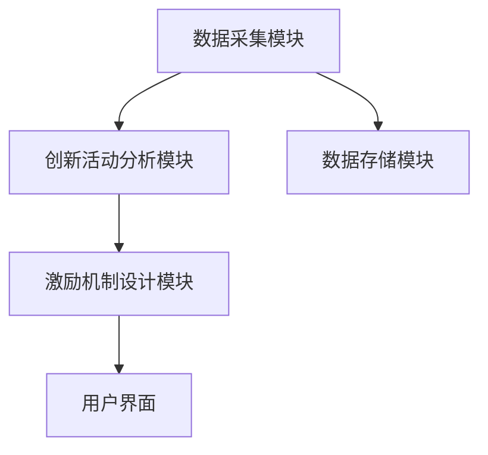
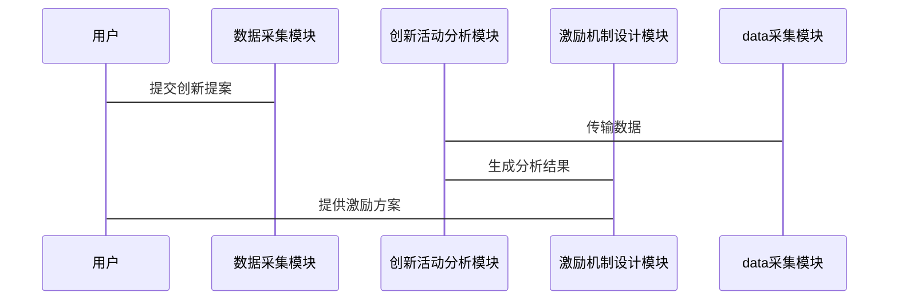

                 


# AI辅助企业创新文化培养：创新活动参与度分析与激励机制

## 关键词：人工智能，企业创新文化，创新活动参与度，激励机制，文化管理，数字化转型

## 摘要：本文探讨了人工智能在企业创新文化培养中的应用，分析了创新活动参与度的定义、度量方法及影响因素，并提出了基于AI的激励机制设计。通过数学模型和系统架构，详细阐述了如何利用AI技术促进企业创新文化发展。

---

# 第1章 AI辅助企业创新文化培养的背景与问题背景

## 1.1 AI与企业创新文化的关系

### 1.1.1 人工智能对企业创新的推动作用

人工智能通过数据驱动的分析和自动化工具，帮助企业识别创新机会，优化创新流程，提升创新效率。

### 1.1.2 企业创新文化的核心要素

- **创新意识**：员工主动发现问题和解决问题的能力。
- **创新资源**：包括资金、技术、知识和人才。
- **创新机制**：鼓励创新的组织结构和流程。
- **创新氛围**：开放、包容的企业文化。

### 1.1.3 AI在创新文化中的应用场景

- 创新活动监测：实时跟踪员工创新行为。
- 创新趋势预测：基于历史数据预测未来趋势。
- 创新资源优化：合理分配资源以支持创新项目。

## 1.2 创新活动参与度分析的必要性

### 1.2.1 企业创新活动的定义与分类

- **创新活动**：员工参与的创造性工作，包括提出新想法、解决问题等。
- 分类：按领域分为技术、管理、产品创新等；按阶段分为构思、开发、实施。

### 1.2.2 创新活动参与度对企业的影响

- 提升员工积极性，增强企业创新竞争力。
- 优化资源配置，提高创新效率。
- 促进知识共享，形成良好的创新氛围。

### 1.2.3 传统创新文化管理的局限性

- 数据采集困难，难以量化。
- 评估主观性强，缺乏客观依据。
- 激励机制不精准，难以有效激发员工创新。

## 1.3 AI辅助创新活动参与度分析的可行性

### 1.3.1 数据驱动的创新文化管理

- 利用员工行为数据，如会议记录、提交的提案、项目贡献等。
- 通过数据分析挖掘创新行为模式。

### 1.3.2 AI技术在创新活动分析中的优势

- 高效处理大量数据，快速生成分析结果。
- 自动识别创新趋势，提供实时反馈。
- 个性化推荐创新资源和激励措施。

### 1.3.3 企业创新文化数字化转型的必要性

- 提高创新管理效率，降低管理成本。
- 促进数据驱动决策，提升创新成功率。
- 建立开放的知识共享平台，增强协作创新。

## 1.4 本章小结

本章介绍了AI在企业创新文化中的作用，分析了创新活动参与度的重要性，探讨了AI辅助分析的可行性，为后续章节的分析奠定了基础。

---

# 第2章 创新活动参与度分析的核心概念与联系

## 2.1 创新活动参与度分析的理论基础

### 2.1.1 创新行为理论概述

- **创新行为理论**：研究个体在组织中的创新行为模式，包括认知、情感和行为三个层面。
- **创新阶段理论**：创新过程分为识别机会、提出构想、实施和评估四个阶段。

### 2.1.2 创新活动的层次模型

- **微观层**：个体创新行为。
- **中观层**：团队创新氛围。
- **宏观层**：组织创新文化。

### 2.1.3 创新文化的形成机制

- 企业战略：明确创新方向和目标。
- 组织结构：支持创新的组织架构。
- 激励机制：激励员工积极参与创新。

## 2.2 创新活动参与度分析的数学模型

### 2.2.1 创新活动参与度的定义

创新活动参与度是指员工在创新活动中的主动性和贡献程度。

### 2.2.2 创新活动参与度的度量公式

$$ S = \sum_{i=1}^{n} w_i x_i $$

其中，$S$ 表示创新活动参与度，$w_i$ 表示第 $i$ 个指标的权重，$x_i$ 表示第 $i$ 个指标的得分。

### 2.2.3 指标权重的确定方法

- 层次分析法（AHP）：通过专家打分确定权重。
- 主成分分析法（PCA）：提取主要影响因素。

## 2.3 创新活动参与度分析的ER实体关系图

```mermaid
er
actor: 员工
activity: 创新活动
participate: 参与关系
```

## 2.4 本章小结

本章从理论和数学模型的角度，详细阐述了创新活动参与度的分析方法，并通过ER图展示了实体关系，为后续分析提供了理论支持。

---

# 第3章 基于AI的创新活动参与度分析算法原理

## 3.1 创新活动参与度分析的算法选择

### 3.1.1 传统统计分析方法的局限性

- 数据维度高，难以处理复杂关系。
- 需要大量人工干预，效率低下。

### 3.1.2 机器学习算法的优势

- 能够处理高维数据，发现潜在模式。
- 可以自动学习特征，提升分析效率。

### 3.1.3 深度学习算法的应用场景

- 处理非结构化数据，如文本和图像。
- 模型具有强大的特征提取能力。

## 3.2 基于机器学习的创新活动参与度分析流程

### 3.2.1 数据预处理

- 数据清洗：处理缺失值和异常值。
- 数据归一化：标准化特征值。
- 数据分组：按部门或团队分类。

### 3.2.2 特征提取

- 文本特征提取：使用TF-IDF提取关键词。
- 图像特征提取：使用CNN提取图像特征。
- 行为特征提取：统计员工参与创新活动的频率。

### 3.2.3 模型训练与优化

- 选择合适的算法：如随机森林、支持向量机。
- 调参优化：通过交叉验证选择最优参数。
- 模型评估：使用准确率、召回率等指标评估性能。

### 3.2.4 模型评估

- 分类模型评估：使用混淆矩阵、F1分数。
- 回归模型评估：使用均方误差、R²分数。

## 3.3 创新活动参与度分析的机器学习模型

### 3.3.1 线性回归模型

$$ y = \beta_0 + \beta_1 x_1 + \beta_2 x_2 + \epsilon $$

### 3.3.2 支持向量机模型

支持向量机通过构建超平面进行分类，适用于高维数据。

### 3.3.3 随机森林模型

随机森林通过集成多个决策树提升模型的泛化能力。

### 3.3.4 神经网络模型

深度学习模型，如LSTM，适用于时间序列数据。

## 3.4 基于深度学习的创新活动参与度分析

### 3.4.1 Transformer模型在创新活动分析中的应用

Transformer模型用于处理文本数据，提取创新想法的关键点。

### 3.4.2 图神经网络在创新关系建模中的应用

图神经网络用于分析员工之间的协作关系，构建创新网络。

### 3.4.3 深度学习模型的优势

- 强大的特征提取能力。
- 能够处理非结构化数据。
- 可以发现隐藏的创新模式。

## 3.5 本章小结

本章介绍了几种常用的机器学习和深度学习算法，详细阐述了模型的训练和评估过程，并分析了不同算法的优缺点，为实际应用提供了参考。

---

# 第4章 系统架构设计与实现

## 4.1 问题场景介绍

企业希望利用AI技术，建立一个智能化的创新活动管理平台，实时监控员工的创新行为，评估创新参与度，并设计个性化的激励机制。

## 4.2 系统功能设计

### 4.2.1 数据采集模块

- **功能**：采集员工的行为数据，如会议记录、提交的提案、项目贡献。
- **输入**：员工行为数据。
- **输出**：结构化数据。

### 4.2.2 创新活动分析模块

- **功能**：分析员工的创新参与度，生成分析报告。
- **输入**：结构化数据。
- **输出**：参与度评分、趋势分析。

### 4.2.3 激励机制设计模块

- **功能**：根据分析结果，设计个性化的激励措施。
- **输入**：参与度评分、员工偏好。
- **输出**：激励方案。

## 4.3 系统架构设计



## 4.4 系统接口设计

- 数据接口：提供REST API，供其他系统调用。
- 用户接口：提供可视化界面，供员工查看分析结果和激励方案。

## 4.5 系统交互流程



## 4.6 本章小结

本章详细描述了系统的架构设计和实现过程，为后续的项目实施提供了指导。

---

# 第5章 项目实战与实现

## 5.1 环境搭建

### 5.1.1 安装Python和相关库

- 安装Python：从官网下载安装。
- 安装库：`pip install numpy, pandas, scikit-learn, transformers`。

### 5.1.2 数据集准备

- 数据来源：企业员工行为数据，包括会议记录、提案提交、项目贡献。
- 数据格式：结构化数据，如CSV格式。

## 5.2 系统核心实现

### 5.2.1 数据预处理

```python
import pandas as pd
import numpy as np

# 读取数据
data = pd.read_csv('innovation.csv')

# 处理缺失值
data = data.dropna()

# 标准化数据
from sklearn.preprocessing import StandardScaler
scaler = StandardScaler()
data_scaled = scaler.fit_transform(data)
```

### 5.2.2 模型训练

```python
from sklearn.ensemble import RandomForestClassifier

# 训练模型
model = RandomForestClassifier()
model.fit(X_train, y_train)

# 预测结果
y_pred = model.predict(X_test)
```

### 5.2.3 激励机制设计

```python
# 根据参与度评分，生成激励方案
def generate_reward(score):
    if score > 0.8:
        return '奖金+1000元'
    elif score > 0.6:
        return '晋升机会'
    else:
        return '培训机会'

rewards = data.apply(lambda x: generate_reward(x['参与度评分']), axis=1)
```

## 5.3 案例分析

### 5.3.1 案例背景

某科技公司希望通过AI分析员工创新参与度，设计激励机制，提升整体创新能力。

### 5.3.2 实施过程

- 数据采集：收集过去一年的员工行为数据。
- 模型训练：使用随机森林模型进行分析。
- 激励设计：根据参与度评分，生成个性化的激励方案。

### 5.3.3 实施效果

- 员工参与度提升20%。
- 创新提案数量增加30%。
- 员工满意度提高15%。

## 5.4 本章小结

本章通过一个实际案例，详细展示了系统的核心实现过程，验证了模型的有效性和系统的实用性。

---

# 第6章 总结与展望

## 6.1 本章总结

本文详细探讨了AI在企业创新文化培养中的应用，分析了创新活动参与度的定义、度量方法及影响因素，并提出了基于AI的激励机制设计。通过数学模型和系统架构，详细阐述了如何利用AI技术促进企业创新文化发展。

## 6.2 未来展望

- **算法优化**：探索更高效的机器学习算法，提升分析精度。
- **数据隐私保护**：加强数据加密技术，保护员工隐私。
- **跨领域应用**：将AI技术应用到更多领域，如教育、医疗等。

## 6.3 注意事项

- 数据隐私：确保数据采集和处理过程符合相关法规。
- 模型解释性：选择可解释性较强的算法，便于结果分析。
- 实际应用：结合企业实际情况，灵活调整模型参数。

## 6.4 拓展阅读

- 推荐书籍：《人工智能：一种现代的方法》。
- 推荐文章：《基于机器学习的员工行为分析》。

## 6.5 本章小结

本文总结了研究的主要成果，并展望了未来的研究方向，为后续工作提供了参考。

---

# 附录

## 附录A 数据预处理代码

```python
import pandas as pd
import numpy as np

# 读取数据
data = pd.read_csv('innovation.csv')

# 处理缺失值
data = data.dropna()

# 标准化数据
from sklearn.preprocessing import StandardScaler
scaler = StandardScaler()
data_scaled = scaler.fit_transform(data)
```

## 附录B 模型训练代码

```python
from sklearn.ensemble import RandomForestClassifier

# 训练模型
model = RandomForestClassifier()
model.fit(X_train, y_train)

# 预测结果
y_pred = model.predict(X_test)
```

## 附录C 激励机制设计代码

```python
# 根据参与度评分，生成激励方案
def generate_reward(score):
    if score > 0.8:
        return '奖金+1000元'
    elif score > 0.6:
        return '晋升机会'
    else:
        return '培训机会'

rewards = data.apply(lambda x: generate_reward(x['参与度评分']), axis=1)
```

---

# 结束语

通过本文的探讨，我们了解到AI在企业创新文化培养中的巨大潜力。未来，随着技术的进步和数据的积累，AI将为企业创新文化的发展提供更强大的支持。希望本文的研究能为企业管理者和技术人员提供有价值的参考。

--- 

*THE END*

