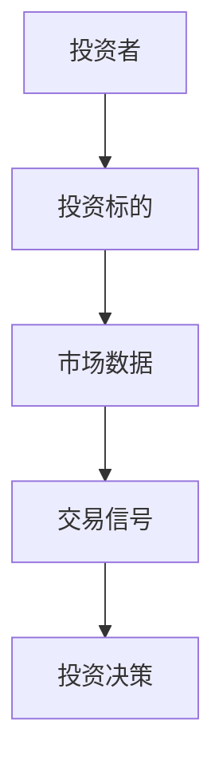
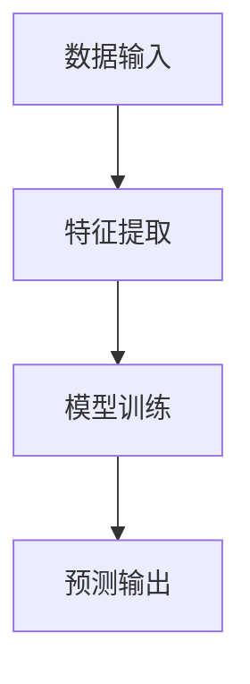
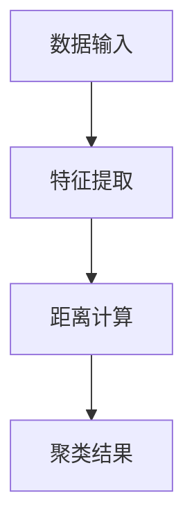
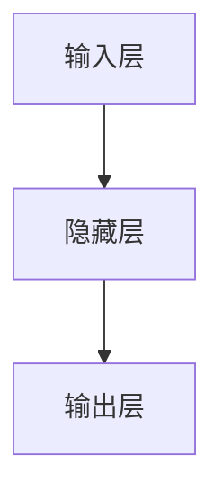
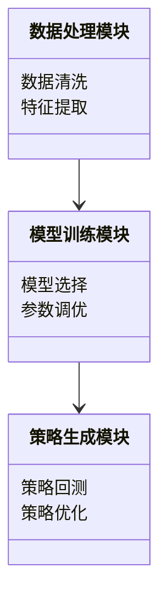
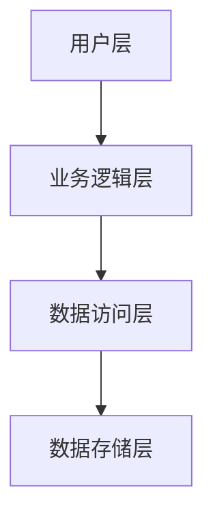
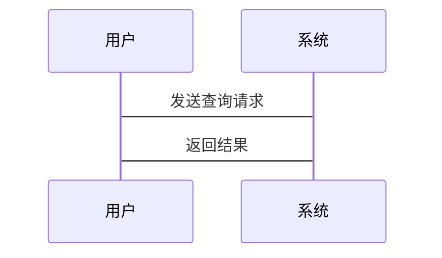

                 


# AI辅助发现新兴市场价值投资标的

## 关键词：人工智能、投资分析、新兴市场、价值投资、算法、数据挖掘

## 摘要：本文探讨如何利用人工智能技术辅助发现新兴市场的价值投资标的。通过分析数据挖掘、模式识别和机器学习算法，构建智能投资系统，优化投资策略，降低风险。文章从背景、核心概念、算法原理、系统架构到项目实战，全面阐述AI在投资中的应用，总结最佳实践和未来方向。

---

## 第一部分：背景与概述

### 1.1 AI辅助投资的背景

#### 1.1.1 传统投资方式的局限性
- 信息过载和复杂性
- 人为情绪影响决策
- 数据分析能力有限

#### 1.1.2 AI技术的发展与应用
- 数据处理能力提升
- 智能算法的应用
- 大数据分析优势

### 1.2 问题描述

#### 1.2.1 新兴市场的特点
- 不确定性高
- 数据稀缺
- 市场波动大

#### 1.2.2 传统投资分析的难点
- 数据量大，难处理
- 模式识别困难
- 风险预测挑战

### 1.3 解决方案

#### 1.3.1 AI在数据处理中的优势
- 高效数据清洗与预处理
- 智能特征提取
- 实时数据分析

#### 1.3.2 智能算法的应用
- 机器学习预测市场趋势
- 自然语言处理分析文本数据
- 图神经网络识别市场关联

### 1.4 边界与外延

#### 1.4.1 定义AI辅助投资的范围
- 数据收集与分析边界
- 算法应用范围
- 投资决策辅助边界

#### 1.4.2 与其他投资方法的区别
- 传统分析 vs AI辅助分析
- 人工决策 vs 系统决策
- 定量分析 vs 定性分析

### 1.5 核心概念

#### 1.5.1 数据驱动的分析
- 数据收集、清洗、预处理
- 数据特征提取与建模

#### 1.5.2 智能模型的构建
- 机器学习模型训练
- 深度学习模型应用
- 模型优化与调参

#### 1.5.3 策略优化与执行
- 策略生成与测试
- 策略评估与优化
- 策略执行与监控

---

## 第二部分：核心概念与联系

### 2.1 AI辅助投资的核心流程

#### 2.1.1 数据收集与处理
- 数据源选择与收集
- 数据清洗与预处理
- 数据特征提取

#### 2.1.2 模型训练与优化
- 算法选择与训练
- 模型评估与优化
- 超参数调整

#### 2.1.3 策略生成与评估
- 策略生成与回测
- 策略风险评估
- 策略优化与调整

### 2.2 核心概念对比

#### 2.2.1 数据处理与特征提取
- 数据清洗与预处理
- 特征选择与提取方法

#### 2.2.2 模型训练与策略生成
- 模型训练方法
- 策略生成与优化

### 2.3 ER实体关系图



---

## 第三部分：算法原理

### 3.1 算法选择与实现

#### 3.1.1 线性回归

##### 3.1.1.1 算法流程图



##### 3.1.1.2 数学公式

线性回归的损失函数为：
$$ L = \sum_{i=1}^{n} (y_i - (\beta_0 + \beta_1 x_i))^2 $$

最小二乘法求解参数：
$$ \beta = (X^T X)^{-1} X^T y $$

#### 3.1.2 聚类分析

##### 3.1.2.1 算法流程图



##### 3.1.2.2 K-means算法步骤

1. 初始化质心
2. 计算每个数据点到质心的距离
3. 分配最近的质心
4. 更新质心
5. 重复直到收敛

#### 3.1.3 神经网络

##### 3.1.3.1 算法流程图



##### 3.1.3.2 神经网络结构

- 输入层：接收市场数据
- 隐藏层：处理特征
- 输出层：生成预测结果

---

## 第四部分：系统分析与架构设计

### 4.1 系统功能设计

#### 4.1.1 领域模型



### 4.2 系统架构设计

#### 4.2.1 分层架构



#### 4.2.2 接口设计

- RESTful API：用于数据交互
- WebSocket：实时数据传输

#### 4.2.3 交互设计



---

## 第五部分：项目实战

### 5.1 环境安装

```bash
pip install numpy pandas scikit-learn tensorflow
```

### 5.2 核心代码实现

#### 5.2.1 数据处理

```python
import pandas as pd
import numpy as np

def preprocess_data(data):
    data = data.dropna()
    data = pd.get_dummies(data)
    return data
```

#### 5.2.2 模型训练

```python
from sklearn.linear_model import LinearRegression

model = LinearRegression()
model.fit(X_train, y_train)
```

#### 5.2.3 策略生成

```python
def generate_strategy(model, data):
    predictions = model.predict(data)
    return predictions
```

### 5.3 案例分析

- 数据收集：新兴市场的股票数据
- 数据清洗：处理缺失值和异常值
- 模型训练：使用线性回归预测股票价格
- 策略生成：基于预测结果生成买卖信号

### 5.4 项目总结

- 代码实现的关键点
- 案例分析的结果
- 项目实施的经验教训

---

## 第六部分：最佳实践与总结

### 6.1 最佳实践

- 数据质量的重要性
- 模型解释性的考虑
- 策略多样化的必要性

### 6.2 小结

AI在新兴市场中的应用前景广阔，通过高效的数据处理和智能算法，投资者可以发现潜在的价值标的，优化投资策略，降低风险。

### 6.3 注意事项

- 数据隐私和安全
- 模型的泛化能力
- 投资者的认知偏差

### 6.4 拓展阅读

- 《机器学习实战》
- 《Python金融大数据分析》

---

## 结语

AI辅助投资是一个充满潜力的领域，随着技术的进步，未来会有更多的创新和应用。通过系统的分析和实践，投资者可以更好地利用AI技术，抓住新兴市场的机会。

