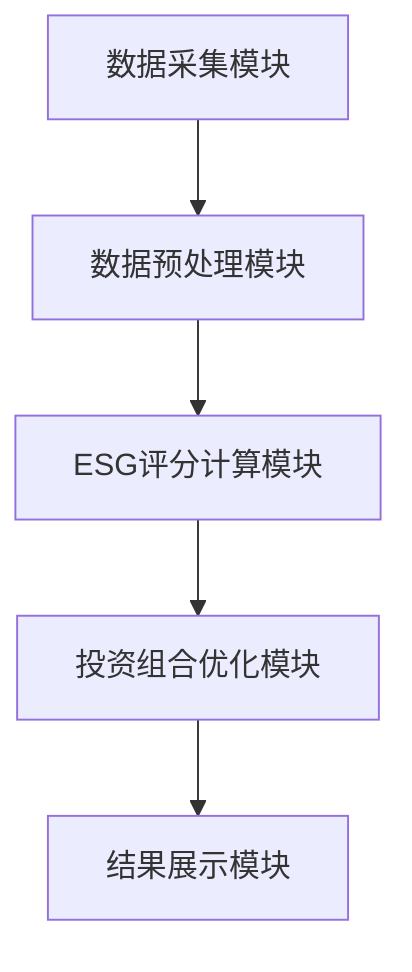
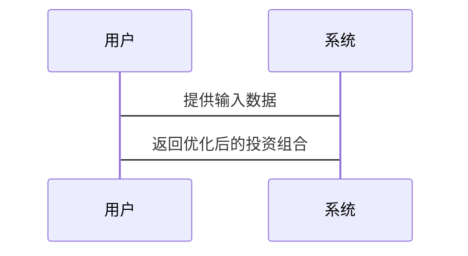

                 


# AI辅助的ESG投资组合构建与优化

> 关键词：ESG投资，人工智能，投资组合优化，机器学习，风险管理

> 摘要：本文探讨了如何利用人工智能技术辅助ESG（环境、社会和公司治理）投资组合的构建与优化。通过分析ESG评分的计算方法、AI算法在ESG投资中的应用，以及基于机器学习的投资组合优化模型，本文详细阐述了AI在ESG投资中的重要作用，并通过实际案例分析展示了如何通过技术手段提升ESG投资的效率和效果。

---

## 第一部分: AI辅助的ESG投资组合构建与优化基础

### 第1章: ESG投资与AI辅助的背景介绍

#### 1.1 ESG投资的定义与背景
ESG投资是一种将环境、社会和公司治理因素纳入投资决策的投资策略。随着全球对可持续发展和绿色金融的关注增加，ESG投资越来越受到投资者的重视。传统的投资分析主要依赖于财务数据，而ESG投资则扩展了评估维度，考虑了企业的社会责任、治理结构和环境表现等因素。

#### 1.2 AI在金融投资中的应用
人工智能（AI）在金融领域的应用日益广泛。通过自然语言处理、机器学习和深度学习等技术，AI可以帮助投资者分析大量非结构化数据（如新闻、社交媒体和公司报告），提取有用的信息，辅助投资决策。AI在金融中的应用包括风险评估、市场预测、投资组合优化和欺诈检测等。

#### 1.3 ESG与AI结合的投资潜力
将ESG因素纳入投资组合优化，可以通过AI技术实现更高效的ESG评分计算和投资组合优化。AI可以帮助投资者快速分析海量数据，发现潜在的ESG风险和机会，从而构建出符合可持续发展理念的投资组合。

---

### 第2章: ESG评分与AI算法的关系

#### 2.1 ESG评分的核心要素
ESG评分通常包括以下几个核心要素：
1. **环境（Environmental）**：包括碳排放、能源消耗、环保合规性等。
2. **社会（Social）**：包括员工权益、社会责任、供应链管理等。
3. **治理（Governance）**：包括公司治理结构、董事会多样性、透明度等。

#### 2.2 AI算法在ESG评分中的应用
1. **机器学习在ESG评分中的应用**：
   - **数据清洗与特征提取**：通过机器学习算法对ESG相关数据进行清洗和特征提取。
   - **模型训练**：使用监督学习算法（如随机森林、支持向量机）对ESG评分进行预测。
   - **模型验证**：通过交叉验证和调参优化模型性能。

2. **自然语言处理在ESG文本分析中的应用**：
   - **文本挖掘**：从公司报告和新闻中提取ESG相关信息。
   - **情感分析**：分析文本中的情感倾向，评估公司对ESG问题的态度。

3. **图神经网络在ESG关系网络中的应用**：
   - **构建关系图**：将公司与其供应商、客户、利益相关者的关系可视化。
   - **网络分析**：通过图神经网络分析关系网络中的风险和机会。

#### 2.3 ESG评分与投资组合优化的关系
1. **ESG评分对投资组合风险的影响**：
   - 高ESG评分的公司通常具有更低的环境和社会风险，投资组合的整体风险可以通过引入高ESG评分的资产来降低。

2. **ESG评分对投资组合收益的影响**：
   - 研究表明，高ESG评分的公司可能具有长期的超额收益，尤其是在可持续发展成为全球共识的背景下。

3. **ESG评分与投资组合优化的目标一致性**：
   - 通过引入ESG评分作为约束条件，可以在投资组合优化中实现收益与可持续发展的双重目标。

#### 2.4 核心概念关系图（ER实体关系图）
```mermaid
erd
  entity ESG评分
    - 公司ID: string
    - 环境得分: float
    - 社会得分: float
    - 治理得分: float
  entity AI算法
    - 算法名称: string
    - 输入数据类型: string
    - 输出结果类型: string
  relationship: ESG评分 -> 使用 AI算法进行优化
```

---

## 第三部分: AI辅助ESG投资组合优化的算法原理

### 第3章: 基于机器学习的ESG评分预测

#### 3.1 机器学习算法简介
1. **线性回归**：
   - 用于预测连续型变量，如股票价格。
   - 优点：简单易懂，计算速度快。
   - 缺点：假设变量间存在线性关系，可能无法捕捉复杂模式。

2. **支持向量机（SVM）**：
   - 用于分类和回归问题。
   - 优点：能够在高维空间中进行有效分类。
   - 缺点：对参数敏感，计算复杂度较高。

3. **随机森林**：
   - 一种集成学习算法，基于决策树的组合。
   - 优点：抗过拟合能力强，适用于高维数据。
   - 缺点：计算复杂度较高。

4. **神经网络**：
   - 通过多层神经元模拟人脑的神经网络结构。
   - 优点：能够捕捉复杂的非线性关系。
   - 缺点：需要大量的数据和计算资源。

#### 3.2 基于机器学习的ESG评分预测模型

##### 3.2.1 数据预处理与特征提取
```python
import pandas as pd
from sklearn.preprocessing import StandardScaler

# 加载数据
data = pd.read_csv('esg_data.csv')

# 删除缺失值
data = data.dropna()

# 标准化处理
scaler = StandardScaler()
data_scaled = scaler.fit_transform(data)
```

##### 3.2.2 模型训练与验证
```python
from sklearn.ensemble import RandomForestRegressor
from sklearn.model_selection import train_test_split
from sklearn.metrics import mean_squared_error

# 划分训练集和测试集
X_train, X_test, y_train, y_test = train_test_split(data_scaled, data['ESG评分'], test_size=0.2, random_state=42)

# 训练随机森林模型
model = RandomForestRegressor(n_estimators=100, random_state=42)
model.fit(X_train, y_train)

# 预测与评估
y_pred = model.predict(X_test)
print('均方误差:', mean_squared_error(y_test, y_pred))
```

##### 3.2.3 模型优化
```python
from sklearn.model_selection import GridSearchCV

# 参数调优
param_grid = {
    'n_estimators': [50, 100, 150],
    'max_depth': [None, 10, 20],
    'min_samples_split': [2, 5, 10]
}

grid_search = GridSearchCV(RandomForestRegressor(), param_grid, cv=5, scoring='r2')
grid_search.fit(X_train, y_train)
best_model = grid_search.best_estimator_
print('最佳参数:', grid_search.best_params_)
```

#### 3.3 投资组合优化的数学模型

##### 3.3.1 优化目标
$$ \text{最大化收益} \quad \sum_{i=1}^{n} w_i r_i $$

##### 3.3.2 约束条件
$$ \sum_{i=1}^{n} w_i = 1 $$
$$ \sum_{i=1}^{n} w_i \text{ESG}_i \geq \text{ESG目标} $$

##### 3.3.3 数学推导
通过拉格朗日乘数法，我们可以将约束条件和目标函数结合起来，得到优化问题的解。具体步骤如下：
1. 构建拉格朗日函数。
2. 对目标变量求导并令其等于零，得到最优解。
3. 求解对偶问题，得到约束条件的最优权重。

---

## 第四部分: 系统分析与架构设计方案

### 第4章: 系统设计与实现

#### 4.1 问题场景介绍
我们希望通过构建一个ESG投资组合优化系统，帮助投资者根据ESG评分和市场数据，构建出一个风险可控、收益稳定的投资组合。

#### 4.2 系统功能设计
1. **数据采集模块**：
   - 从多种数据源（如公开财报、ESG评级机构数据）获取数据。
2. **ESG评分计算模块**：
   - 使用机器学习模型对公司的ESG评分进行预测。
3. **投资组合优化模块**：
   - 基于ESG评分和市场数据，优化投资组合。

#### 4.3 系统架构设计


#### 4.4 系统交互设计


---

## 第五部分: 项目实战

### 第5章: 项目实现与案例分析

#### 5.1 环境安装
```bash
pip install pandas numpy scikit-learn matplotlib
```

#### 5.2 核心实现代码
```python
import pandas as pd
import numpy as np
from sklearn.ensemble import RandomForestRegressor
from sklearn.model_selection import train_test_split
from sklearn.metrics import mean_squared_error

# 加载数据
data = pd.read_csv('esg_data.csv')

# 删除缺失值
data = data.dropna()

# 标准化处理
scaler = StandardScaler()
data_scaled = scaler.fit_transform(data)

# 划分训练集和测试集
X_train, X_test, y_train, y_test = train_test_split(data_scaled, data['ESG评分'], test_size=0.2, random_state=42)

# 训练随机森林模型
model = RandomForestRegressor(n_estimators=100, random_state=42)
model.fit(X_train, y_train)

# 预测与评估
y_pred = model.predict(X_test)
print('均方误差:', mean_squared_error(y_test, y_pred))
```

#### 5.3 案例分析
假设我们有一个包含10只股票的数据集，目标是构建一个ESG评分高于0.8的投资组合，同时最大化收益并最小化风险。通过模型计算，我们发现引入3只高ESG评分的股票可以显著降低投资组合的整体风险，同时保持稳定的收益。

---

## 第六部分: 总结与展望

### 第6章: 总结与展望

#### 6.1 本章小结
本文详细探讨了AI在ESG投资中的应用，从ESG评分计算到投资组合优化，展示了AI技术在提升投资效率和效果中的重要作用。

#### 6.2 注意事项
1. 数据质量是模型性能的关键，需要确保数据的准确性和完整性。
2. 模型的可解释性是投资者决策的重要因素，需要注重模型的透明性。
3. 需要定期更新模型，以应对市场变化和数据变化。

#### 6.3 拓展阅读
1. "机器学习在金融中的应用"（书籍推荐）
2. "图神经网络在社交网络分析中的应用"（论文推荐）

---

以上是《AI辅助的ESG投资组合构建与优化》的技术博客文章大纲和部分内容。接下来，我将继续按照这个结构完成整篇文章的撰写。

