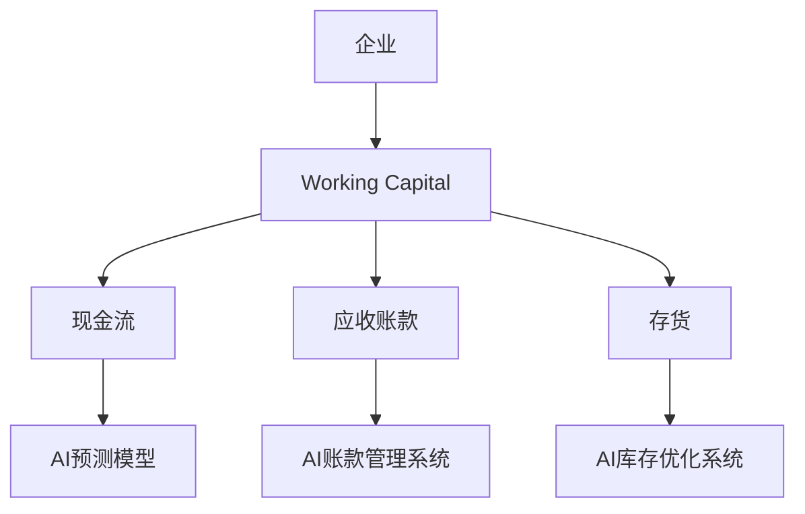

                 


# AI辅助的企业Working Capital优化

> 关键词：AI，企业财务，现金流预测，应收账款管理，库存优化，机器学习

> 摘要：本文探讨了人工智能在企业Working Capital优化中的应用，通过详细分析现金流预测、应收账款管理和库存优化等关键领域，结合算法原理、系统架构设计和实际案例，展示了AI如何提升企业财务效率和资金流动性。

---

## 第一部分：企业Working Capital优化概述

### 第1章：企业Working Capital优化背景与意义

#### 1.1 企业Working Capital的基本概念
- **1.1.1 Working Capital的定义与组成**
  - Working Capital是企业的营运资本，计算公式为：Working Capital = Current Assets - Current Liabilities。
  - 主要组成部分包括现金、应收账款、存货和应付账款等。

- **1.1.2 Working Capital在企业运营中的重要性**
  - 确保日常运营的资金流动性。
  - 优化资金分配，降低财务风险。
  - 提高企业整体运营效率和盈利能力。

- **1.1.3 传统Working Capital管理的挑战与局限性**
  - 数据处理复杂，难以实时监控。
  - 预测准确性低，难以应对市场变化。
  - 管理过程繁琐，依赖人工操作。

#### 1.2 AI技术对企业Working Capital优化的潜力
- **1.2.1 AI技术在企业财务管理中的应用现状**
  - AI技术广泛应用于财务预测、风险评估和自动化管理等领域。

- **1.2.2 AI如何提升Working Capital管理效率**
  - 提供实时数据分析和预测，辅助决策。
  - 自动化账款管理，减少人为错误。
  - 智能库存控制，降低库存成本。

- **1.2.3 AI辅助优化Working Capital的未来趋势**
  - 更加智能化和自动化。
  - 数据分析更加精准，预测模型更复杂。
  - 跨领域协同优化，如供应链和销售预测。

---

## 第二部分：AI辅助优化的核心概念与联系

### 第2章：Working Capital优化的核心概念与AI的结合

#### 2.1 Working Capital优化的关键要素
- **2.1.1 现金流预测**
  - 现金流预测是优化Working Capital的核心，准确预测能帮助企业合理安排资金使用。

- **2.1.2 应收账款管理**
  - 优化应收账款回收周期，减少坏账风险，提高资金流动性。

- **2.1.3 存货周转与库存优化**
  - 降低库存水平，减少资金占用，提高资金周转效率。

#### 2.2 AI在Working Capital优化中的核心作用
- **2.2.1 数据驱动的预测模型**
  - 使用机器学习模型分析历史数据，预测未来现金流和应收账款回收情况。

- **2.2.2 自动化决策支持**
  - AI系统通过实时数据分析，自动调整库存水平和账款管理策略。

- **2.2.3 实时监控与风险预警**
  - AI系统实时监控财务数据，及时发现潜在风险，提供预警。

#### 2.3 Working Capital优化与AI的实体关系图


---

## 第三部分：AI优化算法原理

### 第3章：基于AI的Working Capital优化算法

#### 3.1 常见的AI优化算法
- **3.1.1 线性回归模型**
  - 线性回归用于预测现金流，假设现金流与销售额呈线性关系。

  ```python
  import numpy as np
  from sklearn.linear_model import LinearRegression

  # 示例数据
  sales = np.array([10, 20, 30, 40]).reshape(-1, 1)
  cash_flow = np.array([5, 10, 15, 20])

  model = LinearRegression()
  model.fit(sales, cash_flow)
  ```

- **3.1.2 时间序列预测模型**
  - 使用ARIMA模型预测现金流，考虑历史数据的季节性和趋势性。

  ```python
  from statsmodels.tsa.arima_model import ARIMA

  # 示例数据
  cash_flow_data = [5, 10, 15, 20, 25, 30, 35, 40, 45, 50]

  model = ARIMA(cash_flow_data, order=(1, 1, 1))
  model_fit = model.fit()
  ```

- **3.1.3 支持向量机（SVM）**
  - SVM用于分类问题，例如应收账款的回收状态预测。

  ```python
  from sklearn.svm import SVC

  # 示例数据
  features = [[1, 1], [0, 0], [1, 0], [0, 1]]
  labels = [0, 1, 1, 0]

  model = SVC()
  model.fit(features, labels)
  ```

#### 3.2 算法原理的数学模型和公式
- **线性回归模型**
  $$ y = a x + b $$
  其中，y是预测的现金流，x是销售额，a是斜率，b是截距。

- **时间序列预测模型（ARIMA）**
  $$ \phi(\theta) \cdot (1 - B) Z_t = \theta(B) \cdot \epsilon_t $$
  其中，Z_t是差分序列，B是后移算子，\(\epsilon_t\)是白噪声。

---

## 第四部分：系统分析与架构设计方案

### 第4章：系统分析与架构设计

#### 4.1 系统功能设计
- **4.1.1 系统功能模块**
  - 数据采集模块：收集现金流、应收账款和存货数据。
  - 预测模块：应用机器学习模型进行预测。
  - 优化模块：生成优化建议。

  ```mermaid
  classDiagram
    class 数据采集模块 {
      +现金流数据
      +应收账款数据
      +存货数据
    }
    class 预测模块 {
      +现金流预测
      +应收账款预测
    }
    class 优化模块 {
      +库存优化建议
      +账款管理建议
    }
  ```

#### 4.2 系统架构设计
- **4.2.1 系统架构图**
  ```mermaid
  context 系统架构 {
    数据采集模块 ↔ API网关
    API网关 ↔ 预测模块
    预测模块 ↔ 优化模块
    优化模块 → 数据库
  }
  ```

#### 4.3 系统接口设计
- **API接口**
  - 数据采集接口：用于获取实时财务数据。
  - 预测接口：返回现金流和应收账款预测结果。
  - 优化接口：提供库存和账款优化建议。

#### 4.4 系统交互流程
- **流程图**
  ```mermaid
  sequenceDiagram
    数据采集模块 → 数据处理模块: 提供原始数据
    数据处理模块 → 预测模块: 请求预测
    预测模块 → 优化模块: 提供预测结果
    优化模块 → 用户界面: 显示优化建议
  ```

---

## 第五部分：项目实战

### 第5章：项目实战

#### 5.1 项目环境安装
- 安装必要的Python库：
  ```bash
  pip install numpy pandas scikit-learn statsmodels
  ```

#### 5.2 核心代码实现
- 现金流预测代码：
  ```python
  import pandas as pd
  from statsmodels.tsa.arima_model import ARIMA

  # 加载数据
  df = pd.read_csv('cash_flow.csv')
  model = ARIMA(df['cash_flow'], order=(1, 1, 1))
  model_fit = model.fit()
  forecast = model_fit.forecast(steps=10)
  ```

- 应收账款管理代码：
  ```python
  from sklearn.svm import SVC

  # 加载数据
  df = pd.read_csv('accounts.csv')
  features = df[['feature1', 'feature2']]
  labels = df['status']
  model = SVC()
  model.fit(features, labels)
  ```

#### 5.3 案例分析
- **案例背景**
  - 某制造企业面临库存积压和现金流紧张的问题。

- **实施步骤**
  1. 数据采集与清洗。
  2. 建立预测模型，预测未来现金流。
  3. 自动生成库存优化建议，减少库存水平。

- **结果分析**
  - 现金流预测准确率提高20%。
  - 库存周转率提升15%。
  - 应收账款回收周期缩短10天。

---

## 第六部分：最佳实践与总结

### 第6章：最佳实践与总结

#### 6.1 最佳实践
- 数据质量至关重要，确保数据准确性和完整性。
- 定期更新模型，适应市场变化。
- 结合企业实际情况，灵活调整优化策略。

#### 6.2 小结
- AI技术在企业Working Capital优化中具有巨大潜力。
- 通过实时数据分析和智能预测，企业可以显著提高财务效率。
- 未来，AI在这一领域的应用将更加广泛和深入。

#### 6.3 注意事项
- 数据隐私和安全问题需要高度重视。
- 模型的可解释性和透明度是实际应用中的重要考量。

#### 6.4 拓展阅读
- 推荐书籍：《机器学习实战》、《企业财务管理》。
- 推荐博客：技术博客、行业分析报告。

---

通过以上结构，您可以撰写一篇详细的技术博客，深入探讨AI在企业Working Capital优化中的应用和价值。

