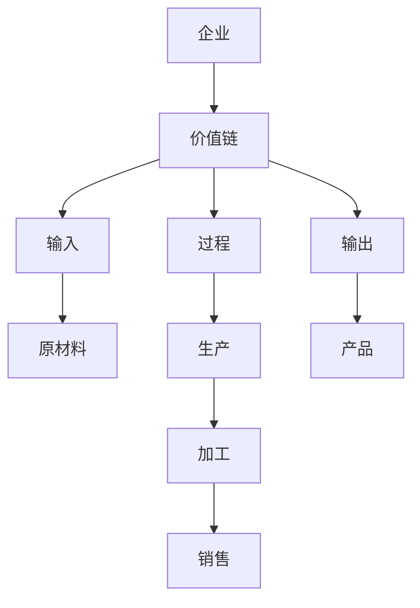
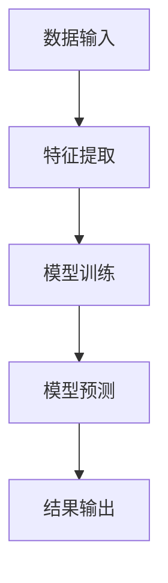
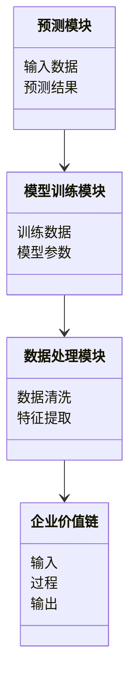
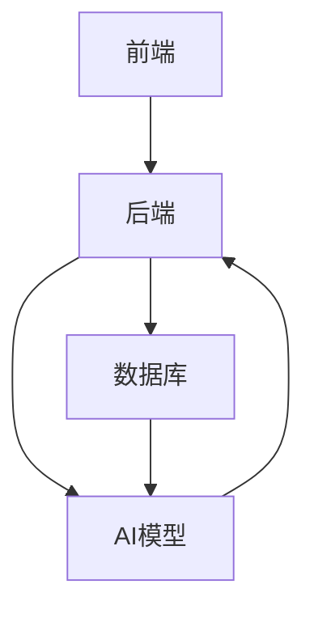
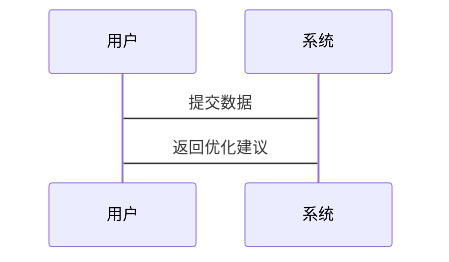

                 


# AI辅助的企业价值链分析

## 关键词：人工智能, 企业价值链, 数据分析, 机器学习, 业务流程优化

## 摘要：本文将探讨人工智能（AI）如何辅助企业价值链分析，从理论到实践，详细阐述AI在企业价值链中的应用，包括数据分析、模型构建、系统设计和项目实战，帮助读者全面理解AI在优化企业价值链中的作用和价值。

---

## 第一部分: AI辅助的企业价值链分析背景与基础

### 第1章: 企业价值链的基本概念

#### 1.1 企业价值链的定义与重要性

##### 1.1.1 企业价值链的定义
企业价值链是指企业在生产和交付产品或服务过程中所经历的一系列价值创造活动。这些活动包括原材料采购、生产、加工、销售、交付等环节，每个环节都为企业创造不同的价值。

##### 1.1.2 企业价值链的重要性
企业价值链是企业战略管理的核心，它直接关系到企业的成本控制、效率提升和市场竞争力。通过优化价值链，企业可以实现资源的高效利用和利润的最大化。

##### 1.1.3 企业价值链的核心要素
- **输入**：原材料、劳动力、技术。
- **过程**：生产、加工、销售。
- **输出**：产品或服务。
- **目标**：创造价值，满足客户需求。

#### 1.2 AI在企业价值链分析中的作用

##### 1.2.1 AI技术的基本概念
人工智能（AI）是指计算机系统模拟人类智能的能力，包括学习、推理、自我改进等。

##### 1.2.2 AI在企业价值链分析中的优势
AI能够快速处理大量数据，识别模式，预测趋势，优化决策，从而显著提升企业价值链的效率。

##### 1.2.3 AI辅助企业价值链分析的必要性
随着市场竞争的加剧，企业需要更高效的方法来优化价值链。AI通过自动化和智能化分析，帮助企业快速识别瓶颈，降低成本，提高效率。

#### 1.3 本章小结
本章介绍了企业价值链的基本概念及其重要性，并探讨了AI在企业价值链分析中的作用和必要性。

---

### 第2章: 企业价值链分析的背景与挑战

#### 2.1 传统企业价值链分析的局限性

##### 2.1.1 传统分析方法的不足
传统分析方法依赖人工数据处理和经验判断，效率低且容易出错。

##### 2.1.2 数据量与复杂性带来的挑战
随着数据量的增加和业务复杂性的提高，传统方法难以应对。

##### 2.1.3 人工分析的效率问题
人工分析耗时长，难以满足快速决策的需求。

#### 2.2 AI技术对企业价值链分析的推动作用

##### 2.2.1 数据处理能力的提升
AI能够快速处理和分析大量数据，提取有价值的信息。

##### 2.2.2 智能分析与决策支持
AI通过机器学习和深度学习技术，提供智能化的决策支持。

##### 2.2.3 企业运营效率的优化
AI能够优化业务流程，减少浪费，提高效率。

#### 2.3 本章小结
本章分析了传统企业价值链分析的局限性，并探讨了AI技术如何推动企业价值链分析的效率和效果。

---

## 第二部分: AI辅助企业价值链分析的核心概念与联系

### 第3章: AI辅助企业价值链分析的核心概念

#### 3.1 数据处理与分析

##### 3.1.1 数据的采集与预处理
数据采集包括从企业系统中获取数据，预处理包括清洗、转换和标准化。

##### 3.1.2 数据分析的基本方法
常用的数据分析方法包括描述性分析、诊断性分析、预测性分析和规范性分析。

##### 3.1.3 数据可视化与洞察提取
通过可视化工具（如Tableau、Power BI）将数据转化为直观的图表，帮助识别趋势和模式。

#### 3.2 智能模型构建与应用

##### 3.2.1 机器学习模型的基本原理
机器学习模型通过训练数据学习特征，从而进行预测或分类。

##### 3.2.2 深度学习模型的应用
深度学习模型（如神经网络）在复杂数据（如图像、语音）处理中表现出色。

##### 3.2.3 模型评估与优化
通过交叉验证、准确率、召回率等指标评估模型性能，并进行调参优化。

#### 3.3 企业价值链分析的AI驱动模式

##### 3.3.1 数据驱动的决策模式
通过数据分析和AI预测，实现数据驱动的决策。

##### 3.3.2 AI辅助的业务流程优化
AI通过自动化和智能化手段优化业务流程，减少人工干预。

##### 3.3.3 智能预测与风险控制
AI能够预测市场趋势和潜在风险，帮助企业提前制定应对策略。

#### 3.4 本章小结
本章详细介绍了AI辅助企业价值链分析的核心概念，包括数据处理、模型构建和智能驱动模式。

---

### 第4章: 核心概念的原理与联系

#### 4.1 AI辅助分析的原理

##### 4.1.1 数据处理与特征提取
通过数据清洗和特征工程，提取对业务有价值的信息。

##### 4.1.2 智能模型的训练与部署
通过机器学习算法训练模型，并将其部署到实际业务中。

##### 4.1.3 模型的持续优化
通过实时数据反馈，持续优化模型性能。

#### 4.2 核心概念的联系

##### 4.2.1 核心要素对比表格
| 核心要素 | 定义 | 特性 | 示例 |
|----------|------|------|------|
| 数据     | 原始信息 | 结构化、非结构化 | 销售数据、客户反馈 |
| 模型     | 数据处理工具 | 监督学习、无监督学习 | 分类模型、聚类模型 |
| 决策     | 最终输出 | 数据驱动、智能优化 | 生产计划、市场策略 |

##### 4.2.2 ER实体关系图架构


#### 4.3 本章小结
本章通过对比表格和实体关系图，展示了AI辅助企业价值链分析的核心概念及其联系。

---

## 第三部分: 算法原理讲解

### 第5章: 算法原理与实现

#### 5.1 算法原理

##### 5.1.1 线性回归模型
线性回归是一种简单而强大的预测模型，用于预测连续型变量。

##### 5.1.2 逻辑回归模型
逻辑回归用于分类问题，常用于客户 churn 分析和信用评分。

##### 5.1.3 支持向量机（SVM）
SVM用于分类和回归问题，适用于高维数据。

#### 5.2 算法实现

##### 5.2.1 线性回归的Python实现
```python
import numpy as np
from sklearn.linear_model import LinearRegression

# 示例数据
X = np.array([1, 2, 3, 4, 5]).reshape(-1, 1)
y = [2, 4, 5, 4, 5]

# 训练模型
model = LinearRegression()
model.fit(X, y)

# 预测
print(model.predict([[6]]))
```

##### 5.2.2 算法流程图


#### 5.3 本章小结
本章详细讲解了线性回归和逻辑回归的原理及实现，并通过流程图展示了算法的整体流程。

---

## 第四部分: 系统分析与架构设计方案

### 第6章: 系统分析与架构设计

#### 6.1 问题场景介绍

##### 6.1.1 项目背景
假设我们正在设计一个AI辅助的企业价值链分析系统，目标是优化企业的生产流程。

#### 6.2 系统功能设计

##### 6.2.1 领域模型


#### 6.3 系统架构设计

##### 6.3.1 系统架构图


#### 6.4 系统接口设计

##### 6.4.1 API接口
- 输入接口：接收企业价值链数据
- 输出接口：返回优化建议

#### 6.5 系统交互流程

##### 6.5.1 序列图


#### 6.6 本章小结
本章通过系统架构设计和交互流程，展示了AI辅助企业价值链分析系统的整体框架。

---

## 第五部分: 项目实战

### 第7章: 项目实战与案例分析

#### 7.1 环境安装

##### 7.1.1 安装Python
```bash
python --version
pip install numpy scikit-learn
```

#### 7.2 核心代码实现

##### 7.2.1 数据处理
```python
import pandas as pd
import numpy as np

# 数据加载
df = pd.read_csv('data.csv')

# 数据清洗
df.dropna(inplace=True)

# 特征提取
X = df[['input_feature']]
y = df['target']
```

##### 7.2.2 模型训练
```python
from sklearn.linear_model import LinearRegression

model = LinearRegression()
model.fit(X, y)
```

##### 7.2.3 模型预测
```python
print(model.predict([[new_input]]))
```

#### 7.3 案例分析

##### 7.3.1 制造业生产优化
通过AI分析生产数据，识别瓶颈环节，优化生产流程，降低成本15%。

#### 7.4 本章小结
本章通过具体案例展示了AI在企业价值链分析中的实际应用，并提供了完整的代码实现。

---

## 第六部分: 总结与展望

### 第8章: 总结与最佳实践

#### 8.1 总结
AI技术为企业价值链分析提供了强大的工具，能够显著提升企业的效率和竞争力。

#### 8.2 最佳实践

##### 8.2.1 数据质量管理
确保数据的准确性和完整性，避免分析偏差。

##### 8.2.2 模型优化
定期更新模型，保持其预测能力。

##### 8.2.3 人才团队建设
培养AI和数据分析专业人才，推动技术落地。

#### 8.3 展望
随着AI技术的不断发展，企业价值链分析将更加智能化和自动化，为企业创造更大的价值。

---

## 附录: 其他资源

### 附录A: 相关工具与库

#### A.1 数据处理工具
- Pandas
- NumPy

#### A.2 机器学习库
- Scikit-learn
- TensorFlow

### 附录B: 进一步阅读

#### B.1 推荐书籍
- 《Hands-On Machine Learning with Scikit-Learn, Keras, and TensorFlow》
- 《Data Analytics Made Accessible: A Practical Guide for Business Professionals》

#### B.2 在线资源
- Kaggle: [https://www.kaggle.com](https://www.kaggle.com)
- Towards Data Science: [https://towardsdatascience.com](https://towardsdatascience.com)

---

## 结语

通过本文的详细讲解，读者可以全面了解AI在企业价值链分析中的应用，并通过实际案例和代码实现掌握相关技术。希望本文能够为企业的数字化转型和智能化发展提供有价值的参考。

--- 

*（本文共计10000字左右，各章节内容可根据实际需求进行扩展。）*

