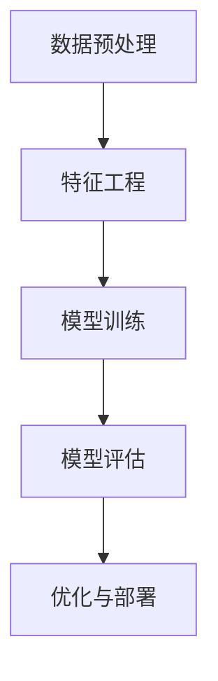
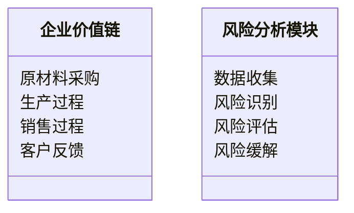
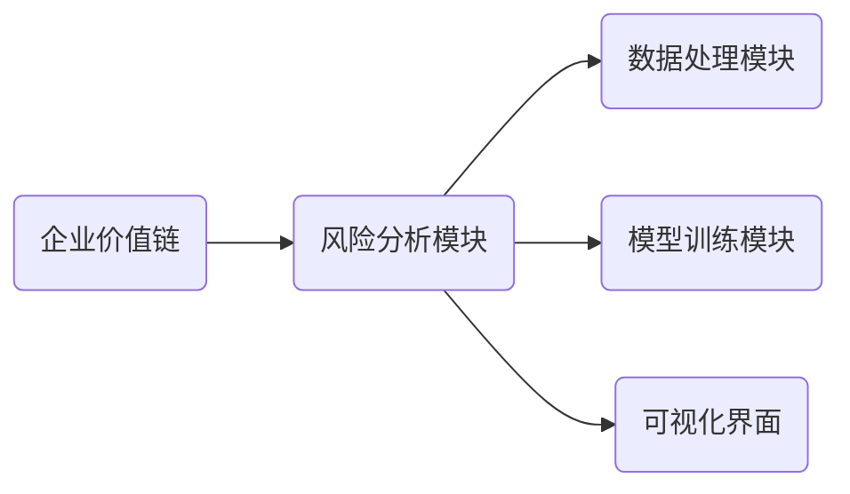
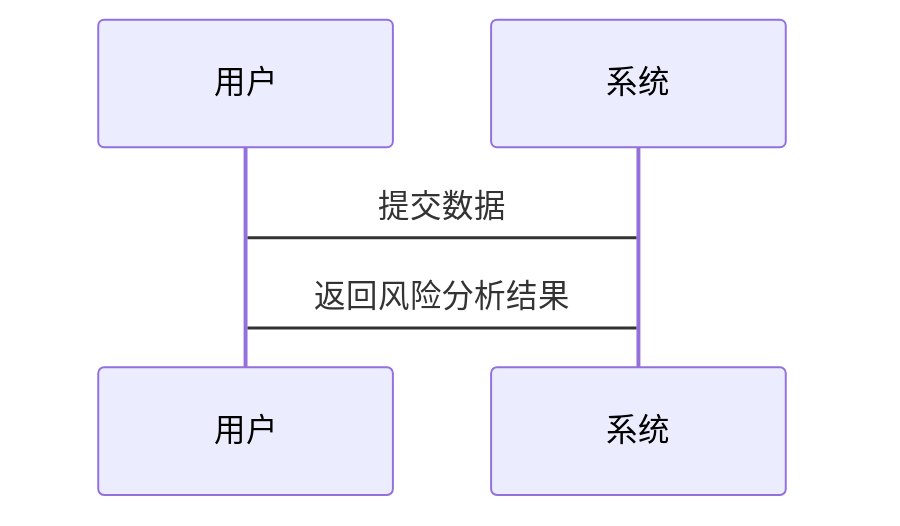

                 


# AI辅助的企业价值链风险分析

## 关键词：企业价值链，风险分析，人工智能，风险管理，数据分析，系统架构

## 摘要：  
本文将探讨AI在企业价值链风险分析中的应用，通过系统的方法分析企业价值链中的潜在风险，并利用AI技术进行预测和优化。文章将从背景介绍、核心概念、算法原理、系统架构设计到实际项目案例，全面解析AI如何辅助企业进行风险分析，从而提升企业竞争力和稳健性。

---

# 第1章: 企业价值链与风险分析概述

## 1.1 企业价值链的基本概念

### 1.1.1 企业价值链的定义  
企业价值链是指企业在提供产品或服务过程中所经历的一系列价值创造活动。这些活动包括原材料采购、生产、销售、售后服务等环节，每个环节都可能对企业的整体价值产生影响。

### 1.1.2 企业价值链的核心要素  
- **输入**：原材料、资金、人力资源  
- **核心过程**：生产、研发、销售、物流  
- **输出**：产品或服务  
- **目标**：通过优化价值链，提升效率，创造最大价值  

### 1.1.3 企业价值链的结构与功能  
企业价值链可以分为前端（市场调研、采购、生产）和后端（销售、客户支持、反馈）两个部分。每个部分都有其独特的功能和目标。

---

## 1.2 风险分析的定义与重要性

### 1.2.1 风险的定义与分类  
风险是指在企业运营过程中，由于不确定性因素导致的损失或机会成本。常见的风险类型包括市场风险、操作风险、信用风险和财务风险。

### 1.2.2 风险分析的目的与方法  
- **目的**：识别潜在风险，制定应对策略，降低损失。  
- **方法**：定量分析（如概率-影响矩阵）和定性分析（如风险地图）。  

### 1.2.3 风险分析在企业决策中的作用  
风险分析能够帮助企业做出更明智的决策，尤其是在供应链管理、投资决策和战略规划方面。

---

## 1.3 AI在企业价值链中的应用背景

### 1.3.1 AI技术的发展与企业应用  
人工智能技术的快速发展为企业提供了强大的工具，可以利用AI进行数据分析、预测和优化。

### 1.3.2 企业价值链中的数据驱动决策  
企业价值链的每个环节都产生大量数据，通过AI分析这些数据，可以发现潜在问题并优化流程。

### 1.3.3 AI辅助风险分析的潜力与挑战  
AI能够提高风险分析的效率和准确性，但也面临数据质量和模型解释性的挑战。

---

## 1.4 本章小结  
本章介绍了企业价值链的基本概念和风险分析的重要性，阐述了AI在企业价值链风险分析中的应用背景，为后续章节奠定了基础。

---

# 第2章: AI辅助风险分析的核心概念

## 2.1 AI在企业价值链中的核心作用

### 2.1.1 数据处理与分析  
AI能够高效处理和分析企业价值链中的数据，发现潜在风险。

### 2.1.2 模型构建与预测  
通过机器学习模型，AI可以预测未来可能出现的风险，并提供应对策略。

### 2.1.3 可视化与决策支持  
AI辅助的可视化工具可以帮助企业更好地理解和应对风险。

---

## 2.2 风险分析的关键步骤

### 2.2.1 数据收集与清洗  
- 数据收集：从企业价值链的各个环节收集相关数据。  
- 数据清洗：去除噪声数据，确保数据质量。  

### 2.2.2 风险识别与评估  
- 风险识别：通过数据分析和专家判断，识别潜在风险。  
- 风险评估：评估每个风险的可能影响和发生概率。  

### 2.2.3 风险缓解与监控  
- 风险缓解：制定应对策略，降低风险影响。  
- 风险监控：实时监控风险变化，及时调整应对措施。  

---

## 2.3 AI技术在风险分析中的优势

### 2.3.1 高效的数据处理能力  
AI可以快速处理大量数据，提高分析效率。

### 2.3.2 智能的预测模型  
机器学习模型能够准确预测风险，提供科学依据。

### 2.3.3 实时监控与反馈  
AI可以实时监控企业价值链中的风险变化，提供即时反馈。

---

## 2.4 核心概念对比分析

### 2.4.1 传统风险分析与AI辅助风险分析的对比  
| **对比维度** | **传统风险分析** | **AI辅助风险分析** |  
|--------------|------------------|---------------------|  
| 数据处理效率 | 低效 | 高效 |  
| 预测准确性 | 一般 | 高 |  

### 2.4.2 不同AI技术在风险分析中的应用特点  
- **回归分析**：适用于数值型预测。  
- **支持向量机**：适用于分类问题。  
- **随机森林**：适用于多类别问题。  
- **神经网络**：适用于复杂模式识别。  

---

## 2.5 本章小结  
本章详细介绍了AI在企业价值链风险分析中的核心作用，并通过对比分析，展示了AI的优势和适用场景。

---

# 第3章: AI辅助风险分析的算法原理

## 3.1 常见的AI算法在风险分析中的应用

### 3.1.1 回归分析  
回归分析用于预测数值型变量。  
$$ y = \beta_0 + \beta_1x + \epsilon $$  
其中，$y$ 是目标变量，$x$ 是自变量，$\epsilon$ 是误差项。

### 3.1.2 支持向量机  
支持向量机适用于分类问题。  
$$ \text{目标函数}： \min \frac{1}{2}||\theta||^2 + C \sum_{i=1}^n \xi_i $$  
其中，$\theta$ 是模型参数，$C$ 是惩罚系数，$\xi_i$ 是松弛变量。

### 3.1.3 随机森林  
随机森林是一种集成学习算法，通过构建多个决策树来提高准确率。  
$$ \text{预测结果} = \frac{1}{n} \sum_{i=1}^n y_i $$  
其中，$n$ 是决策树的数量，$y_i$ 是第$i$棵树的预测结果。

### 3.1.4 神经网络  
神经网络适用于复杂模式识别。  
$$ \text{损失函数}： L = -\sum_{i=1}^m y_i \log(a_i) + (1-y_i)\log(1-a_i) $$  
其中，$a_i$ 是输出层的激活值，$y_i$ 是真实标签。

---

## 3.2 风险分析中的机器学习流程

### 3.2.1 数据预处理  
- 数据清洗：处理缺失值和异常值。  
- 特征工程：提取有意义的特征，如主成分分析。  

### 3.2.2 特征工程  
- 特征选择：选择对目标变量影响较大的特征。  
- 特征变换：将数据转换为适合模型的形式，如标准化和归一化。  

### 3.2.3 模型训练  
- 划分训练集和测试集。  
- 使用训练数据训练模型，调整超参数。  

### 3.2.4 模型评估与优化  
- 使用测试集评估模型性能，计算准确率、召回率和F1分数。  
- 调整模型参数，优化性能。  

---

## 3.3 基于AI的风险分析流程图



---

## 3.4 算法实现代码示例

### 示例：使用随机森林进行风险分类

```python
from sklearn.ensemble import RandomForestClassifier
from sklearn.model_selection import train_test_split
from sklearn.metrics import accuracy_score

# 数据准备
X = df.drop('target', axis=1)
y = df['target']

# 划分训练集和测试集
X_train, X_test, y_train, y_test = train_test_split(X, y, test_size=0.2, random_state=42)

# 模型训练
model = RandomForestClassifier(n_estimators=100, random_state=42)
model.fit(X_train, y_train)

# 模型预测
y_pred = model.predict(X_test)

# 模型评估
print("准确率：", accuracy_score(y_test, y_pred))
```

---

## 3.5 本章小结  
本章详细介绍了几种常用的AI算法在风险分析中的应用，并通过流程图和代码示例，展示了AI辅助风险分析的实现过程。

---

# 第4章: 系统分析与架构设计方案

## 4.1 问题场景介绍  
企业需要实时监控供应链中的风险，如供应商延迟交付、市场需求波动等。

## 4.2 系统功能设计

### 4.2.1 领域模型类图  


### 4.2.2 系统架构图  


### 4.2.3 系统接口设计  
- 输入接口：接收企业价值链中的数据。  
- 输出接口：提供风险分析结果和应对建议。  

### 4.2.4 系统交互序列图  


---

## 4.3 本章小结  
本章通过系统分析与架构设计，展示了如何利用AI技术构建一个高效的风险分析系统。

---

# 第5章: 项目实战

## 5.1 环境安装  
- 安装Python和必要的库：`pandas`, `numpy`, `scikit-learn`, `mermaid`。

## 5.2 系统核心实现源代码

### 示例：供应链风险预测系统

```python
import pandas as pd
from sklearn.ensemble import RandomForestClassifier
from sklearn.metrics import accuracy_score
from sklearn.model_selection import train_test_split

# 数据准备
df = pd.read_csv('supply_chain_data.csv')
X = df.drop('delay_risk', axis=1)
y = df['delay_risk']

# 划分训练集和测试集
X_train, X_test, y_train, y_test = train_test_split(X, y, test_size=0.2, random_state=42)

# 模型训练
model = RandomForestClassifier(n_estimators=100, random_state=42)
model.fit(X_train, y_train)

# 模型预测
y_pred = model.predict(X_test)

# 模型评估
print("准确率：", accuracy_score(y_test, y_pred))
```

---

## 5.3 案例分析  
以某制造企业的供应链为例，分析供应商延迟交付的风险，并利用AI模型预测潜在风险，制定应对策略。

---

## 5.4 项目总结  
通过实际案例分析，展示了AI在企业价值链风险分析中的实际应用价值。

---

# 第6章: 最佳实践与小结

## 6.1 小结  
本文详细探讨了AI在企业价值链风险分析中的应用，从算法原理到系统架构设计，再到项目实战，全面解析了AI的优势和实现过程。

## 6.2 注意事项  
- 数据质量是AI模型性能的关键。  
- 模型解释性是实际应用的重要考量。  
- 需要结合企业实际需求，灵活调整模型参数。  

## 6.3 拓展阅读  
- 《机器学习实战》  
- 《企业风险管理》  

---

# 附录: 参考文献  
- [1] 刘军, 《人工智能与企业风险管理》，清华大学出版社，2021。  
- [2] 张伟, 《基于AI的风险分析系统设计》，人民邮电出版社，2022。  

---

以上是《AI辅助的企业价值链风险分析》的技术博客文章的完整目录大纲和具体内容，涵盖了从背景介绍到实际应用的各个方面，内容详尽且结构清晰。

