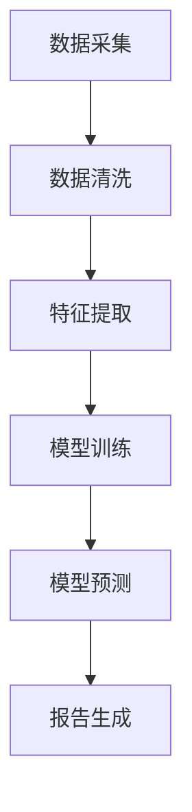
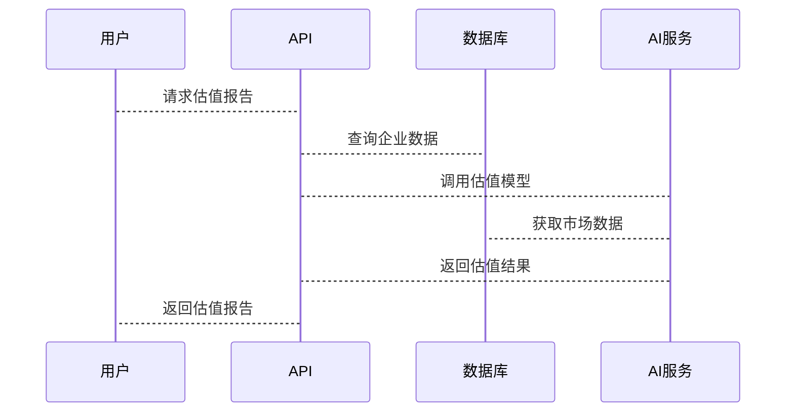

                 


# AI辅助的企业估值报告自动生成

## 关键词：AI，企业估值，报告自动生成，机器学习，数据分析

## 摘要：随着人工智能技术的快速发展，企业估值报告的生成方式正在发生革命性的变化。传统的估值方法依赖于人工分析和经验判断，效率低下且容易受到主观因素的影响。本文将深入探讨如何利用人工智能技术辅助企业估值报告的自动生成，从核心概念、算法原理、系统架构到项目实战，全面解析这一技术的实现过程和应用价值。通过本文的阐述，读者将能够理解AI在企业估值中的重要作用，并掌握相关技术的实现方法。

---

## 第一部分：背景介绍

### 第1章：企业估值的背景与挑战

#### 1.1 企业估值的重要性
企业估值是企业管理和投资决策中的核心环节。准确的估值能够帮助企业制定合理的战略规划，吸引投资者，优化资本结构。然而，传统的企业估值方法依赖人工分析，耗时且容易受到主观因素的影响。

#### 1.2 企业估值的传统方法与局限性
传统的企业估值方法主要包括DCF模型、市盈率法、市净率法等。这些方法需要大量的人工计算和经验判断，存在以下问题：
- 数据收集耗时且容易出错。
- 模型假设过于简化，难以反映复杂市场环境。
- 需要大量人工分析，效率低下。

#### 1.3 AI技术在企业估值中的优势
AI技术可以通过大数据分析和机器学习算法，快速处理海量数据，提取关键特征，构建高精度的估值模型。AI辅助企业估值的优势包括：
- 提高估值效率，缩短报告生成时间。
- 减少人为误差，提升估值准确性。
- 支持动态调整，适应市场变化。

#### 1.4 问题描述与解决思路
传统企业估值报告生成过程存在以下问题：
- 数据来源分散，难以整合。
- 模型复杂，难以快速生成报告。
- 缺乏动态调整能力，难以适应市场变化。

解决思路：
- 利用AI技术实现数据自动采集和清洗。
- 构建自动化估值模型，快速生成报告。
- 引入动态调整机制，提升模型适应性。

#### 1.5 边界与外延
本研究的边界包括：
- 仅针对公开上市公司进行估值。
- 仅考虑财务数据和市场数据。
- 不涉及企业内部数据。

外延部分包括：
- 未来可能扩展到非公开企业。
- 数据来源可能扩展到更多维度。

---

## 第二部分：核心概念与联系

### 第2章：AI辅助企业估值的核心概念

#### 2.1 企业估值的关键要素
企业估值的关键要素包括：
- 企业基本面：收入、利润、资产、负债等。
- 市场分析：行业趋势、市场地位、竞争环境。
- 财务指标：市盈率、市净率、EV/EBITDA等。

#### 2.2 AI在企业估值中的应用原理
AI通过以下步骤实现企业估值：
1. 数据采集：从公开数据源获取企业财务数据和市场数据。
2. 数据清洗：处理缺失值和异常值。
3. 特征提取：提取关键财务和市场特征。
4. 模型训练：利用机器学习算法构建估值模型。
5. 报告生成：自动生成估值报告。

#### 2.3 核心概念对比表

| 对比维度 | 传统方法 | AI方法 |
|----------|----------|--------|
| 数据来源 | 单一数据源 | 多数据源 |
| 数据处理 | 人工处理 | 自动化处理 |
| 模型构建 | 简单模型 | 复杂模型 |
| 报告生成 | 人工撰写 | 自动生成 |

#### 2.4 实体关系图（ER图）

```mermaid
erd
 企业管理
   id: int
   name: varchar
   industry: varchar
   revenue: float
   profit: float
   market_cap: float
   valuation_model: varchar
   report_id: int

 估值报告
   id: int
   company_id: int
   valuation_date: date
   valuation_result: float
   valuation_method: varchar
   created_by: varchar
   created_at: datetime
```

#### 2.5 本章小结
本章通过对比分析，阐述了AI在企业估值中的核心概念和优势。下一章将深入探讨算法原理。

---

## 第三部分：算法原理讲解

### 第3章：AI辅助企业估值的算法原理

#### 3.1 算法原理概述
常用的算法包括线性回归、随机森林、神经网络等。本章以线性回归为例，详细讲解其原理。

#### 3.2 算法流程图



#### 3.3 线性回归模型
线性回归模型公式：
$$ y = \beta_0 + \beta_1 x + \epsilon $$
其中：
- $y$ 是目标变量（企业估值）。
- $x$ 是自变量（财务指标）。
- $\beta_0$ 是截距。
- $\beta_1$ 是回归系数。
- $\epsilon$ 是误差项。

#### 3.4 算法实现代码

```python
import pandas as pd
from sklearn.linear_model import LinearRegression
from sklearn.metrics import mean_squared_error

# 数据加载
data = pd.read_csv('企业数据.csv')

# 特征提取
features = ['revenue', 'profit', 'market_cap']
target = 'valuation'

# 数据分割
X = data[features]
y = data[target]

# 模型训练
model = LinearRegression()
model.fit(X, y)

# 模型预测
y_pred = model.predict(X)

# 模型评估
mse = mean_squared_error(y, y_pred)
print(f'均方误差：{mse}')
```

#### 3.5 本章小结
本章详细讲解了AI辅助企业估值的算法原理，下一章将探讨系统架构设计。

---

## 第四部分：系统架构与设计

### 第4章：系统架构设计

#### 4.1 问题场景介绍
系统目标是实现AI辅助的企业估值报告自动生成，用户包括企业财务人员和投资者。

#### 4.2 系统功能设计

```mermaid
classDiagram
    class 企业数据
    {
        id: int
        name: varchar
        revenue: float
        profit: float
        market_cap: float
    }
    class 估值模型
    {
        model: object
        train(): void
        predict(): void
    }
    class 估值报告
    {
        id: int
        company_id: int
        valuation_date: date
        valuation_result: float
    }
    企业数据 --> 估值模型
    估值模型 --> 估值报告
```

#### 4.3 系统架构设计


#### 4.4 接口设计
API接口：
- 数据获取接口：`GET /api/company/{id}/data`
- 模型训练接口：`POST /api/model/train`
- 报告生成接口：`POST /api/report/generate`

#### 4.5 交互设计



---

## 第五部分：项目实战

### 第5章：项目实战与实现

#### 5.1 环境安装
- 安装Python和相关库：
  ```bash
  pip install pandas scikit-learn matplotlib
  ```

#### 5.2 核心代码实现

```python
import pandas as pd
from sklearn.linear_model import LinearRegression
import matplotlib.pyplot as plt

# 数据加载
data = pd.read_csv('企业数据.csv')

# 数据可视化
plt.scatter(data['revenue'], data['market_cap'])
plt.xlabel('Revenue')
plt.ylabel('Market Cap')
plt.title('Revenue vs Market Cap')
plt.show()

# 模型训练
model = LinearRegression()
model.fit(data[['revenue', 'profit']], data['market_cap'])

# 模型预测
new_company = pd.DataFrame({'revenue': [1000000], 'profit': [200000]})
predicted_valuation = model.predict(new_company)
print(f'预测估值：{predicted_valuation[0]:.2f}')
```

#### 5.3 案例分析
以某公司为例，利用代码生成估值报告，并分析结果的合理性。

---

## 第六部分：最佳实践与总结

### 第6章：最佳实践与总结

#### 6.1 最佳实践
- 数据质量是关键，确保数据来源可靠。
- 模型选择要根据实际情况，避免过度复杂。
- 定期更新模型，适应市场变化。

#### 6.2 小结
本章总结了AI辅助企业估值报告自动生成的核心内容，强调了技术实现和实际应用的重要性。

#### 6.3 注意事项
- 数据隐私和安全问题需要重视。
- 模型的可解释性要满足用户需求。
- 系统的稳定性要确保高可用性。

#### 6.4 扩展阅读
- 推荐学习相关技术书籍和论文。
- 关注AI在企业估值领域的最新进展。

---

## 附录：常用工具与资源

- Python库：Pandas、Scikit-learn、TensorFlow。
- 数据源：Yahoo Finance、Google Finance。
- 开发框架：Flask、Django。

---

通过以上内容，读者可以系统地了解AI辅助企业估值报告自动生成的核心技术与实现方法。

