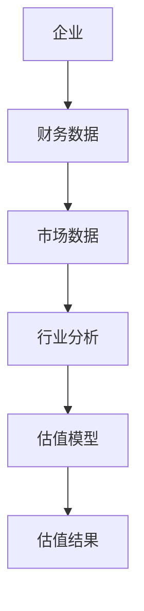
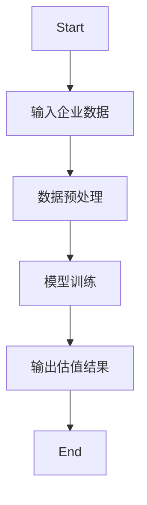
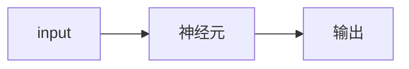
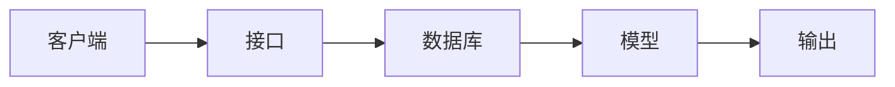
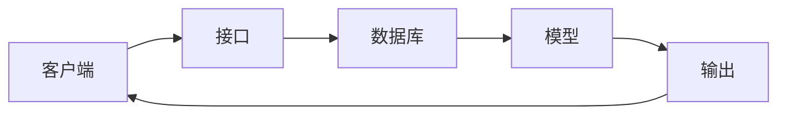

                 


# AI辅助的企业估值报告自动生成与分析

## 关键词：
- AI技术
- 企业估值
- 自动化报告
- 数据分析
- 机器学习

## 摘要：
本文探讨了AI技术在企业估值报告自动生成与分析中的应用，结合自然语言处理和机器学习算法，详细分析了AI辅助企业估值的核心概念、算法原理、系统架构设计以及实际案例。文章从理论到实践，逐步引导读者理解如何利用AI技术提升企业估值的效率和准确性。

---

# 第一部分: AI辅助的企业估值背景与核心概念

## 第1章: 企业估值的基本概念与AI的应用前景

### 1.1 企业估值的基本概念
企业估值是指对企业的整体价值进行评估的过程，通常用于企业并购、融资、上市等场景。传统的企业估值方法包括DCF模型、PE估值法、EV/EBITDA等，这些方法依赖于大量历史数据和复杂的计算，且需要专业人员进行分析。

随着大数据和AI技术的发展，企业估值的效率和准确性有了显著提升。AI技术可以通过自动化处理财务数据、市场数据和行业分析，生成更精准的估值模型。AI还能帮助识别潜在的风险因素，并提供实时更新的估值结果，从而为企业决策提供更有力的支持。

### 1.2 AI在企业估值中的应用背景
在大数据时代，企业估值的需求日益增加。AI技术在企业估值中的应用前景广阔，尤其是在以下几个方面：
1. **自然语言处理（NLP）**：通过对财务报告、新闻和行业分析的文本进行解析，提取关键信息，辅助估值模型的构建。
2. **机器学习**：利用历史数据训练模型，预测企业的未来价值，并优化估值参数。
3. **自动化分析**：AI可以通过自动化处理大量数据，减少人为误差，提高估值的效率。

### 1.3 本章小结
本章介绍了企业估值的基本概念及其在大数据时代的应用需求，重点阐述了AI技术在企业估值中的潜力和应用场景。

---

## 第2章: AI辅助企业估值的核心概念与联系

### 2.1 核心概念原理
AI辅助企业估值的核心在于以下几个方面：
1. **自然语言处理（NLP）**：通过NLP技术，AI可以从财务报告、新闻和其他文本数据中提取关键信息，如收入、利润、行业趋势等。
2. **机器学习模型**：利用机器学习算法，AI可以基于历史数据训练出预测企业价值的模型，并不断优化模型参数。
3. **大数据分析**：通过对海量数据的分析，AI能够发现传统方法难以察觉的市场趋势和风险因素。

### 2.2 核心概念属性对比
以下是传统估值方法与AI估值方法的对比：

| 对比维度       | 传统估值方法                 | AI估值方法                   |
|----------------|------------------------------|------------------------------|
| 数据处理       | 依赖人工整理和分析           | 自动化处理，支持大数据分析     |
| 精度           | 受人为因素影响较大           | 更精准，基于机器学习模型优化   |
| 效率           | 低效，耗时                   | 高效，自动化处理               |
| 更新频率       | 低，难以实时更新             | 高，支持实时数据更新           |

### 2.3 ER实体关系图
以下是企业估值系统的核心实体关系图：



### 2.4 本章小结
本章详细阐述了AI辅助企业估值的核心概念及其与传统方法的对比，通过ER实体关系图展示了系统的核心组成部分。

---

# 第3章: AI辅助企业估值的算法原理

## 3.1 算法原理概述
AI辅助企业估值主要依赖于以下几种算法：
1. **自然语言处理（NLP）**：用于从文本数据中提取关键信息。
2. **机器学习模型**：用于训练和优化估值模型。
3. **深度学习模型**：用于处理复杂的数据关系和模式识别。

## 3.2 算法流程图
以下是AI辅助企业估值的基本算法流程图：



## 3.3 算法数学模型
### 3.3.1 线性回归模型
线性回归是一种常用的机器学习模型，用于预测企业的未来价值。其数学公式如下：

$$ y = \beta_0 + \beta_1x + \epsilon $$

其中，$y$ 是预测的企业价值，$\beta_0$ 是截距，$\beta_1$ 是回归系数，$x$ 是自变量（如收入、利润等），$\epsilon$ 是误差项。

### 3.3.2 神经网络模型
神经网络是一种深度学习模型，能够处理复杂的非线性关系。其基本结构如下：



### 3.4 本章小结
本章详细介绍了AI辅助企业估值的主要算法及其工作原理，通过数学公式和流程图展示了算法的核心逻辑。

---

## 第4章: 企业估值系统分析与架构设计

### 4.1 系统功能设计
AI辅助企业估值系统主要包括以下功能模块：
1. **数据采集模块**：从财务报告、市场数据和行业分析中获取数据。
2. **模型训练模块**：基于历史数据训练机器学习模型。
3. **报告生成模块**：自动生成估值报告并输出结果。

### 4.2 系统架构设计
以下是企业估值系统的架构设计图：



### 4.3 系统交互设计
以下是系统的交互设计图：



### 4.4 本章小结
本章详细描述了企业估值系统的功能设计和架构设计，并通过图表展示了系统的交互流程。

---

## 第5章: 项目实战

### 5.1 环境配置
以下是项目所需的环境配置：
- Python 3.8+
- PyTorch 1.9+
- NLTK 3.6+
- Scikit-learn 0.24+

### 5.2 核心代码实现
以下是模型训练的核心代码：

```python
import torch
import torch.nn as nn
import torch.optim as optim

class ValuationModel(nn.Module):
    def __init__(self, input_dim, hidden_dim, output_dim):
        super(ValuationModel, self).__init__()
        self.fc1 = nn.Linear(input_dim, hidden_dim)
        self.fc2 = nn.Linear(hidden_dim, output_dim)
    
    def forward(self, x):
        x = torch.relu(self.fc1(x))
        x = self.fc2(x)
        return x

# 训练数据和标签
X = torch.randn(100, input_dim)
y = torch.randn(100, output_dim)

# 初始化模型和优化器
model = ValuationModel(input_dim, hidden_dim, output_dim)
criterion = nn.MSELoss()
optimizer = optim.Adam(model.parameters(), lr=0.001)

# 训练模型
for epoch in range(100):
    outputs = model(X)
    loss = criterion(outputs, y)
    optimizer.zero_grad()
    loss.backward()
    optimizer.step()
```

### 5.3 案例分析
以下是一个简单的案例分析：
假设我们有一家企业的财务数据，包括收入、利润和市场份额。我们可以通过上述模型预测该企业的未来价值。

### 5.4 本章小结
本章通过实际案例展示了如何利用AI技术实现企业估值报告的自动生成与分析。

---

## 第6章: 总结与展望

### 6.1 总结
本文详细探讨了AI技术在企业估值中的应用，从理论到实践，详细介绍了AI辅助企业估值的核心概念、算法原理和系统设计。通过实际案例分析，展示了AI技术在提升企业估值效率和准确性方面的潜力。

### 6.2 展望
未来，随着AI技术的不断发展，企业估值将更加智能化和自动化。深度学习模型的优化、多模态数据的融合以及实时数据的处理能力将成为研究的重点。

---

## 参考文献
1. [1] Goodfellow, I., Bengio, Y., & Courville, A. (2016). *Deep Learning*. MIT Press.
2. [2] Hochreiter, S., & Schmidhuber, J. (1997). Long short-term memory. *Neural computation*, 9(8), 1735-1780.

---

通过以上内容，您可以获得关于AI辅助的企业估值报告自动生成与分析的系统性知识。

