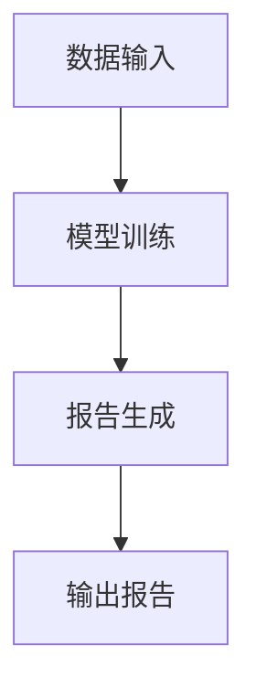
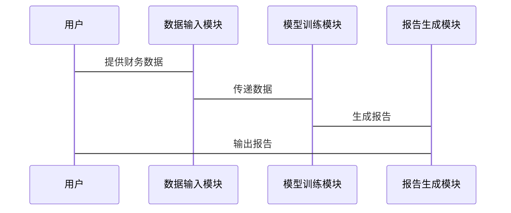

                 


# AI辅助的企业估值报告自动生成系统

> **关键词**：AI、企业估值、自然语言处理、机器学习、数据可视化

> **摘要**：本文探讨了AI技术在企业估值报告自动生成中的应用。通过分析传统估值方法的局限性，介绍了基于大模型的AI生成系统的核心原理、系统架构设计，以及实际项目实现。文章详细阐述了从数据输入到模型训练、报告生成的全过程，并通过案例分析展示了系统的实际应用价值。

---

## 第一部分: AI辅助的企业估值报告自动生成系统概述

### 第1章: 企业估值报告的现状与挑战

#### 1.1 企业估值的背景与问题背景

企业估值是企业战略决策、投资评估和财务分析的重要组成部分。传统的估值方法依赖于大量人工分析，包括收集数据、建立模型、撰写报告等步骤。然而，这种方法存在以下问题：

- **数据收集耗时**：需要从多个来源收集财务数据、市场信息等，耗时且容易出错。
- **模型构建复杂**：需要手动建立复杂的财务模型，对分析师的经验要求较高。
- **报告撰写繁琐**：报告需要包含大量文本描述，耗时且难以保持一致性。

AI技术的出现为解决这些问题提供了可能。通过自然语言处理和机器学习，AI可以帮助自动生成估值报告，提高效率并降低成本。

#### 1.2 AI如何解决企业估值问题

AI技术在企业估值中的应用主要体现在以下几个方面：

- **自动化数据处理**：AI可以自动从多个数据源收集和整理财务数据，减少人工干预。
- **智能模型构建**：基于机器学习的模型可以自动建立估值模型，并进行参数优化。
- **自动生成报告**：自然语言生成技术可以将分析结果转化为结构化的报告文本，提高报告的生成效率。

### 第2章: AI在企业估值中的应用潜力

#### 2.1 AI技术的核心优势

AI技术在企业估值中的优势主要体现在以下几个方面：

- **高效性**：AI可以在短时间内处理大量数据，快速生成估值报告。
- **准确性**：通过机器学习模型，AI可以基于历史数据和市场趋势，提供更准确的估值结果。
- **可扩展性**：AI系统可以同时处理多个企业的估值，适用于大规模应用场景。

#### 2.2 AI在企业估值中的具体应用

- **数据清洗与预处理**：AI可以自动识别和处理数据中的异常值，确保数据质量。
- **估值模型优化**：通过机器学习算法，AI可以优化估值模型的参数，提高估值的准确性。
- **报告生成**：自然语言生成技术可以将估值结果转化为结构化的报告，包括财务分析、市场趋势等内容。

### 第3章: 企业估值报告自动生成系统的概念

#### 3.1 系统的核心概念

企业估值报告自动生成系统是一个基于AI技术的自动化平台，其核心功能包括：

- **数据输入**：系统接收企业的财务数据、市场信息等输入。
- **模型训练**：基于输入数据，系统训练机器学习模型。
- **报告生成**：模型生成估值报告，包括财务分析、市场趋势等内容。

#### 3.2 系统的边界与外延

- **功能边界**：系统仅负责估值报告的自动生成，不包括数据收集和外部接口。
- **与其他系统的接口**：系统需要与数据源、数据库等外部系统进行交互。
- **系统的扩展性**：系统支持扩展，可以集成更多的AI模型和数据源。

---

## 第二部分: AI辅助企业估值的核心原理与技术

### 第4章: 核心概念与技术原理

#### 4.1 AI生成报告的原理

AI生成报告的核心原理包括：

- **自然语言处理**：利用NLP技术理解报告内容，并生成结构化的文本。
- **机器学习**：基于历史数据训练模型，预测企业的估值结果。
- **数据可视化**：将分析结果以图表形式展示，提高报告的可读性。

#### 4.2 核心概念对比分析

下表对比了传统报告生成与AI生成的优劣势：

| 特性             | 传统报告生成 | AI辅助报告生成 |
|------------------|--------------|----------------|
| 效率             | 低           | 高             |
| 准确性           | 受限于经验   | 基于数据驱动   |
| 可扩展性         | 有限         | 强             |

### 第5章: 算法原理与数学模型

#### 5.1 大模型的训练与优化

- **模型训练流程**：数据预处理、模型选择、参数优化。
- **损失函数**：均方误差（MSE）用于衡量预测值与真实值的差异。
$$ L = \frac{1}{N}\sum_{i=1}^{N}(y_i - \hat{y}_i)^2 $$

- **优化器**：使用Adam优化器进行参数更新。
$$ \theta_{new} = \theta - \eta \cdot \frac{\partial L}{\partial \theta} $$

#### 5.2 算法实现与代码示例

以下是一个简单的模型训练代码示例：

```python
import torch
import torch.nn as nn
import torch.optim as optim

class ValuationModel(nn.Module):
    def __init__(self, input_dim, output_dim):
        super(ValuationModel, self).__init__()
        self.fc = nn.Linear(input_dim, output_dim)

    def forward(self, x):
        return self.fc(x)

# 初始化模型和优化器
model = ValuationModel(input_dim=10, output_dim=1)
optimizer = optim.Adam(model.parameters(), lr=0.001)

# 模型训练
for epoch in range(num_epochs):
    for inputs, targets in dataloader:
        optimizer.zero_grad()
        outputs = model(inputs)
        loss = criterion(outputs, targets)
        loss.backward()
        optimizer.step()
```

---

## 第三部分: 系统架构与设计

### 第6章: 系统架构设计

#### 6.1 系统功能模块

系统主要包括以下几个功能模块：

- **数据输入模块**：接收企业的财务数据和市场信息。
- **模型训练模块**：基于输入数据训练机器学习模型。
- **报告生成模块**：将模型输出结果生成估值报告。

#### 6.2 系统架构图



### 第7章: 系统接口与交互

#### 7.1 系统接口设计

- **输入接口**：接收企业的财务数据和市场信息。
- **输出接口**：生成估值报告，并输出结果。

#### 7.2 系统交互流程



---

## 第四部分: 项目实战

### 第8章: 项目实战

#### 8.1 环境安装

- **安装Python环境**：建议使用Python 3.6以上版本。
- **安装依赖库**：包括PyTorch、TensorFlow、Numpy等。

#### 8.2 核心代码实现

以下是一个简单的报告生成代码示例：

```python
def generate_report(model, input_data):
    with torch.no_grad():
        outputs = model(input_data)
        report = decode(outputs)
    return report
```

#### 8.3 案例分析

通过一个具体案例，展示系统如何生成估值报告。

#### 8.4 项目小结

总结项目的实现过程和成果。

---

## 第五部分: 总结与展望

### 第9章: 总结与展望

#### 9.1 核心要点回顾

- AI技术在企业估值中的应用优势。
- 系统架构设计的关键点。
- 项目实现的核心代码和技术。

#### 9.2 未来展望

- 探索更先进的AI模型，如大语言模型（LLM）的应用。
- 结合更多数据源，提高估值的准确性。
- 扩展系统的应用场景，如实时估值、动态报告生成等。

---

通过以上步骤，我们可以看到AI技术在企业估值报告自动生成中的巨大潜力。随着技术的不断进步，AI辅助的企业估值系统将变得更加高效和准确，为企业决策提供强有力的支持。

