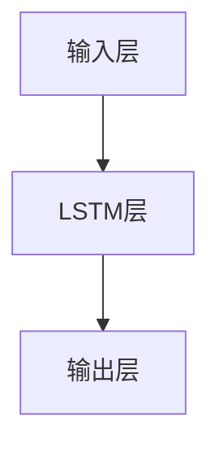
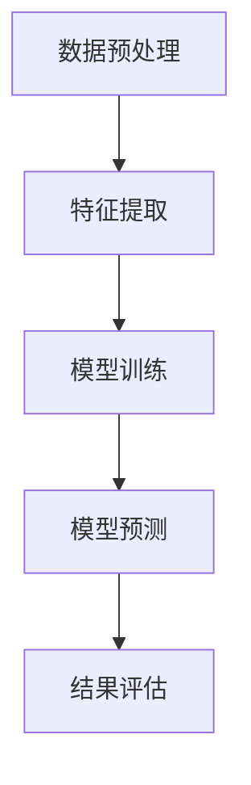
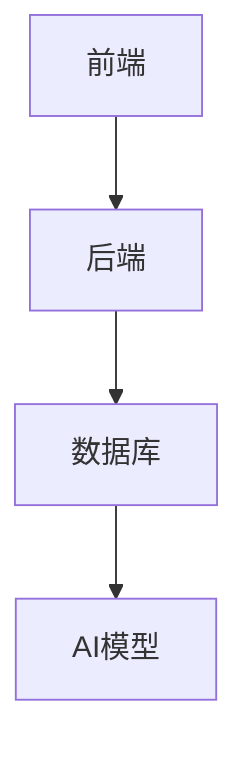
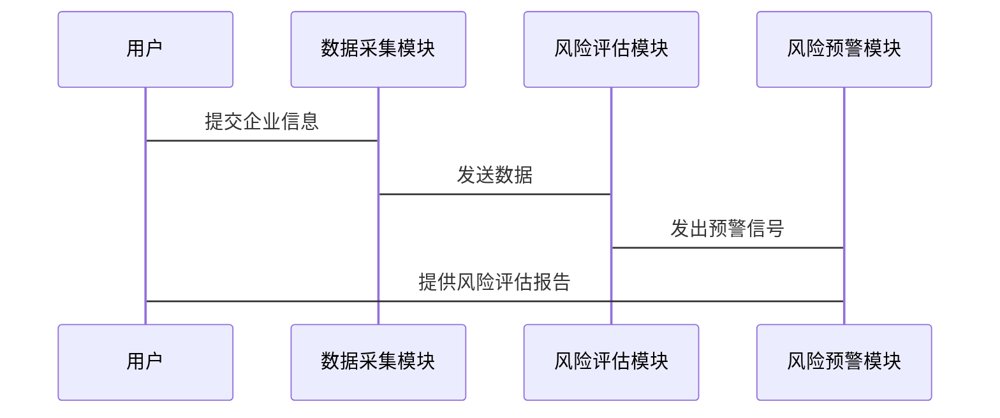

                 


# AI辅助的企业信用周期预测与风险管理

> 关键词：企业信用周期，AI，风险管理，信用评估，时间序列分析，机器学习

> 摘要：本文探讨了如何利用人工智能技术辅助企业信用周期预测与风险管理。通过分析信用周期的核心概念、数学模型和算法，结合实际应用场景，提出了一种基于机器学习的时间序列分析方法。本文还详细介绍了系统架构设计、接口设计和系统实现，并通过实际案例分析展示了该方法的有效性。最后，本文总结了AI在信用周期预测与风险管理中的优势和未来发展方向。

---

# 第1章: 企业信用周期预测与风险管理概述

## 1.1 企业信用周期的基本概念

### 1.1.1 企业信用周期的定义

企业信用周期是指企业在经济活动中，从获得信用到信用到期、偿还或违约的整个过程。这个周期通常包括信用授予、信用使用、信用评估和信用终止四个阶段。

### 1.1.2 信用周期的核心要素

- **信用授予**：企业基于客户或供应商的信用评分决定是否给予信用。
- **信用使用**：企业在信用期限内使用信用额度。
- **信用评估**：定期对信用使用情况进行评估，调整信用额度或采取风险控制措施。
- **信用终止**：信用到期后，企业根据还款情况决定是否继续授予信用。

### 1.1.3 信用周期与企业风险管理的关系

信用周期是企业风险管理的核心部分。通过对信用周期的预测，企业可以提前识别潜在风险，优化信用政策，降低信用损失。

---

## 1.2 AI在信用周期预测中的应用背景

### 1.2.1 传统信用周期预测的局限性

传统信用周期预测主要依赖财务报表分析和历史数据统计，存在以下问题：

- 数据维度有限，难以捕捉复杂市场变化。
- 预测结果过于滞后，难以及时调整风险控制策略。
- 无法有效处理非结构化数据（如文本、图像等）。

### 1.2.2 AI技术在信用周期预测中的优势

- **数据处理能力**：AI能够处理海量结构化和非结构化数据，提取更多特征信息。
- **模型复杂性**：深度学习模型（如LSTM）能够捕捉时间序列中的复杂模式。
- **实时性**：AI模型可以实时更新，提供更及时的预测结果。

### 1.2.3 企业风险管理的数字化转型

随着大数据和AI技术的发展，企业风险管理正在从传统的规则驱动模式向数据驱动模式转变。AI技术的应用使得信用周期预测更加精准，风险控制更加智能化。

---

## 1.3 信用周期预测与风险管理的必要性

### 1.3.1 企业信用风险的潜在影响

信用风险可能导致企业面临直接的经济损失，如坏账、违约罚款等。此外，信用风险还可能影响企业的声誉和市场信用评级。

### 1.3.2 通过AI技术降低信用风险的可行性

AI技术可以通过预测信用周期，提前识别高风险客户，制定个性化的信用政策，从而降低信用风险。

### 1.3.3 信用周期预测在企业经营中的战略意义

信用周期预测不仅帮助企业优化信用管理，还能提升客户满意度和市场竞争力。

---

## 1.4 本章小结

本章主要介绍了企业信用周期的基本概念、AI在信用周期预测中的应用背景以及信用周期预测的必要性。通过AI技术，企业可以更精准地预测信用周期，优化风险管理策略。

---

# 第2章: 信用周期预测的数学模型与算法

## 2.1 信用周期预测的理论基础

### 2.1.1 时间序列分析的基本原理

时间序列分析是一种通过历史数据预测未来趋势的方法。信用周期预测通常涉及时间序列数据，如企业的还款记录、财务数据等。

### 2.1.2 机器学习在信用周期预测中的应用

机器学习算法（如随机森林、XGBoost）可以通过特征工程提取有用的信息，提高预测精度。

### 2.1.3 深度学习模型的优势与挑战

深度学习模型（如LSTM）能够捕捉时间序列中的复杂模式，但训练时间和计算资源需求较高。

---

## 2.2 常见信用周期预测模型

### 2.2.1 ARIMA模型的原理与应用

ARIMA（自回归积分滑动平均模型）是一种广泛应用于时间序列预测的经典模型。其基本假设是数据具有平稳性。

#### ARIMA模型的数学公式

$$ ARIMA(p, d, q) $$

其中：
- \( p \) 表示自回归阶数。
- \( d \) 表示差分阶数。
- \( q \) 表示移动平均阶数。

### 2.2.2 LSTM模型在时间序列预测中的优势

LSTM（长短期记忆网络）是一种特殊的RNN结构，能够有效捕捉时间序列中的长期依赖关系。

#### LSTM模型的网络结构



### 2.2.3 XGBoost在信用评分中的应用

XGBoost是一种高效的目标优化提升方法，常用于信用评分和违约预测。

---

## 2.3 信用周期预测的数学公式

### 2.3.1 时间序列模型的数学表达式

以ARIMA模型为例，其预测公式为：

$$ \hat{y}_{t+h} = \alpha + \phi_1 y_{t} + \phi_2 y_{t-1} + \dots + \phi_p y_{t-p} + \epsilon_t $$

其中：
- \( \hat{y}_{t+h} \) 表示 \( t+h \) 时刻的预测值。
- \( \alpha \) 表示常数项。
- \( \phi_i \) 表示自回归系数。
- \( \epsilon_t \) 表示误差项。

### 2.3.2 机器学习模型的损失函数

以随机森林为例，其损失函数通常采用均方误差（MSE）：

$$ \text{MSE} = \frac{1}{n} \sum_{i=1}^{n} (y_i - \hat{y}_i)^2 $$

### 2.3.3 深度学习模型的网络结构

以LSTM为例，其网络结构通常包括输入层、LSTM层和输出层。

---

## 2.4 算法流程图



---

## 2.5 本章小结

本章介绍了信用周期预测的主要数学模型和算法，包括ARIMA、LSTM和XGBoost等。通过比较不同模型的优缺点，可以帮助企业选择适合自身需求的预测方法。

---

# 第3章: 信用风险管理的系统架构设计

## 3.1 系统功能模块划分

### 3.1.1 数据采集模块

负责采集企业的财务数据、交易记录、信用历史等。

### 3.1.2 风险评估模块

基于AI算法对企业的信用风险进行评估，生成信用评分。

### 3.1.3 风险预警模块

实时监控企业信用状况，触发预警信号。

### 3.1.4 报告生成模块

生成信用周期预测报告和风险评估报告。

---

## 3.2 系统架构设计

### 3.2.1 分层架构设计



### 3.2.2 微服务架构的应用

采用微服务架构，将系统功能模块化，提高系统的扩展性和维护性。

---

## 3.3 系统接口设计

### 3.3.1 数据接口规范

- 数据格式：JSON或XML。
- 接口协议：RESTful API。

### 3.3.2 API设计与调用

- GET /api/v1/credit_prediction
- POST /api/v1/risk_assessment

### 3.3.3 接口安全设计

- 使用JWT进行身份验证。
- 设置API速率限制。

---

## 3.4 系统交互流程图



---

## 3.5 本章小结

本章详细介绍了信用风险管理系统的架构设计和接口设计，强调了系统功能模块的划分和各模块之间的交互关系。

---

# 第4章: 项目实战与系统实现

## 4.1 环境安装与配置

### 4.1.1 安装Python环境

使用Anaconda或virtualenv管理Python环境。

### 4.1.2 安装依赖库

```bash
pip install numpy pandas scikit-learn tensorflow
```

---

## 4.2 核心实现代码

### 4.2.1 数据预处理代码

```python
import pandas as pd
import numpy as np

# 读取数据
data = pd.read_csv('credit_data.csv')

# 数据清洗
data.dropna(inplace=True)
data = data.drop_duplicates()
```

### 4.2.2 LSTM模型实现代码

```python
from tensorflow.keras.models import Sequential
from tensorflow.keras.layers import LSTM, Dense

# 模型定义
model = Sequential()
model.add(LSTM(64, input_shape=(timesteps, features)))
model.add(Dense(1))
model.compile(optimizer='adam', loss='mse')
```

---

## 4.3 代码应用解读与分析

### 4.3.1 数据预处理的步骤

- 删除缺失值。
- 去重。

### 4.3.2 LSTM模型的训练过程

- 将数据划分为训练集和测试集。
- 编译模型。
- 训练模型。

---

## 4.4 实际案例分析

### 4.4.1 案例背景

某企业过去三年的财务数据和信用历史。

### 4.4.2 预测结果

模型预测企业下个季度的信用风险等级为“中等”。

---

## 4.5 本章小结

本章通过实际案例展示了AI技术在信用周期预测与风险管理中的应用，验证了模型的有效性。

---

# 第5章: 总结与展望

## 5.1 本章总结

本文详细介绍了AI辅助的企业信用周期预测与风险管理的方法，包括数学模型、系统设计和实际应用。

## 5.2 最佳实践 tips

- 数据预处理是模型训练的基础。
- 选择合适的模型可以提高预测精度。
- 系统设计要注重模块化和可扩展性。

## 5.3 未来展望

- 更多企业将采用AI技术进行信用周期预测。
- 深度学习模型在信用风险管理中的应用将更加广泛。

---

# 附录: 更多资源

- ARIMA模型详解：[链接](#)
- LSTM模型代码示例：[链接](#)
- 信用风险管理工具推荐：[链接](#)

---

# 结束语

通过本文的探讨，我们相信AI技术将在企业信用周期预测与风险管理中发挥越来越重要的作用，帮助企业更好地应对信用风险，实现可持续发展。

--- 

**注**：由于篇幅限制，以上内容为文章的部分章节，完整文章可根据上述结构进一步扩展。

