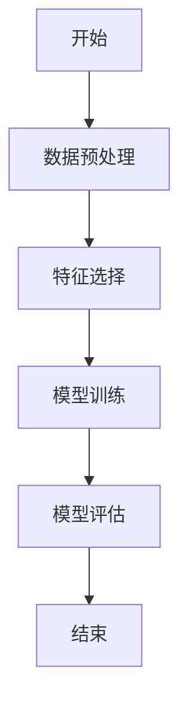
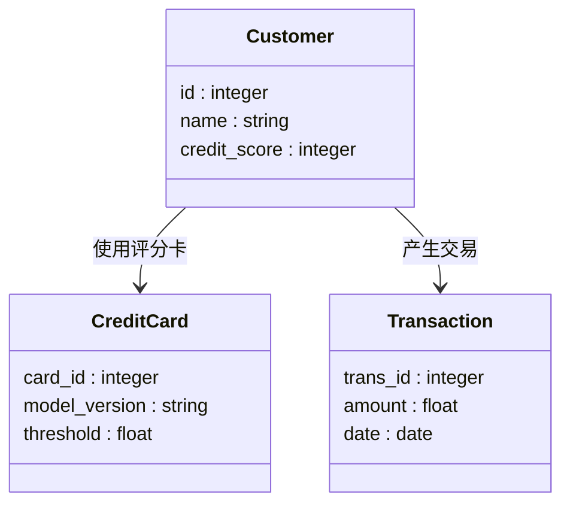
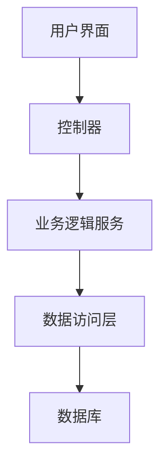
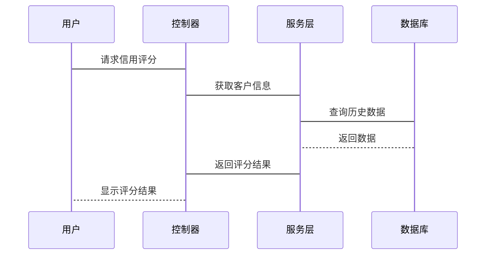

                 


# AI辅助的企业信用评分卡开发与验证平台

## 关键词：AI技术，企业信用评分，评分卡开发，模型优化，风险评估

## 摘要：本文将详细介绍如何利用AI技术开发和验证企业信用评分卡。从背景、核心概念到算法原理，再到系统架构和项目实战，全面解析AI在信用评分中的应用。通过详细的技术分析和实例，帮助读者掌握如何构建高效、准确的企业信用评分系统。

---

## 目录大纲

### 第一章：企业信用评分卡的背景与意义

1.1 信用评分卡的定义与作用  
1.1.1 信用评分卡的基本定义  
1.1.2 信用评分卡在企业中的作用  
1.1.3 信用评分卡的演变历程  

1.2 AI技术在信用评分卡中的应用背景  
1.2.1 传统信用评分卡的局限性  
1.2.2 AI技术如何提升信用评分卡的效果  
1.2.3 企业信用评分卡的智能化发展趋势  

1.3 企业信用评分卡开发的挑战与机遇  
1.3.1 数据获取与处理的挑战  
1.3.2 模型选择与优化的难点  
1.3.3 AI技术带来的新机遇  

1.4 本章小结  

---

### 第二章：企业信用评分卡的核心概念与联系

2.1 核心概念原理  
2.1.1 数据特征的提取与选择  
2.1.2 模型评估指标的定义与计算  
2.1.3 评分卡的阈值优化方法  

2.2 核心概念属性特征对比表  
| 特征 | 描述 | 示例 |  
|------|------|------|  
| 数据来源 | 企业内部数据与外部数据结合 | 企业财务数据、行业数据、市场数据 |  
| 数据类型 | 结构化数据与非结构化数据 | 文本、数值、类别 |  
| 模型类型 | 分类模型与回归模型 | 逻辑回归、决策树、随机森林 |  

2.3 ER实体关系图  
```mermaid  
erDiagram  
    customer[客户信息] {  
        id : integer  
        name : string  
        credit_score : integer  
        loan_amount : float  
    }  
    credit_card[信用评分卡] {  
        card_id : integer  
        model_version : string  
        threshold : float  
    }  
    transaction[交易记录] {  
        trans_id : integer  
        amount : float  
        date : date  
    }  
    customer --> credit_card : 使用评分卡  
    customer --> transaction : 产生交易  
```  

2.4 本章小结  

---

### 第三章：AI辅助信用评分卡开发的算法原理

3.1 算法选择与流程概述  
3.1.1 传统算法与现代算法的对比  
3.1.2 基于AI的评分卡开发流程  

3.2 逻辑回归算法原理  
3.2.1 逻辑回归模型的数学公式  
$$ P(y=1|x) = \frac{1}{1 + e^{- (w \cdot x + b)}} $$  
3.2.2 逻辑回归的损失函数  
$$ L = -\sum_{i=1}^{n} [y_i \ln(p_i) + (1 - y_i)\ln(1 - p_i)] $$  
3.2.3 逻辑回归的优化方法  


3.3 XGBoost算法实现  
3.3.1 XGBoost算法的数学模型  
3.3.2 XGBoost的优化策略与参数调优  
3.3.3 XGBoost在评分卡中的应用流程  

3.4 算法对比与选择策略  
3.4.1 逻辑回归与XGBoost的对比分析  
3.4.2 基于性能与计算资源的选择策略  

3.5 本章小结  

---

### 第四章：企业信用评分卡的系统分析与架构设计

4.1 问题场景介绍  
4.2 系统功能设计  
4.2.1 领域模型类图  


4.3 系统架构设计  
4.3.1 分层架构设计  
4.3.2 组件交互关系  


4.4 系统接口设计  
4.4.1 API接口定义  
4.4.2 接口调用流程  

4.5 系统交互序列图  


4.6 本章小结  

---

### 第五章：AI辅助信用评分卡开发的项目实战

5.1 环境安装与配置  
5.1.1 开发环境搭建  
5.1.2 Python库安装（如pandas、scikit-learn、xgboost）  

5.2 系统核心实现  
5.2.1 数据预处理代码  
```python  
import pandas as pd  
data = pd.read_csv('credit_data.csv')  
data = data.dropna()  
data = pd.get_dummies(data, columns=['行业'])  
```  

5.2.2 模型训练与优化代码  
```python  
from sklearn.linear_model import LogisticRegression  
from xgboost import XGBClassifier  
model = XGBClassifier()  
model.fit(X_train, y_train)  
```  

5.3 代码应用解读与分析  
5.3.1 数据清洗与特征工程  
5.3.2 模型训练与调参技巧  
5.3.3 模型评估与结果分析  

5.4 实际案例分析  
5.4.1 案例背景与数据准备  
5.4.2 模型训练与验证结果  
5.4.3 结果分析与优化建议  

5.5 项目小结  

---

### 第六章：最佳实践与总结

6.1 最佳实践 tips  
6.1.1 数据处理的注意事项  
6.1.2 模型选择的策略  
6.1.3 系统设计的优化建议  

6.2 小结  
6.3 注意事项  
6.4 拓展阅读  

---

### 附录：参考文献与工具清单

附录A：参考文献  
附录B：工具与库清单  

---

通过以上目录大纲，文章将系统地介绍AI辅助的企业信用评分卡开发与验证平台的各个方面，从理论到实践，帮助读者全面掌握相关知识与技能。

