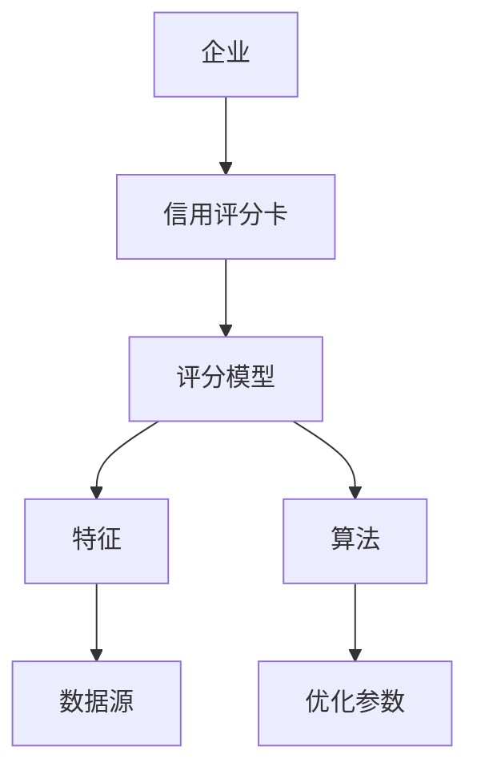
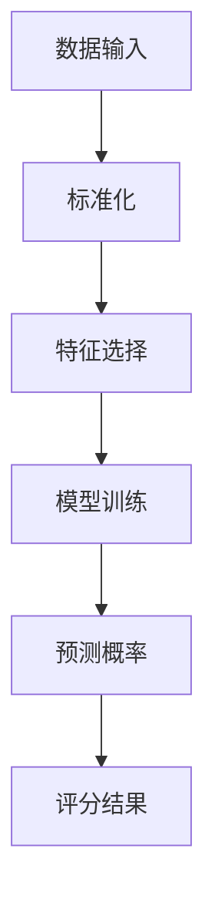
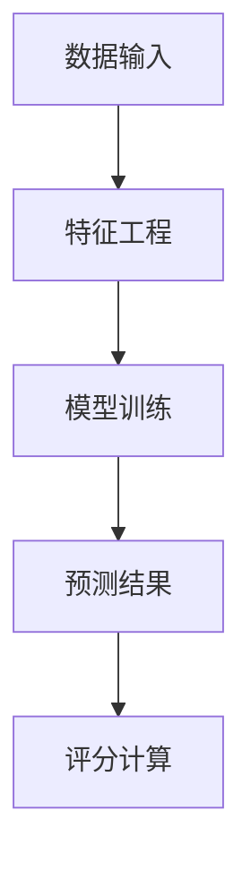
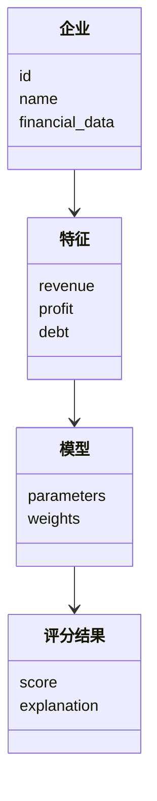
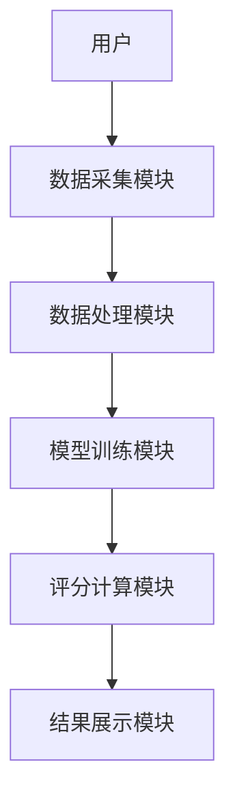
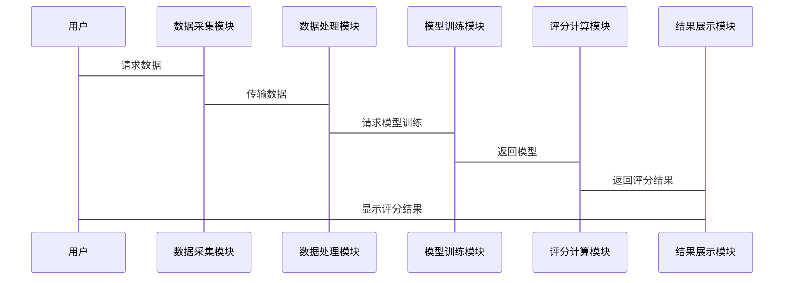

                 


# AI辅助的企业信用评分卡开发平台

## 关键词：企业信用评分卡、人工智能、机器学习、评分模型、风险管理

## 摘要：  
本文深入探讨了AI辅助的企业信用评分卡开发平台的构建与应用。通过分析传统信用评分的局限性，结合AI技术的优势，提出了一种高效的开发平台架构。文章详细介绍了平台的核心概念、算法原理、系统设计以及项目实战，并通过具体案例展示了如何利用该平台快速开发和优化企业信用评分卡。最后，总结了最佳实践和未来发展方向。

---

# 第一部分: 企业信用评分卡开发的背景与挑战

## 第1章: 企业信用评分卡的背景与重要性

### 1.1 企业信用评分卡的定义与作用

#### 1.1.1 企业信用评分卡的定义
企业信用评分卡是一种用于评估企业信用风险的工具，通过对企业的财务数据、经营状况、市场表现等多维度信息进行分析，生成一个量化评分，帮助金融机构或投资者评估企业的信用风险。

#### 1.1.2 信用评分卡在企业风险管理中的作用
- **风险控制**：通过评分卡识别高风险企业，降低信贷违约率。
- **决策支持**：为贷款审批、投资决策等提供数据支持。
- **效率提升**：自动化评分过程，减少人工干预，提高决策效率。

#### 1.1.3 信用评分卡的演变与发展趋势
- **传统评分方法**：基于简单的财务指标，如资产负债率、利润率等。
- **AI驱动的评分方法**：利用机器学习算法，结合非结构化数据（如新闻、社交媒体数据）进行更精准的评分。
- **未来趋势**：实时动态评分、多维度数据融合、个性化评分模型。

### 1.2 AI在信用评分中的应用背景

#### 1.2.1 传统信用评分的局限性
- 数据维度有限，难以捕捉企业动态风险。
- 模型泛化能力差，难以应对市场变化。
- 人工干预过多，效率低下。

#### 1.2.2 AI技术在信用评分中的优势
- **数据处理能力**：AI能够处理海量数据，包括结构化和非结构化数据。
- **模型复杂性**：深度学习模型可以捕捉复杂的非线性关系。
- **实时性**：AI算法可以实现实时评分，及时反映企业信用状况。

#### 1.2.3 企业信用评分卡开发的痛点与挑战
- 数据质量：数据缺失、噪声大。
- 模型解释性：复杂模型难以解释评分结果。
- 模型性能：如何在不同场景下保持模型的稳定性和准确性。

---

## 第2章: AI辅助开发平台的核心概念

### 2.1 AI辅助开发平台的定义与特点

#### 2.1.1 平台的定义
AI辅助的企业信用评分卡开发平台是一种基于机器学习和大数据技术的工具，旨在帮助企业快速构建、优化和部署信用评分模型。

#### 2.1.2 平台的核心功能与特点
- **数据采集与处理**：支持多种数据源，提供数据清洗和特征工程功能。
- **模型训练与优化**：内置多种机器学习算法，支持自动调参和模型优化。
- **评分计算与解释**：生成评分结果，并提供可解释的分析报告。
- **实时监控与更新**：实时跟踪企业信用状况，动态更新评分模型。

#### 2.1.3 平台与传统开发工具的区别
- **自动化程度高**：AI平台能够自动完成数据处理和模型训练，减少人工干预。
- **数据驱动**：基于大数据分析，提供更精准的评分结果。
- **灵活性强**：支持定制化模型和动态调整评分策略。

### 2.2 企业信用评分卡开发的关键要素

#### 2.2.1 数据采集与处理
- **数据源**：企业财务报表、行业数据、市场新闻等。
- **数据清洗**：处理缺失值、异常值和重复数据。
- **特征工程**：提取关键特征，如财务指标、市场表现、信用历史等。

#### 2.2.2 模型训练与优化
- **算法选择**：逻辑回归、随机森林、梯度提升树（如XGBoost、LightGBM）等。
- **模型调优**：通过交叉验证优化模型参数。
- **模型评估**：使用ROC-AUC、F1分数等指标评估模型性能。

#### 2.2.3 评分策略与结果解释
- **评分策略**：根据模型输出生成信用评分，如AAA、AA、A、BBB等。
- **结果解释**：提供评分解释，如关键特征对评分的影响程度。
- **可视化报告**：生成图表和报告，帮助用户理解评分结果。

---

## 第3章: AI辅助平台的核心概念与联系

### 3.1 核心概念原理

#### 3.1.1 数据预处理与特征工程
- 数据预处理：清洗数据，处理缺失值和异常值。
- 特征工程：提取关键特征，如财务指标、市场表现等。

#### 3.1.2 AI模型训练与调优
- 模型选择：根据数据特点选择合适的算法。
- 模型调优：通过交叉验证优化模型参数。

#### 3.1.3 评分结果的解释与应用
- 评分解释：分析关键特征对评分的影响。
- 应用场景：信用审批、风险预警、投资决策等。

### 3.2 核心概念属性对比表格

| 概念         | 定义                                                                 | 特点                                                                 |
|--------------|----------------------------------------------------------------------|----------------------------------------------------------------------|
| 数据预处理   | 对原始数据进行清洗、转换和标准化的过程                               | 提高模型训练效率和准确性           |
| 特征工程     | 从数据中提取对目标变量有预测能力的特征的过程                         | 提升模型性能和可解释性             |
| 模型调优     | 通过调整模型参数优化模型性能的过程                                   | 提高模型预测准确性和泛化能力       |

### 3.3 实体关系图



---

## 第4章: 算法原理与实现

### 4.1 算法原理

#### 4.1.1 逻辑回归



```python
import pandas as pd
from sklearn.linear_model import LogisticRegression
from sklearn.metrics import roc_auc_score

# 数据加载与预处理
data = pd.read_csv('credit_data.csv')
data = data.dropna()
data['label'] = data['label'].astype(int)

# 特征选择
features = ['revenue', 'profit', 'debt']
X = data[features]
y = data['label']

# 模型训练
model = LogisticRegression()
model.fit(X, y)

# 模型评估
y_pred = model.predict_proba(X)[:, 1]
roc_auc = roc_auc_score(y, y_pred)
print(f"ROC-AUC Score: {roc_auc}")
```

#### 4.1.2 XGBoost



```python
import xgboost as xgb
from sklearn.metrics import mean_squared_error

# 数据加载与预处理
data = pd.read_csv('credit_data.csv')
data = data.dropna()
data['label'] = data['label'].astype(int)

# 特征选择
features = ['revenue', 'profit', 'debt']
X = data[features]
y = data['label']

# 模型训练
dtrain = xgb.DMatrix(X, label=y)
params = {'max_depth': 3, 'learning_rate': 0.1}
model = xgb.train(params, dtrain)

# 模型评估
y_pred = model.predict(dtrain)
mse = mean_squared_error(y, y_pred)
print(f"Mean Squared Error: {mse}")
```

#### 4.1.3 神经网络


```python
import tensorflow as tf
from sklearn.metrics import accuracy_score

# 数据加载与预处理
data = pd.read_csv('credit_data.csv')
data = data.dropna()
data['label'] = data['label'].astype(int)

# 特征选择
features = ['revenue', 'profit', 'debt']
X = data[features]
y = data['label']

# 模型训练
model = tf.keras.Sequential([
    tf.keras.layers.Dense(64, activation='relu'),
    tf.keras.layers.Dense(1, activation='sigmoid')
])
model.compile(optimizer='adam', loss='binary_crossentropy', metrics=['accuracy'])
model.fit(X, y, epochs=10, batch_size=32)

# 模型评估
y_pred = model.predict(X)
accuracy = accuracy_score(y, y_pred.round())
print(f"Accuracy: {accuracy}")
```

### 4.2 数学模型与公式

#### 4.2.1 逻辑回归模型
$$ P(y=1|x) = \frac{1}{1 + e^{- (w \cdot x + b)}} $$

#### 4.2.2 XGBoost模型
$$ y = \sum_{i=1}^{n} \text{tree}(x) $$

#### 4.2.3 神经网络模型
$$ y = \sigma(w \cdot x + b) $$
其中，$\sigma$ 是sigmoid函数。

---

## 第5章: 系统分析与架构设计

### 5.1 问题场景介绍

#### 5.1.1 项目介绍
企业信用评分卡开发平台旨在通过AI技术，帮助企业快速构建和优化信用评分模型，提升信用风险管理能力。

### 5.2 系统功能设计

#### 5.2.1 领域模型


#### 5.2.2 系统架构


#### 5.2.3 系统接口设计
- 数据接口：与企业数据源对接，获取企业数据。
- 模型接口：与第三方AI服务集成，调用模型训练和预测接口。
- 结果接口：将评分结果返回给用户或集成到其他系统。

#### 5.2.4 系统交互


---

## 第6章: 项目实战

### 6.1 环境安装与配置

#### 6.1.1 安装依赖
```bash
pip install numpy pandas scikit-learn xgboost tensorflow
```

#### 6.1.2 数据准备
```python
import pandas as pd

# 加载数据
data = pd.read_csv('credit_data.csv')

# 数据清洗
data = data.dropna()
data['label'] = data['label'].astype(int)
```

### 6.2 核心代码实现

#### 6.2.1 数据预处理
```python
features = ['revenue', 'profit', 'debt']
X = data[features]
y = data['label']
```

#### 6.2.2 模型训练
```python
from sklearn.model_selection import train_test_split
from sklearn.metrics import accuracy_score

# 数据分割
X_train, X_test, y_train, y_test = train_test_split(X, y, test_size=0.2)

# 模型训练
model = LogisticRegression()
model.fit(X_train, y_train)

# 模型评估
y_pred = model.predict(X_test)
accuracy = accuracy_score(y_test, y_pred)
print(f"Accuracy: {accuracy}")
```

#### 6.2.3 评分计算与解释
```python
# 生成评分结果
y_proba = model.predict_proba(X_test)[:, 1]
score = [f"Score: {p:.2f}" for p in y_proba]

# 可视化报告
import matplotlib.pyplot as plt
plt.hist(y_proba, bins=10)
plt.title('Credit Score Distribution')
plt.xlabel('Score')
plt.ylabel('Frequency')
plt.show()
```

### 6.3 案例分析与结果解读

#### 6.3.1 案例分析
假设我们有一个企业的数据：
```python
new_data = pd.DataFrame({'revenue': [1000000, 500000], 'profit': [200000, 100000], 'debt': [500000, 300000]})
```

#### 6.3.2 模型预测
```python
y_new_proba = model.predict_proba(new_data)[:, 1]
print(f"Predicted probabilities: {y_new_proba}")
```

### 6.4 项目小结
- **优势**：快速构建模型，提高效率。
- **挑战**：数据质量和模型解释性仍需优化。
- **改进方向**：引入更多数据源，优化模型结构。

---

## 第7章: 最佳实践与未来展望

### 7.1 最佳实践

#### 7.1.1 数据质量管理
- 确保数据的完整性和准确性。
- 处理异常值和噪声数据。

#### 7.1.2 模型解释性
- 使用特征重要性分析，提高模型可解释性。
- 提供可视化报告，帮助用户理解评分结果。

#### 7.1.3 模型性能优化
- 定期更新模型，适应市场变化。
- 引入实时数据，提高评分的及时性。

### 7.2 小结

#### 7.2.1 总结
AI辅助的企业信用评分卡开发平台通过自动化数据处理和模型训练，显著提高了信用评分的效率和准确性。然而，数据质量和模型解释性仍需进一步优化。

#### 7.2.2 展望
未来，随着AI技术的进步，信用评分卡将更加智能化和个性化。实时动态评分、多维度数据融合和自适应模型优化将是未来发展的主要方向。

---

## 第8章: 注意事项与拓展阅读

### 8.1 注意事项

#### 8.1.1 数据隐私与安全
确保数据的隐私和安全，遵守相关法律法规。

#### 8.1.2 模型鲁棒性
在不同场景下验证模型的鲁棒性，避免过拟合和欠拟合。

#### 8.1.3 用户培训
对平台用户进行培训，确保其能够正确使用和理解评分结果。

### 8.2 拓展阅读

#### 8.2.1 推荐书籍
- 《机器学习实战》
- 《信用评分模型开发与应用》

#### 8.2.2 在线资源
- Kaggle上的信用评分相关数据集
- TensorFlow和XGBoost的官方文档

---

## 第9章: 项目小结与下一步计划

### 9.1 项目小结

#### 9.1.1 项目目标
构建一个基于AI的企业信用评分卡开发平台，帮助企业快速优化信用评分模型。

#### 9.1.2 实现成果
完成了数据预处理、模型训练、评分计算和结果展示模块的开发。

### 9.2 下一步计划

#### 9.2.1 功能优化
- 引入实时数据流处理。
- 支持多模型对比和优化。

#### 9.2.2 技术提升
- 深入研究深度学习模型，如BERT，用于文本数据的处理。
- 探索联邦学习技术，实现数据隐私下的模型协作。

---

## 第10章: 结语

通过本文的详细介绍，我们了解了AI辅助的企业信用评分卡开发平台的构建过程和应用场景。未来，随着AI技术的不断发展，信用评分卡将更加智能化和精准化，为企业信用风险管理提供更强大的支持。

---

