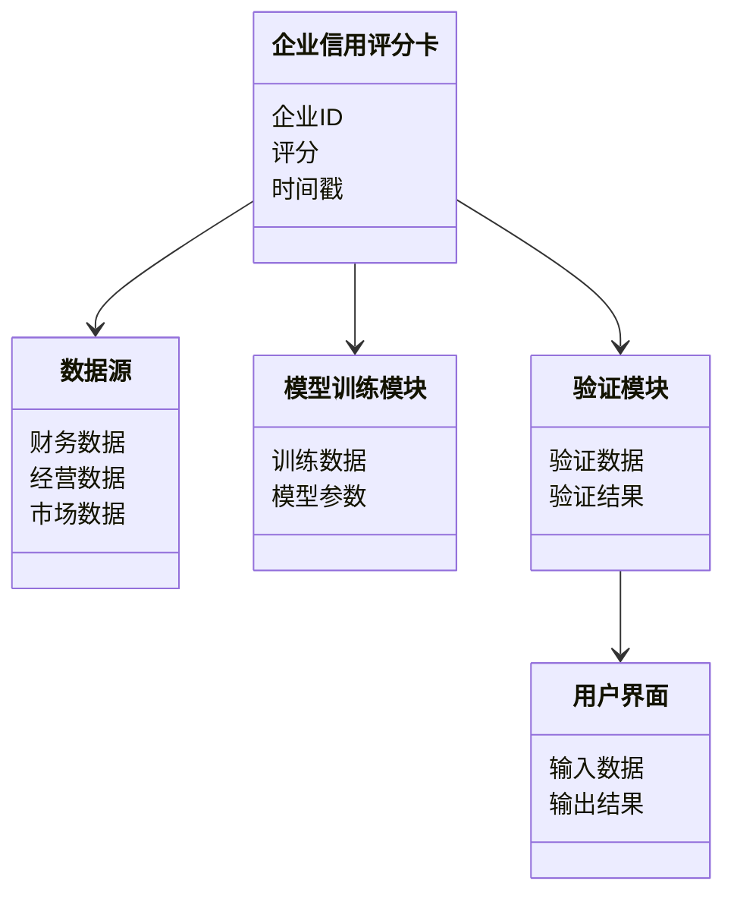
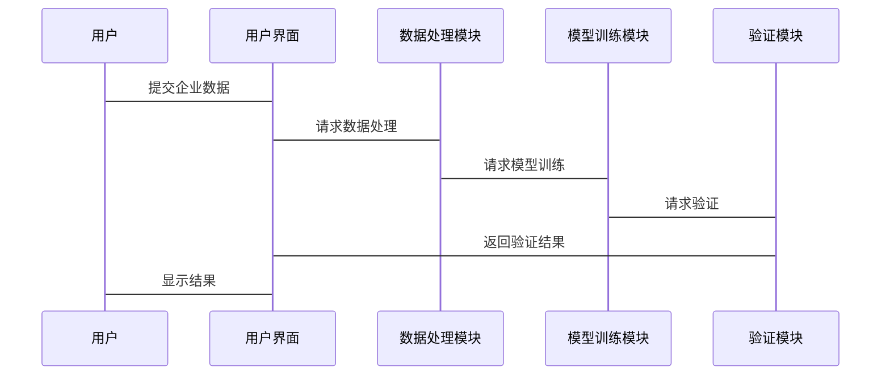

                 


# AI辅助的企业信用评分卡验证

## 关键词：AI，企业信用评分卡，信用评分，机器学习，风险评估，数据验证

## 摘要：  
随着人工智能技术的快速发展，企业信用评分卡的验证过程逐渐从传统的人工审核转向智能化的AI辅助模式。本文将深入探讨AI在企业信用评分卡验证中的应用，从背景、核心概念、算法原理、系统架构到项目实战，全面解析AI如何提升信用评分卡的验证效率和准确性。通过具体案例分析和代码实现，帮助读者理解AI技术在信用评分卡验证中的实际应用场景和价值。

---

# 第一部分：企业信用评分卡的背景与挑战

## 第1章：企业信用评分卡的背景与挑战

### 1.1 企业信用评分卡的基本概念

#### 1.1.1 信用评分卡的定义  
信用评分卡是一种用于评估企业信用状况的工具，通过对企业财务数据、经营状况、市场表现等多维度信息的分析，生成一个综合评分，用以反映企业的信用风险水平。

#### 1.1.2 信用评分卡的作用与意义  
- **作用**：帮助银行、投资机构等评估企业的信用风险，做出授信决策。  
- **意义**：降低金融风险，提高信贷审批效率，优化资源配置。  

#### 1.1.3 信用评分卡的核心要素  
| 核心要素 | 描述 | 示例数据 |
|----------|------|----------|
| 财务状况 | 包括收入、利润、负债等财务指标 | 营业收入、净利润 |
| 经营能力 | 包括利润率、周转率等经营效率指标 | 资产周转率、销售净利率 |
| 偿债能力 | 包括流动比率、速动比率等偿债能力指标 | 流动比率、速动比率 |
| 市场表现 | 包括市场份额、行业排名等市场相关指标 | 市场份额、行业排名 |
| 管理能力 | 包括管理团队的稳定性、战略规划等管理相关指标 | 管理团队稳定性、战略清晰度 |

### 1.2 企业信用评分卡的验证需求

#### 1.2.1 信用评分卡验证的必要性  
- 信用评分卡的准确性直接影响企业的授信决策，因此需要通过验证确保评分的可靠性和稳定性。  
- 传统信用评分卡验证依赖人工审核，效率低且容易出错，需要引入AI技术提升效率和准确性。  

#### 1.2.2 传统信用评分卡验证的痛点  
| 痛点 | 描述 |
|------|------|
| 低效性 | 人工审核耗时长，难以处理大量数据 |  
| 不准确性 | 人为判断容易受到主观因素影响，导致评分偏差 |  
| 高成本 | 需要大量人力资源，成本较高 |  
| 缺乏动态性 | 无法实时更新评分，难以应对市场变化 |  

#### 1.2.3 AI辅助信用评分卡验证的优势  
| 优势 | 描述 |
|------|------|
| 高效率 | AI算法可以快速处理海量数据，显著提升验证效率 |  
| 高准确性 | 基于机器学习的模型能够捕捉数据中的复杂模式，提高评分准确性 |  
| 低成本 | 自动化验证流程减少了对人工的依赖，降低运营成本 |  
| 实时性 | AI系统可以实时更新数据，动态调整评分结果 |  

### 1.3 AI在企业信用评分卡验证中的应用前景

#### 1.3.1 AI技术在信用评分中的潜在应用  
- 数据预处理：清洗和特征提取。  
- 模型训练：构建机器学习模型，如逻辑回归、随机森林等。  
- 模型验证：通过交叉验证评估模型性能。  

#### 1.3.2 企业信用评分卡验证的智能化趋势  
- AI技术的引入使得信用评分卡验证从人工主导转向智能辅助。  
- 通过大数据分析和机器学习模型，信用评分卡的验证更加精准和高效。  

#### 1.3.3 AI辅助信用评分卡验证的市场价值  
- 提高金融机构的风险控制能力，降低不良贷款率。  
- 提升企业融资效率，促进金融市场的健康发展。  

### 1.4 本章小结  
本章从企业信用评分卡的基本概念、验证需求和AI的应用前景三个方面，全面介绍了AI辅助信用评分卡验证的重要性和必要性。接下来将深入探讨信用评分卡的核心概念及其与AI的联系。

---

# 第二部分：企业信用评分卡验证的核心概念与AI联系

## 第2章：企业信用评分卡的核心概念

### 2.1 信用评分卡的构建过程

#### 2.1.1 数据收集与处理  
- 数据来源：企业财务报表、市场数据、行业报告等。  
- 数据清洗：处理缺失值、异常值和重复数据。  
- 数据标准化：对不同量纲的特征进行标准化处理。  

#### 2.1.2 模型训练与验证  
- 选择合适的机器学习模型，如逻辑回归、支持向量机（SVM）、随机森林等。  
- 使用训练数据训练模型，并通过验证数据评估模型性能。  

#### 2.1.3 模型部署与应用  
- 将训练好的模型部署到生产环境，用于实时信用评分。  
- 定期更新模型，确保评分结果的准确性和时效性。  

### 2.2 信用评分卡验证的关键指标

#### 2.2.1 准确率  
准确率是模型预测结果与真实结果的匹配程度。  
$$ \text{准确率} = \frac{\text{正确预测的数量}}{\text{总预测数量}} $$  

#### 2.2.2 召回率  
召回率是模型正确预测的正样本数量与实际正样本总数的比例。  
$$ \text{召回率} = \frac{\text{真正例数}}{\text{真例总数}} $$  

#### 2.2.3 F1分数  
F1分数是准确率和召回率的调和平均数，综合衡量模型的性能。  
$$ F1 = 2 \times \frac{\text{准确率} \times \text{召回率}}{\text{准确率} + \text{召回率}} $$  

#### 2.2.4 ROC-AUC曲线  
ROC-AUC曲线是评估分类模型性能的重要指标，AUC值越接近1，模型性能越好。  

### 2.3 信用评分卡验证的流程

#### 2.3.1 数据预处理  
- 清洗数据，处理缺失值和异常值。  
- 对数据进行标准化或归一化处理。  

#### 2.3.2 模型选择  
- 根据数据特征选择合适的机器学习算法，如逻辑回归、随机森林等。  

#### 2.3.3 模型训练  
- 使用训练数据训练模型，并通过交叉验证评估模型性能。  

#### 2.3.4 模型验证  
- 使用验证数据评估模型的准确率、召回率等指标。  

#### 2.3.5 模型优化  
- 根据验证结果调整模型参数，优化模型性能。  

## 第3章：AI与企业信用评分卡验证的联系

### 3.1 AI在信用评分卡验证中的应用场景

#### 3.1.1 数据预处理  
- 使用自然语言处理（NLP）技术提取企业文本数据中的有用信息。  
- 利用聚类算法自动识别数据中的异常值。  

#### 3.1.2 特征选择  
- 使用特征重要性分析方法，如随机森林的特征重要性，选择关键特征。  

#### 3.1.3 模型训练  
- 构建基于深度学习的神经网络模型，进一步提升模型的表达能力。  

#### 3.1.4 模型验证  
- 使用混淆矩阵分析模型的分类性能。  
- 通过ROC-AUC曲线评估模型的区分能力。  

#### 3.1.5 模型优化  
- 使用超参数调优技术，如网格搜索（Grid Search），优化模型性能。  

---

# 第三部分：系统分析与架构设计

## 第4章：系统分析与架构设计

### 4.1 问题场景介绍

#### 4.1.1 项目背景  
企业信用评分卡验证系统需要实时处理大量的企业数据，快速生成准确的信用评分。  

#### 4.1.2 项目目标  
- 实现AI辅助的信用评分卡验证系统，提升验证效率和准确性。  

### 4.2 系统功能设计

#### 4.2.1 领域模型类图  


### 4.3 系统架构设计

#### 4.3.1 系统架构图  


### 4.4 系统接口设计

#### 4.4.1 接口描述  
- 数据输入接口：接收企业数据，格式为JSON或CSV。  
- 模型训练接口：训练机器学习模型，返回模型参数。  
- 验证接口：输入数据，返回验证结果。  

### 4.5 系统交互流程

#### 4.5.1 交互序列图  


---

# 第四部分：项目实战

## 第5章：项目实战

### 5.1 环境安装

#### 5.1.1 安装Python环境  
- 使用Anaconda安装Python 3.8及以上版本。  

#### 5.1.2 安装依赖库  
```bash
pip install numpy pandas scikit-learn matplotlib
```

### 5.2 核心代码实现

#### 5.2.1 数据预处理  
```python
import pandas as pd
import numpy as np

# 读取数据
data = pd.read_csv('企业数据.csv')

# 处理缺失值
data = data.dropna()

# 标准化处理
from sklearn.preprocessing import StandardScaler
scaler = StandardScaler()
data_scaled = scaler.fit_transform(data)
```

#### 5.2.2 模型训练  
```python
from sklearn.linear_model import LogisticRegression
from sklearn.metrics import accuracy_score, recall_score, f1_score, roc_auc_score

# 划分训练集和验证集
X_train, X_test, y_train, y_test = train_test_split(data_scaled, target, test_size=0.2)

# 训练模型
model = LogisticRegression()
model.fit(X_train, y_train)

# 验证模型
y_pred = model.predict(X_test)
print(f"准确率: {accuracy_score(y_test, y_pred)}")
print(f"召回率: {recall_score(y_test, y_pred)}")
print(f"F1分数: {f1_score(y_test, y_pred)}")
print(f"ROC-AUC: {roc_auc_score(y_test, y_pred)}")
```

#### 5.2.3 模型优化  
```python
from sklearn.model_selection import GridSearchCV

# 定义参数搜索空间
param_grid = {
    'penalty': ['l2'],
    'C': np.logspace(-4, 4, 20)
}

# 网格搜索优化
grid_search = GridSearchCV(model, param_grid, cv=5)
grid_search.fit(X_train, y_train)

# 输出最优参数
print(f"最优参数: {grid_search.best_params_}")
```

### 5.3 项目小结  
通过本项目实战，我们实现了基于AI的信用评分卡验证系统，验证了AI技术在提升信用评分卡验证效率和准确性方面的优势。

---

# 第五部分：总结与展望

## 第6章：总结与展望

### 6.1 小结  
本文详细探讨了AI在企业信用评分卡验证中的应用，从背景、核心概念、算法原理到系统架构和项目实战，全面解析了AI技术在信用评分卡验证中的重要性。通过具体案例分析和代码实现，展示了AI技术如何显著提升信用评分卡的验证效率和准确性。

### 6.2 注意事项  
- 数据质量和完整性对模型性能影响重大，需注意数据清洗和特征选择。  
- 模型的可解释性是信用评分卡验证的重要因素，需选择适合业务需求的模型。  

### 6.3 拓展阅读  
- 《机器学习实战》  
- 《Python机器学习》  
- 《信用评分卡构建与应用》  

---

通过以上目录结构，我们可以系统地学习和理解AI在企业信用评分卡验证中的应用，从理论到实践，逐步掌握相关技术的核心要点。

