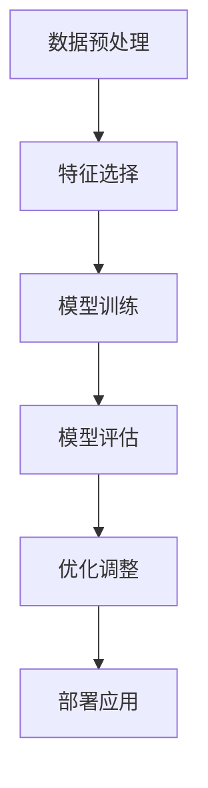
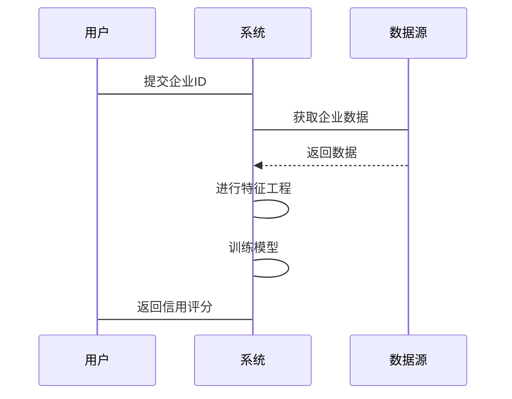

                 


# AI辅助的企业信用评分卡验证系统

> 关键词：企业信用评分卡、人工智能、机器学习、信用评估、数据特征工程

> 摘要：本文详细探讨了如何利用人工智能技术构建企业信用评分卡验证系统。通过分析传统信用评分方法的局限性，结合现代机器学习算法，提出了一种基于AI的解决方案。文章从背景介绍、核心概念、算法原理、系统架构到项目实战，全面阐述了AI在信用评分中的应用，展示了如何通过技术手段提升信用评估的效率和准确性。

---

# 第一部分: 背景与挑战

## 第1章: 企业信用评分卡的背景与挑战

### 1.1 企业信用评分卡的定义与作用

企业信用评分卡是一种用于评估企业信用状况的工具，通过对企业的财务数据、市场表现、管理能力等多维度信息进行分析，生成一个量化评分，以帮助企业做出信贷决策。信用评分卡在金融行业、供应链管理和风险控制等领域具有重要作用。

#### 1.1.1 信用评分卡的基本概念

信用评分卡的核心目标是量化企业的信用风险，帮助金融机构和企业判断合作伙伴的信用可靠性。传统的信用评分卡通常基于财务报表数据，通过加权评分模型计算得分，反映企业的信用状况。

#### 1.1.2 信用评分卡在企业中的重要性

信用评分卡是企业风险管理的重要工具，能够帮助金融机构识别潜在风险，优化资源配置，降低违约率。此外，信用评分卡还能提升企业间的信任度，促进商业合作的顺利进行。

#### 1.1.3 信用评分卡的分类与应用场景

信用评分卡可以根据评分对象、评分方法和应用场景进行分类。常见的应用场景包括银行贷款审批、供应链管理、企业信用评级等。

### 1.2 传统信用评分卡的局限性

传统信用评分卡主要依赖财务数据和简单的加权评分模型，存在以下局限性：

#### 1.2.1 传统评分模型的缺陷

传统评分模型通常只考虑财务数据，忽视了企业的市场表现、管理能力和外部环境等多维度信息，导致评分结果不够全面。

#### 1.2.2 数据获取与处理的难点

传统评分模型依赖手工数据录入和处理，耗时且容易出错。此外，数据来源单一，难以获取多维度的实时数据。

#### 1.2.3 评分结果的可解释性问题

传统评分模型通常缺乏透明度，评分结果难以解释，导致用户难以理解评分依据，影响信任度。

### 1.3 AI技术在信用评分中的应用前景

随着人工智能技术的发展，AI在信用评分中的应用前景广阔。AI可以通过大数据分析和机器学习算法，挖掘企业信用数据中的深层特征，提升评分的准确性和可解释性。

#### 1.3.1 AI技术如何改善信用评分

AI可以通过自然语言处理技术分析企业公开文本信息，结合结构化数据进行特征工程，构建更全面的信用评分模型。此外，AI还可以实时更新模型，适应市场变化。

#### 1.3.2 机器学习在信用评分中的优势

机器学习算法能够自动提取数据特征，发现传统模型难以察觉的信用风险。此外，机器学习模型具有较高的可扩展性，可以处理海量数据。

#### 1.3.3 未来发展趋势与挑战

未来，AI在信用评分中的应用将更加普及，但同时也面临数据隐私、模型解释性等挑战，需要在技术创新和合规性之间找到平衡。

---

## 第2章: AI辅助信用评分卡的核心概念与原理

### 2.1 AI辅助信用评分的核心概念

AI辅助信用评分的核心在于利用机器学习算法和大数据技术，构建更准确、更全面的信用评分模型。

#### 2.1.1 数据特征工程

数据特征工程是AI信用评分模型的基础，通过对数据的清洗、转换和组合，提取有助于模型预测的关键特征。

#### 2.1.2 机器学习模型

机器学习模型是AI信用评分的核心，包括逻辑回归、随机森林、神经网络等多种算法。

#### 2.1.3 模型评估与优化

模型评估与优化是确保模型性能的关键步骤，通常包括交叉验证、调参和性能指标评估。

### 2.2 核心概念对比分析

通过对比分析，可以更好地理解AI辅助信用评分的核心概念。

#### 2.2.1 数据特征与模型选择的对比

| 特征类型 | 优点 | 缺点 |
|----------|------|------|
| 财务特征 | 易获取 | 单一 |
| 市场特征 | 全面 | 复杂 |
| 行为特征 | 实时 | 隐私 |

#### 2.2.2 不同模型的性能对比

| 模型类型 | 优点 | 缺点 |
|----------|------|------|
| 逻辑回归 | 解释性强 | 非线性差 |
| 随机森林 | 高准确性 | 易过拟合 |
| 神经网络 | 强大学习能力 | 需大量数据 |

#### 2.2.3 模型可解释性与准确性的权衡

可解释性与准确性是模型设计中的重要权衡。高解释性的模型通常准确性较低，而高准确性的模型可能难以解释。

### 2.3 核心概念的ER实体关系图

```mermaid
erDiagram
    customer[企业客户] {
        string id
        string name
        double credit_score
    }
    transaction[交易记录] {
        string id
        string customer_id
        date date
        double amount
    }
    credit_card[信用评分卡] {
        string id
        string customer_id
        double score
        date valid_until
    }
    customer --> transaction : 发起
    customer --> credit_card : 持有
```

---

## 第3章: AI辅助信用评分卡的算法原理

### 3.1 常用算法概述

AI辅助信用评分中常用的算法包括逻辑回归、随机森林和神经网络。

#### 3.1.1 逻辑回归

逻辑回归是一种广泛应用于信用评分的分类算法，通过sigmoid函数将线性回归的结果映射到概率空间。

#### 3.1.2 支持向量机

支持向量机通过构建超平面分离数据点，适用于小规模数据集的分类任务。

#### 3.1.3 随机森林

随机森林通过集成多个决策树模型，提高模型的准确性和鲁棒性。

#### 3.1.4 神经网络

神经网络通过多层感知机模拟人脑神经网络，能够处理复杂的非线性关系。

### 3.2 算法流程图



### 3.3 逻辑回归算法详解

#### 3.3.1 逻辑回归的数学模型

$$ P(y=1|x) = \frac{1}{1 + e^{-\beta x}} $$

其中，$\beta$ 是模型参数，$x$ 是输入特征。

#### 3.3.2 逻辑回归的损失函数

$$ L(\beta) = -\sum_{i=1}^{n} [y_i \ln(p_i) + (1 - y_i)\ln(1 - p_i)] $$

其中，$p_i$ 是第i个样本的预测概率。

#### 3.3.3 逻辑回归的优化过程

逻辑回归的优化过程通常采用梯度下降方法：

```python
import numpy as np

def logistic_regression(X, y, learning_rate=0.1, iterations=100):
    m, n = X.shape
    theta = np.zeros((n, 1))
    for _ in range(iterations):
        h = sigmoid(np.dot(X, theta))
        gradient = (1/m) * np.dot(X.T, (h - y))
        theta -= learning_rate * gradient
    return theta

def sigmoid(z):
    return 1 / (1 + np.exp(-z))
```

---

## 第4章: 系统分析与架构设计

### 4.1 问题场景介绍

企业信用评分卡验证系统需要处理大量的企业数据，包括财务数据、交易记录和市场信息等。

### 4.2 系统功能设计

系统功能包括数据采集、特征工程、模型训练和结果展示。

### 4.3 系统架构设计

系统架构采用分层设计，包括数据层、服务层、应用层和表现层。

### 4.4 系统接口设计

系统接口包括数据接口、模型接口和用户接口。

### 4.5 系统交互序列图



---

## 第5章: 项目实战

### 5.1 环境安装

安装必要的开发环境和库，包括Python、Pandas、Scikit-learn等。

### 5.2 核心代码实现

实现数据预处理、特征工程、模型训练和结果展示的代码。

```python
import pandas as pd
from sklearn.model_selection import train_test_split
from sklearn.linear_model import LogisticRegression
from sklearn.metrics import accuracy_score

# 数据加载
df = pd.read_csv('enterprise_data.csv')

# 数据预处理
X = df.drop('credit_risk', axis=1)
y = df['credit_risk']
X_train, X_test, y_train, y_test = train_test_split(X, y, test_size=0.2)

# 模型训练
model = LogisticRegression()
model.fit(X_train, y_train)

# 模型评估
y_pred = model.predict(X_test)
print(f'Accuracy: {accuracy_score(y_test, y_pred)}')
```

### 5.3 实际案例分析

通过实际案例分析，展示AI辅助信用评分卡的应用效果。

---

## 第6章: 最佳实践与总结

### 6.1 最佳实践

在实际应用中，需要注意数据隐私、模型解释性和模型更新频率等问题。

### 6.2 小结

AI技术为信用评分卡的验证提供了新的可能性，通过机器学习算法和大数据技术，能够显著提升信用评估的效率和准确性。

### 6.3 注意事项

在实际应用中，需要注意数据质量和模型的可解释性，避免因数据偏差导致评分不准确。

### 6.4 拓展阅读

建议读者进一步阅读相关文献，了解最新的研究成果和技术进展。

---

通过以上步骤，我们可以看到AI在企业信用评分卡验证系统中的巨大潜力。AI技术不仅能够提升评分的准确性，还能帮助金融机构更好地管理风险，优化资源配置。随着技术的不断进步，AI在信用评分中的应用将更加广泛和深入。

