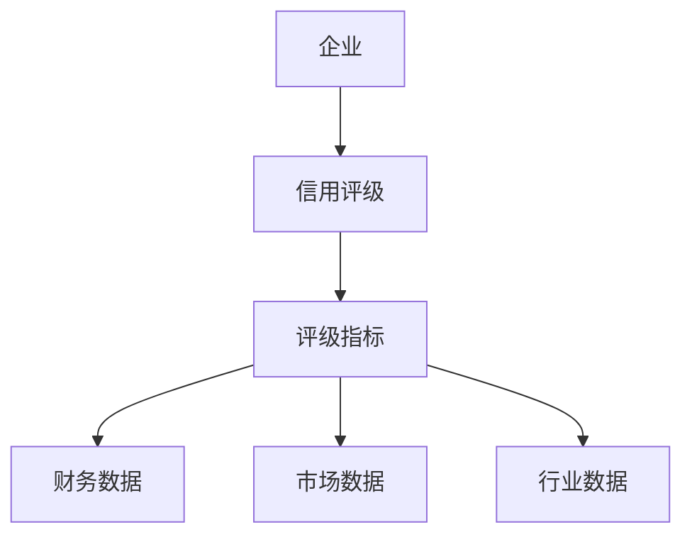
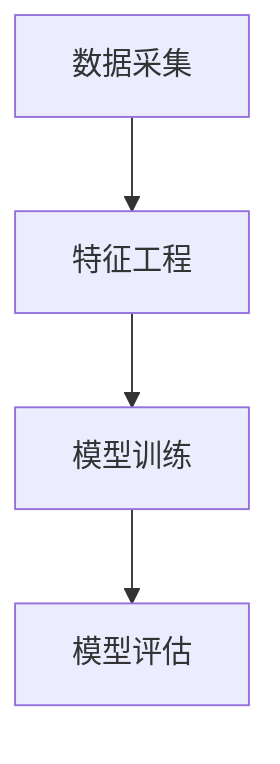
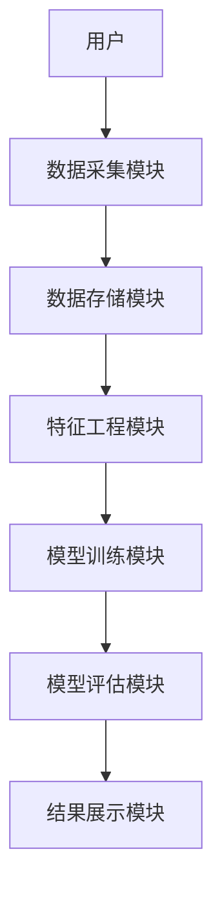
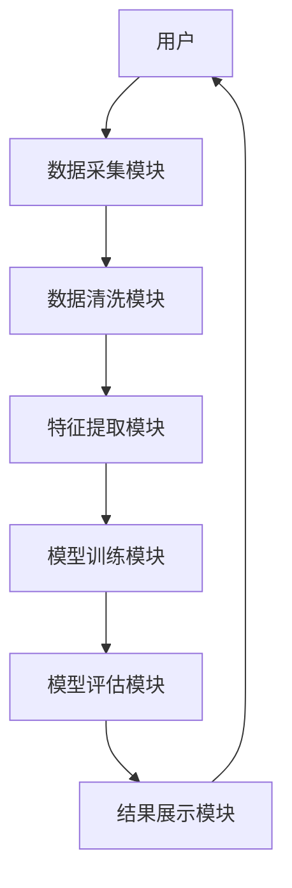

                 


# AI辅助的企业信用评级模型校准

> 关键词：企业信用评级，AI辅助，模型校准，机器学习，信用风险

> 摘要：本文详细探讨了如何利用人工智能技术辅助企业信用评级模型的校准过程，分析了传统信用评级方法的局限性，介绍了AI技术在信用评级中的应用前景，详细讲解了基于机器学习的信用评级模型的算法原理，并通过实际案例展示了AI辅助信用评级系统的架构设计和实现方法，最后总结了最佳实践和应用前景。

---

# 第1章: 企业信用评级模型的背景与挑战

## 1.1 企业信用评级的定义与重要性

### 1.1.1 企业信用评级的基本概念

企业信用评级是指根据企业的财务状况、经营能力和市场环境等因素，对其偿债能力和违约风险进行评估，并给出相应的信用等级。信用评级是企业融资、银行贷款、投资决策等重要环节中的关键依据。

### 1.1.2 信用评级在金融领域的作用

信用评级在金融领域具有重要的作用，它可以帮助投资者、银行和其他金融机构评估企业的信用风险，从而做出更科学的投资和信贷决策。信用评级结果直接影响企业的融资成本和市场信任度。

### 1.1.3 企业信用评级的分类与标准

企业信用评级通常分为内部评级和外部评级。内部评级由企业自身或其内部部门进行，主要用于内部管理；外部评级由专业的评级机构进行，如穆迪、标普等。信用评级的标准通常基于企业的财务指标、经营状况、行业地位和市场环境等因素。

---

## 1.2 传统信用评级模型的局限性

### 1.2.1 传统信用评级方法的优缺点

传统信用评级方法主要依赖于财务数据和经验判断，具有以下优点：简单易懂、易于解释。然而，其局限性也较为明显，如数据维度有限、模型过于简化、难以捕捉复杂市场变化等。

### 1.2.2 数据不足与模型过拟合问题

传统信用评级模型通常基于少量的财务数据，难以充分利用企业的非结构化数据（如文本、图像等）。此外，由于数据量的限制，传统模型容易过拟合，导致评级结果不够准确。

### 1.2.3 人工干预的局限性与效率低下

传统信用评级过程中，人工干预较多，容易受到主观因素的影响，且效率低下。特别是在面对大量企业时，人工评级的效率和准确性难以满足需求。

---

## 1.3 AI技术在信用评级中的应用前景

### 1.3.1 AI技术如何提升信用评级的准确性

AI技术可以通过机器学习算法从海量数据中提取特征，发现传统方法难以捕捉的模式和规律，从而提高信用评级的准确性。

### 1.3.2 数据驱动的信用评级模型的优势

基于AI的信用评级模型可以充分利用企业的结构化和非结构化数据，构建更全面的特征集，从而提高模型的预测能力。

### 1.3.3 企业信用评级模型校准的必要性

模型校准是确保信用评级模型准确性和可靠性的关键步骤。通过AI技术辅助模型校准，可以更有效地解决数据偏差、模型过拟合等问题，提高评级结果的可信度。

---

## 1.4 本章小结

本章介绍了企业信用评级的基本概念和重要性，分析了传统信用评级模型的局限性，探讨了AI技术在信用评级中的应用前景。通过对比传统方法和AI辅助方法，可以发现AI技术在提高信用评级准确性和效率方面具有显著优势。

---

# 第2章: AI辅助信用评级的核心概念与联系

## 2.1 核心概念原理

### 2.1.1 机器学习在信用评级中的应用

机器学习是一种人工智能技术，通过训练模型从数据中学习规律，从而实现对企业的信用评级。常用的机器学习算法包括逻辑回归、支持向量机（SVM）、随机森林和梯度提升树（如XGBoost、LightGBM等）。

### 2.1.2 监督学习与无监督学习的区别

监督学习是在有标签的数据上训练模型，目标是通过输入特征预测目标变量；无监督学习是在无标签的数据上发现数据的内在结构。在信用评级中，监督学习更为常用，因为我们需要根据历史数据预测企业的信用等级。

### 2.1.3 神经网络在信用评级中的作用

神经网络是一种强大的机器学习模型，能够处理复杂的非线性关系。在信用评级中，神经网络可以用于处理非结构化数据（如文本、图像）和高维数据，提供更准确的预测结果。

---

## 2.2 核心概念属性特征对比表格

以下是传统信用评级与AI辅助信用评级的核心概念对比：

| 特征 | 传统信用评级 | AI辅助信用评级 |
|------|---------------|-----------------|
| 数据来源 | 结构化数据     | 结构化+非结构化数据 |
| 模型复杂度 | 简单线性模型   | 复杂非线性模型   |
| 训练数据 | 小样本         | 大样本         |
| 模型解释性 | 高            | 低            |

---

## 2.3 ER实体关系图架构

以下是企业信用评级系统的ER实体关系图：



---

## 2.4 本章小结

本章详细介绍了AI辅助信用评级的核心概念，包括机器学习、监督学习、无监督学习和神经网络的基本原理，并通过对比表格和ER实体关系图展示了传统方法与AI辅助方法的差异。

---

# 第3章: AI辅助信用评级模型校准的算法原理

## 3.1 算法原理概述

### 3.1.1 机器学习算法在信用评级中的应用

在信用评级中，常用的机器学习算法包括逻辑回归、随机森林、梯度提升树（如XGBoost、LightGBM）和神经网络（如深度学习模型）。每种算法都有其优缺点，适用于不同的数据特性和任务需求。

### 3.1.2 常见的信用评级模型算法

- **逻辑回归（Logistic Regression）**：用于分类问题，适合处理二分类或多分类任务。
- **随机森林（Random Forest）**：基于决策树的集成学习方法，具有较高的鲁棒性和抗过拟合能力。
- **梯度提升树（Gradient Boosting Trees）**：通过逐步优化模型，提升整体预测能力。
- **神经网络（Neural Networks）**：适用于处理复杂的非线性关系，尤其是在非结构化数据上表现优异。

### 3.1.3 算法选择的依据与原则

选择合适的算法需要考虑数据特性、任务需求、计算资源和模型解释性等因素。例如，对于小样本数据，逻辑回归和随机森林是不错的选择；对于大样本数据，梯度提升树和神经网络更为适合。

---

## 3.2 基于梯度提升的信用评级模型

### 3.2.1 XGBoost算法原理

XGBoost（eXtreme Gradient Boosting）是一种高效的梯度提升算法，通过正则化和分裂策略优化模型，具有较高的准确性和稳定性。

#### XGBoost的数学模型

XGBoost的目标是最小化损失函数，通过不断迭代优化模型。其损失函数可以表示为：

$$
L = \sum_{i=1}^{n} [w_i (y_i - \hat{y}_i)]
$$

其中，$w_i$ 是样本的权重，$y_i$ 是真实标签，$\hat{y}_i$ 是模型预测值。

#### XGBoost的实现步骤

1. 初始化基础模型，如简单的线性回归。
2. 计算每个样本的损失和梯度。
3. 使用分裂策略优化每个树节点，选择最优分裂特征和分裂点。
4. 合并所有树，得到最终的预测结果。

#### Python代码示例

以下是XGBoost在信用评级中的实现示例：

```python
import xgboost as xgb

# 数据准备
X_train, y_train = prepare_data()

# 创建DMatrix
dtrain = xgb.DMatrix(X_train, label=y_train)

# 设置参数
params = {
    'objective': 'binary:logistic',
    'learning_rate': 0.1,
    'max_depth': 6,
    'n_estimators': 100
}

# 训练模型
model = xgb.train(params, dtrain)

# 预测结果
y_pred = model.predict(dtrain)
```

---

## 3.3 基于神经网络的信用评级模型

### 3.3.1 深度学习模型的原理

深度学习模型（如卷积神经网络CNN和循环神经网络RNN）适用于处理非结构化数据，如文本和图像。在信用评级中，可以通过自然语言处理（NLP）技术提取企业新闻、报告等文本数据中的特征。

### 3.3.2 LSTM网络在信用评级中的应用

LSTM（长短期记忆网络）是一种特殊的循环神经网络，适合处理时间序列数据。在信用评级中，可以用于分析企业的财务数据和市场数据的时间序列变化。

#### LSTM的数学模型

LSTM的单元包括输入门、遗忘门和输出门，其数学表达式如下：

$$
i_t = \sigma(W_i x_t + U_i h_{t-1} + b_i)
$$

$$
f_t = \sigma(W_f x_t + U_f h_{t-1} + b_f)
$$

$$
o_t = \sigma(W_o x_t + U_o h_{t-1} + b_o)
$$

$$
h_t = i_t \cdot \cosh(W_c x_t + U_c h_{t-1} + b_c) + f_t \cdot \cosh_{t-1}
$$

其中，$i_t$ 是输入门，$f_t$ 是遗忘门，$o_t$ 是输出门，$\cosh_t$ 是单元状态。

#### LSTM的Python代码实现

以下是LSTM在信用评级中的实现示例：

```python
import tensorflow as tf
from tensorflow.keras import layers

# 定义LSTM模型
model = tf.keras.Sequential([
    layers.LSTM(64, input_shape=(timesteps, features)),
    layers.Dense(1, activation='sigmoid')
])

# 编译模型
model.compile(optimizer='adam', loss='binary_crossentropy', metrics=['accuracy'])

# 训练模型
model.fit(X_train, y_train, epochs=10, batch_size=32)
```

---

## 3.4 本章小结

本章详细介绍了AI辅助信用评级中常用的算法，包括XGBoost和神经网络。通过数学公式和Python代码示例，展示了这些算法的实现步骤和应用场景。通过对比不同算法的优缺点，读者可以更好地选择适合特定任务的算法。

---

# 第4章: AI辅助信用评级系统的架构设计

## 4.1 系统架构概述

### 4.1.1 系统模块划分

AI辅助信用评级系统通常包括以下几个模块：

1. **数据采集模块**：从企业财务报表、市场数据、新闻报道等来源获取数据。
2. **特征工程模块**：对数据进行清洗、转换和特征提取。
3. **模型训练模块**：基于机器学习算法训练信用评级模型。
4. **模型评估模块**：对模型进行验证和调优，确保模型的准确性和稳定性。

### 4.1.2 系统功能设计

以下是系统的功能模块图：



---

## 4.2 系统架构设计

### 4.2.1 系统架构图

以下是系统的整体架构图：



---

## 4.3 系统接口设计

### 4.3.1 数据接口

系统需要与企业数据库、金融市场数据源等进行数据对接，获取企业的财务数据、市场数据和行业数据。

### 4.3.2 模型接口

模型训练模块需要与特征工程模块和数据存储模块进行交互，获取特征数据并进行模型训练。

### 4.3.3 结果接口

模型评估模块需要将评估结果传递给结果展示模块，供用户查看和分析。

---

## 4.4 系统交互流程

### 4.4.1 交互流程图

以下是系统的交互流程图：



---

## 4.5 本章小结

本章详细介绍了AI辅助信用评级系统的架构设计，包括系统模块划分、功能设计、系统架构图和交互流程图。通过清晰的架构设计，可以更好地指导系统的开发和实现。

---

# 第5章: AI辅助信用评级系统的项目实战

## 5.1 项目背景与目标

### 5.1.1 项目背景

本项目旨在开发一个基于AI的信用评级系统，利用机器学习算法对企业进行信用评级，提高评级的准确性和效率。

### 5.1.2 项目目标

- 数据采集与处理
- 特征工程与模型训练
- 模型评估与优化
- 系统实现与部署

---

## 5.2 项目实施步骤

### 5.2.1 数据采集与处理

1. 从企业数据库中获取财务数据。
2. 从新闻网站获取企业相关新闻。
3. 从行业报告中获取市场数据。

### 5.2.2 特征工程与模型训练

1. 对数据进行清洗和预处理。
2. 提取特征，如财务指标、文本情感特征等。
3. 划分训练集和测试集。
4. 使用XGBoost和LSTM模型进行训练。

### 5.2.3 模型评估与优化

1. 使用交叉验证评估模型性能。
2. 调优模型参数，优化模型性能。
3. 比较不同算法的性能，选择最优模型。

---

## 5.3 系统实现与代码

### 5.3.1 数据采集代码

以下是数据采集的Python代码示例：

```python
import pandas as pd
import requests
from bs4 import BeautifulSoup

# 从企业数据库获取财务数据
def get_financial_data(company_id):
    # 数据库查询代码
    pass

# 从新闻网站获取相关新闻
def get_news_data(company_id):
    url = f"https://www.example.com/company/{company_id}"
    response = requests.get(url)
    soup = BeautifulSoup(response.text, 'html.parser')
    news = soup.find_all('div', class_='news-item')
    return [n.text for n in news]

# 从行业报告中获取市场数据
def get_market_data():
    # API调用代码
    pass
```

### 5.3.2 特征工程代码

以下是特征工程的Python代码示例：

```python
import pandas as pd
from sklearn.preprocessing import StandardScaler

# 数据预处理
data = pd.read_csv('data.csv')
data = data.dropna()
data = pd.get_dummies(data)

# 特征标准化
scaler = StandardScaler()
data_scaled = scaler.fit_transform(data)
```

### 5.3.3 模型训练代码

以下是模型训练的Python代码示例：

```python
from sklearn.ensemble import RandomForestClassifier
from sklearn.metrics import accuracy_score

# 训练随机森林模型
model = RandomForestClassifier(n_estimators=100, max_depth=6, random_state=42)
model.fit(X_train, y_train)

# 模型评估
y_pred = model.predict(X_test)
print("Accuracy:", accuracy_score(y_test, y_pred))
```

---

## 5.4 项目小结

本章通过实际案例展示了AI辅助信用评级系统的项目实施过程，包括数据采集、特征工程、模型训练和评估等步骤。通过代码示例，读者可以更好地理解和实现这些步骤。

---

# 第6章: AI辅助信用评级系统的最佳实践与总结

## 6.1 最佳实践

### 6.1.1 数据质量的重要性

数据是模型训练的基础，高质量的数据可以显著提高模型的准确性和可靠性。

### 6.1.2 模型解释性的考虑

虽然AI模型可以提高预测准确性，但模型的解释性同样重要，尤其是在金融领域，解释性可以帮助用户理解和信任模型。

### 6.1.3 模型的实时更新与维护

信用评级是一个动态过程，模型需要定期更新，以适应市场环境的变化。

---

## 6.2 应用前景与总结

### 6.2.1 AI技术在信用评级中的未来发展方向

随着AI技术的不断发展，信用评级模型将更加智能化和自动化。未来的信用评级系统将更加依赖于大数据和深度学习技术，实现更精准的预测和更高效的决策。

### 6.2.2 本文总结

本文详细探讨了AI辅助企业信用评级模型校准的技术与方法，通过理论分析和实际案例，展示了如何利用机器学习算法提高信用评级的准确性和效率。通过本文的分析，读者可以更好地理解AI技术在信用评级中的应用，为实际应用提供参考。

---

# 结语

AI技术正在深刻改变信用评级的模式和方法，通过本文的探讨，我们可以看到AI辅助信用评级模型校准的巨大潜力和广阔前景。未来，随着技术的不断进步，AI在信用评级中的应用将更加广泛和深入，为企业和金融机构提供更精准、更高效的信用评级服务。

