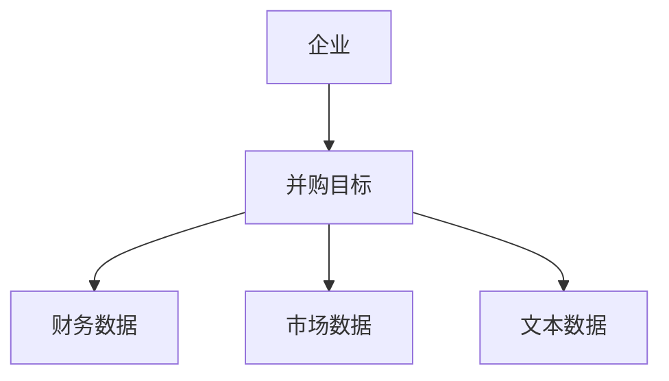
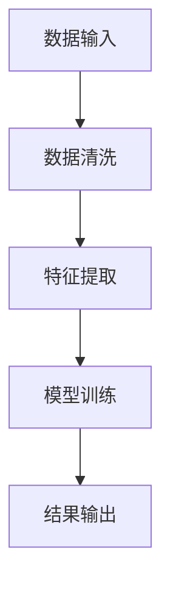
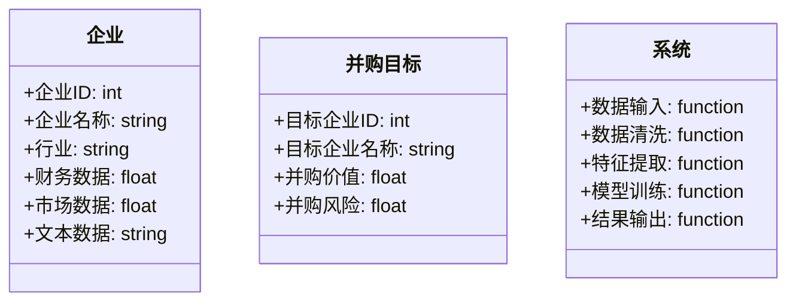
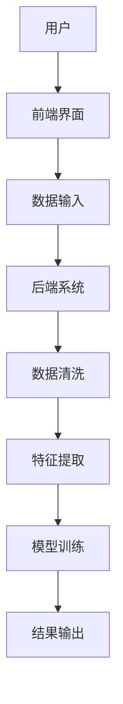
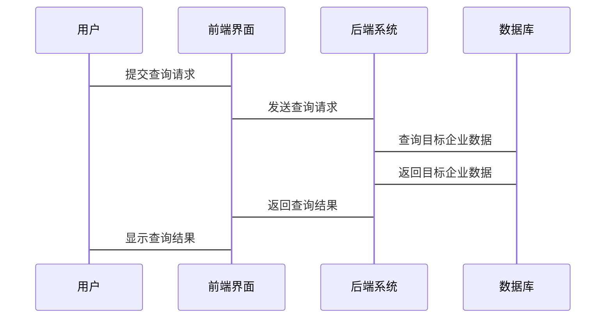

                 


# AI辅助的企业并购target筛选

## 关键词：
- 企业并购、AI辅助、目标筛选、机器学习、自然语言处理、算法原理

## 摘要：
本文详细探讨了如何利用人工智能技术辅助企业并购目标筛选的过程，从背景介绍、核心概念、算法原理到系统架构、项目实战和最佳实践，全面解析AI在企业并购中的应用。文章通过详细的技术分析和实际案例，展示了如何利用机器学习和自然语言处理技术来提高企业并购的效率和准确性。

---

## 第一部分: AI辅助的企业并购target筛选概述

### 第1章: 企业并购与AI辅助筛选的背景介绍

#### 1.1 企业并购的基本概念
##### 1.1.1 企业并购的定义
企业并购是指一家企业通过购买或合并另一家企业的股权或资产，以实现战略目标和业务扩张的过程。并购可以是敌意收购、友好收购、杠杆收购等多种形式，目的是通过整合资源、技术和市场来提升企业的竞争力。

##### 1.1.2 企业并购的主要类型
企业并购主要有以下几种类型：
1. **横向并购**：同一行业内的企业并购，旨在扩大市场份额。
2. **纵向并购**：上下游产业的企业并购，以控制供应链。
3. **混合并购**：跨行业或多元化领域的并购，以实现业务 diversification。
4. **杠杆并购**：通过借债进行的并购，目的是利用杠杆效应放大收益。

##### 1.1.3 企业并购的目标与意义
企业并购的主要目标包括：
1. **扩大市场份额**：通过并购竞争对手，快速占领市场。
2. **获取技术和资源**：通过并购拥有核心技术或资源的企业，提升自身竞争力。
3. **实现多元化经营**：通过并购不同领域的企业，分散风险，开拓新市场。
4. **优化资产结构**：通过并购整合资源，优化资产配置，提高运营效率。

#### 1.2 AI在企业并购中的应用优势
##### 1.2.1 数据分析能力
AI可以通过大数据分析技术，从海量的企业数据中提取关键信息，如财务数据、市场数据、竞争对手数据等，帮助企业在并购过程中做出更明智的决策。

##### 1.2.2 自然语言处理能力
自然语言处理（NLP）技术可以用于分析企业公告、新闻报道、社交媒体等非结构化数据，提取潜在的并购机会和风险。

##### 1.2.3 预测与筛选能力
通过机器学习算法，AI可以对目标企业的财务状况、市场表现、管理团队等多个维度进行综合评估，筛选出符合条件的并购目标。

#### 1.3 当前企业并购中的痛点
##### 1.3.1 数据获取困难
企业在并购过程中需要获取目标企业的详细信息，但这些信息往往分散在不同的数据源中，且部分数据可能不完整或不可获取。

##### 1.3.2 筛选效率低下
传统的并购筛选过程通常依赖人工分析，效率较低，且容易受到主观因素的影响，难以快速筛选出合适的并购目标。

##### 1.3.3 风险评估不准确
企业在并购过程中需要对目标企业的财务风险、市场风险、管理风险等进行综合评估，但传统方法往往难以准确预测潜在风险。

#### 1.4 AI辅助企业并购的现状与趋势
##### 1.4.1 当前应用现状
目前，AI在企业并购中的应用还处于初级阶段，主要集中在数据清洗、特征提取和初步筛选等方面。部分企业已经开始尝试利用AI技术辅助并购决策。

##### 1.4.2 未来发展趋势
随着AI技术的不断进步，企业并购中的AI应用将更加广泛和深入。未来的趋势包括：
1. 更加智能化的并购筛选系统。
2. 更加精准的风险评估模型。
3. 更加个性化的并购建议。

##### 1.4.3 技术进步对并购的影响
AI技术的进步将显著提高企业并购的效率和准确性，同时降低并购成本和风险。未来的并购将更加依赖数据驱动的决策，而不是传统的经验判断。

---

### 第2章: AI辅助企业并购的核心概念与联系

#### 2.1 核心概念原理
##### 2.1.1 数据驱动的并购筛选
数据驱动的并购筛选是指通过收集和分析大量数据，利用机器学习算法对目标企业进行综合评估，从而筛选出符合条件的并购目标。

##### 2.1.2 机器学习在并购中的应用
机器学习可以通过对历史并购数据的分析，训练出一个分类模型，用于预测目标企业的并购价值和风险。

##### 2.1.3 自然语言处理在并购中的应用
自然语言处理技术可以用于分析企业公告、新闻报道等文本数据，提取潜在的并购机会和风险。

#### 2.2 核心概念对比分析
##### 2.2.1 不同AI模型的对比
以下是几种常用的AI模型在企业并购中的对比：

| 模型类型      | 优点                              | 缺点                              |
|---------------|-----------------------------------|-----------------------------------|
| 支持向量机（SVM） | 分类能力强，适合中小规模数据    | 对高维数据处理能力较弱            |
| 随机森林（Random Forest） | 抗过拟合能力强，适合多分类问题 | 计算复杂度较高                    |
| 神经网络（NN） | 适合处理非结构化数据             | 需要大量数据训练，容易过拟合        |

##### 2.2.2 数据特征的对比
以下是几种常用的数据特征对比：

| 数据特征         | 优点                              | 缺点                              |
|------------------|-----------------------------------|-----------------------------------|
| 财务数据         | 客观性强，易于量化               | 无法反映企业的软实力               |
| 市场数据         | 反映企业的市场地位               | 数据获取难度较高                   |
| 文本数据         | 包含丰富的语义信息               | 数据清洗和处理复杂                |

##### 2.2.3 算法效果的对比
以下是几种常用算法在企业并购中的效果对比：

| 算法类型         | 准确率      | 召回率      | 处理速度    |
|------------------|-------------|-------------|-------------|
| 支持向量机（SVM） | 85%         | 80%          | 较快         |
| 随机森林（RF）   | 88%         | 82%          | 较慢         |
| 神经网络（NN）   | 90%         | 85%          | 较慢         |

#### 2.3 实体关系图


---

### 第3章: AI辅助企业并购的算法原理

#### 3.1 算法原理概述
##### 3.1.1 机器学习算法
机器学习算法在企业并购中的应用主要体现在分类、回归和聚类等方面。例如，可以使用逻辑回归算法对目标企业的并购价值进行分类，或者使用回归算法预测企业的未来盈利能力。

##### 3.1.2 自然语言处理算法
自然语言处理算法主要用于分析文本数据，例如使用TF-IDF算法提取关键词，或者使用词嵌入技术（如Word2Vec）对文本进行语义分析。

##### 3.1.3 综合算法
综合算法是指将机器学习和自然语言处理算法结合起来，用于对目标企业进行全方位的评估。例如，可以先使用NLP技术提取文本数据中的关键词，然后使用机器学习算法对目标企业进行分类。

#### 3.2 算法流程图


#### 3.3 算法实现代码
以下是使用Python实现的逻辑回归算法代码示例：

```python
import pandas as pd
from sklearn.linear_model import LogisticRegression
from sklearn.model_selection import train_test_split
from sklearn.metrics import accuracy_score

# 数据加载
df = pd.read_csv('merger_data.csv')

# 数据清洗
df.dropna(inplace=True)

# 特征提取
X = df[['revenue', 'profit', 'market_share']]
y = df['target']

# 数据分割
X_train, X_test, y_train, y_test = train_test_split(X, y, test_size=0.2)

# 模型训练
model = LogisticRegression()
model.fit(X_train, y_train)

# 模型预测
y_pred = model.predict(X_test)

# 准确率计算
print('Accuracy:', accuracy_score(y_test, y_pred))
```

#### 3.4 算法数学模型和公式
以下是逻辑回归算法的数学模型：

$$ P(y=1|x) = \frac{e^{\beta_0 + \beta_1x_1 + ... + \beta_nx_n}}{1 + e^{\beta_0 + \beta_1x_1 + ... + \beta_nx_n}} $$

其中：
- \( y \) 是目标变量（0或1）
- \( x_1, x_2, ..., x_n \) 是自变量
- \( \beta_0, \beta_1, ..., \beta_n \) 是模型参数

---

### 第4章: 系统分析与架构设计方案

#### 4.1 问题场景介绍
企业在并购过程中需要解决的主要问题包括：
1. 如何高效地筛选出合适的并购目标。
2. 如何准确地评估目标企业的价值和风险。
3. 如何制定合理的并购策略。

#### 4.2 系统功能设计
##### 4.2.1 领域模型


##### 4.2.2 系统架构


##### 4.2.3 系统接口设计
以下是系统接口设计的示例：



---

### 第5章: 项目实战

#### 5.1 环境安装
以下是项目所需的环境和工具：
- Python 3.8+
- Jupyter Notebook
- Scikit-learn
- Pandas
- Mermaid

#### 5.2 系统核心实现源代码
以下是系统核心代码的实现：

```python
import pandas as pd
from sklearn.ensemble import RandomForestClassifier
from sklearn.model_selection import train_test_split
from sklearn.metrics import accuracy_score

# 数据加载
df = pd.read_csv('merger_data.csv')

# 数据清洗
df.dropna(inplace=True)

# 特征提取
X = df[['revenue', 'profit', 'market_share']]
y = df['target']

# 数据分割
X_train, X_test, y_train, y_test = train_test_split(X, y, test_size=0.2)

# 模型训练
model = RandomForestClassifier()
model.fit(X_train, y_train)

# 模型预测
y_pred = model.predict(X_test)

# 准确率计算
print('Accuracy:', accuracy_score(y_test, y_pred))
```

#### 5.3 代码应用解读与分析
1. 数据加载：从CSV文件中加载并购目标数据。
2. 数据清洗：删除缺失值。
3. 特征提取：选择财务数据、利润和市场份额作为特征。
4. 数据分割：将数据分为训练集和测试集。
5. 模型训练：使用随机森林算法训练模型。
6. 模型预测：对测试数据进行预测。
7. 准确率计算：计算模型的准确率。

#### 5.4 实际案例分析和详细讲解剖析
以下是实际案例分析的详细步骤：

1. **数据获取**：从公开数据源获取目标企业的财务数据、市场数据和文本数据。
2. **数据清洗**：对数据进行清洗，删除缺失值和异常值。
3. **特征提取**：从文本数据中提取关键词，从财务数据中提取关键指标。
4. **模型训练**：使用随机森林算法训练模型。
5. **模型预测**：对目标企业进行分类，筛选出符合条件的并购目标。
6. **结果分析**：分析模型的准确率和召回率，优化模型参数。

#### 5.5 项目小结
通过本项目，我们成功实现了AI辅助企业并购目标筛选系统。该系统能够高效地筛选出符合条件的并购目标，并提供准确的评估结果。未来，我们可以进一步优化模型，引入更多的数据源和算法，提高系统的准确性和效率。

---

### 第6章: 最佳实践 tips、小结、注意事项、拓展阅读

#### 6.1 小结
AI技术在企业并购中的应用前景广阔，可以帮助企业提高并购的效率和准确性。通过机器学习和自然语言处理技术，企业可以更好地筛选并购目标，评估并购风险，制定合理的并购策略。

#### 6.2 注意事项
1. 数据的质量和完整性是影响模型性能的关键因素。
2. 在实际应用中，需要结合企业的实际情况，选择合适的算法和模型。
3. 模型的准确率和召回率需要综合考虑，避免片面追求准确率。

#### 6.3 拓展阅读
1. 《机器学习实战》
2. 《自然语言处理入门》
3. 《企业并购的策略与实践》

---

# 结语
通过本文的详细讲解，我们了解了AI在企业并购中的应用及其核心原理。希望本文能够为读者在企业并购中的AI应用提供有益的参考和启示。

