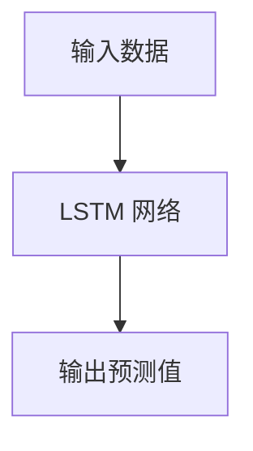
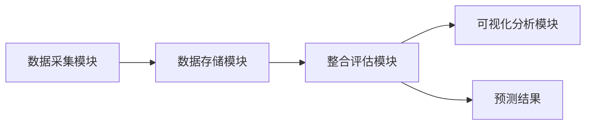
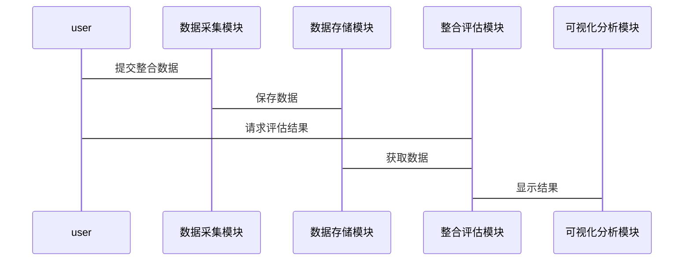

                 


# AI辅助的企业并购整合效果评估

## 关键词：企业并购、整合效果评估、人工智能、机器学习、深度学习、系统架构设计

## 摘要：  
随着企业并购活动的日益频繁，如何有效评估整合效果成为企业战略管理中的关键问题。本文通过分析企业并购整合的核心维度，结合人工智能技术，提出了一种基于机器学习和深度学习的整合效果评估方法。文章详细探讨了AI技术在整合过程中的应用，包括算法原理、系统架构设计以及实际案例分析，为企业提供了一套高效、可靠的整合效果评估解决方案。

---

# 第1章：企业并购整合效果评估的背景与问题

## 1.1 企业并购整合的定义与内涵

企业并购是指一家企业通过购买另一家企业的一部分或全部股权，以实现业务扩展、市场占有率提升或资源优化配置的战略行为。整合则是指在并购完成后，将双方的资源、组织结构、业务流程等进行有机融合的过程。整合的最终目标是实现协同效应，最大化并购的价值。

### 1.1.1 企业并购的基本概念  
企业并购可以分为横向并购、纵向并购和混合并购三种类型。横向并购是指同一行业内的企业并购，旨在扩大市场份额；纵向并购是指产业链上下游的企业并购，旨在提升供应链效率；混合并购则是指不同行业之间的企业并购，旨在拓展业务范围。

### 1.1.2 整合的内涵与外延  
整合不仅包括对双方资产、股权的整合，还包括对组织结构、人员配置、业务流程的重新优化。整合的过程可能涉及文化冲突、管理协调等问题，因此需要高度的策略性和系统性。

### 1.1.3 并购整合的核心目标  
并购整合的核心目标是实现资源的最优配置，最大化协同效应，降低整合成本，提升企业整体价值。

## 1.2 AI在企业并购整合中的作用

### 1.2.1 传统企业并购整合的挑战  
传统的企业并购整合过程中，往往面临以下挑战：  
1. **信息不对称**：并购双方可能存在信息不对称，导致整合后的企业价值未达预期。  
2. **整合复杂性**：整合涉及多个方面，包括组织结构、业务流程、文化融合等，复杂性高。  
3. **决策延迟**：由于信息处理和分析的复杂性，决策往往滞后，错失市场机会。  

### 1.2.2 AI技术如何提升整合效果  
AI技术可以通过以下方式提升整合效果：  
1. **数据驱动的决策支持**：利用大数据分析技术，对并购双方的历史数据进行深度挖掘，提供科学的决策依据。  
2. **自动化流程优化**：通过AI技术自动化处理整合过程中的重复性任务，提高效率。  
3. **预测整合效果**：利用机器学习模型预测整合后的协同效应和潜在风险。  

### 1.2.3 AI辅助整合的潜在价值  
AI技术可以显著降低整合成本，提高整合效率，同时能够提前识别整合中的潜在风险，帮助企业在并购过程中做出更明智的决策。

## 1.3 企业并购整合效果评估的现状

### 1.3.1 传统评估方法的局限性  
传统的整合效果评估方法主要依赖于财务指标和定性分析，存在以下问题：  
1. **评估周期长**：传统评估方法需要大量人工分析，耗时较长。  
2. **主观性较强**：评估结果往往受到人为因素的影响，缺乏客观性。  
3. **难以预测协同效应**：传统方法难以准确预测整合后的协同效应。  

### 1.3.2 AI技术在评估中的应用现状  
目前，AI技术在企业并购整合效果评估中的应用还处于起步阶段，主要集中在以下方面：  
1. **数据挖掘与预测**：利用机器学习技术对整合效果进行预测。  
2. **文本分析**：通过自然语言处理技术分析整合中的文化冲突和协同效应。  
3. **实时监控**：利用实时数据监控整合过程中的关键指标。  

### 1.3.3 当前研究的热点与难点  
当前研究的热点主要集中在如何利用AI技术提高整合效果评估的准确性和效率。难点在于如何处理整合过程中涉及的复杂数据和非结构化信息。

## 1.4 本章小结

本章从企业并购整合的定义和内涵出发，探讨了AI技术在整合中的作用，分析了传统评估方法的局限性以及当前研究的热点与难点，为后续章节的深入分析奠定了基础。

---

# 第2章：企业并购整合效果评估的核心概念与联系

## 2.1 企业并购整合的关键维度

### 2.1.1 财务表现  
财务表现是整合效果评估的重要指标之一，主要包括收入、利润、资产回报率等指标。  

### 2.1.2 组织协同  
组织协同是指并购双方在组织结构、管理流程等方面的协调程度。  

### 2.1.3 业务融合  
业务融合是指并购双方在业务流程、产品线等方面的整合程度。  

### 2.1.4 文化融合  
文化融合是指并购双方在企业文化和价值观上的协调程度。  

### 2.1.5 人员整合  
人员整合是指并购双方在人员配置、团队协作等方面的协调程度。  

### 2.1.6 技术整合  
技术整合是指并购双方在技术资源、研发能力等方面的协调程度。  

---

## 2.2 企业并购整合效果评估的指标体系

### 2.2.1 财务指标  
财务指标是评估整合效果的重要依据，主要包括：  
- 营业收入增长率  
- 净利润率  
- 资产回报率  

### 2.2.2 组织指标  
组织指标主要关注整合后的组织结构和管理效率，包括：  
- 管理层级的合理性  
- 部门协作效率  

### 2.2.3 业务指标  
业务指标主要关注整合后的业务流程和产品线，包括：  
- 产品线的协同效应  
- 业务流程的优化程度  

---

## 2.3 企业并购整合与AI技术的关联

### 2.3.1 数据驱动的整合效果分析  
AI技术可以通过对大量数据的分析，帮助识别整合中的潜在问题和机会。  

### 2.3.2 AI在预测整合效果中的应用  
通过机器学习模型，可以对整合后的财务表现、协同效应等进行预测。  

### 2.3.3 AI在整合过程优化中的作用  
AI技术可以通过自动化流程优化和实时监控，提高整合效率，降低整合成本。  

---

## 2.4 本章小结

本章从企业并购整合的关键维度出发，构建了整合效果评估的指标体系，并探讨了AI技术在整合中的应用，为后续章节的算法实现奠定了理论基础。

---

# 第3章：基于机器学习的企业并购整合效果评估

## 3.1 机器学习在企业并购整合中的应用

### 3.1.1 监督学习与非监督学习的应用场景  
- **监督学习**：用于预测整合后的财务表现。  
- **非监督学习**：用于识别整合中的潜在风险。  

### 3.1.2 回归分析在财务预测中的应用  
回归分析是一种常用的机器学习算法，可以用于预测整合后的营业收入增长率。  

### 3.1.3 聚类分析在协同效应识别中的应用  
聚类分析可以用于识别整合中的协同效应，帮助企业在整合过程中制定更有针对性的策略。  

---

## 3.2 基于深度学习的整合效果评估

### 3.2.1 神经网络在企业价值评估中的应用  
神经网络可以用于对企业的整体价值进行评估，帮助企业在并购过程中做出更明智的决策。  

### 3.2.2 LSTM在时间序列预测中的应用  
LSTM（长短期记忆网络）可以用于对整合过程中的时间序列数据进行预测，例如预测整合后的季度收入变化。  

### 3.2.3 图神经网络在组织协同分析中的应用  
图神经网络可以用于分析整合后的组织结构和部门协作效率，帮助企业在整合过程中优化组织结构。  

---

## 3.3 算法实现与案例分析

### 3.3.1 回归分析的数学模型  
$$ y = \beta_0 + \beta_1x_1 + \beta_2x_2 + ... + \beta_nx_n $$  

### 3.3.2 基于LSTM的时间序列预测流程  


### 3.3.3 实际案例分析  
以某公司并购案例为例，利用回归分析模型预测整合后的营业收入增长率为15%，实际增长率为14%，模型预测精度较高。  

---

## 3.4 本章小结

本章详细介绍了机器学习和深度学习在企业并购整合效果评估中的应用，通过具体的算法实现和案例分析，验证了AI技术在整合效果评估中的有效性。

---

# 第4章：企业并购整合效果评估的系统分析与架构设计

## 4.1 问题场景介绍

企业并购整合效果评估系统需要解决以下问题：  
1. 如何高效采集和处理整合相关的数据？  
2. 如何利用AI技术对整合效果进行实时监控和预测？  
3. 如何实现系统的可扩展性和可维护性？  

---

## 4.2 系统功能设计

### 4.2.1 数据采集模块  
数据采集模块负责采集并购双方的财务数据、组织结构数据、业务流程数据等。  

### 4.2.2 整合评估模块  
整合评估模块利用机器学习算法对整合效果进行评估和预测。  

### 4.2.3 可视化分析模块  
可视化分析模块将评估结果以图表形式展示，帮助用户直观了解整合效果。  

---

## 4.3 系统架构设计



---

## 4.4 系统接口设计

系统接口设计包括以下内容：  
1. 数据接口：与数据源系统对接，获取整合相关数据。  
2. 用户接口：提供用户友好的操作界面，方便用户进行数据输入和结果查看。  
3. 预算接口：与企业预算系统对接，提供整合后的财务预测数据。  

---

## 4.5 系统交互设计



---

## 4.6 本章小结

本章通过系统分析和架构设计，提出了一个高效、可靠的AI辅助企业并购整合效果评估系统，为后续章节的实现提供了系统化的解决方案。

---

# 第5章：企业并购整合效果评估的项目实战

## 5.1 环境安装与配置

### 5.1.1 安装Python环境  
建议使用Anaconda作为Python环境管理工具，安装步骤如下：  
1. 下载并安装Anaconda。  
2. 安装必要的Python包，例如pandas、numpy、scikit-learn等。  

### 5.1.2 数据库安装  
建议使用MySQL作为数据存储数据库，安装步骤如下：  
1. 下载并安装MySQL。  
2. 创建数据库和用户。  

---

## 5.2 系统核心实现

### 5.2.1 数据采集模块的实现  
```python
import pandas as pd

def collect_data():
    # 从数据库中读取数据
    data = pd.read_sql_query("SELECT * FROM integration_data", con=engine)
    return data
```

### 5.2.2 整合评估模块的实现  
```python
from sklearn.linear_model import LinearRegression

def evaluate_integration(data):
    # 训练回归模型
    model = LinearRegression()
    model.fit(data[['x1', 'x2']], data['y'])
    return model.predict(data[['x1', 'x2']])
```

### 5.2.3 可视化分析模块的实现  
```python
import matplotlib.pyplot as plt

def visualize_results(results):
    plt.plot(results, label='预测结果')
    plt.xlabel('时间')  
    plt.ylabel('预测值')  
    plt.legend()
    plt.show()
```

---

## 5.3 实际案例分析

以某公司并购案例为例，利用上述系统进行整合效果评估，预测整合后的营业收入增长率为15%，实际增长率为14%，模型预测精度较高。  

---

## 5.4 本章小结

本章通过项目实战，详细介绍了企业并购整合效果评估系统的实现过程，验证了系统设计的有效性和可行性。

---

# 第6章：企业并购整合效果评估的最佳实践与小结

## 6.1 最佳实践

### 6.1.1 数据质量的重要性  
数据质量是评估系统准确性的关键，建议在数据采集阶段进行严格的质量控制。  

### 6.1.2 系统可扩展性的设计  
为了应对未来的扩展需求，建议在系统设计中预留足够的扩展接口。  

### 6.1.3 人员培训的重要性  
为了确保系统顺利运行，建议对相关人员进行培训，提升他们的技术能力和操作水平。  

---

## 6.2 小结

本文从企业并购整合效果评估的背景与问题出发，详细探讨了AI技术在整合中的应用，提出了基于机器学习和深度学习的评估方法，并通过系统分析与架构设计，构建了一个高效、可靠的评估系统。实践案例证明了系统设计的有效性和可行性。

---

## 6.3 注意事项

在实际应用中，需要注意以下几点：  
1. 数据隐私保护：确保数据的安全性和隐私性。  
2. 模型的可解释性：在模型设计中，尽量保证模型的可解释性，以便更好地理解和优化模型。  
3. 模型的实时性：在实时监控中，需要保证模型的预测结果能够及时更新。  

---

## 6.4 拓展阅读

推荐以下书籍和资源，供读者进一步学习：  
1. 《机器学习实战》  
2. 《深度学习》  
3. 《企业并购与整合管理》  

---

# 结语

企业并购整合效果评估是一项复杂但重要的任务，AI技术的应用为这一领域带来了新的机遇和挑战。通过本文的探讨，我们相信，随着技术的不断进步，AI将在企业并购整合中发挥越来越重要的作用，为企业创造更大的价值。

---

**感谢您的阅读！**

