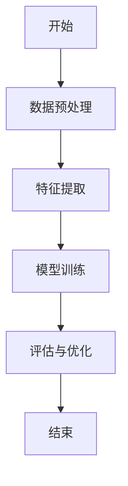
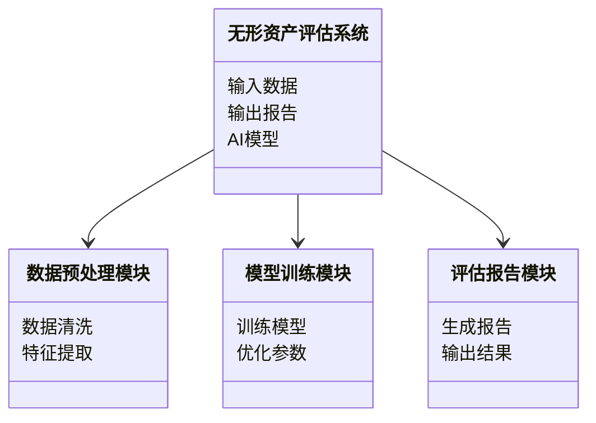
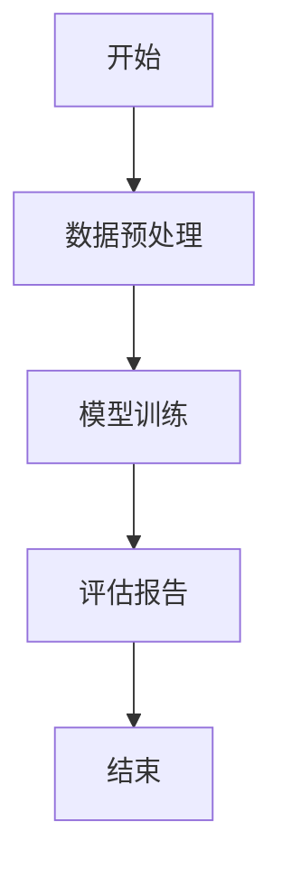

                 


# AI辅助的企业无形资产价值评估

> 关键词：AI辅助，企业无形资产，价值评估，自然语言处理，机器学习，系统架构

> 摘要：本文探讨了如何利用人工智能技术辅助企业无形资产的价值评估。通过分析无形资产的核心概念、AI技术在评估中的应用背景、自然语言处理和机器学习算法在评估中的具体应用，以及系统架构设计，本文为企业提供了一套基于AI的无形资产价值评估解决方案。文章从理论到实践，详细阐述了AI辅助评估的全过程，并通过实际案例展示了该方法的有效性。

---

# 第一部分: AI辅助的企业无形资产价值评估概述

## 第1章: 企业无形资产与AI辅助评估背景

### 1.1 企业无形资产的基本概念

#### 1.1.1 无形资产的定义与分类
无形资产是指企业拥有或控制的没有实物形态的资产，主要包括专利权、商标权、版权、商誉、特许经营权等。无形资产的价值往往难以直接量化，但它们在企业的运营和市场竞争力中起着至关重要的作用。

#### 1.1.2 无形资产在企业中的重要性
无形资产是企业核心竞争力的体现，尤其是在高科技行业，无形资产的价值占据了企业总价值的很大比重。例如，专利和商标的保护可以为企业带来长期的市场优势。

#### 1.1.3 无形资产价值评估的难点与挑战
无形资产价值评估的难点在于其无形性和不确定性。传统的评估方法（如收益法、市场法、成本法）难以准确捕捉无形资产的动态变化，尤其是在数据量大、信息复杂的情况下，传统方法往往显得力不从心。

### 1.2 AI技术在企业价值评估中的应用背景

#### 1.2.1 AI技术的发展与应用现状
人工智能技术近年来取得了飞速发展，尤其是在自然语言处理（NLP）、机器学习等领域，AI已经广泛应用于金融、医疗、法律等多个行业。在企业价值评估领域，AI技术的应用还处于起步阶段，但其潜力巨大。

#### 1.2.2 企业价值评估中的数据化趋势
随着企业数字化转型的推进，企业积累的数据量急剧增加。通过AI技术对这些数据的分析，可以提取出传统方法难以捕捉的有价值的信息，从而为无形资产评估提供新的视角。

#### 1.2.3 AI辅助评估的优势与潜力
AI辅助评估的优势在于其强大的数据处理能力和自动化能力。通过AI技术，可以快速分析大量的非结构化数据（如文本、图像），提取关键信息，并建立预测模型，从而提高评估的准确性和效率。

---

## 第2章: 无形资产价值评估的关键要素

### 2.1 无形资产的评估维度

#### 2.1.1 收益法、市场法、成本法的对比
- **收益法**：基于未来现金流折现，适用于有稳定收益的无形资产。
- **市场法**：基于可比交易案例，适用于市场流动性较高的无形资产。
- **成本法**：基于重置成本，适用于有明确成本记录的无形资产。

#### 2.1.2 无形资产的生命周期与价值波动
无形资产的价值往往与其生命周期密切相关。例如，专利的生命周期可能较短，而商誉的生命周期则与企业的长期表现相关。

#### 2.1.3 影响无形资产价值的关键因素
- **市场需求**：市场需求的变化直接影响无形资产的使用价值。
- **技术进步**：技术的快速迭代会影响无形资产的贬值速度。
- **法律保护**：法律保护的力度影响无形资产的市场竞争力。

### 2.2 AI在无形资产评估中的核心作用

#### 2.2.1 数据驱动的评估方法
AI技术可以通过对海量数据的分析，提取出影响无形资产价值的关键因素，从而构建数据驱动的评估模型。

#### 2.2.2 自然语言处理在文本数据中的应用
自然语言处理技术可以对企业的新闻报道、财务报告等文本数据进行分析，提取情感、关键词等信息，为评估提供依据。

#### 2.2.3 机器学习模型在预测中的优势
机器学习模型可以通过历史数据训练，预测无形资产的未来价值变化趋势，从而为评估提供参考。

---

## 第3章: AI辅助企业无形资产价值评估的核心概念

### 3.1 自然语言处理在无形资产评估中的应用

#### 3.1.1 NLP的核心技术与算法
自然语言处理技术包括文本分词、句法分析、情感分析等。在无形资产评估中，NLP主要用于文本数据的特征提取和信息挖掘。

#### 3.1.2 常见的NLP任务与应用
- **文本分类**：将企业文本分为不同类别，如正面、负面新闻。
- **实体识别**：识别文本中的关键实体，如公司名称、专利名称。
- **文本摘要**：提取文本中的关键信息，生成摘要。

#### 3.1.3 NLP在企业文本数据处理中的价值
通过NLP技术，可以快速处理大量的文本数据，提取有用信息，为评估提供支持。

### 3.2 基于NLP的企业价值评估模型

#### 3.2.1 文本特征提取与向量表示
文本特征提取是将文本数据转化为数值表示的关键步骤。常用的向量表示方法包括TF-IDF、Word2Vec、BERT等。

#### 3.2.2 预训练语言模型在评估中的应用
预训练语言模型（如BERT、GPT）可以通过大规模预训练，直接应用于文本分析任务，无需额外标注数据。

#### 3.2.3 基于NLP的情感分析与价值预测
情感分析可以识别文本中的情感倾向，从而帮助企业判断市场对某一无形资产的评价。

---

## 第4章: AI辅助企业无形资产价值评估的算法原理

### 4.1 算法流程图



### 4.2 核心算法实现

#### 4.2.1 使用Python实现文本特征提取
```python
from sklearn.feature_extraction.text import TfidfVectorizer
vectorizer = TfidfVectorizer()
X = vectorizer.fit_transform(corpus)
```

#### 4.2.2 机器学习模型的训练与评估
```python
from sklearn.linear_model import LogisticRegression
model = LogisticRegression()
model.fit(X_train, y_train)
score = model.score(X_test, y_test)
```

---

## 第5章: 系统分析与架构设计方案

### 5.1 问题场景介绍
企业在无形资产评估中面临数据量大、信息复杂、评估方法单一等问题。通过构建AI辅助评估系统，可以解决这些问题。

### 5.2 系统功能设计

#### 5.2.1 领域模型


### 5.3 系统架构设计



---

## 第6章: 项目实战

### 6.1 环境安装
安装所需的Python库，如scikit-learn、transformers、tensorflow等。

### 6.2 系统核心实现

#### 6.2.1 文本特征提取
```python
from transformers import pipeline
nlp = pipeline("sentiment-analysis")
```

#### 6.2.2 模型训练与评估
```python
from sklearn.metrics import accuracy_score
y_pred = model.predict(X_test)
print(f"Accuracy: {accuracy_score(y_pred, y_test)}")
```

### 6.3 案例分析
通过实际案例分析，展示AI辅助评估的全过程，并对比传统方法和AI方法的优劣。

---

## 第7章: 最佳实践与总结

### 7.1 小结
本文详细探讨了AI辅助企业无形资产价值评估的全过程，从理论到实践，为读者提供了一套完整的解决方案。

### 7.2 注意事项
- 数据的质量和完整性直接影响评估结果。
- 模型的选择和调优是关键。
- 法律和道德问题需要高度重视。

### 7.3 未来展望
随着AI技术的不断进步，企业无形资产价值评估将更加智能化和精准化。未来的研究方向包括更复杂的模型和更广泛的应用场景。

---

通过以上思考过程，我们可以清晰地看到，AI技术在企业无形资产价值评估中的应用前景广阔。结合自然语言处理、机器学习等技术，可以显著提高评估的准确性和效率，为企业决策提供有力支持。

