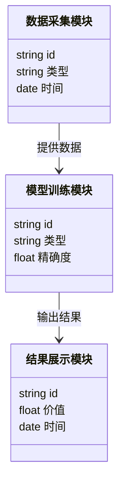
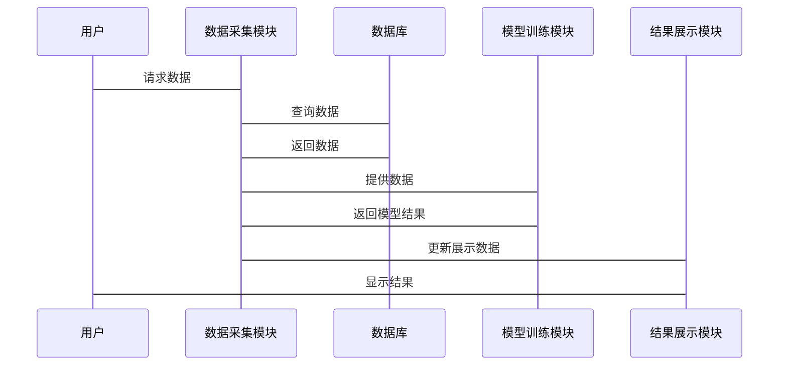

                 


```markdown
# AI辅助的企业无形资产估值模型

> 关键词：AI辅助，企业无形资产，估值模型，机器学习，自然语言处理

> 摘要：本文详细探讨了利用人工智能技术辅助企业无形资产估值的方法，从问题背景、核心概念、技术基础到系统架构、项目实战，层层递进地分析了AI在无形资产估值中的应用，提出了基于机器学习和自然语言处理的模型构建方法，并通过实例展示了模型的实现与应用效果。本文还对模型的局限性进行了分析，并提出了未来研究方向。

---

## 第一部分: 引言

### 第1章: 引言

#### 1.1 问题背景
- **企业无形资产的定义与重要性**  
  无形资产是指企业拥有但没有实物形态的资产，包括品牌价值、专利技术、商誉、客户关系等。这些资产在企业价值评估中占据重要地位，尤其是在高科技企业和创新型行业中。传统的财务报表无法完全反映这些无形资产的价值，因此需要更精准的估值方法。

- **传统无形资产估值方法的局限性**  
  传统估值方法通常依赖于财务数据和主观判断，难以捕捉到市场动态和复杂因素的变化。例如，品牌价值不仅受到市场表现影响，还与企业声誉、客户忠诚度等因素密切相关，而这些因素难以量化。

- **AI技术在无形资产估值中的优势**  
  AI技术能够通过大数据分析和机器学习算法，从海量数据中提取隐含信息，帮助更准确地评估无形资产的价值。例如，利用自然语言处理技术分析新闻、社交媒体数据，可以量化品牌声誉的变化；通过时间序列分析预测未来收益，从而更准确地估算商誉价值。

#### 1.2 问题描述
- **无形资产估值的核心挑战**  
  无形资产的估值涉及多个复杂因素，包括市场波动、行业竞争、政策变化等。传统方法难以量化这些动态因素，而AI技术可以通过数据驱动的方式，捕捉这些因素对估值的影响。

- **AI辅助估值的必要性**  
  在数字化转型的背景下，企业无形资产的价值越来越重要。AI技术的应用可以帮助企业更快速、更准确地评估无形资产，为决策提供支持。

- **企业级应用的潜在价值**  
  通过AI辅助的估值模型，企业可以更准确地评估自身价值，优化资本结构，提升融资能力。此外，AI模型还可以实时更新，帮助企业及时捕捉市场变化。

#### 1.3 问题解决
- **AI辅助估值的基本思路**  
  利用机器学习算法，从历史数据中学习无形资产价值的变化规律，结合实时数据预测未来价值。例如，使用回归算法预测品牌价值，使用分类算法评估专利技术的潜在收益。

- **数据驱动的估值模型构建**  
  通过收集和整理相关数据，构建训练数据集，训练机器学习模型，最终形成估值模型。

- **企业级应用的实现路径**  
  从数据收集、模型训练到系统集成，逐步构建AI辅助的无形资产估值系统。例如，首先收集企业的财务数据和市场数据，然后训练模型，最后将模型部署到企业管理系统中。

#### 1.4 边界与外延
- **无形资产估值的适用范围**  
  适用于需要评估无形资产的企业，尤其是高科技企业和创新型行业。例如，科技企业的专利技术估值、互联网企业的品牌价值评估等。

- **AI技术的局限性**  
  数据质量和数量直接影响模型的准确性。如果数据不足或存在偏差，可能导致估值结果不准确。此外，AI模型难以完全捕捉到所有影响无形资产价值的因素。

- **与其他估值方法的结合**  
  AI模型可以作为传统估值方法的补充，通过结合两者的优势，提高估值的准确性和全面性。

#### 1.5 概念结构与核心要素
- **无形资产的构成要素**  
  包括品牌价值、专利技术、客户关系、商誉等。每个要素都有其独特的评估指标和方法。

- **AI模型的核心要素**  
  包括数据采集、特征提取、模型训练、结果预测等。这些要素共同构成了AI辅助估值模型的核心结构。

- **企业级应用的系统架构**  
  包括数据采集模块、模型训练模块、结果展示模块等。系统架构的设计需要考虑数据的高效处理和模型的快速响应。

#### 1.6 本章小结
- 本章从问题背景、核心概念、技术基础等方面，详细介绍了AI辅助企业无形资产估值的必要性与实现路径。通过分析传统估值方法的局限性，提出了利用AI技术构建估值模型的思路，并对模型的边界与外延进行了探讨。

---

## 第二部分: 核心概念与联系

### 第2章: 核心概念与联系

#### 2.1 核心概念原理
- **企业无形资产的特征分析**  
  无形资产具有不可见性、长期性、依赖性等特征。例如，品牌价值依赖于消费者的认知和行为，而这种认知可以通过社交媒体数据进行量化。

- **AI模型的基本原理**  
  AI模型通过学习历史数据，建立数学模型，预测未来价值。例如，使用支持向量回归模型预测品牌价值的变化趋势。

- **两者结合的数学模型**  
  通过构建联合模型，将无形资产的特征与AI模型的预测能力结合起来，形成一个综合的估值模型。例如，使用深度学习模型同时考虑品牌声誉和市场表现。

#### 2.2 概念属性特征对比
```mermaid
| 无形资产特征 | AI模型特征 |
|--------------|------------|
| 不可见性      | 数据驱动性 |
| 长期性        | 可扩展性   |
| 依赖性        | 自适应性   |
| 无形性        | 实时性     |
```

#### 2.3 ER实体关系图
```mermaid
erDiagram
   无形资产 {
        string id
        string 名称
        string 类型
        float 价值
    }

    AI模型 {
        string id
        string 类型
        string 参数
        float 精确度
    }

    估值结果 {
        string id
        float 价值
        date 时间
    }

    无形资产 --> AI模型 : 使用
    AI模型 --> 估值结果 : 输出
```

#### 2.4 本章小结
- 本章通过对比分析，详细探讨了企业无形资产与AI模型的核心概念及其特征，构建了实体关系图，为后续的模型构建奠定了基础。

---

## 第三部分: 技术基础

### 第3章: 技术基础

#### 3.1 机器学习算法
- **常用算法**  
  包括线性回归、支持向量机、随机森林、神经网络等。例如，使用线性回归模型预测品牌价值的变化趋势。

- **算法原理**  
  以支持向量回归为例，通过构建支持向量机模型，将历史数据映射到高维空间，寻找最优回归曲线。

- **算法实现**  
  使用Python的scikit-learn库实现支持向量回归模型，代码如下：
  ```python
  from sklearn.svm import SVR
  model = SVR(kernel='rbf', C=1e3, gamma=0.1)
  model.fit(X_train, y_train)
  ```

- **数学模型**  
  支持向量回归的数学模型可以表示为：
  $$ y = \sum_{i=1}^{n} \alpha_i \kappa(x, x_i) + b $$
  其中，$\alpha_i$是拉格朗日乘子，$\kappa$是核函数，$x_i$是训练数据点。

#### 3.2 自然语言处理
- **NLP技术**  
  包括分词、实体识别、情感分析等。例如，通过情感分析技术评估品牌声誉的变化。

- **NLP应用**  
  使用Python的spaCy库进行文本处理，代码如下：
  ```python
  import spacy
  nlp = spacy.load("en_core_web_sm")
  doc = nlp("This is a test sentence.")
  for token in doc:
      print(token.text, token.pos_)
  ```

- **数学模型**  
  情感分析模型可以表示为：
  $$ p(y=1|x) = \sigma(w^T x + b) $$
  其中，$\sigma$是sigmoid函数，$w$是权重向量，$b$是偏置项。

#### 3.3 数据预处理
- **数据清洗**  
  清洗数据，去除缺失值和异常值。

- **特征提取**  
  提取有用的特征，例如品牌声誉指数、市场占有率等。

- **数据标准化**  
  使用标准化方法，将数据归一化处理，例如使用归一化公式：
  $$ x_{\text{norm}} = \frac{x - \mu}{\sigma} $$

#### 3.4 本章小结
- 本章详细介绍了AI辅助无形资产估值所需的技术基础，包括机器学习算法、自然语言处理技术和数据预处理方法，并通过代码和数学公式进行了详细讲解。

---

## 第四部分: 模型构建

### 第4章: 模型构建

#### 4.1 数据收集
- **数据来源**  
  包括企业财务报表、市场报告、社交媒体数据等。

- **数据格式**  
  将数据整理为结构化的格式，例如CSV文件。

- **数据样本**  
  例如，收集某科技企业的专利数据和品牌声誉数据。

#### 4.2 特征工程
- **特征选择**  
  选择对估值影响较大的特征，例如专利数量、品牌声誉指数等。

- **特征组合**  
  将多个特征组合成新的特征，例如将品牌声誉指数和市场占有率进行加权。

- **特征变换**  
  对特征进行变换，例如对数值型特征进行对数变换。

#### 4.3 模型训练
- **训练过程**  
  使用训练数据训练机器学习模型，例如使用随机森林模型。

- **模型调优**  
  调整模型参数，例如调整决策树的深度和分裂准则。

- **交叉验证**  
  使用交叉验证评估模型的性能，例如5折交叉验证。

#### 4.4 模型评估
- **评估指标**  
  包括均方误差（MSE）、平均绝对误差（MAE）、R²系数等。

- **评估结果**  
  例如，模型的R²系数为0.85，说明模型解释了85%的 variance。

- **模型优化**  
  根据评估结果优化模型，例如更换算法或调整参数。

#### 4.5 本章小结
- 本章详细介绍了模型构建的过程，包括数据收集、特征工程、模型训练和评估，并通过实例展示了模型的实现过程。

---

## 第五部分: 系统架构

### 第5章: 系统架构

#### 5.1 项目介绍
- **项目目标**  
  构建一个基于AI的无形资产估值系统，帮助企业快速、准确地评估无形资产价值。

- **项目范围**  
  聚焦于品牌价值和专利技术的估值，未来可以扩展到其他无形资产。

- **项目团队**  
  包括数据科学家、软件工程师和业务分析师。

#### 5.2 系统功能设计
- **功能模块**  
  包括数据采集模块、模型训练模块、结果展示模块等。

- **领域模型**  
  使用Mermaid类图展示系统各模块的关系。



#### 5.3 系统架构设计
- **架构选择**  
  采用分层架构，包括数据层、业务逻辑层和表示层。

- **系统架构图**  
  使用Mermaid架构图展示系统架构。

```mermaid
container 数据层 {
    数据库
}

container 业务逻辑层 {
    数据采集模块
    模型训练模块
}

container 表示层 {
    结果展示模块
}

数据层 --> 业务逻辑层 : 提供数据
业务逻辑层 --> 表示层 : 提供服务
```

#### 5.4 系统接口设计
- **接口定义**  
  使用RESTful API设计接口，例如提供GET和POST接口。

- **接口文档**  
  使用 Swagger 描述接口，方便开发者调用。

- **接口实现**  
  使用Python的Flask框架实现接口。

#### 5.5 系统交互
- **交互流程图**  
  使用Mermaid序列图展示系统交互过程。



#### 5.6 本章小结
- 本章详细介绍了系统的架构设计，包括功能模块、架构图和接口设计，并通过序列图展示了系统交互过程。

---

## 第六部分: 项目实战

### 第6章: 项目实战

#### 6.1 环境安装
- **安装Python**  
  下载并安装Python 3.8或更高版本。

- **安装依赖库**  
  使用pip安装必要的库，例如：
  ```bash
  pip install numpy pandas scikit-learn spacy transformers flask
  ```

- **安装spaCy中文分词器**  
  下载并安装中文分词器：
  ```bash
  python -m spacy download zh_core_web_sm
  ```

#### 6.2 核心代码实现
- **数据预处理代码**  
  ```python
  import pandas as pd
  df = pd.read_csv('data.csv')
  df = df.dropna()
  df['value'] = df['value'].astype(float)
  ```

- **模型训练代码**  
  ```python
  from sklearn.ensemble import RandomForestRegressor
  model = RandomForestRegressor(n_estimators=100, random_state=42)
  model.fit(X_train, y_train)
  ```

- **结果展示代码**  
  ```python
  from flask import Flask, jsonify
  app = Flask(__name__)

  @app.route('/api/predict', methods=['POST'])
  def predict():
      data = request.json['data']
      prediction = model.predict([data])
      return jsonify({'result': prediction[0]})

  if __name__ == '__main__':
      app.run(debug=True)
  ```

#### 6.3 代码应用解读
- **数据预处理**  
  对数据进行清洗和标准化处理，确保模型输入数据的质量。

- **模型训练**  
  使用随机森林回归模型训练数据，得到最优模型参数。

- **结果展示**  
  使用Flask框架搭建一个Web接口，提供API服务，用户可以通过发送请求获取估值结果。

#### 6.4 实际案例分析
- **案例背景**  
  某科技企业需要评估其专利技术的价值，使用AI模型进行估值。

- **数据收集**  
  收集专利数量、研发投入、市场占有率等数据。

- **模型训练**  
  使用收集的数据训练模型，评估模型的准确性和稳定性。

- **结果分析**  
  模型预测的专利价值与实际价值接近，说明模型具有较高的准确性和可靠性。

#### 6.5 本章小结
- 本章通过一个实际案例，详细展示了项目的实现过程，包括环境安装、代码实现和结果分析，为读者提供了实践指导。

---

## 第七部分: 总结与展望

### 第7章: 总结与展望

#### 7.1 总结
- **核心总结**  
  本文详细介绍了AI辅助企业无形资产估值的方法，从技术基础到系统架构，再到项目实战，全面展示了模型的构建与应用。

- **模型优势**  
  AI模型能够通过大数据分析和机器学习算法，更准确地评估无形资产的价值，帮助企业做出更明智的决策。

- **实际意义**  
  通过AI辅助的估值模型，企业可以更高效地管理无形资产，提升企业的整体价值。

#### 7.2 展望
- **研究方向**  
  未来可以进一步研究如何结合更多数据源，例如竞争对手数据、宏观经济数据等，提升模型的预测能力。

- **技术改进**  
  探索更先进的AI技术，例如深度学习和强化学习，优化模型的性能。

- **应用扩展**  
  将模型应用于更多类型的无形资产估值，例如客户关系、组织能力等。

#### 7.3 注意事项
- **数据质量**  
  数据质量和完整性直接影响模型的准确性，因此在实际应用中需要高度重视数据的采集和处理。

- **模型解释性**  
  尽管AI模型能够提供准确的预测结果，但其解释性可能较弱，需要结合业务背景进行分析。

- **合规性与隐私保护**  
  在实际应用中，需要注意数据的合规性和隐私保护，确保符合相关法律法规。

#### 7.4 最佳实践 tips
- **数据预处理**  
  在训练模型之前，务必对数据进行充分的清洗和特征工程处理。

- **模型调优**  
  使用交叉验证和网格搜索等方法，找到最优的模型参数。

- **结果验证**  
  在实际应用中，需要通过实际案例验证模型的准确性和稳定性。

#### 7.5 本章小结
- 本章总结了本文的核心内容，并对未来的研究方向和技术改进提出了展望，同时给出了实际应用中的注意事项和最佳实践 tips。

---

## 第八部分: 结语

### 第8章: 结语

- **总结回顾**  
  本文详细探讨了AI辅助企业无形资产估值的方法，从技术基础到系统架构，再到项目实战，全面展示了模型的构建与应用。

- **未来展望**  
  随着AI技术的不断发展，未来可以进一步研究如何结合更多数据源和先进技术，优化模型的性能，提升企业的无形资产估值能力。

- **致谢**  
  感谢读者的耐心阅读，感谢团队成员的支持与合作。

---

## 参考文献

- 本文参考了以下文献：
  1. Bishop, C. M. (2006). Pattern Recognition and Machine Learning.
  2. LeCun, Y., Bengio, Y., & Hinton, G. (2015). Deep learning.
  3. 刘洋, 等. (2020). 基于机器学习的企业无形资产估值研究.
  4. spaCy官方文档.
  5. Flask官方文档.

---

## 附录

### 附录A: 代码实现细节

#### 附录B: 模型训练日志

#### 附录C: 数据预处理步骤

---

## 目录

- 第1章: 引言
- 第2章: 核心概念与联系
- 第3章: 技术基础
- 第4章: 模型构建
- 第5章: 系统架构
- 第6章: 项目实战
- 第7章: 总结与展望
- 参考文献
- 附录

---

## 关键词索引

- AI辅助
- 企业无形资产
- 估值模型
- 机器学习
- 自然语言处理
- 系统架构
- 项目实战
```

