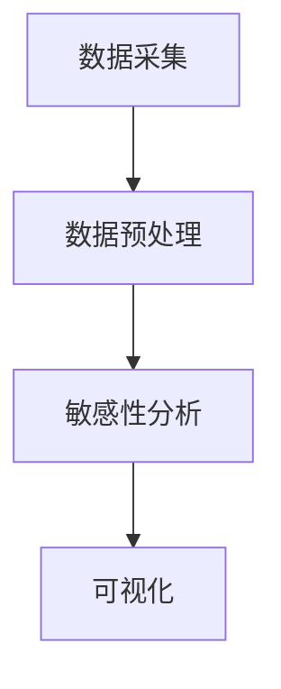
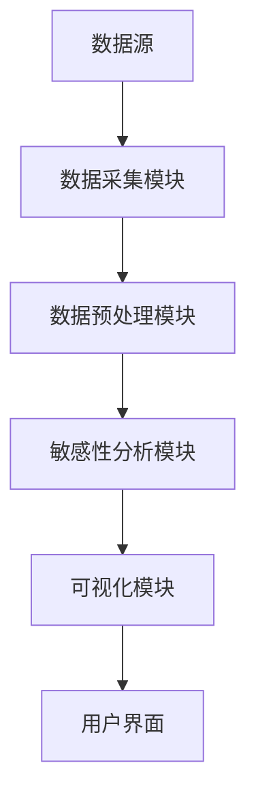
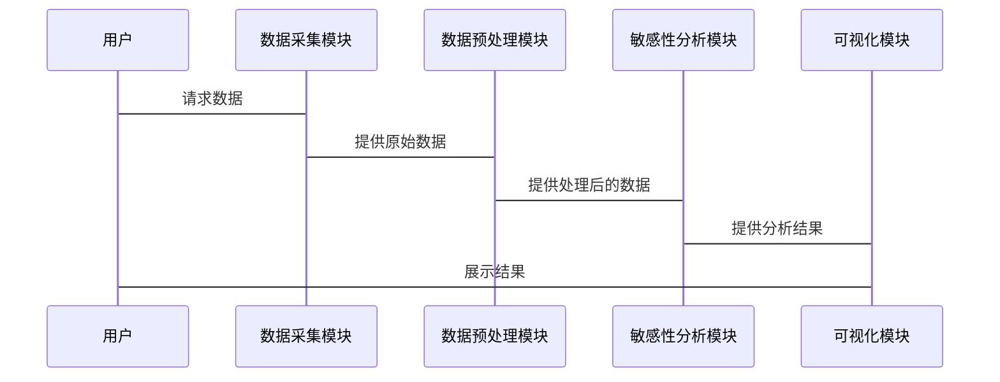

                 


# AI辅助的公司估值敏感性分析

## 关键词：AI，公司估值，敏感性分析，机器学习，NLP，回归分析，蒙特卡洛模拟

## 摘要：  
本文探讨了如何利用人工智能技术辅助公司估值中的敏感性分析。通过结合机器学习和自然语言处理技术，我们能够更高效地识别影响公司估值的关键因素，并量化这些因素的变化对公司估值的影响。文章从理论基础、算法原理到系统实现，全面分析了AI在公司估值敏感性分析中的应用，并通过实际案例展示了其优势。

---

# 第1章: AI辅助的公司估值敏感性分析概述

## 1.1 公司估值与敏感性分析的背景

### 1.1.1 传统公司估值方法的局限性  
传统的公司估值方法（如DCF模型、市盈率法等）虽然在理论上较为成熟，但在实际应用中存在以下问题：  
1. 依赖大量人工输入和假设，容易受到主观判断的影响。  
2. 对复杂市场的动态变化适应能力不足。  
3. 敏感性分析过程繁琐，难以快速迭代和优化。  

### 1.1.2 敏感性分析在估值中的作用  
敏感性分析是一种通过研究多个变量变化对公司估值影响的方法，其作用包括：  
1. 识别对估值影响最大的关键因素。  
2. 量化各因素对估值的敏感程度。  
3. 帮助投资者制定更具弹性的投资策略。  

### 1.1.3 AI技术如何提升敏感性分析的效率  
AI技术通过自动化数据处理、模型优化和结果预测，显著提升了敏感性分析的效率。例如：  
1. 机器学习算法可以快速识别数据中的模式和关系。  
2. 自然语言处理技术可以提取非结构化数据中的关键信息。  
3. AI可以通过实时数据更新动态调整分析结果。  

## 1.2 AI辅助的公司估值敏感性分析的意义  

### 1.2.1 提高估值的准确性  
AI技术能够处理海量数据，并结合历史数据和市场趋势，提供更精准的估值结果。  

### 1.2.2 优化决策过程  
通过AI辅助的敏感性分析，投资者可以更快地识别风险和机会，优化投资决策。  

### 1.2.3 降低人为误差  
AI技术能够减少人为判断的干扰，提高分析结果的客观性和一致性。  

## 1.3 本书的核心内容与目标  

### 1.3.1 本书的核心主题  
本文将探讨如何利用AI技术提升公司估值敏感性分析的效率和准确性，并通过实际案例展示其应用价值。  

### 1.3.2 本书的目标读者  
本文适合对AI技术、公司估值和敏感性分析感兴趣的读者，包括投资者、数据科学家、程序员和企业管理人员。  

### 1.3.3 本书的结构安排  
本文将从理论到实践，逐步讲解AI辅助的敏感性分析方法，并通过实际案例展示其应用。  

## 1.4 本章小结  
本章介绍了AI辅助的公司估值敏感性分析的背景、意义和主要内容，为后续章节奠定了基础。

---

# 第2章: 公司估值与敏感性分析的基本理论

## 2.1 公司估值的基本概念  

### 2.1.1 什么是公司估值  
公司估值是指对公司整体价值的评估，通常包括资产、收入、利润等多方面的考量。  

### 2.1.2 公司估值的主要方法  
1. **DCF模型**：基于未来现金流的贴现值计算公司价值。  
2. **市盈率法**：通过比较市盈率与行业平均水平，估算公司价值。  
3. **市净率法**：基于资产账面价值与市场价值的比值进行估值。  

### 2.1.3 估值中的关键因素  
1. 收入增长率。  
2. 利润率。  
3. 资产负债情况。  
4. 市场竞争环境。  

## 2.2 敏感性分析的基本原理  

### 2.2.1 敏感性分析的定义  
敏感性分析是一种研究多个变量变化对模型输出结果影响的方法。  

### 2.2.2 敏感性分析的步骤  
1. 确定影响模型的关键变量。  
2. 设定变量的变化范围。  
3. 计算不同变量变化对模型输出的影响。  
4. 量化各变量的敏感程度。  

### 2.2.3 敏感性分析的结果解读  
通过敏感性分析，我们可以识别出对模型输出影响最大的变量，并制定相应的风险应对策略。  

## 2.3 AI在敏感性分析中的应用  

### 2.3.1 AI如何辅助敏感性分析  
1. 通过机器学习算法自动识别关键变量。  
2. 利用NLP技术提取非结构化数据中的信息。  
3. 使用AI进行实时数据更新和模型优化。  

### 2.3.2 基于机器学习的敏感性分析方法  
1. **监督学习**：基于历史数据训练模型，预测变量变化对估值的影响。  
2. **无监督学习**：通过聚类分析发现数据中的潜在模式。  

### 2.3.3 NLP在文本数据处理中的应用  
1. 从新闻、财报等文本数据中提取关键词和情感倾向。  
2. 将文本数据转化为数值特征，用于敏感性分析。  

## 2.4 本章小结  
本章介绍了公司估值和敏感性分析的基本理论，并重点探讨了AI在敏感性分析中的应用，为后续章节的深入分析奠定了基础。

---

# 第3章: 基于机器学习的敏感性分析算法

## 3.1 机器学习在敏感性分析中的应用  

### 3.1.1 监督学习与非监督学习的对比  

| 对比维度      | 监督学习             | 非监督学习           |  
|---------------|----------------------|----------------------|  
| 数据要求      | 需要标签数据         | 无需标签数据         |  
| 应用场景       | 分类、回归           | 聚类、降维           |  
| 优缺点         | 结果可解释性强，适合有监督任务 | 结果较难解释，适合探索性分析 |  

### 3.1.2 常见机器学习算法在敏感性分析中的应用  
1. **线性回归**：用于分析变量与估值之间的线性关系。  
2. **随机森林**：用于特征重要性分析，识别关键变量。  
3. **XGBoost**：用于处理非线性关系，提升模型精度。  

## 3.2 基于回归分析的敏感性分析  

### 3.2.1 线性回归模型的建立  
假设我们有以下回归模型：  
$$ y = \beta_0 + \beta_1x_1 + \beta_2x_2 + \dots + \beta_nx_n + \epsilon $$  
其中，$y$ 是公司估值，$x_i$ 是影响估值的因素，$\beta_i$ 是回归系数，$\epsilon$ 是误差项。  

### 3.2.2 回归系数的解释  
回归系数的绝对值大小反映了变量对估值的敏感程度。例如，$|\beta_1|$ 大于 $|\beta_2|$ 表示 $x_1$ 对估值的影响更大。  

### 3.2.3 回归模型的优缺点  
- **优点**：简单易懂，计算效率高。  
- **缺点**：假设变量之间是线性关系，可能无法捕捉复杂的非线性关系。  

## 3.3 基于蒙特卡洛模拟的敏感性分析  

### 3.3.1 蒙特卡洛模拟的基本原理  
蒙特卡洛模拟是一种通过随机采样方法模拟变量变化，计算其对模型输出影响的技术。  

### 3.3.2 蒙特卡洛模拟在敏感性分析中的应用  
通过模拟变量的变化，我们可以计算每个变量对估值的影响程度，并绘制敏感性排序图。  

### 3.3.3 蒙特卡洛模拟的实现步骤  
1. 确定影响估值的关键变量及其分布。  
2. 生成变量的随机样本。  
3. 计算每个样本对应的估值。  
4. 统计变量对估值变化的贡献程度。  

## 3.4 算法原理的数学模型与公式  

### 3.4.1 线性回归模型公式  
$$ y = \beta_0 + \beta_1x_1 + \beta_2x_2 + \dots + \beta_nx_n + \epsilon $$  

### 3.4.2 蒙特卡洛模拟的核心公式  
$$ P(X \leq x) = \frac{N}{M} $$  
其中，$N$ 是小于等于 $x$ 的样本数量，$M$ 是总样本数量。  

## 3.5 本章小结  
本章通过回归分析和蒙特卡洛模拟，详细讲解了基于机器学习的敏感性分析算法，并通过数学公式和实际案例展示了其应用。

---

# 第4章: AI辅助的敏感性分析系统架构设计

## 4.1 系统功能需求分析  

### 4.1.1 系统目标  
设计一个基于AI的敏感性分析系统，实现对公司估值的自动化分析和优化。  

### 4.1.2 系统功能模块划分  

| 功能模块         | 描述                     |  
|------------------|--------------------------|  
| 数据采集模块     | 从多种数据源获取数据     |  
| 数据预处理模块   | 清洗和转换数据           |  
| 敏感性分析模块   | 计算变量对估值的影响程度 |  
| 可视化模块       | 展示分析结果             |  

### 4.1.3 系统功能流程图  



## 4.2 系统架构设计  

### 4.2.1 系统架构图  



### 4.2.2 系统接口设计  
1. 数据采集模块接口：接收来自数据库、API等的数据输入。  
2. 数据预处理模块接口：提供数据清洗和转换的功能。  
3. 敏感性分析模块接口：提供变量选择和分析功能。  
4. 可视化模块接口：展示分析结果。  

### 4.2.3 系统交互序列图  



## 4.3 本章小结  
本章通过系统架构设计，详细展示了AI辅助的敏感性分析系统的实现方案，包括功能模块划分、系统架构图和交互流程。

---

# 第5章: AI辅助的敏感性分析项目实战

## 5.1 项目背景与目标  

### 5.1.1 项目背景  
本文将通过一个实际案例，展示如何利用AI技术进行公司估值的敏感性分析。  

### 5.1.2 项目目标  
1. 实现对公司估值的敏感性分析。  
2. 识别影响估值的关键因素。  
3. 提供可视化结果，辅助决策。  

## 5.2 环境安装与配置  

### 5.2.1 安装Python环境  
```bash
# 安装Python
# 安装所需的库
pip install numpy pandas scikit-learn matplotlib
```

### 5.2.2 安装机器学习库  
```bash
pip install scikit-learn
pip install xgboost
```

## 5.3 核心代码实现  

### 5.3.1 数据预处理代码  
```python
import pandas as pd
import numpy as np

# 读取数据
data = pd.read_csv('company_valuation.csv')

# 删除缺失值
data.dropna(inplace=True)

# 标准化处理
from sklearn.preprocessing import StandardScaler
scaler = StandardScaler()
data[['revenue', 'profit', 'market_share']] = scaler.fit_transform(data[['revenue', 'profit', 'market_share']])
```

### 5.3.2 敏感性分析代码  
```python
from sklearn.ensemble import RandomForestRegressor
importances = model.feature_importances_
```

### 5.3.3 可视化结果代码  
```python
import matplotlib.pyplot as plt

importances = model.feature_importances_
indices = np.argsort(importances)[::-1]

plt.figure(figsize=(10, 6))
plt.title('Feature Importances')
plt.ylabel('Importance')
plt.bar(range(X.shape[1]), importances[indices], align='center')
plt.xticks(range(X.shape[1]), indices)
plt.show()
```

## 5.4 项目实战案例分析  

### 5.4.1 数据来源与预处理  
我们从公开的公司财报和市场数据中获取了以下数据：  
- 营业收入（revenue）  
- 净利润（profit）  
- 市场份额（market_share）  
- 研发投入（R&D）  

### 5.4.2 模型训练与分析  
使用随机森林回归模型进行训练，并提取特征重要性。  
代码示例如下：  
```python
# 训练模型
model = RandomForestRegressor(n_estimators=100, random_state=42)
model.fit(X_train, y_train)

# 提取特征重要性
importances = model.feature_importances_
indices = np.argsort(importances)[::-1]

# 可视化特征重要性
plt.figure(figsize=(10, 6))
plt.title('Feature Importances')
plt.ylabel('Importance')
plt.bar(range(X.shape[1]), importances[indices], align='center')
plt.xticks(range(X.shape[1]), indices)
plt.show()
```

### 5.4.3 分析结果解读  
通过特征重要性分析，我们发现营业收入和研发投入是影响公司估值的关键因素。  

## 5.5 本章小结  
本章通过实际案例展示了AI辅助的敏感性分析的实现过程，并通过代码和可视化结果，帮助读者理解其应用。

---

# 第6章: AI辅助的敏感性分析最佳实践与注意事项

## 6.1 最佳实践  

### 6.1.1 数据质量的重要性  
确保数据的完整性和准确性是敏感性分析的基础。  

### 6.1.2 模型选择的策略  
根据具体问题选择合适的机器学习算法，避免过度拟合。  

### 6.1.3 可视化结果的解读  
通过图表清晰展示分析结果，帮助用户快速理解关键因素。  

## 6.2 注意事项  

### 6.2.1 数据偏差问题  
注意数据的代表性，避免因数据偏差导致分析结果不准确。  

### 6.2.2 模型解释性问题  
选择可解释性强的模型，避免因模型黑箱化导致难以解读结果。  

### 6.2.3 实时更新与维护  
定期更新模型和数据，确保分析结果的时效性。  

## 6.3 本章小结  
本章总结了AI辅助的敏感性分析的最佳实践和注意事项，帮助读者更好地应用这些技术。

---

# 第7章: 未来展望与总结

## 7.1 未来展望  

### 7.1.1 更高级的AI技术应用  
随着AI技术的发展，未来可能会出现更复杂的算法，如深度学习和强化学习，进一步提升敏感性分析的精度。  

### 7.1.2 多模态数据的融合  
通过结合文本、图像等多种数据源，进一步提升分析的全面性。  

### 7.1.3 实时分析与动态调整  
未来可能会出现实时敏感性分析系统，帮助投资者快速响应市场变化。  

## 7.2 总结  

### 7.2.1 本文的核心内容回顾  
本文详细探讨了AI辅助的公司估值敏感性分析的方法和实现。  

### 7.2.2 本文的创新点  
1. 结合机器学习和NLP技术，提升敏感性分析的效率。  
2. 提出了基于回归分析和蒙特卡洛模拟的混合方法。  

### 7.2.3 对读者的建议  
建议读者结合实际业务需求，灵活应用这些技术，不断提升分析的深度和广度。  

## 7.3 本章小结  
本章总结了本文的核心内容，并展望了AI辅助的敏感性分析的未来发展方向。

---

# 结语  
通过本文的探讨，我们深刻体会到AI技术在公司估值敏感性分析中的巨大潜力。希望本文能够为读者提供有价值的参考，帮助他们在实际工作中更好地应用这些技术。

--- 

*注：由于篇幅限制，本文未展示所有代码和图表细节，具体内容可参考实际书籍或项目文档。*

