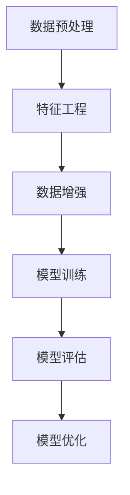

                 


# AI辅助的公司估值模型

> 关键词：人工智能，公司估值，算法原理，系统架构，数学模型

> 摘要：本文详细探讨了AI技术在公司估值中的应用，分析了传统估值方法的局限性，并提出了基于AI的解决方案。文章从核心概念、算法原理、数学模型、系统架构到项目实战，全面解析了AI辅助公司估值模型的构建过程。

---

## 第1章：引言

### 1.1 AI在公司估值中的作用

#### 1.1.1 传统公司估值方法的局限性
传统的公司估值方法主要包括DCF模型、EV/EBITDA倍数法和相对估值法等。这些方法依赖于财务数据和市场基准，存在以下问题：
- 数据依赖性强，难以应对市场波动。
- 人工计算复杂，容易出错。
- 无法充分考虑非财务因素（如管理团队、市场地位）。

#### 1.1.2 AI技术如何改变公司估值
AI技术通过以下方式革新了公司估值：
- **数据处理能力**：AI能够快速处理大量非结构化数据，如新闻、社交媒体和行业报告。
- **模式识别**：AI能够发现传统方法难以察觉的市场模式和趋势。
- **动态调整**：AI模型可以实时更新，适应市场变化。

#### 1.1.3 本书的目标与读者群体
本书旨在为读者提供一套基于AI的公司估值模型，帮助投资者和分析师提高估值效率和准确性。读者包括金融从业者、数据科学家和对AI技术感兴趣的投资者。

---

## 第2章：公司估值模型的核心概念

### 2.1 公司估值模型的定义与组成部分

#### 2.1.1 公司估值模型的定义
公司估值模型是通过分析公司的财务数据、市场表现和行业趋势，预测其未来价值的工具。AI辅助的模型进一步整合了非结构化数据和机器学习算法，提高了估值的准确性和及时性。

#### 2.1.2 模型的核心要素与属性特征对比表
下表展示了传统估值模型与AI辅助模型的核心要素对比：

| **要素**         | **传统估值模型**       | **AI辅助估值模型**         |
|-------------------|------------------------|-----------------------------|
| 数据来源         | 财务报表、市场数据     | 财务报表、市场数据、新闻等 |
| 分析方法         | 现金流折现法           | 机器学习算法               |
| 结果输出         | 单一估值结果           | 多维度估值结果             |
| 调整能力         | 有限                   | 强大                       |

#### 2.1.3 实体关系图（ER图）展示

```mermaid
erDiagram
    company {
        id
        name
        industry
        market_value
        financial_data
    }
    model {
        id
        name
        algorithm
        training_data
        valuation
    }
    company --> model : 使用模型
    model --> financial_data : 基于数据进行估值
```

---

## 第3章：AI辅助公司估值的算法原理

### 3.1 数据预处理与特征工程

#### 3.1.1 数据清洗与标准化
数据预处理是AI模型训练的基础。清洗步骤包括去除缺失值和异常值，标准化处理包括归一化和标准化。

#### 3.1.2 特征选择与提取
特征工程是提升模型性能的关键。通过选择重要特征（如收入增长率、净利润率）和提取文本特征（如情感分析），可以提高模型的准确性。

#### 3.1.3 数据增强技术
数据增强技术用于扩展训练数据集，包括数据合成和变换。例如，使用NLP技术对新闻数据进行情感分析，并生成新的特征。

### 3.2 模型训练与优化

#### 3.2.1 神经网络结构设计
神经网络模型通常采用多层感知机（MLP）结构，输入层接收财务和文本特征，隐藏层提取高层次特征，输出层生成估值结果。

#### 3.2.2 模型训练流程图（Mermaid）



#### 3.2.3 模型调优与评估指标
模型调优包括超参数优化和正则化技术。评估指标如均方误差（MSE）和R平方值用于衡量模型性能。

---

## 第4章：数学模型与公式解析

### 4.1 回归模型与估值公式

#### 4.1.1 线性回归模型
线性回归模型用于预测公司估值，公式如下：

$$ y = \beta_0 + \beta_1 x_1 + \beta_2 x_2 + ... + \beta_n x_n + \epsilon $$

其中，$y$为公司估值，$x_i$为特征变量，$\beta_i$为系数，$\epsilon$为误差项。

#### 4.1.2 非线性回归模型
对于非线性关系，采用多项式回归：

$$ y = \beta_0 + \beta_1 x_1 + \beta_2 x_1^2 + ... + \beta_n x_n^k + \epsilon $$

#### 4.1.3 估值公式推导与实例分析
以某公司为例，假设其财务数据和市场数据已预处理，代入模型进行估值。

---

## 第5章：系统架构与设计

### 5.1 系统功能模块划分

#### 5.1.1 数据采集模块
负责收集公司财务数据、行业报告和市场新闻。

#### 5.1.2 模型训练模块
包括数据预处理、特征工程和模型训练。

#### 5.1.3 结果分析模块
展示估值结果，并提供可视化报告。

### 5.2 系统架构设计图（Mermaid）


---

## 第6章：项目实战

### 6.1 环境安装与配置

#### 6.1.1 环境搭建
安装Python、TensorFlow和Scikit-learn等库。

#### 6.1.2 代码实现
实现数据预处理、特征工程和模型训练。

### 6.2 核心代码解读

```python
import pandas as pd
from sklearn.preprocessing import StandardScaler
from tensorflow.keras import layers

# 数据预处理
data = pd.read_csv('company_data.csv')
scaler = StandardScaler()
scaled_data = scaler.fit_transform(data)

# 特征工程
features = scaled_data[:, :10]  # 假设选择前10个特征
labels = scaled_data[:, 10]    # 估值结果

# 模型训练
model = tf.keras.Sequential([
    layers.Dense(64, activation='relu'),
    layers.Dense(1, activation='linear')
])
model.compile(optimizer='adam', loss='mse')
model.fit(features, labels, epochs=100, batch_size=32)
```

### 6.3 实例分析与结果展示
以具体公司为例，展示模型输出的估值结果，并与实际估值进行对比。

---

## 第7章：总结与展望

### 7.1 最佳实践 Tips
- 数据质量是模型准确性的关键。
- 模型需要定期更新以适应市场变化。
- 结合人工分析以提高估值的全面性。

### 7.2 小结
本文详细介绍了AI辅助的公司估值模型，从理论到实践，全面解析了其构建和应用过程。

### 7.3 注意事项
- 数据隐私问题需谨慎处理。
- 模型结果仅供参考，需结合市场实际情况进行判断。

### 7.4 拓展阅读
推荐阅读《机器学习实战》和《金融建模与数据分析》。

---

通过以上步骤，AI辅助的公司估值模型能够有效提升估值效率和准确性，为投资者和分析师提供有力支持。

