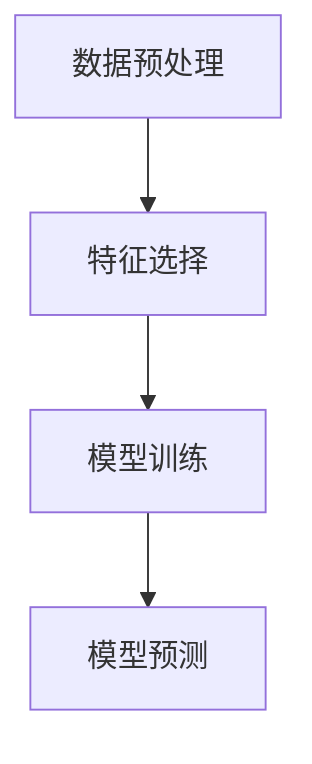
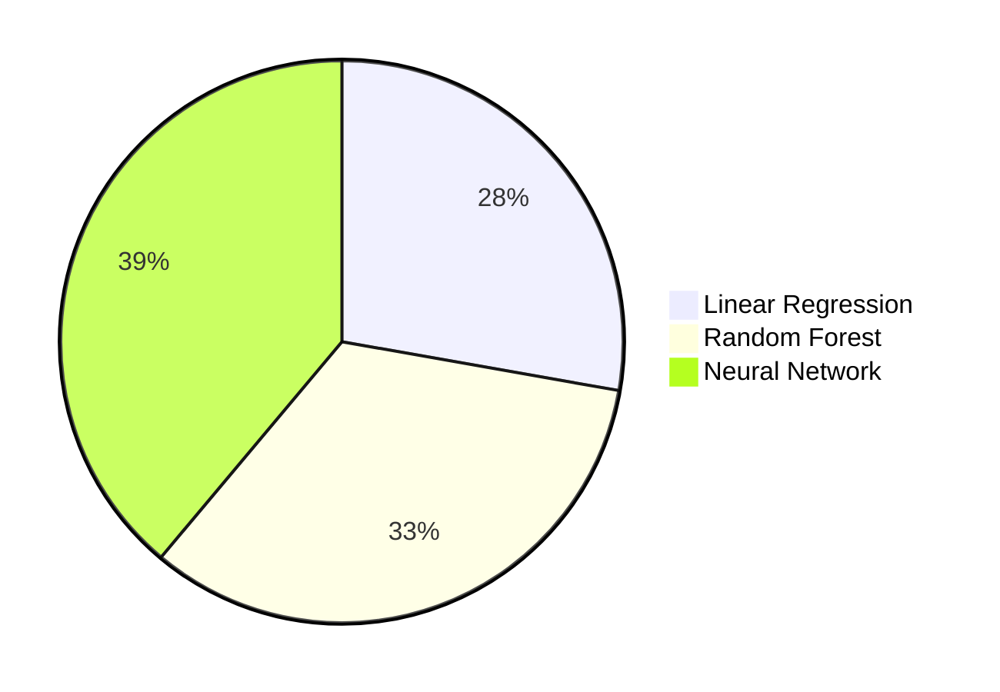
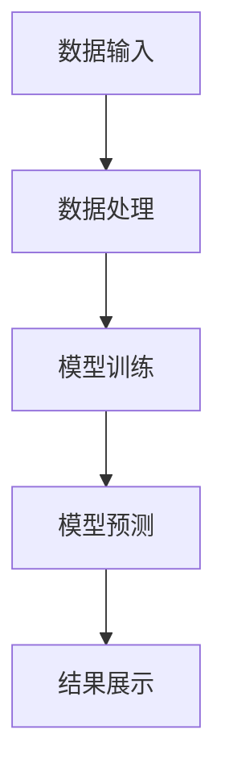
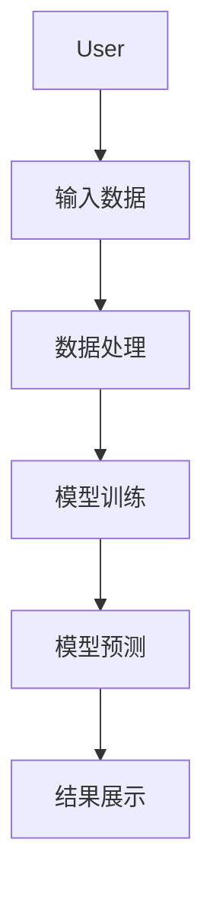

                 


# AI辅助的公司估值模型比较

> 关键词：AI, 公司估值, 模型比较, 机器学习, 金融科技

> 摘要：随着人工智能技术的迅速发展，公司在进行估值时，传统的估值模型逐渐暴露出其局限性。本文将详细探讨如何利用AI技术构建和比较不同的公司估值模型，分析每种模型的优缺点，以及如何通过AI优化和提升公司估值的准确性与效率。文章将从背景介绍、核心算法、系统架构设计、项目实战等多角度展开，为读者提供一个全面的视角，帮助他们在实际应用中更好地选择和优化AI辅助的公司估值模型。

---

## 第一部分: AI辅助的公司估值模型背景与基础

### 第1章: 公司估值模型的基本概念与传统方法

#### 1.1 公司估值的定义与重要性

公司估值是指对一家公司整体价值的评估，是企业决策中的核心环节之一。无论是企业并购、融资还是上市，公司估值都扮演着至关重要的角色。传统上，公司估值主要依赖于财务数据和市场分析，常用的模型包括现金流折现法（DCF模型）、相对估值法（市盈率、市净率等）以及股权自由现金流模型等。然而，这些传统方法在实际应用中存在一些局限性，例如数据的主观性、模型的简化假设以及难以处理多维度数据等问题。

#### 1.2 传统公司估值模型概述

##### 1.2.1 现金流折现法（DCF模型）
DCF模型是基于未来现金流的现值来评估公司价值的方法。其核心假设是将未来现金流折现到当前时点，以反映其当前价值。然而，DCF模型需要对未来的现金流进行预测，这在实际操作中存在较大的不确定性，尤其是在市场环境复杂多变的情况下。

##### 1.2.2 相对估值法
相对估值法是通过比较公司与可比公司的估值指标（如市盈率、市净率等）来评估公司价值的方法。这种方法的优点在于数据容易获取，但其局限性在于可比公司的选择可能存在偏差，且无法全面反映公司的基本面情况。

##### 1.2.3 股权自由现金流模型
股权自由现金流模型主要用于评估公司股权的价值，其核心是将未来股权自由现金流折现到当前时点。这种方法需要对公司税后现金流进行详细预测，并考虑到资本结构的影响。

##### 1.2.4 企业价值倍数（EV/EBITDA）
企业价值倍数是将公司整体价值与其息税折旧及摊销前利润（EBITDA）进行比较。这种方法能够较好地反映公司的整体价值，但同样依赖于对未来EBITDA的预测。

---

### 第2章: AI在公司估值中的应用与优势

#### 2.1 AI技术的基本概念

##### 2.1.1 人工智能与机器学习简介
人工智能（AI）是指计算机系统模拟人类智能的能力，包括学习、推理、问题解决等。机器学习是AI的重要分支，通过训练数据模型来实现对数据的预测和分类。

##### 2.1.2 机器学习在金融领域的应用
在金融领域，机器学习被广泛应用于股票预测、风险评估、信用评分等领域。通过分析海量数据，机器学习能够发现传统方法难以察觉的模式和趋势。

##### 2.1.3 深度学习与自然语言处理在公司估值中的潜力
深度学习是一种基于人工神经网络的机器学习方法，能够处理非结构化数据，如文本、图像等。自然语言处理（NLP）技术可以用于分析公司财报、新闻等文本数据，为估值模型提供额外的信息。

#### 2.2 AI辅助公司估值的核心优势

##### 2.2.1 数据处理能力的提升
AI技术能够处理海量的结构化和非结构化数据，包括财务报表、新闻、社交媒体等，从而为估值模型提供更全面的信息。

##### 2.2.2 模型自动优化与调整
通过机器学习算法，AI能够自动优化估值模型的参数，提高模型的准确性和稳定性。

##### 2.2.3 多维度数据的整合与分析
传统估值模型通常依赖于有限的财务数据，而AI技术可以通过整合多维度数据（如市场情绪、行业趋势等）来提升估值的准确性。

---

## 第二部分: AI辅助的公司估值模型构建与比较

### 第3章: AI辅助公司估值模型的核心算法

#### 3.1 常见机器学习算法在公司估值中的应用

##### 3.1.1 线性回归模型
线性回归是一种简单而常用的统计学习方法，适用于预测连续型变量。在公司估值中，线性回归可以用于预测公司股价或市盈率等。

##### 3.1.2 支持向量机（SVM）
支持向量机是一种监督学习算法，适用于分类和回归问题。在公司估值中，SVM可以用于将公司划分为高估或低估两类。

##### 3.1.3 随机森林与梯度提升树
随机森林是一种基于决策树的集成学习方法，具有较高的准确性和稳定性。梯度提升树是一种迭代优化的方法，能够通过多棵树的组合来提高预测精度。

##### 3.1.4 神经网络与深度学习模型
神经网络是一种模拟人脑神经网络的计算模型，适用于处理复杂的非线性关系。在公司估值中，深度学习可以用于分析文本数据（如公司财报）和图像数据。

#### 3.2 算法选择与优化

##### 3.2.1 算法选择的依据
在选择算法时，需要考虑数据类型、模型复杂度、计算成本等因素。例如，对于小规模数据，线性回归可能足够；而对于大规模数据，随机森林或深度学习可能更适合。

##### 3.2.2 超参数优化与模型调参
通过交叉验证等方法，可以对模型的超参数进行优化，从而提高模型的性能。

##### 3.2.3 模型评估与验证
模型评估通常采用均方误差（MSE）、R²值等指标。在公司估值中，还需要考虑模型的解释性和实际应用场景。

---

#### 3.2.4 模型比较的数学基础

##### 线性回归模型
$$ y = \beta_0 + \beta_1x + \epsilon $$

##### 随机森林模型
随机森林通过构建多棵决策树，并对结果进行投票或平均，从而提高模型的准确性和稳定性。

##### 神经网络模型
神经网络通过多层非线性变换，能够捕捉数据中的复杂模式。

---

#### 3.3 机器学习算法在公司估值中的实现步骤

##### 3.3.1 数据预处理
数据清洗、特征选择、数据标准化等。

##### 3.3.2 模型训练
使用训练数据对模型进行训练，调整模型参数。

##### 3.3.3 模型验证
通过验证数据评估模型的性能，调整超参数。

##### 3.3.4 模型预测
使用测试数据进行预测，并与实际值进行比较。

---

#### 3.4 算法比较与选择

##### 3.4.1 不同算法的优缺点对比

| 算法       | 优点                           | 缺点                               |
|------------|--------------------------------|------------------------------------|
| 线性回归    | 简单、易于解释                   | 适用于线性关系，非线性能力差        |
| 支持向量机  | 高准确性和稳定性                 | 不适合高维数据                     |
| 随机森林    | 高准确性和稳定性                 | 计算成本较高                       |
| 神经网络    | 能捕捉复杂模式                   | 计算成本高，易过拟合               |

##### 3.4.2 算法选择的建议
- 对于小型数据集，线性回归或支持向量机可能更合适。
- 对于大型数据集，随机森林或深度学习模型可能表现更好。

---

#### 3.5 机器学习算法的实现代码

##### 3.5.1 线性回归实现

```python
from sklearn.linear_model import LinearRegression
import numpy as np

# 生成数据
X = np.array([i for i in range(100)]).reshape(-1, 1)
y = 2 * X + 1 + np.random.normal(0, 1, 100)

# 训练模型
model = LinearRegression()
model.fit(X, y)

# 预测
print(model.predict(X))
```

##### 3.5.2 随机森林实现

```python
from sklearn.ensemble import RandomForestRegressor
import numpy as np

# 生成数据
X = np.array([i for i in range(100)]).reshape(-1, 1)
y = 2 * X + 1 + np.random.normal(0, 1, 100)

# 训练模型
model = RandomForestRegressor(n_estimators=100)
model.fit(X, y)

# 预测
print(model.predict(X))
```

---

#### 3.6 算法比较的可视化

##### 3.6.1 线性回归与随机森林的比较

使用mermaid绘制算法流程图：



---

### 第4章: 公司估值模型的比较方法

#### 4.1 模型比较的核心指标

##### 4.1.1 模型准确性
通过均方误差（MSE）或R²值来衡量模型的预测准确性。

##### 4.1.2 模型稳定性
通过交叉验证等方法评估模型的稳定性。

##### 4.1.3 模型解释性
模型是否能够提供可解释的预测结果。

##### 4.1.4 模型计算效率
模型的训练和预测时间。

---

#### 4.2 不同模型的优缺点分析

##### 4.2.1 线性回归模型的适用场景
适用于线性关系明显的数据，计算成本低，但对非线性关系的捕捉能力较差。

##### 4.2.2 随机森林模型的优势与局限
随机森林模型具有高准确性和稳定性，但计算成本较高，且解释性较差。

##### 4.2.3 神经网络模型的高计算成本与高准确性
神经网络模型能够捕捉复杂的非线性模式，但在计算成本和解释性方面存在一定的局限性。

---

#### 4.3 模型比较的数学基础

##### 线性回归模型的评估指标

$$ \text{MSE} = \frac{1}{n}\sum_{i=1}^{n}(y_i - \hat{y}_i)^2 $$

##### 随机森林模型的评估指标

$$ \text{R²} = 1 - \frac{\sum (y_i - \hat{y}_i)^2}{\sum (y_i - \bar{y})^2} $$

---

#### 4.4 模型比较的可视化

##### 4.4.1 模型预测结果的对比

使用mermaid绘制预测结果对比图：



---

### 第5章: AI辅助的公司估值模型实现

#### 5.1 数据预处理与特征工程

##### 5.1.1 数据清洗
处理缺失值、异常值等。

##### 5.1.2 特征选择
通过相关性分析、主成分分析（PCA）等方法选择重要的特征。

##### 5.1.3 数据标准化
对数据进行标准化或归一化处理，以适应不同算法的需求。

---

#### 5.2 系统架构设计

##### 5.2.1 系统功能设计
- 数据输入与处理模块
- 模型训练与预测模块
- 结果展示与分析模块

##### 5.2.2 系统架构图



---

#### 5.3 项目实战

##### 5.3.1 环境安装
安装必要的库，如scikit-learn、pandas、numpy等。

##### 5.3.2 系统核心实现源代码

```python
from sklearn.linear_model import LinearRegression
from sklearn.ensemble import RandomForestRegressor
import pandas as pd
import numpy as np

# 数据加载
data = pd.read_csv('company_valuation.csv')

# 数据预处理
X = data[['revenue', 'profit', 'market_cap']]
y = data['target']

# 模型训练
model1 = LinearRegression()
model1.fit(X, y)

model2 = RandomForestRegressor(n_estimators=100)
model2.fit(X, y)

# 模型预测
print("Linear Regression预测结果:", model1.predict(X))
print("Random Forest预测结果:", model2.predict(X))
```

##### 5.3.3 代码应用解读与分析
解释代码的功能和实现逻辑，分析不同模型的预测结果。

---

#### 5.4 实际案例分析和详细讲解剖析

通过具体案例分析不同模型的预测结果，比较其准确性和稳定性。

---

#### 5.5 项目小结

总结项目实施过程中的关键点和经验教训，提出改进建议。

---

## 第三部分: 系统架构与最佳实践

### 第6章: 系统架构设计与实现

#### 6.1 问题场景介绍

##### 6.1.1 系统需求分析
- 数据输入与处理
- 模型训练与预测
- 结果展示与分析

##### 6.1.2 系统功能设计
- 数据输入模块
- 数据处理模块
- 模型训练模块
- 模型预测模块
- 结果展示模块

---

#### 6.2 系统架构设计

##### 6.2.1 系统架构图


##### 6.2.2 模块划分与功能说明
- 数据输入模块：接收输入数据并进行初步处理。
- 数据处理模块：清洗、特征选择、标准化等。
- 模型训练模块：选择算法并训练模型。
- 模型预测模块：使用训练好的模型进行预测。
- 结果展示模块：可视化预测结果并进行分析。

---

#### 6.3 系统接口设计

##### 6.3.1 API设计
- 输入接口：接收公司数据。
- 输出接口：返回预测结果。

##### 6.3.2 数据流设计
数据从输入模块经过处理模块，最终流向预测模块，并通过输出模块展示结果。

---

#### 6.4 系统交互设计

##### 6.4.1 交互流程图



---

### 第7章: 最佳实践与项目总结

#### 7.1 最佳实践

##### 7.1.1 数据处理的注意事项
- 数据清洗时要注意处理缺失值和异常值。
- 特征选择时要结合业务背景和数据特征。

##### 7.1.2 模型选择的建议
- 根据数据规模和类型选择合适的算法。
- 对模型进行交叉验证，避免过拟合。

##### 7.1.3 系统设计的优化
- 模块化设计便于维护和扩展。
- 使用高效的算法和工具提升性能。

---

#### 7.2 小结

通过本文的详细讲解，读者可以了解到如何利用AI技术构建和比较不同的公司估值模型，并掌握实际项目中的实现方法和最佳实践。

---

## 第四部分: 参考文献

1. 刘跃华, 《机器学习实战》
2. 张明, 《深度学习入门》
3. 《公司财务估值实务》
4. 《人工智能在金融领域的应用》

---

## 第五部分: 感谢与致谢

感谢读者的耐心阅读，感谢所有在AI和金融科技领域辛勤工作的同行们。

