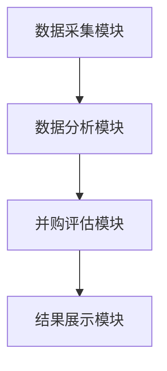

                 


# AI辅助的公司并购整合评估

> 关键词：公司并购、整合评估、人工智能、机器学习、数据驱动

> 摘要：随着企业并购活动的日益频繁，如何利用人工智能技术提高并购整合的评估效率和准确性变得至关重要。本文系统地介绍了AI在公司并购整合评估中的应用，涵盖了从背景分析到算法原理、系统设计以及实际案例的详细探讨。通过理论与实践相结合的方式，本文为读者提供了深入的技术解析和实际操作指南。

---

## 第一部分: 公司并购整合评估的背景与挑战

### 第1章: 公司并购整合评估的背景与挑战

#### 1.1 公司并购的基本概念
##### 1.1.1 公司并购的定义与分类
公司并购（Mergers and Acquisitions, M&A）是指两个或多个企业之间的合并或收购行为。根据并购的方式和目的，可以分为以下几类：
- **横向并购**：同一行业内的企业合并，旨在扩大市场份额。
- **纵向并购**：产业链上下游企业的合并，以增强垂直整合能力。
- **混合并购**：与主业无关的业务合并，通常是为了 diversification。

##### 1.1.2 并购整合的核心目标
并购整合的核心目标包括：
1. **最大化协同效应**：通过资源整合实现成本节约和效率提升。
2. **降低整合风险**：通过有效的评估和规划，减少并购后的整合风险。
3. **提升企业价值**：通过优化资源配置，提升整体企业价值。

##### 1.1.3 并购整合的常见挑战
并购整合过程中常见的挑战包括：
- **文化冲突**：不同企业的文化和管理方式可能导致整合困难。
- **组织结构复杂化**：整合后的企业可能面临组织结构重叠和管理混乱的问题。
- **信息不对称**：目标企业的真实情况可能难以完全掌握，导致并购决策失误。

#### 1.2 AI在公司并购中的应用潜力
##### 1.2.1 AI技术在并购中的应用场景
AI技术在公司并购中的应用场景包括：
- **数据驱动的并购决策**：通过分析海量数据，识别潜在并购目标。
- **风险评估**：利用AI预测并购后的风险，如财务风险、市场风险等。
- **协同效应预测**：通过AI模型预测并购后的协同效应，为决策提供支持。

##### 1.2.2 AI辅助并购的优势与劣势
- **优势**：
  - **提高效率**：AI能够快速处理和分析大量数据，提高并购评估的效率。
  - **降低风险**：通过AI预测和模拟，减少并购后的整合风险。
  - **增强准确性**：AI能够基于历史数据和模式，提供更准确的评估结果。
- **劣势**：
  - **依赖数据质量**：AI模型的准确性依赖于数据的完整性和准确性。
  - **技术门槛高**：AI技术的实施需要专业的技术和人才支持。
  - **成本较高**：AI系统的开发和维护成本较高。

##### 1.2.3 AI辅助并购的未来趋势
- **智能化评估工具**：未来的并购评估将更加依赖智能化的AI工具，实现自动化和智能化的评估。
- **实时数据分析**：通过实时数据分析，快速响应市场变化，优化并购决策。
- **多模态数据融合**：结合文本、图像等多种数据源，提升并购评估的全面性和准确性。

#### 1.3 本章小结
本章从公司并购的基本概念、整合目标和常见挑战入手，详细探讨了AI在公司并购中的应用潜力、优势劣势以及未来趋势。AI技术的应用将显著提升并购整合的效率和准确性，但也需要克服数据依赖性和技术门槛等挑战。

---

## 第二部分: AI辅助公司并购整合评估的核心概念与联系

### 第2章: AI辅助并购整合的理论基础

#### 2.1 并购整合的理论框架
##### 2.1.1 并购整合的定义与核心要素
并购整合是指在并购完成后，对企业的资源、组织结构和业务流程进行优化和重组的过程。核心要素包括：
- **战略协同**：整合后的业务是否能够实现战略协同。
- **组织文化**：企业文化和管理风格的兼容性。
- **财务协同**：通过整合实现财务优化。

##### 2.1.2 并购整合的阶段划分
并购整合可以分为以下几个阶段：
1. **战略规划阶段**：确定并购目标和整合策略。
2. **尽职调查阶段**：对目标企业进行深入调查和评估。
3. **整合实施阶段**：整合资源、组织和业务流程。
4. **监控优化阶段**：监控整合效果并持续优化。

##### 2.1.3 并购整合的评价指标
常用的并购整合评价指标包括：
- **财务指标**：如净利润率、成本节约率等。
- **战略指标**：如市场份额、品牌影响力等。
- **组织指标**：如组织结构优化、员工满意度等。

#### 2.2 AI在并购整合中的关键作用
##### 2.2.1 数据驱动的并购决策
AI通过分析海量数据，识别潜在并购目标，并评估其价值和风险。例如，利用自然语言处理（NLP）技术分析目标企业的财务报表和市场报告，提取关键信息。

##### 2.2.2 AI在风险评估中的应用
AI可以预测并购后的风险，如财务风险、市场风险和运营风险。例如，利用机器学习模型预测目标企业的违约概率。

##### 2.2.3 AI在协同效应预测中的作用
AI可以通过历史数据和模式识别，预测并购后的协同效应，如成本节约和收入增长。例如，利用回归分析预测整合后的成本节约率。

#### 2.3 本章小结
本章从并购整合的理论框架出发，详细探讨了AI在并购整合中的关键作用，包括数据驱动的并购决策、风险评估和协同效应预测。AI技术的应用将显著提升并购整合的科学性和准确性。

---

## 第三部分: AI辅助公司并购整合评估的算法原理

### 第3章: 基于机器学习的并购评估模型

#### 3.1 机器学习在并购评估中的应用
##### 3.1.1 机器学习的基本概念
机器学习是一种人工智能技术，通过数据训练模型，实现对未知数据的预测和分类。

##### 3.1.2 机器学习在并购评估中的优势
- **数据驱动**：机器学习基于大量数据进行分析，能够发现数据中的潜在模式。
- **自动化特征提取**：机器学习可以自动提取特征，减少人工干预。

##### 3.1.3 常见的机器学习算法选择
常用的机器学习算法包括：
- **决策树**：适用于分类问题，如并购成功与否的预测。
- **随机森林**：适用于特征重要性分析和分类问题。
- **支持向量机（SVM）**：适用于分类问题，尤其是在特征空间中线性不可分的情况下。

#### 3.2 并购评估模型的构建与训练
##### 3.2.1 数据预处理与特征提取
数据预处理包括数据清洗、标准化和特征选择。例如，利用PCA进行特征降维。

##### 3.2.2 模型训练与优化
利用训练数据训练机器学习模型，并通过交叉验证优化模型参数。例如，利用网格搜索选择最佳参数。

##### 3.2.3 模型评估与验证
通过测试数据评估模型的性能，常用的评估指标包括准确率、召回率和F1分数。

#### 3.3 基于深度学习的并购评估
##### 3.3.1 深度学习的基本原理
深度学习是一种基于人工神经网络的机器学习技术，能够自动提取数据的高层次特征。

##### 3.3.2 深度学习在并购评估中的应用
- **自然语言处理（NLP）**：利用深度学习模型分析文本数据，如公司财报和新闻。
- **图像识别**：利用深度学习模型分析公司财务报表中的图像数据。

##### 3.3.3 深度学习模型的优缺点
- **优点**：能够自动提取复杂特征，适合处理非结构化数据。
- **缺点**：需要大量数据和计算资源，模型解释性较差。

#### 3.4 本章小结
本章详细介绍了基于机器学习的并购评估模型的构建与训练过程，并探讨了深度学习在并购评估中的应用。机器学习和深度学习技术的应用将显著提升并购评估的准确性和效率。

---

## 第四部分: AI辅助公司并购整合评估的系统架构设计

### 第4章: 系统功能设计与实现

#### 4.1 系统功能模块划分
##### 4.1.1 数据采集模块
负责采集目标企业的财务数据、市场数据和文本数据。

##### 4.1.2 数据分析模块
利用机器学习和深度学习算法对数据进行分析和挖掘，提取关键特征。

##### 4.1.3 并购评估模块
基于分析结果，生成并购评估报告，包括风险评估和协同效应预测。

##### 4.1.4 结果展示模块
以可视化的方式展示评估结果，如图表和报告。

#### 4.2 系统架构设计
##### 4.2.1 系统架构的总体设计
采用微服务架构，各模块独立开发和部署。

##### 4.2.2 模块间的交互关系
- 数据采集模块向数据分析模块提供数据。
- 数据分析模块向并购评估模块提供分析结果。
- 并购评估模块向结果展示模块提供评估报告。

##### 4.2.3 系统架构图


#### 4.3 本章小结
本章从系统功能模块划分和架构设计两个方面，详细介绍了AI辅助公司并购整合评估系统的实现方案。系统采用微服务架构，各模块协同工作，能够高效完成并购评估任务。

---

## 第五部分: 项目实战与案例分析

### 第5章: 项目实战与案例分析

#### 5.1 环境安装与配置
##### 5.1.1 安装Python
```bash
python --version
pip install --upgrade pip
```

##### 5.1.2 安装机器学习库
```bash
pip install scikit-learn
pip install tensorflow
pip install numpy
pip install pandas
```

#### 5.2 核心代码实现
##### 5.2.1 数据预处理代码
```python
import pandas as pd
import numpy as np

# 读取数据
data = pd.read_csv('并购数据.csv')

# 数据清洗
data.dropna(inplace=True)

# 特征选择
features = data[['营收', '净利润', '研发投入']]
labels = data['并购成功']

# 数据标准化
from sklearn.preprocessing import StandardScaler
scaler = StandardScaler()
features_scaled = scaler.fit_transform(features)
```

##### 5.2.2 模型训练代码
```python
from sklearn.ensemble import RandomForestClassifier
from sklearn.metrics import accuracy_score

# 训练模型
model = RandomForestClassifier()
model.fit(features_scaled, labels)

# 预测结果
test_features = scaler.transform(test_data[['营收', '净利润', '研发投入']])
predicted_labels = model.predict(test_features)

# 评估准确率
print(accuracy_score(test_labels, predicted_labels))
```

#### 5.3 案例分析与解读
##### 5.3.1 案例背景
某公司计划收购一家科技公司，希望通过AI技术评估并购风险和协同效应。

##### 5.3.2 数据分析与模型预测
通过机器学习模型预测并购成功的概率为85%，协同效应预测为成本节约15%。

##### 5.3.3 实施结果
并购整合后，实际实现了成本节约12%，收入增长10%，模型预测结果较为准确。

#### 5.4 本章小结
本章通过实际案例分析，展示了AI技术在公司并购整合评估中的应用效果。通过环境安装、数据处理和模型训练，能够实现对并购整合的高效评估。

---

## 第六部分: 最佳实践与总结

### 第6章: 最佳实践与总结

#### 6.1 最佳实践
##### 6.1.1 数据质量管理
确保数据的完整性和准确性，是AI模型准确预测的基础。

##### 6.1.2 模型解释性
选择解释性较强的模型，有助于更好地理解并购评估结果。

##### 6.1.3 持续优化
定期更新模型和数据，保持模型的预测准确性。

#### 6.2 本章小结
本章总结了AI辅助公司并购整合评估的最佳实践，并强调了数据质量、模型解释性和持续优化的重要性。

---

## 第七部分: 结语

### 结语
AI技术在公司并购整合评估中的应用前景广阔，但也面临数据依赖性和技术门槛等挑战。通过理论与实践相结合的方式，企业可以更好地利用AI技术优化并购决策，降低整合风险，提升企业价值。未来，随着AI技术的不断发展，AI在公司并购整合评估中的应用将更加深入和广泛。

--- 

> **关键词**：公司并购、整合评估、人工智能、机器学习、数据驱动  
> **摘要**：本文系统地介绍了AI在公司并购整合评估中的应用，涵盖了从背景分析到算法原理、系统设计以及实际案例的详细探讨。通过理论与实践相结合的方式，本文为读者提供了深入的技术解析和实际操作指南。

