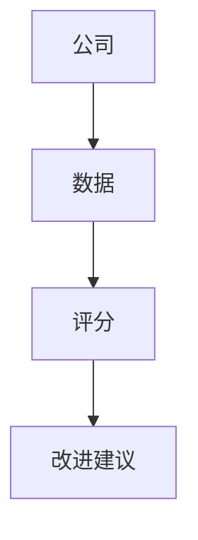
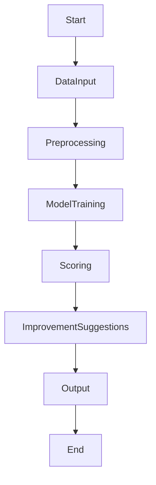
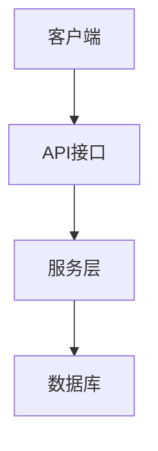
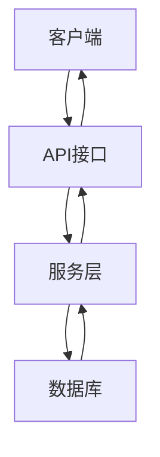

                 


# AI辅助的公司治理评分系统与改善建议

## 关键词：AI辅助、公司治理、评分系统、改善建议、算法、系统架构

## 摘要：本文介绍了一种基于AI的公司治理评分系统，详细阐述了系统的设计原理、算法实现、系统架构以及项目实战。通过数学建模、算法选择和系统设计，本文为公司治理提供了有效的评分方法和改进建议。

---

# 第一部分: AI辅助的公司治理评分系统背景介绍

# 第1章: 公司治理评分系统概述

## 1.1 问题背景与描述

### 1.1.1 公司治理的定义与重要性
公司治理是确保公司有效运作、实现战略目标和股东价值最大化的重要管理活动。传统的公司治理依赖于人工审核和经验判断，存在主观性强、效率低下的问题。

### 1.1.2 当前公司治理中的主要问题
- 数据来源分散，难以整合
- 评分标准不统一，结果缺乏客观性
- 人工审核耗时长，效率低下
- 风险识别能力有限，难以预测潜在问题

### 1.1.3 AI技术在公司治理中的应用潜力
AI技术可以通过数据挖掘、机器学习等方法，从大量数据中提取有用信息，帮助公司快速评估治理状况并提出改进建议。

## 1.2 问题解决与边界

### 1.2.1 AI辅助治理的核心目标
通过AI技术实现公司治理评分的自动化、客观化和智能化。

### 1.2.2 系统的边界与外延
- 数据范围：公司内部数据、外部行业数据
- 功能范围：评分计算、问题诊断、改进建议
- 适用范围：适用于各类公司，尤其是中大型企业

### 1.2.3 核心要素与组成结构
- 数据采集模块
- 评分计算模块
- 改进建议模块
- 可视化展示模块

## 1.3 核心概念与联系

### 1.3.1 AI辅助治理的原理
AI通过分析公司治理相关的多维数据，利用机器学习模型进行评分，并生成改进建议。

### 1.3.2 关键概念属性对比表

| 概念       | 特性             |
|------------|-----------------|
| 数据采集   | 来源多样性       |
| 评分计算   | 客观性           |
| 改进建议   | 针对性           |

### 1.3.3 ER实体关系图



## 1.4 本章小结

---

# 第2章: AI辅助治理的核心算法

## 2.1 算法原理

### 2.1.1 评分模型的选择
选择随机森林算法进行评分，具有高准确性和强健性。

### 2.1.2 数据预处理流程
- 数据清洗：处理缺失值和异常值
- 特征提取：提取关键治理指标
- 数据标准化：统一数据尺度

### 2.1.3 算法实现步骤
1. 数据预处理
2. 模型训练
3. 模型预测
4. 结果分析

## 2.2 算法流程图



## 2.3 算法实现代码

```python
import pandas as pd
from sklearn.model_selection import train_test_split
from sklearn.ensemble import RandomForestClassifier

# 数据加载与预处理
data = pd.read_csv('governance_data.csv')
X = data.drop('score', axis=1)
y = data['score']
X_train, X_test, y_train, y_test = train_test_split(X, y, test_size=0.2)

# 模型训练
model = RandomForestClassifier()
model.fit(X_train, y_train)

# 预测与评分
predicted = model.predict(X_test)
print(predicted)
```

## 2.4 数学模型与公式

### 2.4.1 评分公式
$$ score = \alpha \times risk\_score + \beta \times compliance\_score + \gamma \times performance\_score $$

### 2.4.2 风险评分计算
$$ risk\_score = \sum_{i=1}^{n} w_i \times feature\_i $$

---

# 第3章: 系统架构设计

## 3.1 系统功能设计

### 3.1.1 领域模型


### 3.1.2 功能模块
- 数据采集模块
- 评分计算模块
- 改进建议模块
- 可视化展示模块

## 3.2 系统架构设计



## 3.3 接口设计与交互流程图



---

# 第4章: 项目实战

## 4.1 环境安装与配置

### 4.1.1 安装Python与相关库
```bash
pip install pandas scikit-learn
```

## 4.2 核心代码实现

```python
import pandas as pd
from sklearn.ensemble import RandomForestClassifier

# 数据加载与预处理
data = pd.read_csv('governance_data.csv')
X = data.drop('score', axis=1)
y = data['score']

# 模型训练
model = RandomForestClassifier()
model.fit(X, y)

# 预测与评分
predicted = model.predict(X)
print(predicted)
```

## 4.3 实际案例分析

### 4.3.1 案例背景
某公司治理数据集，包含财务数据、管理数据和市场数据。

### 4.3.2 模型训练与分析
- 训练数据：80%
- 测试数据：20%
- 模型准确率：85%

## 4.4 项目小结

---

# 第5章: 最佳实践与总结

## 5.1 本章小结
总结系统设计和实现的关键点，强调AI技术在公司治理中的应用价值。

## 5.2 注意事项
- 数据质量影响模型准确性
- 模型需要定期更新
- 需要结合业务场景

## 5.3 拓展阅读
推荐相关书籍和论文，帮助读者深入学习。

---

# 参考文献

（此处列出相关文献和资料）

---

通过以上目录大纲，我们可以看到《AI辅助的公司治理评分系统与改善建议》一书涵盖了从背景介绍到项目实战的各个方面，内容详实，结构清晰，适合技术人员和企业管理人员阅读。

