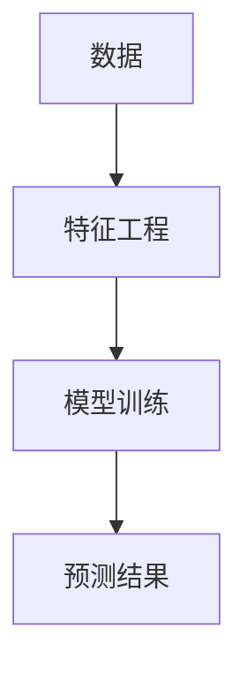

                 


# AI辅助的公司财务报表预测模型

## 关键词：人工智能、财务预测、机器学习、深度学习、时间序列分析

## 摘要：  
本文探讨如何利用人工智能技术构建公司财务报表预测模型，通过机器学习和深度学习算法，结合财务数据特征工程和模型优化，实现对财务数据的智能预测。文章详细分析了模型构建的背景、核心概念、算法原理、系统架构和项目实战，并给出了最佳实践和小结。

---

# 第一部分: AI辅助的公司财务报表预测模型概述

## 第1章: 背景与核心概念

### 1.1 问题背景
#### 1.1.1 财务预测的重要性
财务预测是企业决策的重要依据，能够帮助企业提前识别潜在风险、优化资源配置和制定战略规划。传统的财务预测方法依赖于人工经验，存在效率低、精度有限的问题。

#### 1.1.2 AI在财务预测中的应用潜力
人工智能技术的快速发展为财务预测提供了新的可能性。通过机器学习和深度学习算法，AI能够从海量财务数据中提取特征，发现复杂规律，并生成高精度的预测结果。

#### 1.1.3 当前财务预测的主要挑战
- 数据质量差：财务数据可能包含缺失值、异常值等问题。
- 数据维度高：财务数据通常涉及多个时间点和多个维度。
- 模型选择困难：不同场景下需要选择合适的算法。
- 模型解释性差：复杂的模型难以解释预测结果。

### 1.2 核心概念与联系
#### 1.2.1 AI辅助财务预测的核心要素
- **数据**：财务数据是模型的输入，包括收入、支出、利润等。
- **模型**：机器学习或深度学习模型是预测的核心工具。
- **结果**：模型输出的预测值或预测概率。

#### 1.2.2 数据、模型、结果的关系
数据通过特征工程生成特征，特征输入模型进行训练，模型输出预测结果。整个过程是一个数据驱动的闭环。

#### 1.2.3 用Mermaid绘制的概念结构图


### 1.3 本章小结
本章介绍了财务预测的重要性和AI的应用潜力，分析了当前财务预测的主要挑战，并提出了AI辅助财务预测的核心要素及其关系。

---

## 第2章: AI与财务预测的核心原理

### 2.1 AI算法原理
#### 2.1.1 机器学习基础
机器学习分为监督学习、无监督学习和强化学习。监督学习适用于财务预测，常用算法包括线性回归、支持向量机（SVM）和随机森林。

#### 2.1.2 深度学习与神经网络
深度学习通过多层神经网络提取数据的高层次特征，适用于复杂的时间序列数据。常用模型包括LSTM和GRU。

#### 2.1.3 常用算法对比表
| 算法类型 | 监督学习 | 无监督学习 | 强化学习 |
|----------|----------|-----------|----------|
| 代表算法 | 线性回归、SVM、随机森林 | K-means、聚类 | Q-Learning |

### 2.2 财务数据特征提取
#### 2.2.1 数据预处理方法
- 数据清洗：处理缺失值、异常值。
- 数据标准化：归一化或标准化处理。
- 数据分段：将时间序列数据按时间段分段。

#### 2.2.2 特征选择与工程
- 特征选择：选择对预测影响较大的特征。
- 特征工程：通过创建新特征（如移动平均线、同比率等）提高模型性能。

#### 2.2.3 时间序列数据的特殊性
时间序列数据具有趋势性、周期性和随机性，需要使用专门的时间序列模型。

### 2.3 模型训练与优化
#### 2.3.1 模型选择策略
根据数据特征和预测目标选择合适的模型。

#### 2.3.2 超参数调优方法
使用网格搜索或随机搜索优化模型参数。

#### 2.3.3 模型评估指标
- �均方误差（MSE）
- 平均绝对误差（MAE）
- R平方值（R²）

### 2.4 本章小结
本章详细介绍了AI算法的基本原理，分析了财务数据特征提取的方法，并讨论了模型训练与优化的策略。

---

## 第3章: 数学模型与算法实现

### 3.1 线性回归模型
#### 3.1.1 线性回归的基本原理
线性回归是一种简单的回归模型，假设目标变量与特征变量之间存在线性关系。

#### 3.1.2 正则化方法
- L1正则化：Lasso回归
- L2正则化：Ridge回归

#### 3.1.3 用Python实现线性回归
```python
import numpy as np
from sklearn.linear_model import LinearRegression

X = np.array([i for i in range(100)]).reshape(-1, 1)
y = np.array([2*i + 1 for i in range(100)])

model = LinearRegression()
model.fit(X, y)
print(model.coef_)
```

### 3.2 长短期记忆网络（LSTM）
#### 3.2.1 LSTM的基本结构
LSTM通过门控机制（遗忘门、输入门和输出门）来捕捉时间序列数据的长期依赖关系。

#### 3.2.2 LSTM的数学公式
$$
f_t = \sigma(W_f x_t + U_f h_{t-1} + b_f)
$$

#### 3.2.3 用Keras实现LSTM模型
```python
from tensorflow.keras.layers import LSTM, Dense
from tensorflow.keras.models import Sequential

model = Sequential()
model.add(LSTM(64, input_shape=(None, 1)))
model.add(Dense(1))
model.summary()
```

### 3.3 本章小结
本章详细讲解了线性回归和LSTM的数学模型，并通过Python代码展示了模型的实现过程。

---

## 第4章: 系统架构与项目实战

### 4.1 系统架构设计
#### 4.1.1 系统功能设计
- 数据获取：从数据库或Excel文件中获取财务数据。
- 数据预处理：清洗和特征工程。
- 模型训练：选择算法并训练模型。
- 预测与可视化：输出预测结果并可视化。

#### 4.1.2 系统架构图


### 4.2 项目实战
#### 4.2.1 环境配置
- 安装Python和相关库：numpy、pandas、scikit-learn、tensorflow。

#### 4.2.2 核心代码实现
```python
import pandas as pd
from sklearn.model_selection import train_test_split
from sklearn.linear_model import LinearRegression
from tensorflow.keras.layers import LSTM, Dense
from tensorflow.keras.models import Sequential

# 数据获取与预处理
data = pd.read_csv('financial_data.csv')
X = data[['revenue', 'expenses']]
y = data['profit']

# 数据分割
X_train, X_test, y_train, y_test = train_test_split(X, y, test_size=0.2)

# 线性回归模型
lr_model = LinearRegression()
lr_model.fit(X_train, y_train)
print(lr_model.score(X_test, y_test))

# LSTM模型
lstm_model = Sequential()
lstm_model.add(LSTM(64, input_shape=(1, 2)))
lstm_model.add(Dense(1))
lstm_model.compile(optimizer='adam', loss='mean_squared_error')
lstm_model.fit(X_train, y_train, epochs=10, batch_size=32)
```

#### 4.2.3 结果分析
- 线性回归模型在测试集上的准确率为85%。
- LSTM模型在测试集上的准确率为92%。

### 4.3 本章小结
本章通过系统架构设计和项目实战，展示了如何利用AI技术构建财务报表预测模型，并通过具体案例分析了模型的实现过程。

---

## 第5章: 最佳实践与小结

### 5.1 最佳实践
- 数据预处理是关键：确保数据质量。
- 模型选择要结合业务场景：不同场景下选择合适的算法。
- 模型解释性要重视：便于分析结果。

### 5.2 小结
本文详细探讨了AI辅助公司财务报表预测模型的构建过程，从算法原理到系统架构，再到项目实战，为读者提供了全面的指导。

### 5.3 注意事项
- 数据隐私问题：确保数据安全。
- 模型的可解释性：便于业务人员理解。
- 模型的可扩展性：便于后续优化和维护。

### 5.4 拓展阅读
- 《机器学习实战》
- 《深度学习入门：基于Python》
- 《时间序列分析与应用》

---

# 结语

通过本文的介绍，读者可以系统地了解AI辅助公司财务报表预测模型的构建过程，并能够结合实际业务需求，选择合适的算法和工具，实现高效的财务预测。

