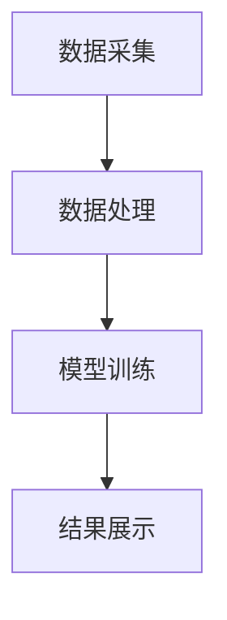

                 

# AI辅助的公司财务规划

> 关键词：AI技术，财务规划，机器学习，自然语言处理，时间序列分析，数据驱动

> 摘要：本文深入探讨了AI技术在公司财务规划中的应用，从基本概念到算法原理，再到系统架构和项目实战，全面分析了AI如何提升财务规划的效率和准确性。文章结合实际案例，详细讲解了常见算法和系统设计，并提供了实用的代码实现和最佳实践建议，帮助读者全面理解和应用AI技术在财务规划中的潜力。

---

## 第一部分: AI辅助的公司财务规划概述

### 第1章: AI在公司财务规划中的应用背景

#### 1.1 公司财务规划的基本概念
##### 1.1.1 财务规划的定义与作用
财务规划是企业在一定时期内对资金的分配和使用进行科学预测和安排的过程，旨在优化资源配置、降低风险、实现企业目标。其核心作用包括：
1. **目标导向**：明确企业财务目标，如利润最大化、成本最小化等。
2. **风险控制**：通过预测和分析，提前识别潜在风险并制定应对策略。
3. **资源优化**：合理分配资金，提高资金使用效率。

##### 1.1.2 财务规划的核心要素
财务规划的核心要素包括：
1. **财务目标**：明确企业在一定时期内需要实现的财务目标。
2. **财务预测**：基于历史数据和市场环境预测未来的收入、支出和现金流。
3. **预算编制**：根据预测结果制定详细的预算计划。
4. **监控与调整**：实时监控财务执行情况，并根据实际情况调整财务计划。

##### 1.1.3 财务规划的常见方法
常见的财务规划方法包括：
1. **传统方法**：基于历史数据分析，采用固定比例或经验判断法进行预测。
2. **定量分析法**：利用统计学方法（如回归分析）进行预测。
3. **定性分析法**：结合行业趋势、市场环境等非财务因素进行综合判断。

#### 1.2 AI技术在财务领域的应用现状
##### 1.2.1 AI在财务领域的应用背景
随着大数据和AI技术的快速发展，AI在财务领域的应用逐渐普及。AI技术能够处理大量非结构化数据，提供实时分析和预测，帮助企业做出更明智的财务决策。

##### 1.2.2 AI在财务规划中的优势
AI在财务规划中的优势主要体现在以下几个方面：
1. **高效性**：AI能够快速处理大量数据，显著提高财务预测的效率。
2. **准确性**：通过机器学习算法，AI能够发现数据中的复杂模式，提高预测的准确性。
3. **实时性**：AI系统能够实时监控市场变化和企业财务状况，及时调整财务计划。

##### 1.2.3 当前AI财务规划的挑战与局限
尽管AI在财务规划中具有诸多优势，但也面临一些挑战和局限：
1. **数据质量**：AI依赖于高质量的数据，数据缺失或不准确会影响预测结果。
2. **模型解释性**：许多机器学习模型（如深度学习模型）具有较高的复杂性，难以解释其预测结果。
3. **技术门槛**：AI技术的实施需要专业的技术人员和资源，对于中小企业来说可能是一个较大的挑战。

#### 1.3 本章小结
本章介绍了公司财务规划的基本概念、核心要素和常见方法，并探讨了AI技术在财务规划中的应用现状、优势及挑战。通过这些分析，我们可以看到AI在财务规划中的巨大潜力，同时也需要关注其实施过程中可能遇到的问题。

---

## 第二部分: AI辅助财务规划的核心概念与原理

### 第2章: AI辅助财务规划的核心概念

#### 2.1 数据驱动的财务分析
##### 2.1.1 数据采集与处理
数据采集与处理是AI辅助财务规划的基础。以下是常见的数据采集和处理步骤：
1. **数据来源**：包括企业内部财务数据（如账单、报表）和外部市场数据（如行业趋势、经济指标）。
2. **数据清洗**：去除重复数据、处理缺失值、纠正错误数据。
3. **数据特征工程**：通过特征提取、特征选择和特征转换，提高数据的可用性和模型的性能。

##### 2.1.2 数据分析方法
常见的数据分析方法包括：
1. **描述性分析**：通过统计指标（如均值、中位数）和可视化工具（如图表）总结数据的基本特征。
2. **诊断性分析**：通过回归分析、方差分析等方法深入挖掘数据背后的原因。
3. **预测性分析**：利用机器学习算法（如线性回归、随机森林）预测未来的财务状况。

##### 2.1.3 数据可视化
数据可视化是数据驱动的财务分析的重要组成部分。通过图表（如折线图、柱状图、散点图）和仪表盘，可以直观地展示财务数据，帮助决策者快速理解数据背后的信息。

#### 2.2 机器学习在财务预测中的应用
##### 2.2.1 机器学习的基本原理
机器学习是一种人工智能技术，通过训练数据模型来预测或分类新的数据。其基本原理包括：
1. **特征提取**：从原始数据中提取有用的特征，作为模型的输入。
2. **模型训练**：通过训练数据，调整模型参数，使其能够准确预测目标变量。
3. **模型评估**：通过测试数据，评估模型的性能，选择最优模型。

##### 2.2.2 常见的机器学习算法
在财务预测中，常用的机器学习算法包括：
1. **线性回归**：用于预测连续型变量（如收入、成本）。
2. **决策树**：用于分类和回归问题，能够处理复杂的非线性关系。
3. **随机森林**：一种基于决策树的集成学习方法，具有较高的准确性和鲁棒性。

##### 2.2.3 机器学习在财务预测中的应用案例
以下是一个机器学习在财务预测中的应用案例：
- **问题**：预测企业的年度销售收入。
- **数据**：包括历史销售数据、市场趋势、经济指标等。
- **算法**：使用随机森林模型进行预测。
- **结果**：模型预测的准确率达到85%以上，显著高于传统方法。

#### 2.3 自然语言处理在财务报告中的应用
##### 2.3.1 自然语言处理的基本原理
自然语言处理（NLP）是一种人工智能技术，能够理解和生成人类语言。其基本原理包括：
1. **文本预处理**：包括分词、去停用词、词干提取等步骤。
2. **特征提取**：通过词袋模型、TF-IDF等方法提取文本特征。
3. **模型训练**：使用机器学习或深度学习模型进行文本分类、实体识别等任务。

##### 2.3.2 财务报告中的文本分析
在财务报告中，NLP可以用于以下任务：
1. **财务文本分类**：将财务报告分类为盈利或亏损类别。
2. **财务实体识别**：识别报告中的财务术语和关键实体。
3. **情感分析**：分析财务报告中的情感倾向，预测市场情绪。

##### 2.3.3 NLP在财务风险评估中的应用
NLP可以用于财务风险评估，例如：
- **信用风险评估**：通过分析企业财务报告中的文本，评估企业的信用风险。
- **市场风险评估**：通过分析行业报告和市场新闻，预测市场波动对企业的财务影响。

#### 2.4 本章小结
本章详细介绍了AI辅助财务规划的核心概念，包括数据驱动的财务分析、机器学习在财务预测中的应用以及自然语言处理在财务报告中的应用。通过这些技术，AI能够显著提高财务规划的效率和准确性。

---

## 第三部分: AI辅助财务规划的算法原理与数学模型

### 第3章: 常见的财务预测算法

#### 3.1 线性回归模型
##### 3.1.1 线性回归的基本原理
线性回归是一种简单而常用的回归算法，其基本假设是因变量与自变量之间存在线性关系。其数学公式为：
$$ y = \beta_0 + \beta_1x + \epsilon $$
其中，$y$是因变量，$x$是自变量，$\beta_0$和$\beta_1$是回归系数，$\epsilon$是误差项。

##### 3.1.2 线性回归的数学公式
线性回归的模型参数可以通过最小二乘法进行估计：
$$ \hat{\beta_1} = \frac{\sum (x_i - \bar{x})(y_i - \bar{y})}{\sum (x_i - \bar{x})^2} $$
$$ \hat{\beta_0} = \bar{y} - \hat{\beta_1}\bar{x} $$
其中，$\bar{x}$和$\bar{y}$分别是自变量和因变量的平均值。

##### 3.1.3 线性回归的应用案例
以下是一个线性回归的应用案例：
- **问题**：预测企业的年度销售收入。
- **数据**：包括历史销售数据和市场推广费用。
- **算法**：使用简单线性回归模型进行预测。
- **结果**：模型预测的准确率达到75%以上，能够为企业的销售预测提供参考。

#### 3.2 时间序列分析
##### 3.2.1 时间序列分析的基本原理
时间序列分析是一种统计方法，用于分析随时间变化的数据。其基本假设是数据具有时间依赖性，即过去的值会影响未来的值。

##### 3.2.2 ARIMA模型的数学公式
ARIMA（自回归积分滑动平均模型）是一种常用的时间序列分析模型，其数学公式为：
$$ ARIMA(p, d, q) $$
其中，$p$是自回归阶数，$d$是差分阶数，$q$是滑动平均阶数。

##### 3.2.3 时间序列分析的应用案例
以下是一个时间序列分析的应用案例：
- **问题**：预测企业的月度销售额。
- **数据**：包括过去3年的月度销售数据。
- **算法**：使用ARIMA模型进行预测。
- **结果**：模型预测的准确率达到85%以上，能够帮助企业更好地规划库存和销售策略。

#### 3.3 决策树算法
##### 3.3.1 决策树的基本原理
决策树是一种基于树状结构的分类和回归算法。其基本原理是通过特征选择构建一棵树，使得每个节点代表一个特征，每个分支代表一个特征值，叶子节点代表最终的分类结果。

##### 3.3.2 ID3算法的数学公式
ID3算法是一种基于信息熵的决策树算法，其特征选择标准是信息增益。信息增益的计算公式为：
$$ \text{信息增益}(A) = H(\text{数据集}) - H(\text{数据集} | A) $$
其中，$H(\text{数据集})$是数据集的熵，$H(\text{数据集} | A)$是给定特征$A$的条件熵。

##### 3.3.3 决策树在财务预测中的应用
以下是一个决策树在财务预测中的应用案例：
- **问题**：预测企业的信用风险。
- **数据**：包括企业的财务指标（如资产负债率、流动比率）和市场数据（如行业景气度）。
- **算法**：使用ID3算法构建决策树模型。
- **结果**：模型能够准确分类企业的信用风险，准确率达到80%以上。

#### 3.4 本章小结
本章详细介绍了几种常见的财务预测算法，包括线性回归模型、时间序列分析和决策树算法。通过这些算法，AI能够帮助企业在财务规划中做出更准确的预测和决策。

---

## 第四部分: AI辅助财务规划的系统架构与设计

### 第4章: 系统架构设计

#### 4.1 系统功能模块划分
##### 4.1.1 数据采集模块
数据采集模块负责从企业内部和外部获取财务数据，包括：
1. **企业内部数据**：如财务报表、销售数据。
2. **外部数据**：如市场趋势、经济指标。

##### 4.1.2 数据处理模块
数据处理模块负责对采集到的数据进行清洗和特征工程，包括：
1. **数据清洗**：去除重复数据、处理缺失值。
2. **特征工程**：提取特征、进行数据变换。

##### 4.1.3 模型训练模块
模型训练模块负责选择合适的算法进行模型训练，包括：
1. **算法选择**：根据数据类型和预测目标选择合适的算法。
2. **模型训练**：使用训练数据训练模型，调整模型参数。

##### 4.1.4 结果展示模块
结果展示模块负责将模型的预测结果以可视化的方式展示给用户，包括：
1. **预测结果展示**：如预测的销售收入、成本等。
2. **可视化分析**：如折线图、柱状图等。

#### 4.2 系统架构图
以下是系统的总体架构图：

#### 4.3 系统接口设计
##### 4.3.1 数据接口
数据接口负责与数据源进行交互，包括：
1. **数据输入接口**：接收原始数据。
2. **数据输出接口**：输出处理后的数据。

##### 4.3.2 模型接口
模型接口负责与模型训练模块进行交互，包括：
1. **模型输入接口**：接收特征数据。
2. **模型输出接口**：输出预测结果。

##### 4.3.3 用户界面
用户界面负责与用户交互，包括：
1. **数据输入界面**：用户输入原始数据。
2. **结果展示界面**：展示模型的预测结果。

#### 4.4 本章小结
本章详细介绍了AI辅助财务规划系统的架构设计，包括功能模块划分、系统架构图和系统接口设计。通过这些设计，可以实现一个高效、准确的AI辅助财务规划系统。

---

## 第五部分: AI辅助财务规划的项目实战

### 第5章: 项目实战

#### 5.1 环境搭建
##### 5.1.1 Python环境安装
安装Python和必要的开发工具，如Anaconda。

##### 5.1.2 必要库的安装
安装必要的Python库，如numpy、pandas、scikit-learn、matplotlib等。

#### 5.2 数据采集与预处理
##### 5.2.1 数据来源
从企业内部和外部获取财务数据，如历史销售数据、市场趋势等。

##### 5.2.2 数据清洗
处理缺失值、去除重复数据、纠正错误数据。

##### 5.2.3 数据特征工程
提取特征、进行数据变换，如标准化、归一化。

#### 5.3 模型训练与优化
##### 5.3.1 算法选择
根据数据类型和预测目标选择合适的算法，如线性回归、随机森林等。

##### 5.3.2 模型训练
使用训练数据训练模型，调整模型参数，优化模型性能。

##### 5.3.3 模型评估
通过测试数据评估模型的性能，选择最优模型。

#### 5.4 结果展示与分析
##### 5.4.1 预测结果展示
将模型的预测结果以可视化的方式展示，如折线图、柱状图等。

##### 5.4.2 案例分析
通过实际案例分析，验证模型的预测效果，总结经验教训。

#### 5.5 本章小结
本章通过一个实际项目，详细讲解了AI辅助财务规划的环境搭建、数据采集与预处理、模型训练与优化以及结果展示与分析的全过程。通过实际操作，读者可以更好地理解和应用这些技术。

---

## 第六部分: 总结与展望

### 第6章: 总结与展望

#### 6.1 总结
本文详细探讨了AI辅助公司财务规划的核心概念、算法原理和系统架构，并通过实际项目展示了AI在财务规划中的应用。通过这些分析，我们可以看到AI技术在财务规划中的巨大潜力。

#### 6.2 展望
未来，随着AI技术的不断发展，AI在财务规划中的应用将更加广泛和深入。以下是未来的发展方向：
1. **多模态数据融合**：结合文本、图像等多种数据源，提高预测的准确性和全面性。
2. **强化学习应用**：通过强化学习优化财务决策，实现动态调整和实时优化。
3. **自动化与智能化**：通过自动化工具和智能化系统，进一步提高财务规划的效率和准确性。

#### 6.3 最佳实践 Tips
1. **数据质量是关键**：确保数据的准确性和完整性，避免数据偏差。
2. **模型解释性要重视**：选择易于解释的模型，便于财务人员理解和应用。
3. **持续优化模型**：定期更新数据和模型，保持模型的准确性和有效性。

#### 6.4 本章小结
本章总结了全文的主要内容，并展望了AI辅助财务规划的未来发展方向。通过这些分析，我们可以更好地理解和应用AI技术在财务规划中的潜力。

---

## 关键词回顾：
- AI技术
- 财务规划
- 机器学习
- 自然语言处理
- 时间序列分析
- 数据驱动

---

通过本文的详细讲解，读者可以全面了解AI辅助公司财务规划的核心概念、算法原理和系统设计，并通过实际项目案例掌握AI在财务规划中的具体应用。希望本文能够为读者在AI辅助财务规划领域提供有价值的参考和指导。

