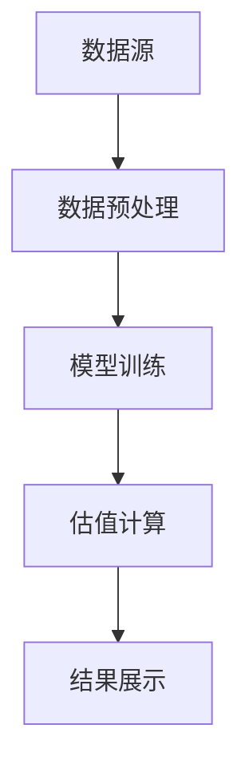
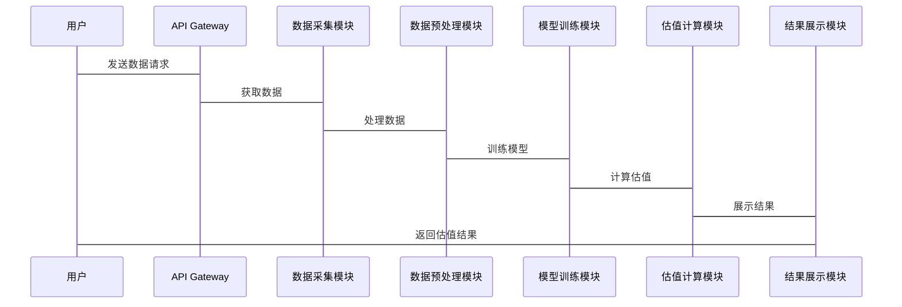

                 


# AI辅助的创业公司估值模型

## 关键词：
AI估值模型、创业公司估值、机器学习、深度学习、回归分析、系统架构、创业投资

## 摘要：
本文系统地探讨了如何利用人工智能技术构建创业公司估值模型，通过分析传统估值方法的局限性，介绍基于机器学习和深度学习的AI辅助估值模型的核心概念、算法原理、系统架构及实际应用。文章结合回归分析、神经网络等算法，详细阐述了模型的设计与实现，并通过实际案例展示了AI在创业公司估值中的巨大潜力。最后，本文总结了AI辅助估值模型的优势与挑战，并展望了未来的发展方向。

---

# 第一部分: AI辅助的创业公司估值模型概述

## 第1章: 创业公司估值模型的背景与挑战

### 1.1 创业公司估值的现状

#### 1.1.1 传统创业公司估值方法
传统的创业公司估值方法主要包括以下几种：
- **DCF模型（Discounted Cash Flow Model）**：通过预测未来现金流并将其折现至现值，计算公司价值。
- **可比交易法（Comparable Transactions）**：通过比较类似交易的市场定价，推导目标公司的估值。
- **贴现率法（Risk-Adjusted Discount Rate）**：基于公司风险调整贴现率，计算公司估值。

#### 1.1.2 当前估值模型的局限性
- 数据不完整：创业公司早期阶段数据有限，传统模型难以准确预测。
- 人工干预多：传统估值方法依赖大量人工判断，主观性强。
- 鲜活性差：市场环境变化快，传统模型难以及时更新。

#### 1.1.3 AI技术在估值中的潜在价值
- 数据处理能力强：AI能够处理大量非结构化数据，提取隐含信息。
- 自动化与实时性：AI模型可以实时更新，快速响应市场变化。
- 客观性与准确性：通过机器学习算法，减少人为干扰，提高估值准确性。

### 1.2 AI辅助估值的核心概念

#### 1.2.1 什么是AI辅助估值模型
AI辅助估值模型是基于机器学习算法，结合创业公司的基本面数据、市场数据和团队数据，构建数学模型，预测公司估值。

#### 1.2.2 模型的基本框架与要素
- **输入数据**：公司财务数据、市场数据、团队数据。
- **模型算法**：回归分析、神经网络、集成学习。
- **输出结果**：公司估值、不确定性分析、敏感性分析。

#### 1.2.3 模型的适用范围与边界
- 适用范围：早期创业公司、中后期创业公司。
- 边界条件：数据质量要求高，模型需要定期更新。

### 1.3 创业公司估值的关键因素

#### 1.3.1 公司基本面分析
- 收入与利润：公司财务数据。
- 成本结构：公司运营成本。
- 竞争优势：产品差异化、技术壁垒。

#### 1.3.2 市场环境与竞争分析
- 行业趋势：市场增长率、竞争格局。
- 宏观经济：GDP增长率、货币政策。
- 市场容量：目标市场规模（TAM）、可服务市场（SAM）、可实现市场（SOP）。

#### 1.3.3 创业团队与知识产权评估
- 团队能力：创始人经验、核心团队背景。
- 知识产权：专利数量、技术先进性。
- 产品路线图：产品开发计划、市场定位。

### 1.4 本章小结
本章介绍了传统创业公司估值方法的局限性，探讨了AI技术在估值中的潜在价值，提出了AI辅助估值模型的基本框架与要素，强调了模型的适用范围与边界条件。

---

# 第二部分: AI辅助估值模型的核心概念与原理

## 第2章: AI模型在估值中的作用

### 2.1 AI模型的基本原理

#### 2.1.1 机器学习与深度学习简介
- 机器学习：通过数据训练模型，使其具备某种任务的预测能力。
- 深度学习：基于人工神经网络的机器学习方法，能够自动提取数据特征。

#### 2.1.2 神经网络的基本结构
- 输入层：接收输入数据。
- 隐藏层：提取特征。
- 输出层：生成预测结果。

#### 2.1.3 深度学习在估值中的应用
- 使用神经网络提取公司数据的非线性特征。
- 利用卷积神经网络（CNN）处理图像数据。
- 使用循环神经网络（RNN）分析时间序列数据。

### 2.2 数据特征与模型选择

#### 2.2.1 数据特征的提取与处理
- 特征选择：从大量数据中选择对估值影响较大的特征。
- 数据标准化：对数据进行归一化处理。
- 数据增强：通过增加数据多样性提高模型鲁棒性。

#### 2.2.2 不同模型的适用场景
- 线性回归：适用于线性关系明显的数据。
- 支持向量机（SVM）：适用于小样本数据。
- 随机森林：适用于高维数据。

#### 2.2.3 模型性能评估指标
- 准确率：预测正确的比例。
- 召回率：真实为正被正确预测的比例。
- F1分数：综合准确率和召回率的指标。

### 2.3 AI模型与传统估值方法的对比

#### 2.3.1 传统估值方法的优缺点
- 优点：逻辑清晰，易于解释。
- 缺点：依赖人工判断，难以处理大量数据。

#### 2.3.2 AI模型的优势与局限性
- 优势：能够处理大量数据，提取非线性特征。
- 局限性：需要大量高质量数据，模型解释性较差。

#### 2.3.3 结合使用的效果分析
- 综合使用AI模型和传统方法，可以提高估值的准确性和全面性。

### 2.4 本章小结
本章详细介绍了AI模型的基本原理，探讨了数据特征与模型选择的关系，并分析了AI模型与传统估值方法的优缺点。

---

# 第三部分: AI辅助估值模型的算法原理

## 第3章: 基于回归分析的估值模型

### 3.1 线性回归原理

#### 3.1.1 线性回归的基本概念
线性回归是一种统计学习方法，用于建立因变量和自变量之间的线性关系。

#### 3.1.2 最小二乘法的数学推导
$$ \text{最小二乘法}：\hat{y} = \beta_0 + \beta_1x $$

其中，$\beta_0$ 是截距，$\beta_1$ 是回归系数，$x$ 是自变量，$\hat{y}$ 是预测值。

#### 3.1.3 线性回归的实现
```python
import numpy as np
from sklearn.linear_model import LinearRegression

# 示例数据
X = np.array([[1], [2], [3], [4], [5]])
y = np.array([2, 4, 5, 4, 6])

# 训练模型
model = LinearRegression()
model.fit(X, y)

# 预测结果
print(model.predict([[6]]))
```

### 3.2 线性回归的实现

#### 3.2.1 数据预处理与特征工程
- 数据清洗：处理缺失值、异常值。
- 特征工程：选择重要特征，进行特征变换。

#### 3.2.2 线性回归的Python实现
```python
import numpy as np
from sklearn.linear_model import LinearRegression

# 示例数据
X = np.array([[1], [2], [3], [4], [5]])
y = np.array([2, 4, 5, 4, 6])

# 训练模型
model = LinearRegression()
model.fit(X, y)

# 预测结果
print(model.predict([[6]]))
```

#### 3.2.3 模型评估与优化
- 均方误差（MSE）：预测值与实际值的平方差的平均值。
$$ \text{MSE} = \frac{1}{n}\sum_{i=1}^{n}(y_i - \hat{y}_i)^2 $$
- R平方值：模型解释能力的指标。
$$ R^2 = 1 - \frac{\text{残差平方和}}{\text{总平方和}} $$

### 3.3 非线性回归的应用

#### 3.3.1 多项式回归简介
多项式回归用于处理非线性关系，通过增加高次项来拟合数据。

#### 3.3.2 支持向量回归原理
支持向量回归是一种基于支持向量机的回归方法，适用于小样本数据。

#### 3.3.3 非线性回归的适用场景
- 数据呈现明显的非线性趋势。
- 数据量较小，适合使用复杂模型。

### 3.4 本章小结
本章详细介绍了线性回归和非线性回归的基本原理，探讨了它们在创业公司估值中的应用，并通过Python代码示例展示了模型的实现过程。

---

# 第四部分: AI辅助估值模型的系统架构与设计

## 第4章: 系统架构设计方案

### 4.1 系统功能模块划分

#### 4.1.1 数据采集模块
- 数据来源：公开数据、行业报告、公司财报。
- 数据类型：结构化数据（财务数据）和非结构化数据（文本数据）。

#### 4.1.2 模型训练模块
- 数据预处理：清洗数据，提取特征。
- 模型训练：使用机器学习算法训练模型。
- 模型优化：调整超参数，提高模型性能。

#### 4.1.3 估值计算模块
- 输入数据：公司基本面数据、市场数据、团队数据。
- 输出结果：公司估值、估值区间、敏感性分析。

#### 4.1.4 结果展示模块
- 可视化界面：展示估值结果、模型解释、数据来源。
- 报告生成：生成估值报告，包括数据来源、模型假设、估值结果。

### 4.2 系统架构设计

#### 4.2.1 系统功能模块划分


#### 4.2.2 系统架构设计
```mermaid
graph LR
    API Gateway --> A[数据采集模块]
    A --> B[数据预处理模块]
    B --> C[模型训练模块]
    C --> D[估值计算模块]
    D --> E[结果展示模块]
    E --> API Gateway
```

#### 4.2.3 系统交互流程


### 4.3 系统接口设计

#### 4.3.1 数据接口
- 数据输入接口：接收公司数据。
- 数据输出接口：返回处理后的数据。

#### 4.3.2 模型接口
- 模型训练接口：接收训练数据，返回训练好的模型。
- 模型预测接口：接收输入数据，返回预测结果。

### 4.4 本章小结
本章详细设计了AI辅助估值模型的系统架构，包括功能模块划分、系统架构图和系统交互流程图。

---

# 第五部分: AI辅助估值模型的项目实战

## 第5章: 项目实战

### 5.1 环境安装与数据准备

#### 5.1.1 环境安装
- 安装Python：建议使用Anaconda。
- 安装依赖库：numpy、pandas、scikit-learn、tensorflow。

#### 5.1.2 数据准备
- 数据来源：公开数据集、爬取数据。
- 数据清洗：处理缺失值、异常值。

### 5.2 系统核心实现

#### 5.2.1 数据预处理
```python
import pandas as pd
import numpy as np

# 加载数据
data = pd.read_csv('company_data.csv')

# 处理缺失值
data = data.dropna()

# 标准化处理
from sklearn.preprocessing import StandardScaler
scaler = StandardScaler()
scaled_data = scaler.fit_transform(data)
```

#### 5.2.2 模型训练
```python
from sklearn.linear_model import LinearRegression
from sklearn.metrics import mean_squared_error

# 训练模型
model = LinearRegression()
model.fit(X_train, y_train)

# 模型评估
y_pred = model.predict(X_test)
print('均方误差:', mean_squared_error(y_test, y_pred))
```

#### 5.2.3 估值计算与结果展示
```python
# 计算估值
valuation = model.predict(new_company_data)
print('公司估值:', valuation)
```

### 5.3 案例分析与结果解读

#### 5.3.1 实际案例分析
- 数据来源：假设一家创业公司A的数据。
- 模型训练：使用历史数据训练模型。
- 模型预测：预测公司A的估值。

#### 5.3.2 模型结果解读
- 估值结果：预测公司A的估值为1000万美元。
- 敏感性分析：公司收入对估值的影响最大。

### 5.4 本章小结
本章通过一个实际案例，详细展示了AI辅助估值模型的实现过程，包括环境安装、数据准备、模型训练和结果展示。

---

# 第六部分: 总结与展望

## 第6章: 总结与展望

### 6.1 本章总结
本文系统地探讨了AI辅助的创业公司估值模型，详细介绍了模型的核心概念、算法原理、系统架构和实际应用。通过回归分析、神经网络等算法，展示了模型的实现过程，并通过实际案例验证了模型的有效性。

### 6.2 未来展望
- 数据质量提升：开发更高效的数据清洗和特征提取方法。
- 模型优化：研究更复杂的深度学习模型，提高模型性能。
- 应用场景拓展：将模型应用于更多领域，如私募股权、风险投资。

### 6.3 最佳实践 Tips
- 数据是模型的核心，确保数据质量和多样性。
- 定期更新模型，适应市场变化。
- 结合传统方法，提高模型的解释性和实用性。

### 6.4 本章小结
本文总结了AI辅助估值模型的优势与挑战，并展望了未来的发展方向，为读者提供了宝贵的参考。

---

# 结语

通过本文的详细讲解，读者可以深入了解AI辅助的创业公司估值模型的核心原理和实际应用。希望本文能够为创业公司和投资者提供新的思路和工具，推动AI技术在创业投资领域的广泛应用。

