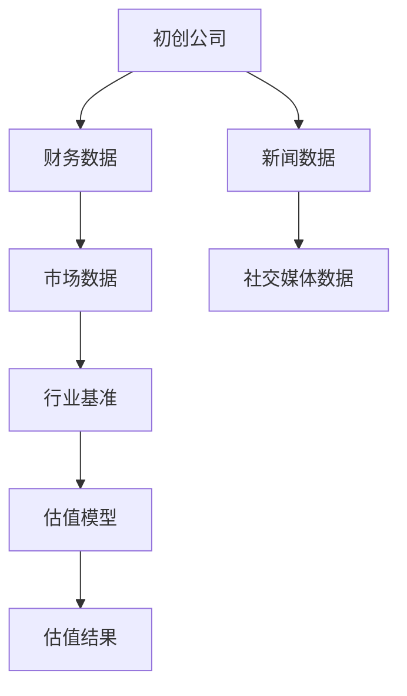
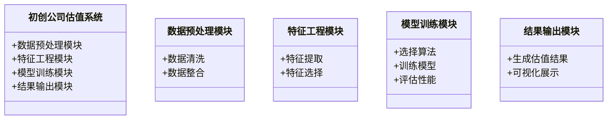
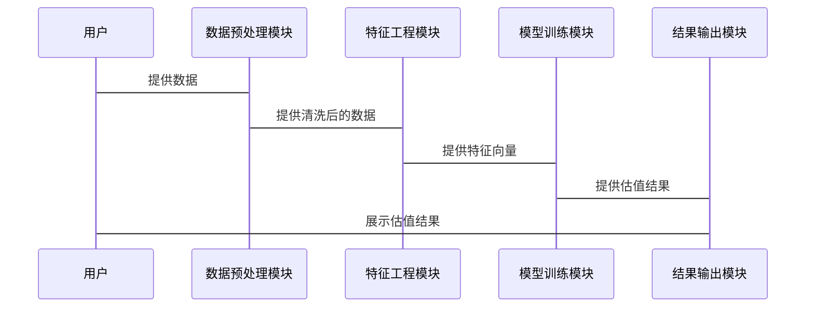

                 


# AI辅助的初创公司估值模型

## 关键词：AI，估值模型，初创公司，机器学习，数据分析

## 摘要：本文深入探讨了如何利用人工智能技术构建初创公司估值模型，通过数据分析、特征工程、机器学习算法和系统架构设计等步骤，展示如何实现动态、精准的估值模型，帮助投资者和企业家做出更明智的决策。

---

## 第1章：AI辅助初创公司估值模型的背景与问题背景

### 1.1 初创公司估值的挑战与痛点

#### 1.1.1 初创公司估值的传统方法与局限性
- 初创公司 valuation的传统方法主要包括DCF模型、可比公司分析、风险投资法等。
- 传统方法依赖于财务数据和市场经验，但数据稀缺性和非线性关系使得传统方法存在局限性。
- 初创公司具有高不确定性，传统方法难以捕捉其潜在价值。

#### 1.1.2 传统估值方法的不足与改进需求
- 数据稀疏性：初创公司早期阶段财务数据有限，难以直接应用传统估值方法。
- 非线性关系：公司价值可能与市场趋势、技术创新等因素高度相关，传统线性模型难以捕捉。
- 动态调整：市场环境变化快，传统方法难以快速调整估值模型。

#### 1.1.3 AI技术在估值中的潜在价值
- AI能够处理非结构化数据（如新闻、社交媒体数据），丰富估值数据来源。
- 机器学习可以发现数据中的非线性关系，提高估值模型的准确性。
- AI支持实时数据更新和动态调整，适合快速变化的市场环境。

### 1.2 问题背景与问题描述

#### 1.2.1 初创公司估值的核心问题
- 如何利用AI技术构建动态、精准的估值模型。
- 如何整合多源异构数据，丰富估值模型的数据基础。
- 如何处理数据稀疏性和非线性关系，提高模型的鲁棒性。

#### 1.2.2 数据稀疏性与非线性关系的挑战
- 数据稀疏性：初创公司早期数据不足，传统统计方法受限。
- 非线性关系：公司价值可能与多种因素的非线性组合相关，传统线性模型难以捕捉。
- 动态调整：市场变化快，需要实时更新模型参数。

#### 1.2.3 AI辅助估值的核心目标
- 提供动态、实时的估值结果，适应快速变化的市场环境。
- 利用多源数据，提高估值模型的准确性和全面性。
- 提供可解释的估值结果，满足用户对决策透明性的需求。

### 1.3 问题解决与边界定义

#### 1.3.1 AI辅助估值的核心目标
- 利用AI技术构建动态、精准的估值模型。
- 整合多源异构数据，丰富模型的数据基础。
- 处理数据稀疏性和非线性关系，提高模型鲁棒性。

#### 1.3.2 边界与外延：AI在估值中的适用范围
- 适用范围：初创公司的早期估值、动态调整、风险评估。
- 不适用范围：成熟公司的估值、市场整体趋势预测。

#### 1.3.3 初创公司估值模型的构成要素
- 数据来源：财务数据、市场数据、新闻数据、社交数据。
- 数据特征：公司规模、增长率、市场地位、行业趋势。
- 模型参数：算法选择、特征权重、模型调参。

### 1.4 核心概念与联系

#### 1.4.1 核心概念原理：AI辅助估值的流程与方法
- 数据收集：整合多源数据，构建丰富的数据集。
- 特征工程：提取关键特征，优化模型输入。
- 模型训练：选择合适的机器学习算法，训练估值模型。
- 模型评估：验证模型性能，调整参数优化结果。

#### 1.4.2 核心概念属性对比表格
| 对比维度 | 传统估值方法 | AI辅助估值方法 |
|----------|---------------|----------------|
| 数据来源 | 依赖财务数据 | 多源数据，包括文本、社交媒体 |
| 模型复杂度 | 线性模型为主 | 支持非线性关系，复杂模型 |
| 调整频率 | 低频调整 | 高频动态调整 |

#### 1.4.3 ER实体关系图架构（Mermaid流程图）


## 第2章：AI辅助估值的核心概念与联系

### 2.1 核心概念原理

#### 2.1.1 数据驱动的估值方法
- 数据驱动的估值方法利用大量数据和机器学习算法，而非传统的财务假设。
- 利用多源数据，如新闻、社交媒体、市场趋势等，构建更全面的估值模型。

#### 2.1.2 机器学习在估值中的应用
- 使用回归分析、随机森林、神经网络等机器学习算法，捕捉数据中的非线性关系。
- 利用特征工程提取关键指标，优化模型性能。

#### 2.1.3 AI模型的特征提取与非线性关系捕捉
- 特征提取：从多源数据中提取有用的特征，如情感分析、关键词提取。
- 非线性关系捕捉：通过复杂模型捕捉传统线性模型难以发现的关系。

### 2.2 核心概念属性对比

#### 2.2.1 传统估值方法与AI估值方法的对比
| 方法 | 传统估值方法 | AI辅助估值方法 |
|------|---------------|----------------|
| 数据来源 | 依赖财务数据 | 多源数据 |
| 模型复杂度 | 线性为主 | 支持非线性 |
| 调整频率 | 低频调整 | 高频动态调整 |

#### 2.2.2 数据特征与模型性能的对比
| 特征类型 | 传统特征 | AI增强特征 |
|----------|-----------|-------------|
| 财务指标 | 收入、利润 | 现金流、资本支出 |
| 市场指标 | 市盈率、市净率 | 市场趋势、行业指数 |
| 文本特征 | 无 | 新闻标题、社交媒体情绪 |

#### 2.2.3 不同AI模型的适用场景对比
| 模型类型 | 适用场景 |
|----------|-----------|
| 线性回归 | 线性关系明显 |
| 随机森林 | 非线性关系复杂 |
| 神经网络 | 高维数据、复杂模式 |

### 2.3 ER实体关系图架构（Mermaid流程图）


---

## 第3章：AI辅助估值的算法原理

### 3.1 算法原理概述

#### 3.1.1 机器学习在估值中的应用
- 机器学习模型可以捕捉传统方法难以发现的非线性关系。
- 特征工程和数据预处理是关键步骤，影响模型性能。

#### 3.1.2 算法选择与数据特征的关系
- 数据特征的类型和数量影响算法选择。
- 非线性数据适合随机森林、神经网络，线性数据适合线性回归。

#### 3.1.3 AI模型的训练与优化
- 划分训练集和测试集，验证模型性能。
- 使用交叉验证优化模型参数，防止过拟合。

---

## 4.1 算法原理与实现

### 4.1.1 线性回归算法原理与实现

#### 4.1.1.1 线性回归算法原理
- 线性回归模型假设因变量与自变量之间存在线性关系。
- 模型公式：$$ y = \beta_0 + \beta_1 x_1 + \beta_2 x_2 + ... + \beta_n x_n + \epsilon $$
- 目标是最小化预测值与实际值的平方差之和，即最小二乘法。

#### 4.1.1.2 线性回归算法实现（Python代码）
```python
import numpy as np
from sklearn.linear_model import LinearRegression
from sklearn.metrics import mean_squared_error

# 假设X为特征矩阵，y为标签
X = np.array([[1, 2], [3, 4], [5, 6]])
y = np.array([3, 7, 11])

# 训练模型
model = LinearRegression()
model.fit(X, y)

# 预测
y_pred = model.predict(X)
print("预测值:", y_pred)
print("均方误差:", mean_squared_error(y, y_pred))
```

#### 4.1.1.3 线性回归算法的优缺点
- 优点：简单易懂，计算高效。
- 缺点：仅能捕捉线性关系，难以处理复杂场景。

### 4.1.2 随机森林算法原理与实现

#### 4.1.2.1 随机森林算法原理
- 随机森林是一种集成学习方法，通过构建多棵决策树并行投票或平均预测结果。
- 模型公式：$$ y = \frac{1}{n} \sum_{i=1}^{n} t_i(x) $$
- 每棵树的特征选择采用袋装法，减少模型方差，提高泛化能力。

#### 4.1.2.2 随机森林算法实现（Python代码）
```python
from sklearn.ensemble import RandomForestRegressor

# 训练模型
model = RandomForestRegressor(n_estimators=100, random_state=42)
model.fit(X, y)

# 预测
y_pred = model.predict(X)
print("预测值:", y_pred)
print("均方误差:", mean_squared_error(y, y_pred))
```

#### 4.1.2.3 随机森林算法的优缺点
- 优点：能够处理非线性关系，鲁棒性好。
- 缺点：计算复杂度高，解释性较差。

### 4.1.3 神经网络算法原理与实现

#### 4.1.3.1 神经网络算法原理
- 神经网络是一种模仿人脑结构的深度学习模型，通过多层神经元连接和激活函数捕捉复杂模式。
- 模型公式：$$ y = f(Wx + b) $$，其中f为激活函数，W为权重，b为偏置。

#### 4.1.3.2 神经网络算法实现（Python代码）
```python
import tensorflow as tf
from tensorflow.keras import layers

# 构建模型
model = tf.keras.Sequential()
model.add(layers.Dense(64, activation='relu', input_shape=(2,)))
model.add(layers.Dense(1, activation='linear'))

# 编译模型
model.compile(optimizer='adam', loss='mean_squared_error')

# 训练
model.fit(X, y, epochs=100, batch_size=1)
y_pred = model.predict(X)
print("预测值:", y_pred)
print("均方误差:", mean_squared_error(y, y_pred.flatten()))
```

#### 4.1.3.3 神经网络算法的优缺点
- 优点：能够捕捉高度复杂的非线性关系，适合高维数据。
- 缺点：计算资源消耗大，模型解释性较差。

---

## 5.1 系统分析与架构设计方案

### 5.1.1 问题场景介绍

#### 5.1.1.1 问题场景描述
- 初创公司估值模型需要整合多源异构数据，构建动态、精准的估值系统。
- 系统需要支持实时数据更新和模型迭代，适应快速变化的市场环境。

### 5.1.2 项目介绍

#### 5.1.2.1 项目目标
- 构建AI辅助的初创公司估值模型，整合财务、市场、文本等多种数据源。
- 利用机器学习算法，捕捉数据中的非线性关系，提高估值准确性。
- 实现动态调整功能，支持实时数据更新和模型迭代。

### 5.1.3 系统功能设计

#### 5.1.3.1 领域模型（Mermaid类图）


#### 5.1.3.2 系统架构设计（Mermaid架构图）


### 5.1.4 系统接口设计

#### 5.1.4.1 输入接口
- 数据输入接口：支持多种数据格式，如CSV、JSON。
- 参数配置接口：允许用户自定义模型参数，如算法选择、特征权重。

#### 5.1.4.2 输出接口
- 估值结果接口：返回JSON格式的估值结果。
- 可视化接口：生成图表展示估值结果。

### 5.1.5 系统交互设计（Mermaid序列图）


---

## 6.1 项目实战

### 6.1.1 环境安装与配置

#### 6.1.1.1 安装必要的库
```bash
pip install numpy scikit-learn tensorflow pandas
```

### 6.1.2 系统核心实现

#### 6.1.2.1 数据预处理代码
```python
import pandas as pd
import numpy as np

# 加载数据
data = pd.read_csv('startup_valuation.csv')

# 数据清洗
data.dropna(inplace=True)
data = pd.get_dummies(data, columns=['industry'])
```

#### 6.1.2.2 特征工程代码
```python
from sklearn.feature_selection import SelectKBest
from sklearn.feature_selection import chi2

# 特征选择
selector = SelectKBest(score_func=chi2, k=5)
selector.fit_transform(data, target)
```

#### 6.1.2.3 模型训练代码
```python
from sklearn.ensemble import RandomForestRegressor

# 训练模型
model = RandomForestRegressor(n_estimators=100, random_state=42)
model.fit(X, y)

# 预测
y_pred = model.predict(X)
```

### 6.1.3 代码应用解读与分析

#### 6.1.3.1 数据预处理模块
- 数据清洗：删除缺失值，确保数据完整性。
- 数据转换：使用虚拟变量编码处理分类特征。

#### 6.1.3.2 特征工程模块
- 特征选择：使用卡方检验选择最优特征，减少维度，提高模型性能。

#### 6.1.3.3 模型训练模块
- 算法选择：随机森林适合处理高维数据，能够捕捉非线性关系。
- 模型调优：通过网格搜索优化模型参数，如n_estimators、max_depth等。

### 6.1.4 实际案例分析与详细讲解剖析

#### 6.1.4.1 案例背景
- 某初创公司位于科技行业，财务数据有限，希望通过AI模型进行估值。

#### 6.1.4.2 数据准备
- 整合财务数据、市场数据、新闻数据，构建多源异构数据集。

#### 6.1.4.3 模型训练与结果分析
- 训练随机森林模型，评估均方误差，分析模型性能。
- 可视化展示估值结果，对比实际值与预测值，验证模型准确性。

### 6.1.5 项目小结

#### 6.1.5.1 系统实现总结
- 成功构建AI辅助的初创公司估值模型，整合多源数据，提高估值准确性。
- 系统架构设计合理，支持动态调整和实时更新，适应快速变化的市场环境。

#### 6.1.5.2 经验与教训
- 数据预处理和特征工程是关键步骤，直接影响模型性能。
- 模型选择和调优需要结合具体场景，选择合适的算法和参数。

---

## 7.1 最佳实践 tips

### 7.1.1 最佳实践 tips

#### 7.1.1.1 数据处理
- 确保数据质量，清洗缺失值和异常值。
- 多源数据整合，丰富数据集。

#### 7.1.1.2 模型选择
- 根据数据特征选择合适的算法，线性回归适合线性关系，随机森林适合复杂场景。
- 使用交叉验证优化模型参数，防止过拟合。

#### 7.1.1.3 模型解释
- 使用特征重要性分析，解释模型决策过程，提高用户信任度。

#### 7.1.1.4 动态调整
- 定期更新模型，适应市场变化。
- 实时监控数据变化，及时调整模型参数。

### 7.2 小结

#### 7.2.1 核心内容总结
- 初创公司估值模型需要整合多源数据，利用AI技术捕捉复杂关系，提高估值准确性。
- 数据预处理和特征工程是关键步骤，影响模型性能。
- 模型选择和调优需要结合具体场景，选择合适的算法和参数。

### 7.3 注意事项

#### 7.3.1 实际应用中的注意事项
- 数据隐私和安全：处理敏感数据时，需遵守相关法律法规，保护数据安全。
- 模型解释性：用户需要可解释的估值结果，避免黑箱模型。
- 实时更新与维护：市场环境变化快，需定期更新模型，保持模型性能。

### 7.4 拓展阅读

#### 7.4.1 深度学习在估值中的应用
- 深度学习模型，如LSTM，适合处理时间序列数据，捕捉市场波动。
- 结合文本数据，构建情感分析模型，辅助估值决策。

#### 7.4.2 异常检测与风险管理
- 使用异常检测算法，识别潜在风险，提高估值模型的鲁棒性。
- 监控市场波动，及时调整模型参数，降低估值误差。

---

## 结语

通过本文的详细讲解，我们探讨了如何利用AI技术构建动态、精准的初创公司估值模型。从背景介绍到算法实现，从系统架构到项目实战，我们全面分析了AI辅助估值的各个关键环节。希望本文能够为读者提供有价值的见解和实践指导，帮助投资者和企业家更好地利用AI技术进行估值决策。

--- 

**结束语**：希望这篇技术博客文章能够为您提供有价值的见解和实践指导。如果需要进一步探讨或有其他问题，请随时联系。

