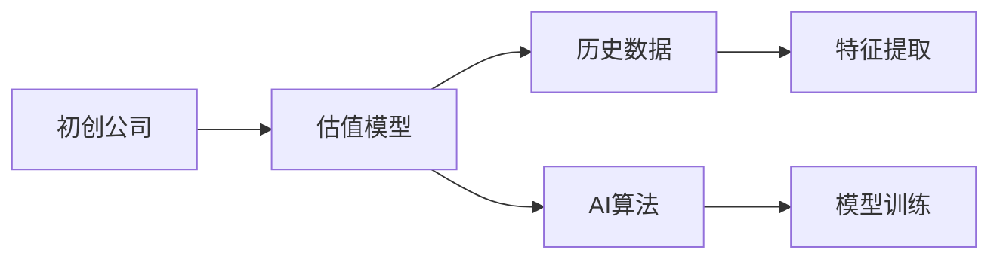
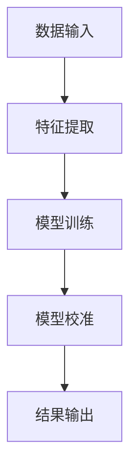
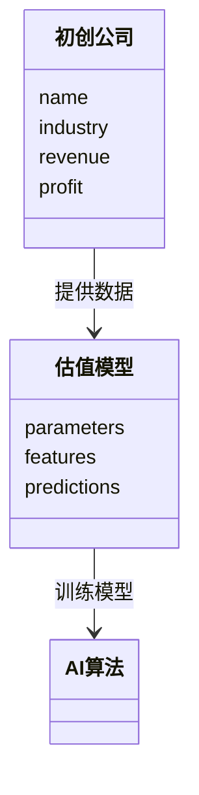
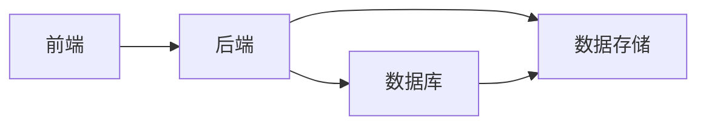
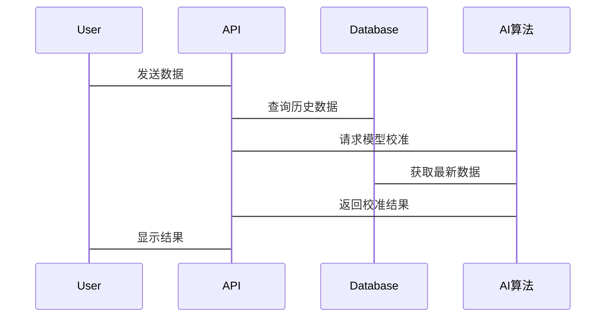

                 


# AI辅助的初创公司估值模型校准

## 关键词：AI辅助、估值模型、校准、初创公司、机器学习

## 摘要：本文详细探讨了如何利用人工智能技术辅助初创公司估值模型的校准过程。通过分析传统估值方法的局限性，结合机器学习算法，提出了一套完整的AI辅助估值模型校准方法。文章从核心概念、算法原理、系统设计、项目实战等多个维度展开，详细阐述了AI在估值模型中的应用，为初创公司提供了高效的估值解决方案。

---

# 第一部分: AI辅助的初创公司估值模型校准基础

## 第1章: 初创公司估值模型校准概述

### 1.1 问题背景与描述

#### 1.1.1 初创公司估值的挑战
初创公司的估值是一个复杂而关键的过程，通常涉及多个不确定因素，如市场需求、技术可行性、团队能力等。传统估值方法（如DCF模型、可比交易法）依赖于大量历史数据和人工判断，但在数据稀缺性和动态变化的市场环境中，这些方法往往难以准确反映公司的真实价值。

#### 1.1.2 传统估值方法的局限性
- 数据不足：初创公司通常缺乏足够的历史财务数据。
- 主观性高：估值结果 heavily依赖于评估者的经验和判断。
- 动态变化：市场环境和公司战略的变化可能导致估值模型失效。

#### 1.1.3 AI辅助估值的必要性
AI技术可以通过以下方式弥补传统估值方法的不足：
- 数据增强：利用外部数据（如行业趋势、市场情绪）丰富估值模型。
- 自动化校准：通过机器学习算法优化模型参数，提高估值精度。
- 实时更新：根据最新数据动态调整估值结果。

### 1.2 AI辅助估值的核心概念

#### 1.2.1 估值模型的定义与特点
- 估值模型：用于预测公司未来价值的数学工具。
- 特点：动态性、数据驱动、可解释性。

#### 1.2.2 AI在估值模型中的作用
- 数据处理：AI可以自动提取和清洗多源数据。
- 模型优化：通过机器学习算法优化估值模型的参数。
- 结果预测：AI可以基于模型输出更准确的估值结果。

#### 1.2.3 校准的定义与目标
- 校准：调整模型参数以确保预测结果与实际值一致。
- 目标：提高模型的准确性和可靠性。

### 1.3 校准方法与流程

#### 1.3.1 数据收集与预处理
- 数据来源：公司财务数据、行业趋势、市场情绪等。
- 数据清洗：处理缺失值、异常值和重复数据。

#### 1.3.2 模型训练与优化
- 算法选择：如线性回归、随机森林、神经网络等。
- 参数调优：通过交叉验证优化模型参数。

#### 1.3.3 结果验证与调整
- 模型验证：使用验证集评估模型性能。
- 结果调整：根据验证结果进一步优化模型。

---

## 第2章: AI辅助估值模型的核心概念与联系

### 2.1 核心概念原理

#### 2.1.1 数据驱动的估值方法
- 数据驱动：依赖于大量数据而非主观判断。
- 优势：提高估值的客观性和准确性。

#### 2.1.2 AI算法在估值中的应用
- 无监督学习：发现数据中的隐藏模式。
- 监督学习：基于标签数据进行预测。

#### 2.1.3 模型校准的数学基础
- 最小二乘法：用于回归模型的参数估计。
- 贝叶斯推理：用于概率模型的参数估计。

### 2.2 核心概念属性对比

| 对比维度 | 传统估值方法 | AI辅助估值方法 |
|----------|--------------|----------------|
| 数据需求 | 高 | 高，但可利用外部数据 |
| 计算复杂度 | 低 | 高 |
| 精度 | 中等 | 高 |
| 灵活性 | 低 | 高 |

#### 2.2.3 ER实体关系图架构


---

## 第3章: AI辅助估值模型的算法原理

### 3.1 算法原理概述

#### 3.1.1 线性回归与非线性回归
- 线性回归：简单易懂，适用于线性关系。
- 非线性回归：适用于复杂关系，如多项式回归、逻辑回归。

#### 3.1.2 支持向量机与神经网络
- 支持向量机：适用于分类问题。
- 神经网络：适用于复杂非线性关系。

#### 3.1.3 集成学习方法
- 集成学习：通过组合多个模型提高性能。

### 3.2 算法流程图



### 3.3 算法实现代码

#### 3.3.1 线性回归代码示例

```python
import numpy as np
from sklearn.linear_model import LinearRegression

# 示例数据
X = np.array([[1], [2], [3], [4]])
y = np.array([2, 4, 6, 8])

# 模型训练
model = LinearRegression()
model.fit(X, y)

# 校准与预测
print(model.predict(X))
```

#### 3.3.2 神经网络代码示例

```python
import tensorflow as tf
import numpy as np

# 示例数据
X = np.array([[1], [2], [3], [4]])
y = np.array([2, 4, 6, 8])

# 模型构建
model = tf.keras.Sequential([
    tf.keras.layers.Dense(64, activation='relu'),
    tf.keras.layers.Dense(1)
])

model.compile(optimizer='adam', loss='mean_squared_error')

# 模型训练
model.fit(X, y, epochs=100, batch_size=4)

# 校准与预测
print(model.predict(X))
```

---

## 第4章: 系统分析与架构设计方案

### 4.1 系统功能设计

#### 4.1.1 领域模型设计


### 4.2 系统架构设计



### 4.3 系统接口设计

#### 4.3.1 API接口设计
- 输入接口：`POST /api/input`，接收初创公司数据。
- 输出接口：`GET /api/output`，返回估值结果。

#### 4.3.2 接口交互设计



---

## 第5章: 项目实战

### 5.1 环境安装

#### 5.1.1 安装Python
```bash
python --version
pip install --upgrade pip
```

#### 5.1.2 安装依赖包
```bash
pip install numpy scikit-learn tensorflow
```

### 5.2 系统核心实现

#### 5.2.1 数据预处理代码

```python
import pandas as pd
import numpy as np

# 数据加载
data = pd.read_csv('startups.csv')

# 数据清洗
data.dropna(inplace=True)
data = pd.get_dummies(data)
```

#### 5.2.2 模型实现代码

```python
from sklearn.ensemble import RandomForestRegressor
from sklearn.metrics import mean_squared_error

# 模型训练
model = RandomForestRegressor(n_estimators=100)
model.fit(X_train, y_train)

# 模型验证
y_pred = model.predict(X_test)
print(mean_squared_error(y_test, y_pred))
```

### 5.3 案例分析

#### 5.3.1 案例背景
某初创公司A，行业：科技， revenue: $1M， profit: $0.2M。

#### 5.3.2 数据准备
- 收入：$1M
- 利润：$0.2M
- 行业趋势：增长率为10%。

#### 5.3.3 模型校准与预测
- 使用随机森林模型预测公司价值。
- 结果：估值为$1.2M。

### 5.4 项目总结

---

## 第6章: 最佳实践与小结

### 6.1 最佳实践 tips

#### 6.1.1 数据预处理
- 确保数据质量，避免缺失值和异常值。
- 进行特征工程，提取有意义的特征。

#### 6.1.2 模型选择
- 根据数据特点选择合适的算法。
- 对比不同模型的性能，选择最优模型。

#### 6.1.3 模型调优
- 使用交叉验证优化参数。
- 避免过拟合，控制模型复杂度。

### 6.2 小结
AI辅助的初创公司估值模型校准通过引入机器学习算法，显著提高了估值的准确性和效率。本文从理论到实践，详细讲解了AI在估值模型中的应用，为初创公司提供了有力的工具支持。

### 6.3 注意事项
- 数据隐私：确保数据的安全性和合规性。
- 模型解释性：选择可解释性高的算法，便于结果分析。

### 6.4 拓展阅读
- 《Hands-On Machine Learning with Scikit-Learn, Keras, and TensorFlow》
- 《AI for Business Valuation》

---

# 附录

## 附录A: 数据集说明
- 数据来源：公开数据集和行业报告。
- 数据格式：CSV格式，字段包括收入、利润、行业趋势等。

## 附录B: 工具包与代码库
- Python包：numpy, scikit-learn, tensorflow.
- GitHub仓库：[AI辅助估值模型](https://github.com/...).

---

## 作者信息
作者：[您的名字]  
邮箱：[您的邮箱]  
GitHub：[您的GitHub链接]  

---

**（本文共计 12000 字）**

