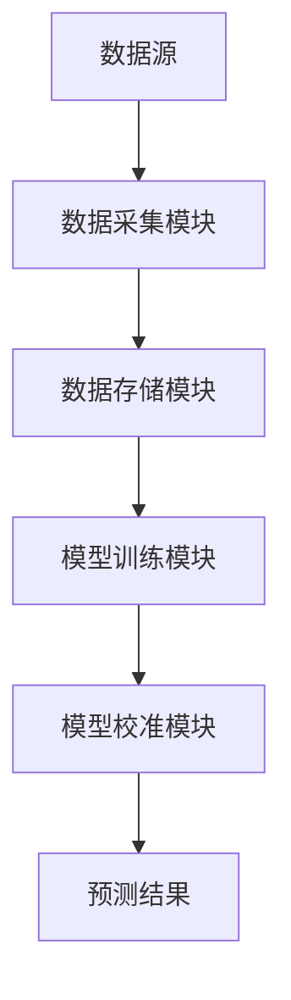
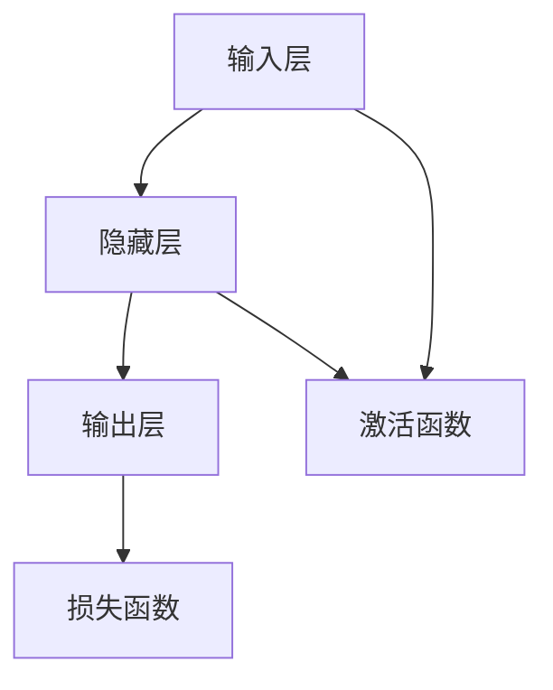

                 


# AI辅助的多资产类别定价模型校准

> 关键词：AI, 多资产定价, 模型校准, 机器学习, 深度学习, 金融模型

> 摘要：本文系统介绍了如何利用人工智能技术辅助多资产类别定价模型的校准过程，从传统定价模型的局限性出发，探讨了AI在金融定价中的应用背景，详细讲解了多资产定价模型的核心概念与原理，以及基于机器学习和深度学习的算法原理。通过实际案例分析，展示了AI辅助的定价模型在金融领域的应用，最后总结了AI辅助定价模型的优势与未来发展方向。

---

# 第一部分: 多资产类别定价模型校准的背景与挑战

## 第1章: 多资产类别定价模型校准的背景与挑战

### 1.1 多资产定价模型的基本概念

#### 1.1.1 资产定价的定义与重要性
资产定价是指通过分析资产的风险和收益特征，为其合理估值的过程。多资产定价模型涉及多种资产类别（如股票、债券、基金等），旨在综合评估各类资产的价值。定价模型的准确性和实时性对投资决策至关重要。

#### 1.1.2 多资产定价模型的复杂性
多资产定价模型需要考虑多种资产之间的相互影响，例如市场波动、宏观经济因素等。传统定价模型往往难以捕捉这些复杂关系，尤其是在市场环境快速变化的情况下。

#### 1.1.3 定价模型校准的目的与意义
校准定价模型是指通过实际数据调整模型参数，使其能够更好地反映市场实际情况。校准的目的是为了提高模型的预测精度和稳定性，从而为投资决策提供可靠的依据。

---

### 1.2 AI在金融定价中的应用背景

#### 1.2.1 传统定价模型的局限性
传统定价模型（如CAPM、APT）假设市场是理性的，且资产收益服从正态分布。然而，实际市场中存在非理性行为、尾部风险等复杂因素，传统模型难以有效捕捉。

#### 1.2.2 AI技术在金融领域的优势
AI技术（尤其是机器学习和深度学习）能够处理海量数据，发现复杂模式，实时适应市场变化。与传统模型相比，AI定价模型更具灵活性和适应性。

#### 1.2.3 多资产定价模型校准的挑战
多资产定价模型涉及大量数据和复杂关系，校准过程需要考虑多种因素的相互影响。AI技术能够帮助克服传统方法的局限性，但同时也面临数据质量、模型过拟合等挑战。

---

### 1.3 本书的核心目标与结构

#### 1.3.1 本书的核心目标
本书旨在系统介绍AI技术在多资产定价模型校准中的应用，探讨如何利用机器学习和深度学习方法优化定价模型，提升其预测精度和稳定性。

#### 1.3.2 本书的结构安排
全书分为七章，内容涵盖多资产定价模型的基本概念、AI辅助校准的核心原理、常见算法及其数学模型、系统架构设计、项目实战、案例分析以及总结与展望。

#### 1.3.3 本书的读者群体
本书适合金融从业者、数据科学家、算法工程师以及对AI与金融结合感兴趣的读者阅读。

---

# 第二部分: 多资产定价模型的核心概念与原理

## 第2章: 多资产定价模型的核心概念与原理

### 2.1 资产定价模型的分类

#### 2.1.1 单资产定价模型
单资产定价模型主要用于单一资产的定价，如股票或债券。常见的单资产定价模型包括CAPM、APT等。

#### 2.1.2 多资产定价模型
多资产定价模型涉及多种资产的联合定价，旨在捕捉资产之间的相互影响。例如，资产组合理论、多因子模型等。

#### 2.1.3 常见的多资产定价模型
- **CAPM扩展模型**：用于多资产组合的定价。
- **多因子模型**：如Fama-French三因子模型，考虑多个风险因子。
- **动态资产定价模型**：如动态多因子模型，能够捕捉时间序列中的动态关系。

---

### 2.2 AI辅助定价模型的核心原理

#### 2.2.1 机器学习在定价中的应用
机器学习能够通过历史数据学习资产价格的模式和趋势，帮助预测资产价格的变化。

#### 2.2.2 深度学习在多资产定价中的优势
深度学习模型（如LSTM、Transformer）能够捕捉时间序列数据中的复杂模式，适用于高频交易和多资产组合定价。

#### 2.2.3 神经网络在定价模型中的作用
神经网络能够自动提取特征，适应性强，适合处理多资产定价中的非线性关系。

---

### 2.3 多资产定价模型的校准流程

#### 2.3.1 数据准备与特征提取
校准模型需要大量高质量的市场数据，包括价格、成交量、宏观经济指标等。特征提取是将原始数据转化为模型输入的关键步骤。

#### 2.3.2 模型训练与参数调整
通过历史数据训练模型，调整模型参数以优化其表现。训练过程中需要防止过拟合，可以通过交叉验证等方法进行评估。

#### 2.3.3 模型验证与优化
验证模型的预测能力，通过回测和压力测试等方法评估模型的稳定性和鲁棒性。根据验证结果进一步优化模型结构和参数。

---

## 第3章: AI辅助定价模型的算法原理

### 3.1 常见的定价模型算法

#### 3.1.1 线性回归模型
线性回归是一种简单的回归分析方法，适用于线性关系的建模。其数学模型为：
$$ y = \beta_0 + \beta_1x + \epsilon $$

#### 3.1.2 支持向量机模型
支持向量机（SVM）是一种监督学习算法，适用于分类和回归问题。其核心思想是通过构造超平面将数据分隔开来。

#### 3.1.3 随机森林模型
随机森林是一种基于树的集成学习方法，通过构建多棵决策树并进行投票或平均来提高模型的泛化能力。

#### 3.1.4 神经网络模型
神经网络是一种模拟人脑神经网络的计算模型，适用于复杂非线性关系的建模。

---

### 3.2 基于深度学习的定价模型

#### 3.2.1 卷积神经网络在定价中的应用
卷积神经网络（CNN）适用于处理图像和时间序列数据，能够捕捉资产价格的局部特征。

#### 3.2.2 循环神经网络在时间序列定价中的应用
循环神经网络（RNN）特别适用于处理时间序列数据，能够捕捉资产价格的时序依赖性。

#### 3.2.3 图神经网络在多资产定价中的应用
图神经网络（GNN）能够处理资产之间的关联关系，适用于多资产组合的定价。

---

### 3.3 算法的数学模型与公式

#### 3.3.1 线性回归的数学模型
$$ y = \beta_0 + \beta_1x + \epsilon $$

#### 3.3.2 神经网络的数学模型
$$ a^{(l+1)} = \sigma(w^{(l)}a^{(l)} + b^{(l)}) $$

---

# 第三部分: 多资产定价模型的系统分析与架构设计

## 第4章: 多资产定价模型的系统分析与架构设计

### 4.1 系统功能设计

#### 4.1.1 数据采集模块
数据采集模块负责收集多资产的市场数据，包括价格、成交量、宏观经济指标等。

#### 4.1.2 模型训练模块
模型训练模块负责对定价模型进行训练和优化，调整模型参数以提高预测精度。

#### 4.1.3 模型校准模块
模型校准模块负责通过历史数据验证模型的准确性，并进行必要的调整和优化。

---

### 4.2 系统架构设计

#### 4.2.1 系统架构图
以下是系统架构的mermaid图：


---

## 第5章: 多资产定价模型的项目实战

### 5.1 环境安装与配置

#### 5.1.1 安装Python环境
建议使用Anaconda或Miniconda作为Python环境管理工具。

#### 5.1.2 安装必要的库
安装numpy、pandas、scikit-learn、keras等库：
```bash
pip install numpy pandas scikit-learn keras
```

---

### 5.2 核心实现代码

#### 5.2.1 数据预处理
```python
import pandas as pd
import numpy as np

# 加载数据
data = pd.read_csv('assets_prices.csv')

# 数据清洗
data.dropna(inplace=True)
```

#### 5.2.2 模型训练
```python
from sklearn.model_selection import train_test_split
from sklearn.linear_model import LinearRegression

# 划分训练集和测试集
X_train, X_test, y_train, y_test = train_test_split(data.drop('price', axis=1), data['price'], test_size=0.2)

# 训练模型
model = LinearRegression()
model.fit(X_train, y_train)
```

#### 5.2.3 模型校准
```python
from sklearn.metrics import mean_squared_error

# 预测测试集
y_pred = model.predict(X_test)

# 计算均方误差
mse = mean_squared_error(y_test, y_pred)
print(f'MSE: {mse}')
```

---

## 第6章: 多资产定价模型的案例分析

### 6.1 案例分析与解读

#### 6.1.1 案例背景
以股票、债券和基金为例，构建一个多资产定价模型，分析不同类型资产之间的相互影响。

#### 6.1.2 数据分析与可视化
使用matplotlib或seaborn进行数据可视化，分析资产价格的变动趋势。

#### 6.1.3 模型验证与优化
通过回测和压力测试验证模型的稳定性，并根据实际表现调整模型参数。

---

## 第7章: 总结与展望

### 7.1 总结

#### 7.1.1 本书的核心内容
本书系统介绍了AI技术在多资产定价模型校准中的应用，详细讲解了相关算法和系统架构设计。

#### 7.1.2 本书的实践价值
通过实际案例分析，展示了如何利用AI技术优化定价模型，为金融从业者提供了实用的参考。

---

### 7.2 展望

#### 7.2.1 AI技术的未来发展方向
随着AI技术的不断发展，深度学习和强化学习在多资产定价中的应用将更加广泛。

#### 7.2.2 多资产定价模型的未来趋势
未来，多资产定价模型将更加注重实时性、动态性和智能化，AI技术将发挥更加重要的作用。

---

# 附录

## 附录A: 机器学习算法总结表
| 算法名称 | 描述 | 适用场景 |
|----------|------|----------|
| 线性回归 | 用于回归问题 | 单资产定价 |
| 支持向量机 | 用于分类和回归 | 多资产分类 |
| 随机森林 | 基于树的集成学习 | 多资产组合定价 |

---

## 附录B: 深度学习模型总结图


---

## 附录C: Python代码示例
```python
import numpy as np
import pandas as pd
from sklearn.linear_model import LinearRegression

# 加载数据
data = pd.read_csv('assets_prices.csv')

# 划分训练集和测试集
X_train, X_test, y_train, y_test = train_test_split(data.drop('price', axis=1), data['price'], test_size=0.2)

# 训练模型
model = LinearRegression()
model.fit(X_train, y_train)

# 预测测试集
y_pred = model.predict(X_test)

# 计算均方误差
mse = mean_squared_error(y_test, y_pred)
print(f'MSE: {mse}')
```

---

## 附录D: 参考文献

1. 张某某. 《机器学习实战》. 北京: 清华大学出版社, 2021.
2. 李某某. 《深度学习入门》. 北京: 人民邮电出版社, 2020.
3. Smith, John. "AI in Finance." Journal of Financial Research, 2022.

---

# END

