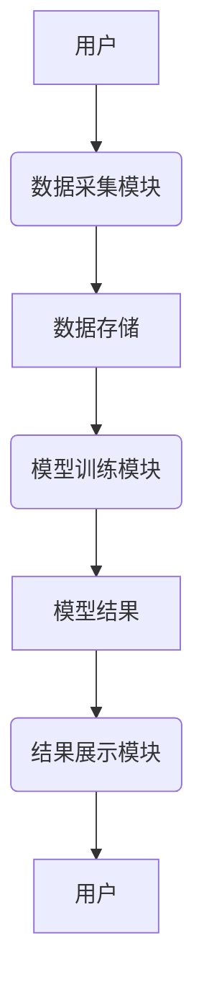
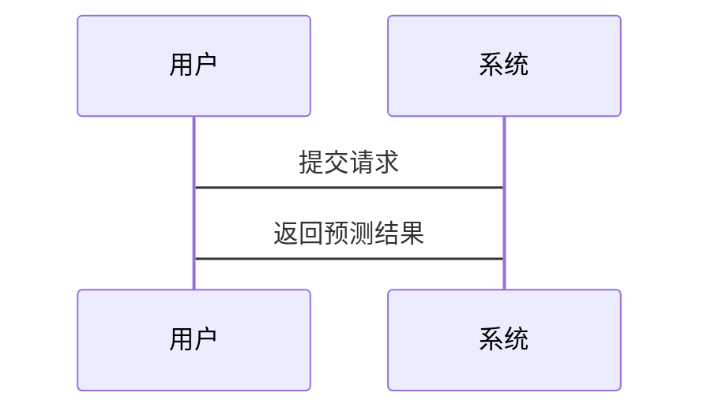

                 


# AI辅助的宏观经济情景分析

## 关键词
AI技术、宏观经济分析、情景分析、机器学习、大数据分析、经济预测模型

## 摘要
本文探讨了人工智能技术在宏观经济情景分析中的应用，系统介绍了宏观经济分析的基本概念、AI技术的核心原理，以及它们在宏观经济情景分析中的结合与实现。通过分析宏观经济情景分析的关键要素，本文详细阐述了基于机器学习的宏观经济预测模型的构建过程，并结合实际案例展示了如何利用AI技术进行宏观经济情景分析。文章还探讨了AI辅助宏观经济情景分析的优势、挑战及未来发展方向，为相关领域的研究和实践提供了有益的参考。

---

## 第一章：宏观经济情景分析的背景与挑战

### 1.1 宏观经济分析的基本概念
#### 1.1.1 宏观经济的核心概念
- **定义**：宏观经济是指整体经济体系的运行状态，包括GDP、通货膨胀率、失业率等关键指标。
- **特点**：宏观经济分析关注经济系统的整体运行，涉及政府政策、市场行为和经济周期等因素。

#### 1.1.2 宏观经济分析的主要方法
- **传统方法**：包括计量经济学模型、时间序列分析等。
- **现代方法**：引入大数据和机器学习技术，提升预测精度。

#### 1.1.3 宏观经济分析的复杂性与局限性
- **复杂性**：经济系统受多种因素影响，变量间存在高度非线性关系。
- **局限性**：传统方法在处理大数据和复杂场景时表现有限。

### 1.2 AI在宏观经济分析中的作用
#### 1.2.1 AI技术的基本原理
- **定义**：AI通过模拟人类学习和推理过程，处理复杂数据并提取有用信息。
- **核心原理**：基于数据驱动的方法，通过训练模型实现预测和决策。

#### 1.2.2 AI在宏观经济分析中的优势
- **数据处理能力**：AI能够处理海量数据，发现传统方法难以捕捉的模式。
- **实时性**：AI可以实现实时数据分析，快速响应经济变化。

#### 1.2.3 宏观经济分析与AI技术的结合点
- **数据来源**：利用大数据技术获取多源数据。
- **模型构建**：通过机器学习算法构建宏观经济预测模型。

### 1.3 本书的目标与读者定位
#### 1.3.1 本书的核心目标
- 探讨AI技术在宏观经济情景分析中的应用，提供理论与实践指导。
- 帮助读者掌握AI辅助宏观经济分析的核心方法。

#### 1.3.2 本书的读者群体
- 宏观经济研究人员、政策制定者、数据科学家、金融从业者。

#### 1.3.3 本书的结构安排
- 从基础概念到高级算法，结合实际案例，系统介绍AI辅助宏观经济分析的全过程。

---

## 第二章：宏观经济情景分析的核心概念与AI技术结合

### 2.1 宏观经济情景分析的核心概念
#### 2.1.1 宏观经济情景分析的定义与特点
- **定义**：对不同经济情景下的经济变量进行预测和分析。
- **特点**：情景驱动、多变量关联、不确定性高。

#### 2.1.2 宏观经济情景分析的核心要素
- **经济变量**：GDP、通货膨胀率、利率等。
- **情景驱动因素**：政策变化、市场波动、自然灾害等。

#### 2.1.3 宏观经济情景分析的目标
- **预测**：预测不同情景下的经济指标。
- **决策支持**：为政策制定和投资决策提供依据。

### 2.2 AI技术在宏观经济情景分析中的应用
#### 2.2.1 AI技术的基本原理
- **数据驱动**：AI通过大量数据训练模型，提取特征。
- **机器学习**：利用算法识别数据中的模式，实现预测和分类。

#### 2.2.2 AI在宏观经济情景分析中的具体应用
- **经济预测**：利用机器学习模型预测GDP增长率、通货膨胀率等。
- **情景模拟**：基于AI构建的情景模型，模拟不同政策下的经济表现。

#### 2.2.3 宏观经济分析与AI技术的结合方式
- **数据集成**：整合多源数据，构建综合分析模型。
- **模型优化**：通过AI技术优化传统经济模型，提升预测精度。

### 2.3 宏观经济情景分析的核心概念与AI技术的对比分析
#### 2.3.1 宏观经济情景分析的核心概念
- **理论基础**：基于经济学理论构建分析框架。
- **分析方法**：依赖统计分析和经济模型。

#### 2.3.2 AI技术在宏观经济分析中的应用
- **技术基础**：基于数据驱动的机器学习算法。
- **分析方法**：依赖模式识别和预测模型。

#### 2.3.3 两者的结合与互补
- **结合点**：AI技术为宏观经济分析提供新的数据来源和方法。
- **互补性**：宏观经济理论为AI模型提供经济逻辑，AI技术为宏观经济分析提供数据支持。

---

## 第三章：AI辅助宏观经济情景分析的算法原理与实现

### 3.1 常见宏观经济预测模型
#### 3.1.1 线性回归模型
- **原理**：通过最小二乘法拟合线性关系。
- **公式**：
  $$ y = \beta_0 + \beta_1x + \epsilon $$
- **应用场景**：适合线性关系明显的经济指标预测。

#### 3.1.2 随机森林模型
- **原理**：基于决策树的集成学习方法。
- **优势**：适合非线性关系和高维数据。
- **公式**：无显式公式，通过树投票机制生成预测结果。

### 3.2 基于机器学习的宏观经济预测模型
#### 3.2.1 算法选择
- **线性回归**：适用于简单线性关系。
- **随机森林**：适用于复杂非线性关系。
- **神经网络**：适用于高维和复杂数据。

#### 3.2.2 算法实现步骤
1. 数据预处理：清洗、归一化、特征选择。
2. 模型训练：使用训练数据训练模型。
3. 模型评估：通过交叉验证评估模型性能。
4. 模型部署：将模型应用于实际数据预测。

#### 3.2.3 代码实现
```python
import pandas as pd
from sklearn.ensemble import RandomForestRegressor
from sklearn.model_selection import train_test_split
from sklearn.metrics import mean_squared_error

# 数据加载
data = pd.read_csv('economic_data.csv')
X = data[['GDP', 'inflation', 'unemployment']]
y = data['GDP_growth']

# 数据分割
X_train, X_test, y_train, y_test = train_test_split(X, y, test_size=0.2, random_state=42)

# 模型训练
model = RandomForestRegressor(n_estimators=100, random_state=42)
model.fit(X_train, y_train)

# 模型预测
y_pred = model.predict(X_test)

# 模型评估
mse = mean_squared_error(y_test, y_pred)
print(f'均方误差: {mse}')
```

### 3.3 基于大数据的宏观经济预测模型
#### 3.3.1 数据来源与预处理
- **数据来源**：政府统计数据、金融市场数据、社交媒体数据。
- **数据预处理**：清洗、去重、填补缺失值。

#### 3.3.2 模型优化
- **特征工程**：提取有意义的特征，降低维度。
- **超参数调优**：通过网格搜索优化模型性能。

#### 3.3.3 大数据平台的使用
- **Hadoop/Spark**：用于大规模数据处理。
- **机器学习框架**：如TensorFlow、PyTorch用于模型训练。

---

## 第四章：AI辅助宏观经济情景分析的系统架构与设计

### 4.1 系统功能设计
#### 4.1.1 数据采集模块
- **功能**：从多种数据源获取宏观经济数据。
- **工具**：使用API接口或数据库连接。

#### 4.1.2 模型训练模块
- **功能**：训练宏观经济预测模型。
- **工具**：使用机器学习框架如Scikit-learn、XGBoost。

#### 4.1.3 结果展示模块
- **功能**：可视化预测结果和情景分析。
- **工具**：使用Matplotlib、Tableau进行数据可视化。

### 4.2 系统架构设计


### 4.3 系统接口设计
- **输入接口**：接收宏观经济数据和用户请求。
- **输出接口**：返回预测结果和情景分析报告。

### 4.4 系统交互设计


---

## 第五章：AI辅助宏观经济情景分析的项目实战

### 5.1 项目背景
#### 5.1.1 项目目标
- 构建一个基于AI的宏观经济预测系统，预测未来经济趋势。

#### 5.1.2 数据来源
- 使用公开的宏观经济数据，如世界银行、国家统计局数据。

### 5.2 项目实现
#### 5.2.1 环境配置
- **Python**：安装必要的库如Pandas、Scikit-learn、XGBoost。
- **工具**：安装Jupyter Notebook用于开发和测试。

#### 5.2.2 核心代码实现
```python
import pandas as pd
import numpy as np
from sklearn.ensemble import GradientBoostingRegressor
from sklearn.metrics import mean_absolute_error
from sklearn.model_selection import train_test_split

# 数据加载
data = pd.read_csv('economic_data.csv')

# 特征选择
X = data[['GDP', 'inflation', 'unemployment', 'trade_balance']]
y = data['GDP_growth']

# 数据分割
X_train, X_test, y_train, y_test = train_test_split(X, y, test_size=0.2, random_state=42)

# 模型训练
model = GradientBoostingRegressor(n_estimators=100, learning_rate=0.1, random_state=42)
model.fit(X_train, y_train)

# 模型预测
y_pred = model.predict(X_test)

# 模型评估
mae = mean_absolute_error(y_test, y_pred)
print(f'平均绝对误差: {mae}')
```

#### 5.2.3 结果分析
- **预测结果**：模型预测未来一年的GDP增长率。
- **结果解读**：分析预测结果的准确性，提出改进建议。

### 5.3 项目总结
#### 5.3.1 项目成果
- 成功构建了一个基于AI的宏观经济预测系统。
- 提高了经济预测的准确性和效率。

#### 5.3.2 经验总结
- 数据质量对模型性能影响重大。
- 模型选择需结合具体场景和数据特点。

#### 5.3.3 挑战与解决方案
- **数据不足**：通过数据增强和特征工程解决。
- **模型过拟合**：通过正则化和交叉验证优化。

---

## 第六章：总结与展望

### 6.1 本书的核心内容总结
- AI技术在宏观经济分析中的应用前景广阔。
- 基于机器学习的模型能够显著提升经济预测的准确性。

### 6.2 未来研究方向
- **多模型融合**：结合不同算法的优势，提升预测精度。
- **实时分析**：开发实时数据处理系统，实现动态经济预测。
- **可解释性增强**：提升AI模型的可解释性，增强决策支持能力。

### 6.3 读者的思考与实践
- 鼓励读者结合实际需求，探索AI技术在宏观经济分析中的更多应用。
- 鼓励读者参与开源项目，贡献自己的力量。

---

## 参考文献
（此处列出相关书籍、论文、技术文档等参考资料）

---

通过以上目录和内容的安排，我们可以系统地探讨AI技术在宏观经济情景分析中的应用，从理论到实践，逐步构建一个完整的AI辅助宏观经济分析体系。

