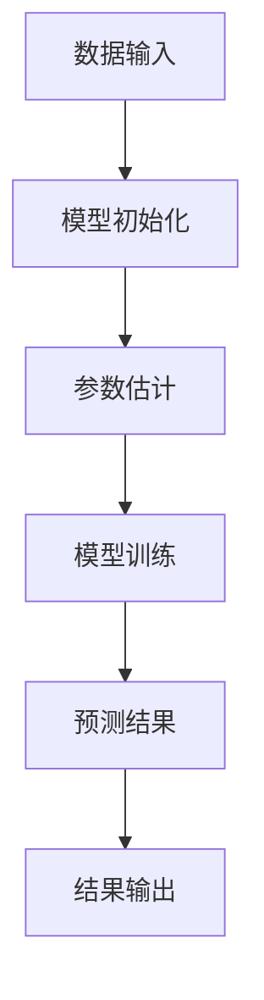
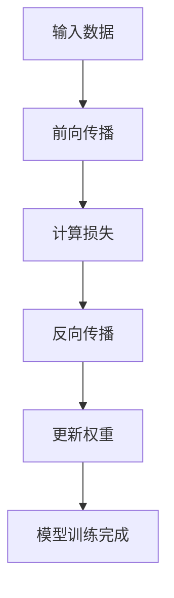
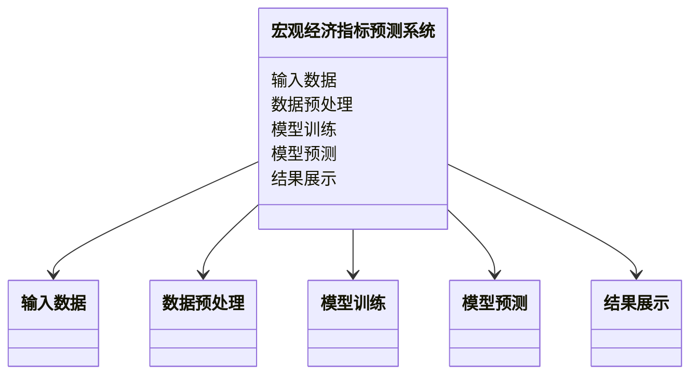
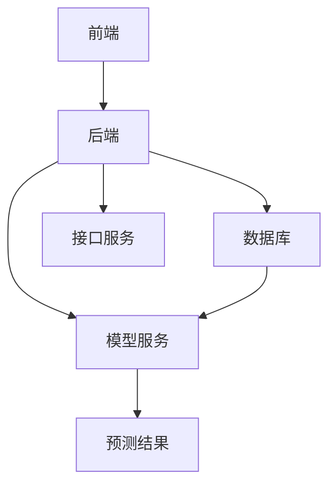
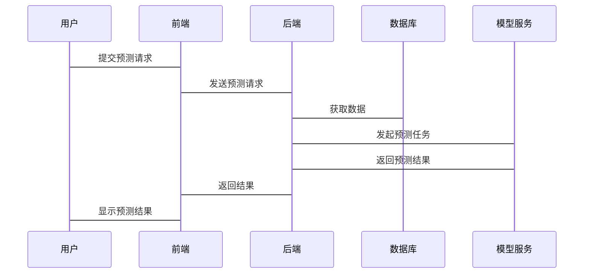

                 


# AI辅助的宏观经济指标预测

## 关键词：AI，宏观经济指标，机器学习，时间序列分析，经济预测，深度学习

## 摘要：本文深入探讨了人工智能技术在宏观经济指标预测中的应用，系统性地分析了宏观经济指标预测的核心概念、AI算法原理、系统架构设计以及实际项目应用。文章从宏观经济指标的基本概念出发，详细介绍了AI技术在经济预测中的优势与挑战，通过具体案例分析展示了AI辅助宏观经济指标预测的实际应用场景和解决方案，最后总结了最佳实践经验和未来发展趋势。

---

# 第一部分: 宏观经济指标预测的背景与挑战

## 第1章: 宏观经济指标预测的背景与挑战

### 1.1 宏观经济指标的基本概念

#### 1.1.1 宏观经济指标的定义与分类

- **定义**：宏观经济指标是衡量一个国家或地区经济运行状况的关键数据，通常包括国内生产总值（GDP）、通货膨胀率、失业率、工业增加值、零售额等。
- **分类**：
  - **总量指标**：如GDP、工业增加值。
  - **结构指标**：如消费结构、投资结构。
  - **价格指标**：如通货膨胀率、CPI（消费者价格指数）。
  - **就业指标**：如失业率。

#### 1.1.2 宏观经济指标的重要性与应用场景

- **重要性**：宏观经济指标是政府制定经济政策、企业制定战略的重要依据，同时也是学术研究的重要数据来源。
- **应用场景**：
  - 政府政策制定：如货币政策、财政政策。
  - 企业决策：如投资决策、风险管理。
  - 学术研究：如经济学理论验证、经济周期分析。

#### 1.1.3 宏观经济预测的难点与挑战

- **数据复杂性**：宏观经济指标受多种因素影响，如政策、市场、国际环境等，数据具有高度的复杂性和不确定性。
- **模型选择**：如何选择合适的模型和算法，平衡预测的准确性和计算效率。
- **数据滞后性**：宏观经济数据通常存在滞后性，如何利用实时数据进行预测是一个挑战。

### 1.2 AI技术在宏观经济预测中的作用

#### 1.2.1 AI技术的基本概念与优势

- **AI技术**：人工智能（AI）是一种模拟人类智能的技术，包括机器学习、深度学习、自然语言处理等。
- **优势**：
  - 数据处理能力强：AI能够处理海量数据，提取复杂模式。
  - 高效性：AI算法可以快速完成预测任务，节省时间和成本。
  - 自适应性：AI模型可以根据数据变化自动调整预测策略。

#### 1.2.2 AI在宏观经济预测中的独特价值

- **非线性关系捕捉**：AI技术能够捕捉宏观经济指标之间的非线性关系，提高预测准确性。
- **多因素分析**：AI可以同时考虑多个影响因素，构建综合预测模型。
- **实时性**：AI技术可以实时处理数据，提供实时预测结果。

#### 1.2.3 宏观经济预测中的AI技术发展趋势

- **深度学习的应用**：深度学习在宏观经济预测中的应用越来越广泛，尤其是在时间序列预测中表现突出。
- **集成学习的发展**：集成学习通过组合多个模型的优势，进一步提高预测准确性。
- **可解释性增强**：AI模型的可解释性是宏观经济预测中的重要需求，未来研究将更加注重模型的可解释性。

### 1.3 本章小结

#### 1.3.1 宏观经济指标预测的核心问题

- 宏观经济指标预测的核心问题是如何利用现有数据准确预测未来的经济走势。

#### 1.3.2 AI技术在宏观经济预测中的关键作用

- AI技术通过强大的数据处理能力和算法优化，显著提高了宏观经济预测的准确性和效率。

#### 1.3.3 本书的研究目标与内容框架

- 本书旨在系统性地探讨AI技术在宏观经济指标预测中的应用，内容涵盖理论、算法、系统设计和实际案例。

---

## 第2章: 宏观经济指标预测的核心概念与联系

### 2.1 宏观经济指标预测的基本原理

#### 2.1.1 宏观经济指标的生成机制

- **生成机制**：宏观经济指标是由多种因素共同作用生成的，包括生产、消费、投资、国际贸易等经济活动。

#### 2.1.2 宏观经济预测的理论基础

- **经济理论**：宏观经济预测需要结合经济学的基本理论，如 Keynesian经济学、 monetarist经济学等。
- **统计学基础**：统计学是宏观经济预测的重要基础，包括回归分析、时间序列分析等。

#### 2.1.3 宏观经济预测的模型分类

- **模型分类**：
  - **时间序列模型**：如ARIMA、GARCH。
  - **回归模型**：如线性回归、Logistic回归。
  - **机器学习模型**：如随机森林、XGBoost。
  - **深度学习模型**：如LSTM、Transformer。

### 2.2 AI模型在宏观经济预测中的核心概念

#### 2.2.1 机器学习在宏观经济预测中的应用

- **机器学习**：机器学习是一种人工智能技术，通过训练数据模型，实现对新数据的预测。
- **应用场景**：在宏观经济预测中，机器学习广泛应用于时间序列预测、分类、聚类等任务。

#### 2.2.2 深度学习在宏观经济预测中的优势

- **深度学习**：深度学习是一种基于人工神经网络的机器学习技术，能够自动提取数据特征。
- **优势**：在处理复杂时间序列数据时，深度学习表现出色，能够捕捉复杂的模式和非线性关系。

#### 2.2.3 时间序列分析与宏观经济预测的关系

- **时间序列分析**：时间序列分析是一种统计学方法，用于分析随时间变化的数据。
- **关系**：宏观经济指标通常具有很强的时间依赖性，时间序列分析是宏观经济预测的核心方法之一。

### 2.3 宏观经济指标预测的核心要素与ER实体关系图

#### 2.3.1 宏观经济指标的核心要素分析

- **核心要素**：
  - 时间维度：数据的时间戳。
  - 经济指标：GDP、CPI、失业率等。
  - 影响因素：政策、市场、国际环境等。

#### 2.3.2 宏观经济预测中的实体关系图

- **ER实体关系图**：通过ER图展示宏观经济指标预测系统中的实体及其关系。

#### 2.3.3 宏观经济指标预测的系统架构

- **系统架构**：包括数据采集、数据预处理、模型训练、模型预测和结果展示等模块。

---

## 第3章: 宏观经济指标预测的算法原理

### 3.1 常见宏观经济预测算法概述

#### 3.1.1 线性回归模型

- **线性回归**：一种简单的统计学方法，用于预测目标变量与一个或多个自变量之间的线性关系。
- **公式**：$$ y = \beta_0 + \beta_1x_1 + \beta_2x_2 + \dots + \beta_nx_n + \epsilon $$

#### 3.1.2 时间序列分析模型

- **ARIMA模型**：自回归积分滑动平均模型，广泛应用于时间序列预测。
- **公式**：$$ (1 - B)^d(1 - \phi_1B - \dots - \phi_pB^p)(X_t - \mu) = (1 + \theta_1B + \dots + \theta_qB^q)Z_t $$

#### 3.1.3 支持向量机模型

- **支持向量机**：一种监督学习模型，用于分类和回归问题。
- **优点**：适合小样本数据，泛化能力强。

#### 3.1.4 随机森林与集成学习

- **随机森林**：一种基于树的集成学习方法，通过组合多个决策树模型，提高预测准确性和鲁棒性。
- **公式**：无具体公式，但可以通过投票或平均方式得到最终结果。

#### 3.1.5 神经网络与深度学习模型

- **神经网络**：一种模拟人类神经系统的计算模型，能够自动提取数据特征。
- **深度学习模型**：如LSTM（长短期记忆网络）和Transformer模型，适用于复杂的时间序列预测任务。

---

### 3.2 算法原理的详细讲解

#### 3.2.1 线性回归模型的数学推导

- **损失函数**：$$ L = \sum_{i=1}^n (y_i - \hat{y}_i)^2 $$
- **优化目标**：通过最小化损失函数，求解回归系数$$ \beta_0, \beta_1, \dots, \beta_n $$

#### 3.2.2 时间序列分析模型的流程图



#### 3.2.3 神经网络模型的训练过程



---

## 第4章: 宏观经济指标预测的系统分析与架构设计

### 4.1 问题场景介绍

#### 4.1.1 宏观经济指标预测的典型问题

- **数据获取**：如何获取高质量的宏观经济数据。
- **数据预处理**：如何处理缺失值、异常值等。
- **模型选择**：如何选择合适的模型和算法。
- **结果验证**：如何验证模型的准确性和稳定性。

### 4.2 系统功能设计

#### 4.2.1 领域模型设计



#### 4.2.2 系统架构设计



#### 4.2.3 系统交互流程



---

## 第5章: 宏观经济指标预测的项目实战

### 5.1 环境安装与配置

#### 5.1.1 安装Python环境

- 使用Anaconda或miniconda安装Python环境。

#### 5.1.2 安装相关库

- 安装numpy、pandas、scikit-learn、keras、tensorflow等库。

### 5.2 系统核心实现源代码

#### 5.2.1 数据预处理代码

```python
import pandas as pd
import numpy as np

# 读取数据
data = pd.read_csv('macroeconomic_data.csv')

# 处理缺失值
data = data.dropna()

# 标准化处理
from sklearn.preprocessing import StandardScaler
scaler = StandardScaler()
data_scaled = scaler.fit_transform(data)
```

#### 5.2.2 模型训练代码

```python
from sklearn.ensemble import RandomForestRegressor
from sklearn.metrics import mean_squared_error

# 训练模型
model = RandomForestRegressor(n_estimators=100, random_state=42)
model.fit(X_train, y_train)

# 预测结果
y_pred = model.predict(X_test)
```

#### 5.2.3 时间序列预测代码

```python
from tensorflow.keras.models import Sequential
from tensorflow.keras.layers import LSTM, Dense

# 定义模型
model = Sequential()
model.add(LSTM(50, input_shape=(timesteps, features)))
model.add(Dense(1))
model.compile(loss='mean_squared_error', optimizer='adam')

# 训练模型
model.fit(X_train, y_train, epochs=50, batch_size=32)
```

### 5.3 实际案例分析与解读

#### 5.3.1 数据来源与处理

- 数据来源：世界银行、各国统计局等。
- 数据处理：清洗数据、特征提取、标准化处理。

#### 5.3.2 模型训练与评估

- 模型选择：根据数据特点选择合适的模型。
- 模型评估：使用均方误差（MSE）、均绝对误差（MAE）等指标评估模型性能。

#### 5.3.3 结果分析

- 预测结果与实际值的对比分析。
- 模型的准确性和稳定性分析。

### 5.4 项目小结

#### 5.4.1 项目实现的关键点

- 数据预处理：清洗、标准化、特征工程。
- 模型选择：根据数据特点选择合适的模型。
- 模型评估：准确性和稳定性评估。

#### 5.4.2 项目实施中的注意事项

- 数据质量：数据清洗和预处理是关键。
- 模型选择：不同模型适用于不同的数据类型和预测任务。
- 模型调优：通过超参数调优提高预测性能。

---

## 第6章: 最佳实践、小结与展望

### 6.1 最佳实践

#### 6.1.1 数据处理

- 数据清洗：处理缺失值、异常值。
- 特征工程：提取有用的特征，降低数据维度。

#### 6.1.2 模型选择

- 根据数据特点选择合适的模型。
- 组合模型：使用集成学习提高预测性能。

#### 6.1.3 模型调优

- 超参数调优：使用网格搜索、随机搜索等方法优化模型参数。
- 模型评估：使用交叉验证评估模型性能。

### 6.2 小结

#### 6.2.1 宏观经济指标预测的核心要点

- 数据是基础，模型是工具，分析是关键。
- 数据预处理、模型选择和结果分析是预测过程中的关键环节。

#### 6.2.2 本书的主要内容回顾

- 系统性地介绍了宏观经济指标预测的核心概念、AI算法原理、系统架构设计和实际项目应用。

### 6.3 注意事项

#### 6.3.1 数据隐私与安全

- 注意数据隐私保护，遵守相关法律法规。

#### 6.3.2 模型的可解释性

- 宏观经济预测需要模型具有较高的可解释性，便于政策制定和决策参考。

#### 6.3.3 模型的实时性

- 在实际应用中，需要考虑模型的实时性和计算效率。

### 6.4 拓展阅读

#### 6.4.1 经济学经典著作

- 《经济学原理》（曼昆）
- 《货币金融学》（米什金）

#### 6.4.2 AI与经济学结合的前沿研究

- AI在经济预测、政策模拟、金融风险控制等领域的应用研究。

---

## 参考文献

（此处列出相关的参考文献）

---

通过以上章节的详细讲解，读者可以系统性地了解AI技术在宏观经济指标预测中的应用，掌握相关的算法原理和系统设计方法，并能够在实际项目中应用这些知识。

