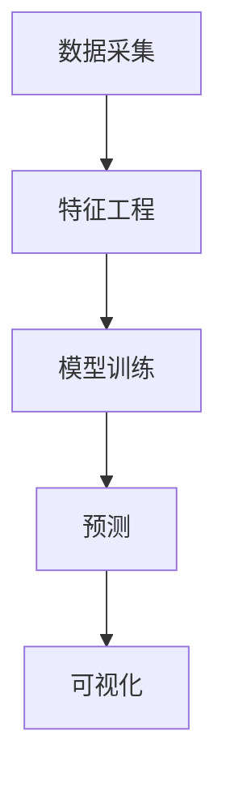
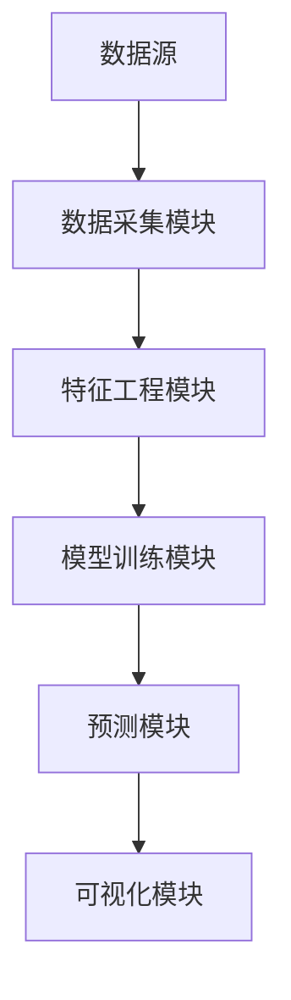

                 


# AI辅助的宏观经济指标预测与情景分析

## 关键词：AI, 宏观经济, 预测模型, 情景分析, 时间序列, 机器学习, 大数据分析

## 摘要：  
随着人工智能技术的快速发展，宏观经济指标的预测与情景分析正逐渐从传统的统计方法转向基于AI的智能分析。本文将系统地介绍AI在宏观经济预测中的应用，从数据预处理到算法选择，再到系统架构设计，详细阐述AI如何提升宏观经济预测的准确性和效率。同时，本文还将探讨如何利用AI进行宏观经济情景分析，为政策制定者和投资者提供科学依据。

---

# 第1章: 宏观经济指标预测的背景与挑战

## 1.1 宏观经济指标的基本概念

### 1.1.1 宏观经济指标的定义与分类  
宏观经济指标是反映一个国家或地区经济运行状况的关键数据，通常分为总量指标、结构指标和价格指标三大类。总量指标包括GDP、就业率等，结构指标包括产业结构分布，价格指标包括通货膨胀率等。

### 1.1.2 宏观经济指标的重要性与应用场景  
宏观经济指标是政府制定政策、企业进行战略规划的重要依据。例如，央行可以通过GDP增长率和通货膨胀率调整货币政策，企业可以通过PMI（采购经理人指数）预测市场需求。

### 1.1.3 宏观经济预测的难点与挑战  
宏观经济预测的难度主要来源于数据的复杂性、不确定性以及模型的局限性。例如，经济指标受到政策、市场情绪等多种因素的影响，且数据往往具有滞后性。

## 1.2 AI技术在宏观经济预测中的作用

### 1.2.1 AI技术的基本原理与优势  
AI技术通过机器学习算法，可以从大量历史数据中提取特征，建立预测模型。其优势在于能够处理非线性关系和复杂的数据模式。

### 1.2.2 AI在宏观经济预测中的独特价值  
AI能够提高预测的准确性和效率，尤其是在处理大数据和复杂关系时表现突出。例如，可以通过自然语言处理技术分析新闻和社交媒体数据，提取情绪指标。

### 1.2.3 宏观经济预测中的数据特点与AI的结合  
宏观经济数据通常具有时间序列特性，AI可以通过时间序列模型（如ARIMA、LSTM）进行建模，捕捉数据中的趋势和周期性。

---

# 第2章: 宏观经济指标预测的AI方法论

## 2.1 数据预处理与特征工程

### 2.1.1 数据清洗与缺失值处理  
在进行预测之前，需要对数据进行清洗，处理缺失值和异常值。例如，可以通过均值填充或插值法处理缺失值。

### 2.1.2 数据标准化与归一化  
由于不同指标的量纲不同，需要对数据进行标准化或归一化处理。例如，使用标准化方法将不同指标的值统一到相同的范围内。

### 2.1.3 时间序列数据的特征提取  
时间序列数据可以通过滑动窗口方法提取特征，例如计算移动平均值（MA）、移动标准差（STD）等。

## 2.2 常见的宏观经济预测模型

### 2.2.1 时间序列分析模型  
时间序列模型是宏观经济预测的核心工具，常用的模型包括ARIMA和Prophet。

### 2.2.2 机器学习模型  
机器学习模型（如随机森林、XGBoost）可以处理非线性关系，适合复杂的数据模式。

### 2.2.3 统计模型与混合模型  
混合模型（如ARIMA-LSTM）结合了统计模型和深度学习模型的优势，能够捕捉复杂的时序特征。

## 2.3 AI辅助预测的核心算法

### 2.3.1 线性回归与广义线性模型  
线性回归模型适用于线性关系的预测，但其局限性在于无法处理非线性关系。

### 2.3.2 支持向量机与核方法  
支持向量机通过核方法可以处理非线性分类和回归问题。

### 2.3.3 随机森林与集成学习  
集成学习通过组合多个模型的结果，能够提高预测的准确性和稳定性。

---

# 第3章: 宏观经济指标预测的系统架构

## 3.1 系统架构设计

### 3.1.1 系统功能模块划分  
系统通常包括数据采集、特征工程、模型训练、预测和可视化五个模块。

### 3.1.2 系统组件之间的关系  
数据采集模块将数据传输到特征工程模块，特征工程模块处理后传给模型训练模块，训练好的模型用于预测，预测结果在可视化模块展示。

### 3.1.3 系统架构图  


## 3.2 系统接口设计

### 3.2.1 数据接口  
数据接口负责与数据源（如数据库、API）进行交互，获取宏观经济指标数据。

### 3.2.2 模型接口  
模型接口负责接收输入数据，调用预测模型进行计算，返回预测结果。

### 3.2.3 可视化接口  
可视化接口负责将预测结果展示给用户，通常以图表形式呈现。

---

# 第4章: 宏观经济情景分析的AI方法

## 4.1 宏观经济情景分析的基本概念

### 4.1.1 宏观经济情景的定义与分类  
情景分析是通过构建不同的假设场景，预测经济指标的变化趋势。常见的场景包括基准情景、最好情景和最坏情景。

### 4.1.2 不同情景分析的目的与意义  
情景分析可以帮助政策制定者和投资者提前规划，应对可能的经济波动。

### 4.1.3 情景分析在政策制定中的作用  
情景分析为政策制定者提供了多种可能的经济走势，有助于制定更具前瞻性的政策。

## 4.2 AI在情景分析中的应用

### 4.2.1 基于AI的情景生成方法  
AI可以通过生成模型（如GAN）生成多种可能的经济情景。

### 4.2.2 情景模拟与结果分析  
通过模拟不同情景，分析其对经济指标的影响，例如GDP增长率的变化。

### 4.2.3 情景分析的可视化与解释  
可视化工具可以帮助用户更好地理解不同情景下的经济走势。

---

# 第5章: 宏观经济指标预测的系统架构

## 5.1 系统功能设计

### 5.1.1 系统功能模块划分  
系统功能模块包括数据采集、特征工程、模型训练、预测和可视化。

### 5.1.2 系统功能流程图  


## 5.2 系统架构设计

### 5.2.1 系统架构图  


## 5.3 系统接口设计

### 5.3.1 数据接口  
数据接口负责与数据源进行交互，获取宏观经济指标数据。

### 5.3.2 模型接口  
模型接口负责接收输入数据，调用预测模型进行计算，返回预测结果。

### 5.3.3 可视化接口  
可视化接口负责将预测结果展示给用户，通常以图表形式呈现。

---

# 第6章: 项目实战

## 6.1 环境搭建

### 6.1.1 安装Python和必要的库  
安装Python，并通过pip安装numpy、pandas、scikit-learn、keras等库。

## 6.2 数据获取与处理

### 6.2.1 数据获取  
从公开数据源（如世界银行）获取宏观经济指标数据。

### 6.2.2 数据清洗与特征工程  
处理缺失值和异常值，提取时间序列特征。

## 6.3 模型训练与预测

### 6.3.1 线性回归模型  
```python
from sklearn.linear_model import LinearRegression
model = LinearRegression()
model.fit(X_train, y_train)
```

### 6.3.2 LSTM模型  
```python
from keras.models import Sequential
from keras.layers import LSTM, Dense
model = Sequential()
model.add(LSTM(50, input_shape=(timesteps, features)))
model.add(Dense(1))
model.compile(optimizer='adam', loss='mean_squared_error')
model.fit(X_train, y_train, epochs=100, batch_size=32)
```

## 6.4 情景分析与可视化

### 6.4.1 情景生成  
使用蒙特卡洛方法生成多种经济情景。

### 6.4.2 情景模拟  
模拟不同情景下的GDP增长率变化。

### 6.4.3 可视化展示  
使用Matplotlib绘制不同情景下的GDP增长曲线。

---

# 第7章: 高级主题与扩展

## 7.1 多变量宏观经济预测

### 7.1.1 多变量时间序列模型  
使用向量自回归模型（VAR）进行多变量预测。

### 7.1.2 基于NLP的宏观经济分析  
通过自然语言处理技术分析新闻和社交媒体数据，提取经济指标的影响因素。

## 7.2 情景模拟的动态调整

### 7.2.1 动态调整模型参数  
根据实时数据动态调整模型参数，提高预测的准确性。

### 7.2.2 实时情景分析  
根据最新数据实时更新情景分析结果，提供及时的经济走势预测。

---

# 第8章: 最佳实践与小结

## 8.1 最佳实践

### 8.1.1 数据质量的重要性  
确保数据的准确性和完整性，数据预处理是关键。

### 8.1.2 模型选择与调优  
选择合适的模型，并通过网格搜索等方法进行调优。

### 8.1.3 可视化与解释性  
通过可视化工具帮助用户理解预测结果，提高模型的可解释性。

## 8.2 小结

### 8.2.1 全文总结  
本文系统地介绍了AI在宏观经济指标预测与情景分析中的应用，从理论到实践，详细阐述了AI技术的优势和应用场景。

### 8.2.2 未来展望  
随着AI技术的不断发展，宏观经济预测将更加精准，情景分析将更加智能化和动态化。

---

# 附录

## 附录A: 数据来源与工具安装

### A.1 数据来源  
宏观经济数据可以来源于世界银行、国际货币基金组织（IMF）等官方网站。

### A.2 工具安装  
安装Python和必要的库：`pip install numpy pandas scikit-learn keras`

## 附录B: 代码示例

### B.1 线性回归模型  
```python
import numpy as np
import pandas as pd
from sklearn.linear_model import LinearRegression
from sklearn.metrics import mean_squared_error

# 数据准备
X = np.array([i for i in range(100)]).reshape(-1, 1)
y = np.array([2*i + 1 for i in range(100)])

# 模型训练
model = LinearRegression()
model.fit(X, y)

# 预测
y_pred = model.predict(X)
print(mean_squared_error(y, y_pred))
```

### B.2 LSTM模型  
```python
import numpy as np
from keras.models import Sequential
from keras.layers import LSTM, Dense

# 数据准备
timesteps = 10
features = 1
X = np.random.rand(100, timesteps, features)
y = np.random.rand(100, 1)

# 模型训练
model = Sequential()
model.add(LSTM(50, input_shape=(timesteps, features)))
model.add(Dense(1))
model.compile(optimizer='adam', loss='mean_squared_error')
model.fit(X, y, epochs=50, batch_size=32)
```

---

通过以上目录和内容设计，我们可以系统地展开《AI辅助的宏观经济指标预测与情景分析》这一主题，从基础理论到实际应用，全面覆盖AI在宏观经济预测中的各个方面。

