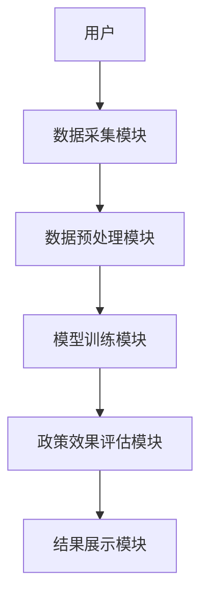
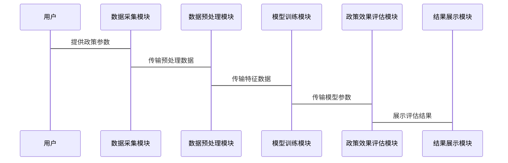

                 


# 《AI辅助的宏观经济政策效果评估》

---

## 关键词：AI技术、宏观经济政策、政策效果评估、机器学习、深度学习、NLP

---

## 摘要：  
本文系统探讨了AI技术在宏观经济政策效果评估中的应用与实践。通过分析宏观经济政策评估的核心概念、AI技术的基本原理及其在宏观经济领域的具体应用，本文提出了一种基于AI的宏观经济政策效果评估框架，并详细介绍了其算法原理、系统架构设计以及实际案例分析。文章最后总结了AI辅助宏观经济政策效果评估的优势与挑战，并展望了未来的发展方向。

---

## 第一部分: 宏观经济政策效果评估的背景与挑战

### 第1章: 宏观经济政策效果评估概述

#### 1.1 宏观经济政策的基本概念

##### 1.1.1 宏观经济政策的定义与目标  
宏观经济政策是指政府或中央银行为了实现特定经济目标（如经济增长、就业稳定、价格稳定等）而采取的一系列政策措施，包括货币政策、财政政策、产业政策等。

##### 1.1.2 宏观经济政策的主要工具与手段  
- **货币政策**：通过调整货币供应量、利率等手段影响经济活动。  
- **财政政策**：通过调整政府支出、税收等手段影响经济活动。  
- **产业政策**：通过政府干预特定产业的发展，促进产业结构优化。  

##### 1.1.3 宏观经济政策的实施主体与作用机制  
- **实施主体**：政府、中央银行等。  
- **作用机制**：通过政策工具的调整，影响市场参与者（企业、家庭、金融机构）的行为，进而实现政策目标。

#### 1.2 宏观经济政策效果评估的重要性

##### 1.2.1 宏观经济政策效果评估的定义  
宏观经济政策效果评估是指通过分析政策实施后的实际效果，判断政策是否达到了预期目标，并为未来的政策制定提供参考依据。

##### 1.2.2 宏观经济政策效果评估的意义与作用  
- **意义**：  
  - 为政策制定者提供科学依据。  
  - 为政策执行提供优化方向。  
  - 为政策效果的公众沟通提供数据支持。  
- **作用**：  
  - 提高政策决策的科学性。  
  - 降低政策实施的风险。  
  - 提升政策效果的透明度。  

##### 1.2.3 宏观经济政策效果评估的难点与挑战  
- **数据获取难度**：宏观经济政策的效果通常涉及大量复杂的数据，且数据可能存在缺失或不完整性。  
- **政策实施的滞后性**：政策效果的显现通常需要较长时间，难以快速评估。  
- **政策的多目标冲突**：宏观经济政策往往需要在多个目标之间寻求平衡，增加了评估的复杂性。  

#### 1.3 AI技术在宏观经济政策效果评估中的应用前景

##### 1.3.1 AI技术的基本概念与特点  
- **基本概念**：人工智能（AI）是指通过计算机模拟人类智能的技术，包括学习、推理、自适应等能力。  
- **特点**：  
  - 数据驱动：AI技术依赖大量数据进行学习和推理。  
  - 自适应性：AI系统能够根据数据变化自动调整模型参数。  
  - 高效性：AI技术能够快速处理大量复杂数据。  

##### 1.3.2 AI技术在宏观经济领域的应用现状  
- **现状**：  
  - 在经济预测领域，AI技术已经被广泛应用于GDP预测、通货膨胀预测等。  
  - 在政策模拟领域，AI技术被用于模拟政策实施后的经济效果。  

##### 1.3.3 AI技术在宏观经济政策效果评估中的潜力  
- **潜力**：  
  - 提高政策评估的效率和准确性。  
  - 发现传统方法难以捕捉的复杂模式。  
  - 支持实时政策调整与优化。  

---

## 第二部分: AI辅助宏观经济政策效果评估的核心概念与方法

### 第2章: 宏观经济政策效果评估的核心概念

#### 2.1 宏观经济政策效果评估的主要指标

##### 2.1.1 经济增长指标  
- **GDP增长率**：衡量经济整体增长情况。  
- **人均GDP**：衡量经济发展水平。  

##### 2.1.2 就业指标  
- **失业率**：衡量劳动力市场状况。  
- **就业增长率**：衡量就业市场的扩张情况。  

##### 2.1.3 通货膨胀指标  
- **CPI（消费者物价指数）**：衡量居民生活成本的变化。  
- **通货膨胀率**：衡量物价整体水平的变化。  

##### 2.1.4 财政与货币政策指标  
- **财政赤字**：衡量政府财政状况。  
- **基准利率**：衡量货币政策的松紧程度。  

#### 2.2 宏观经济政策效果评估的基本模型

##### 2.2.1 宏观经济均衡模型  
- **定义**：描述宏观经济系统中各变量之间的均衡关系。  
- **核心要素**：GDP、失业率、通货膨胀率等。  

##### 2.2.2 宏观经济政策传导机制模型  
- **定义**：描述政策工具如何通过传导机制影响经济变量。  
- **核心要素**：政策工具、传导路径、经济变量。  

##### 2.2.3 宏观经济政策效果的动态评估模型  
- **定义**：通过动态模型模拟政策实施后的经济变化过程。  
- **核心要素**：时间序列数据、政策变量、经济变量。  

#### 2.3 宏观经济政策效果评估的边界与外延

##### 2.3.1 宏观经济政策效果的可量化范围  
- **可量化范围**：经济增长、就业、物价等可以直接量化的指标。  
- **不可量化范围**：政策对社会福利、环境影响等间接效果。  

##### 2.3.2 宏观经济政策效果评估的不确定性因素  
- **数据不确定性**：数据的准确性和完整性可能影响评估结果。  
- **模型假设不确定性**：模型假设可能与实际情况存在偏差。  

##### 2.3.3 宏观经济政策效果的长期与短期影响  
- **短期影响**：政策实施后的即时效果。  
- **长期影响**：政策实施后的持续效果。  

---

## 第三部分: AI技术在宏观经济政策效果评估中的应用原理

### 第3章: AI技术的基本原理与宏观经济政策效果评估的结合

#### 3.1 机器学习的基本原理

##### 3.1.1 机器学习的定义与核心概念  
- **定义**：机器学习是一种通过数据训练模型，使其能够从数据中学习并做出预测的技术。  
- **核心概念**：特征、标签、模型、训练、测试。  

##### 3.1.2 机器学习的主要算法与模型  
- **线性回归**：用于预测连续型变量（如GDP增长率）。  
- **逻辑回归**：用于分类问题（如判断经济政策是否有效）。  
- **支持向量机（SVM）**：用于分类和回归问题。  
- **随机森林**：用于分类和回归问题，具有较强的抗过拟合能力。  

##### 3.1.3 机器学习在宏观经济政策效果评估中的应用  
- **案例**：使用线性回归模型预测货币政策实施后的GDP增长率。  

#### 3.2 深度学习的基本原理

##### 3.2.1 深度学习的定义与核心概念  
- **定义**：深度学习是一种基于人工神经网络的机器学习技术，通过多层非线性变换模拟复杂数据模式。  
- **核心概念**：神经网络、层、激活函数、损失函数、优化器。  

##### 3.2.2 深度学习的主要算法与模型  
- **卷积神经网络（CNN）**：适用于图像识别、时间序列分析等任务。  
- **循环神经网络（RNN）**：适用于时间序列数据的分析。  
- **长短期记忆网络（LSTM）**：适用于时间序列数据的长距离依赖建模。  

##### 3.2.3 深度学习在宏观经济政策效果评估中的应用  
- **案例**：使用LSTM模型预测财政政策实施后的就业增长率。  

#### 3.3 自然语言处理（NLP）的基本原理

##### 3.3.1 NLP的定义与核心概念  
- **定义**：NLP是一种通过计算机处理人类语言的技术，包括文本分析、信息提取、语义理解等。  
- **核心概念**：分词、词性标注、句法分析、语义分析、情感分析。  

##### 3.3.2 NLP的主要算法与模型  
- **词袋模型**：将文本表示为词袋，忽略词语顺序。  
- **TF-IDF**：计算词语在文本中的重要性。  
- **词嵌入（Word Embedding）**：将词语映射为低维向量。  
- **Transformer**：基于自注意力机制的模型，如BERT、GPT。  

##### 3.3.3 NLP在宏观经济政策效果评估中的应用  
- **案例**：通过分析政策文本，提取政策关键词，辅助政策效果评估。  

---

## 第四部分: 系统分析与架构设计

### 第4章: AI辅助宏观经济政策效果评估系统的架构设计

#### 4.1 系统功能设计

##### 4.1.1 数据采集模块  
- **功能**：采集宏观经济数据、政策文本数据等。  
- **工具**：API接口、爬虫工具。  

##### 4.1.2 数据预处理模块  
- **功能**：清洗数据、特征提取、数据标准化。  
- **工具**：Pandas、NumPy。  

##### 4.1.3 模型训练模块  
- **功能**：选择合适的AI模型，训练模型并进行调优。  
- **工具**：Scikit-learn、TensorFlow、Keras。  

##### 4.1.4 政策效果评估模块  
- **功能**：输入政策参数，输出政策效果评估结果。  
- **工具**：自定义模型接口。  

#### 4.2 系统架构设计

##### 4.2.1 系统架构图  


##### 4.2.2 系统交互流程  


---

## 第五部分: 项目实战

### 第5章: 基于AI的宏观经济政策效果评估系统实现

#### 5.1 环境安装

##### 5.1.1 安装Python  
- **命令**：`python --version`  
- **版本要求**：Python 3.8及以上。  

##### 5.1.2 安装依赖库  
- **命令**：  
  ```bash
  pip install numpy pandas scikit-learn tensorflow keras matplotlib
  ```

#### 5.2 系统核心实现

##### 5.2.1 数据采集模块  
```python
import requests
import json

def fetch_macro_data():
    url = "https://api.example.com/macro_data"
    response = requests.get(url)
    data = response.json()
    return data
```

##### 5.2.2 数据预处理模块  
```python
import pandas as pd
import numpy as np

def preprocess_data(data):
    df = pd.DataFrame(data)
    df = df.dropna()
    df['normalized_gdp'] = (df['gdp'] - df['gdp'].mean()) / df['gdp'].std()
    return df
```

##### 5.2.3 模型训练模块  
```python
from sklearn.linear_model import LinearRegression
from sklearn.metrics import mean_squared_error

def train_model(X, y):
    model = LinearRegression()
    model.fit(X, y)
    return model
```

##### 5.2.4 政策效果评估模块  
```python
def evaluate_policy(policy_params, model):
    # 输入政策参数，预测效果
    prediction = model.predict(policy_params)
    return prediction
```

#### 5.3 案例分析

##### 5.3.1 案例背景  
假设我们希望评估一项新的货币政策对GDP增长率的影响。

##### 5.3.2 数据准备  
```python
data = fetch_macro_data()
df = preprocess_data(data)
X = df[['inflation_rate', 'unemployment_rate']]
y = df['gdp_growth_rate']
```

##### 5.3.3 模型训练  
```python
model = train_model(X, y)
```

##### 5.3.4 政策效果评估  
```python
policy_params = [[2.5, 6.5]]  # 假设的通货膨胀率和失业率
prediction = evaluate_policy(policy_params, model)
print(f"预测的GDP增长率：{prediction[0]}%")
```

---

## 第六部分: 总结与展望

### 第6章: 总结与展望

#### 6.1 总结

##### 6.1.1 AI技术在宏观经济政策效果评估中的优势  
- **高效性**：AI技术能够快速处理大量数据。  
- **准确性**：AI技术能够发现传统方法难以捕捉的复杂模式。  
- **实时性**：AI技术能够支持实时政策调整与优化。  

##### 6.1.2 本文的主要贡献  
- 提出了基于AI的宏观经济政策效果评估框架。  
- 详细介绍了AI技术在宏观经济政策效果评估中的具体应用。  
- 提供了完整的系统实现方案和实际案例分析。  

#### 6.2 展望

##### 6.2.1 未来的研究方向  
- **模型优化**：进一步优化AI模型，提高预测精度。  
- **多目标优化**：研究如何在多目标冲突下优化政策效果评估。  
- **实时评估**：探索如何实现政策效果的实时评估。  

##### 6.2.2 未来的发展挑战  
- **数据隐私**：如何在保护数据隐私的前提下进行政策效果评估。  
- **模型解释性**：如何提高AI模型的解释性，使其更易于被政策制定者理解和使用。  
- **跨学科融合**：如何进一步融合经济学、统计学、计算机科学等多学科知识，推动宏观经济政策效果评估的创新发展。  

---

## 参考文献  
（此处可根据实际需求添加相关文献资料）  

---

通过以上目录大纲，我们可以看到，本文从宏观经济政策效果评估的背景与挑战出发，逐步深入探讨了AI技术在这一领域的应用原理与实践，最终提出了一个完整的基于AI的宏观经济政策效果评估框架，并通过实际案例进行了验证。希望本文能够为读者提供一个清晰的思路，帮助他们更好地理解和应用AI技术在宏观经济政策效果评估中的潜力与价值。

