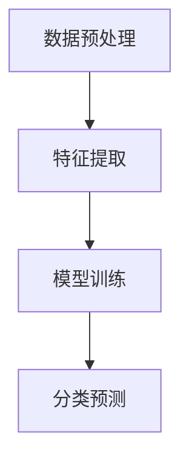
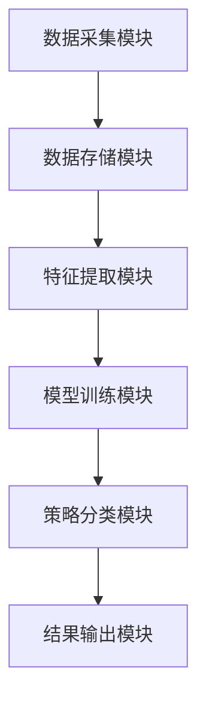
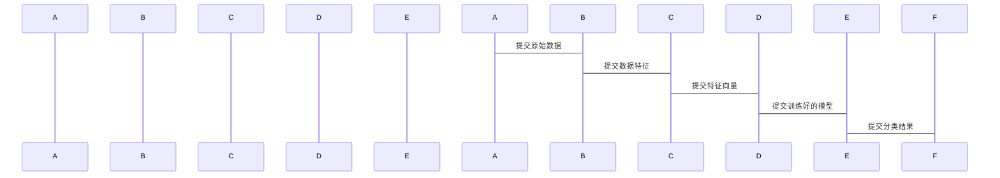

                 


# AI辅助的对冲基金策略分类与性能评估

## 关键词
- 对冲基金
- AI辅助
- 策略分类
- 性能评估
- 机器学习
- 深度学习
- 算法优化

## 摘要
在现代金融领域，对冲基金作为一种重要的投资工具，其策略多样性和复杂性使得传统的人工分析变得日益困难。随着人工智能技术的飞速发展，AI辅助的对冲基金策略分类与性能评估正成为行业内的焦点。本文系统地探讨了AI在对冲基金策略分类中的应用，详细解析了基于机器学习和深度学习的算法原理，并通过实际案例分析了AI辅助策略分类的优势与挑战。文章还从系统架构设计、项目实战、最佳实践等多个维度，全面评估了AI在对冲基金中的应用效果，为从业者提供了深入的理论指导和实践参考。

---

# 第1章: 对冲基金与AI辅助策略概述

## 1.1 对冲基金的基本概念
### 1.1.1 对冲基金的定义与特点
- 对冲基金的定义：一种通过做空和做多相结合的投资基金，旨在通过市场中性策略降低风险。
- 对冲基金的特点：高风险、高回报，策略多样性，杠杆使用，私募性质。

### 1.1.2 对冲基金的主要策略类型
- 股票策略：包括多空策略、事件驱动策略、套利策略等。
- 量化策略：基于数学模型的算法交易、统计套利等。
- 债券策略：固定收益产品套利、信用风险对冲等。

### 1.1.3 对冲基金的市场规模与发展趋势
- 全球对冲基金市场规模：近年来持续增长，特别是在量化策略领域。
- 对冲基金行业的发展趋势：技术驱动、量化交易普及、AI技术的应用。

## 1.2 AI在金融领域的应用背景
### 1.2.1 人工智能在金融行业的应用现状
- AI在金融领域的应用：从交易执行、风险评估到客户画像。
- AI在对冲基金中的具体应用：策略优化、市场预测、风险控制。

### 1.2.2 对冲基金中AI技术的核心作用
- 数据处理：AI能够快速分析海量金融数据，提取关键特征。
- 模型构建：基于机器学习的预测模型帮助发现市场规律。
- 策略优化：AI通过不断迭代优化交易策略，提升收益和风险控制能力。

### 1.2.3 AI辅助对冲基金的优势与挑战
- 优势：提高决策效率，降低人为情绪干扰，增强策略的系统性和科学性。
- 挑战：数据质量、模型过拟合、市场波动性大等问题。

## 1.3 本章小结
本章从对冲基金的基本概念入手，分析了其主要策略类型及发展趋势，重点阐述了AI在对冲基金中的应用背景和核心作用，同时指出了面临的挑战。

---

# 第2章: 对冲基金策略分类与AI技术结合的核心概念

## 2.1 数据驱动的对冲基金策略分类
### 2.1.1 数据特征提取与策略分类的关系
- 数据特征提取：通过统计学方法或机器学习方法从历史数据中提取有意义的特征。
- 策略分类的重要性：准确的策略分类是实现AI辅助对冲的前提。

### 2.1.2 基于机器学习的策略分类方法
- 传统机器学习模型：如逻辑回归、支持向量机（SVM）等。
- 算法选择与特征工程：特征选择、降维技术（如PCA）的应用。

### 2.1.3 数据特征与策略分类的联系
- 特征的重要性：不同策略类型对应的特征不同，如动量策略和均值回归策略的特征差异。
- 数据特征对分类准确率的影响：高质量特征是分类成功的关键。

## 2.2 AI辅助策略分类的核心原理
### 2.2.1 机器学习模型在策略分类中的应用
- 线性模型：如逻辑回归，适用于线性可分的数据。
- 非线性模型：如随机森林、神经网络，适用于复杂数据关系。

### 2.2.2 深度学习模型的优势与局限性
- 深度学习的优势：能够自动提取特征，处理高维数据。
- 深度学习的局限性：计算资源消耗大，模型解释性较差。

### 2.2.3 混合模型在策略分类中的潜力
- 混合模型的概念：结合传统机器学习和深度学习的优势。
- 混合模型的应用：在对冲基金策略分类中的潜在效果。

## 2.3 对冲基金策略分类的ER实体关系图
```mermaid
er
    entity 对冲基金策略 {
        key: 策略ID
        string: 策略名称
        string: 策略类型
        date: 创建时间
        date: 最后修改时间
    }
    entity 数据特征 {
        key: 特征ID
        string: 特征名称
        float: 特征重要性
        date: 特征提取时间
    }
    entity 分类结果 {
        key: 分类ID
        foreign key: 策略ID (对冲基金策略.策略ID)
        string: 分类标签
        date: 分类时间
    }
    对冲基金策略 -- 数据特征: 特征支持
    对冲基金策略 -- 分类结果: 分类结果
```

---

# 第3章: 对冲基金策略分类的算法原理与实现

## 3.1 基于机器学习的策略分类算法
### 3.1.1 支持向量机（SVM）算法

- SVM算法的核心思想：通过最大化分类间隔，找到最优超平面。
- 数学公式：
  $$ \text{目标函数：} \max_{w,b} \frac{1}{2}\|w\|^2 $$
  $$ \text{约束条件：} y_i(w \cdot x_i + b) \geq 1 $$
  $$ \text{拉格朗日函数：} L = \sum \alpha_i y_i (w \cdot x_i + b) - \frac{1}{2}\|w\|^2 $$

### 3.1.2 随机森林算法
- 随机森林的工作原理：通过构建多个决策树，利用投票法进行分类。
- 优势：抗过拟合能力强，特征重要性分析直观。

### 3.1.3 算法选择的注意事项
- 数据集的大小与算法选择：小数据适合SVM，大数据适合随机森林。
- 数据特征的类型与算法匹配：线性模型适合线性可分数据，非线性模型适合复杂数据。

## 3.2 深度学习模型的应用
### 3.2.1 神经网络模型
- 多层感知机（MLP）：用于处理非线性分类问题。
- LSTM网络：适用于时间序列数据的分析。

### 3.2.2 深度学习模型的优缺点
- 优点：能够捕捉复杂数据模式，适合高维数据。
- 缺点：计算资源消耗大，模型解释性差。

## 3.3 算法实现与性能评估
### 3.3.1 算法实现步骤
1. 数据清洗与预处理。
2. 特征工程：提取关键特征。
3. 模型训练：选择合适的算法进行训练。
4. 模型评估：使用交叉验证评估模型性能。

### 3.3.2 性能评估指标
- 准确率：分类正确的样本比例。
- 召回率：模型识别的正类样本比例。
- F1分数：综合准确率和召回率的指标。

---

# 第4章: 对冲基金策略分类的系统架构设计

## 4.1 系统功能设计
### 4.1.1 数据采集模块
- 数据源：金融数据库、API接口。
- 数据格式：结构化数据（如股票价格、交易量）和非结构化数据（如新闻文本）。

### 4.1.2 特征提取模块
- 时间序列特征：动量、波动率、均值回归指标。
- 文本特征：情感分析、关键词提取。

### 4.1.3 模型训练模块
- 模型选择：根据任务需求选择合适的算法。
- 超参数调优：使用网格搜索或随机搜索优化模型性能。

### 4.1.4 策略分类模块
- 分类结果输出：将策略分为不同类别。
- 结果可视化：生成分类结果的图表。

## 4.2 系统架构设计

- 数据存储模块：负责存储原始数据和特征数据。
- 模型训练模块：包括模型训练和超参数优化。
- 策略分类模块：将对冲基金策略分类为不同类别。

## 4.3 系统接口设计
- 输入接口：接收原始数据和特征工程参数。
- 输出接口：提供分类结果和模型性能指标。

## 4.4 系统交互流程图


---

# 第5章: 项目实战——AI辅助的对冲基金策略分类

## 5.1 环境安装与配置
### 5.1.1 安装Python和相关库
- Python版本：建议使用3.8及以上。
- 安装库：`pandas`、`numpy`、`scikit-learn`、`xgboost`、`keras`。

### 5.1.2 数据集准备
- 数据来源：公开金融数据（如Yahoo Finance）。
- 数据预处理：清洗、标准化、特征选择。

## 5.2 系统核心实现
### 5.2.1 特征工程实现
- 使用`pandas`进行数据清洗和特征提取。
- 使用`sklearn`进行特征选择和降维。

### 5.2.2 模型训练实现
- 使用随机森林和神经网络模型进行训练。
- 调整超参数，优化模型性能。

### 5.2.3 分类结果可视化
- 使用`matplotlib`绘制分类结果图表。
- 对比不同模型的分类效果。

## 5.3 实际案例分析
### 5.3.1 数据集描述
- 数据范围：某段时间内的股票数据。
- 标签定义：策略类型。

### 5.3.2 模型训练与评估
- 训练集和测试集划分。
- 评估指标：准确率、F1分数。

### 5.3.3 案例结果分析
- 分类效果对比：随机森林 vs. LSTM网络。
- 模型优势与不足。

## 5.4 项目小结
本章通过实际案例，详细讲解了AI辅助对冲基金策略分类的实现过程，从数据处理到模型训练，再到结果分析，为读者提供了完整的实战指导。

---

# 第6章: 最佳实践与性能评估

## 6.1 最佳实践
### 6.1.1 数据预处理的注意事项
- 数据清洗：处理缺失值、异常值。
- 特征工程：选择与策略分类相关的特征。

### 6.1.2 模型选择的技巧
- 根据数据类型选择模型：结构化数据适合机器学习模型，非结构化数据适合深度学习模型。
- 验证集的使用：避免过拟合。

### 6.1.3 性能优化的策略
- 超参数调优：使用网格搜索或随机搜索。
- 模型集成：结合多种模型的结果提升性能。

## 6.2 性能评估与对比
### 6.2.1 模型性能对比
- 不同算法在对冲基金策略分类中的表现。
- 精度、召回率、F1分数的对比分析。

### 6.2.2 系统性能评估
- 计算效率：训练时间、内存消耗。
- 分类效果的稳定性：不同数据集下的表现一致性。

## 6.3 注意事项
- 数据质量和完整性：数据偏差可能影响分类结果。
- 模型解释性：避免使用过于复杂的模型，便于策略理解和优化。
- 市场变化的适应性：对冲基金策略需要动态调整，AI模型需要定期更新。

## 6.4 拓展阅读
- 推荐相关书籍和论文，供读者深入学习。

---

# 第7章: 总结与展望

## 7.1 本章总结
- AI在对冲基金策略分类中的应用价值。
- 相关技术的发展现状。

## 7.2 未来展望
- AI技术的进一步发展：如强化学习在交易策略中的应用。
- 多模态数据的利用：结合文本、图像等多种数据源进行策略分类。

---

## 参考文献
（此处列出相关书籍和论文）

---

## 致谢
感谢读者的支持与关注，感谢在本书编写过程中提供帮助的各位专家和朋友。

---

## 附录
（可选，包括代码、数据表、扩展资料等）

---

### 作者简介
（可选，介绍作者的背景和专业领域）

---

### 索引
（可选，方便读者快速查找关键词）

---

# 结束语
感谢您的阅读，希望本书能为您提供有价值的见解和实践指导，助您在AI辅助的对冲基金策略分类与性能评估领域取得更好的成果。

---

通过以上目录结构，您可以逐步展开每章内容，确保文章逻辑清晰、结构紧凑、内容详实。希望这能为您提供一个坚实的基础，帮助您完成一篇高质量的技术博客文章。

