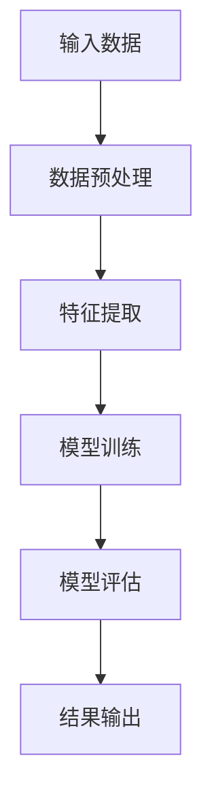
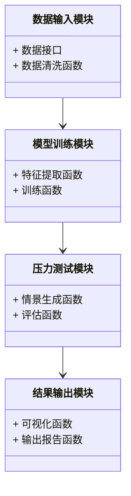
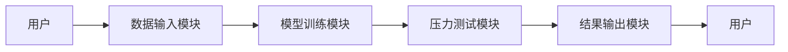

                 


# AI辅助的投资组合压力测试

## 关键词
AI, 投资组合, 压力测试, 机器学习, 金融风险

## 摘要
投资组合压力测试是评估投资组合在极端市场条件下的表现和风险的重要工具。传统的方法依赖于统计模型和假设，存在局限性。随着人工智能技术的发展，AI辅助的投资组合压力测试逐渐成为研究的热点。本文将详细探讨AI在投资组合压力测试中的应用，分析其核心算法、系统架构和实现方案，以及在实际中的应用案例。通过本文，读者可以全面理解AI如何提升投资组合压力测试的效率和准确性。

## 第一部分: AI辅助的投资组合压力测试概述

### 第1章: 投资组合压力测试的背景与意义

#### 1.1 投资组合压力测试的背景
投资组合压力测试是一种用于评估投资组合在极端市场条件下的表现和风险的工具。传统的压力测试方法主要基于统计模型和历史数据分析，存在一定的局限性。随着人工智能技术的发展，AI辅助的压力测试方法逐渐受到关注。

#### 1.2 投资组合压力测试的核心概念
投资组合压力测试的目的是通过模拟极端市场条件，评估投资组合在这些条件下的表现，从而帮助投资者制定更有效的风险管理策略。AI辅助的压力测试可以利用机器学习算法，提高压力测试的准确性和效率。

#### 1.3 本书的目的与结构
本书旨在探讨AI在投资组合压力测试中的应用，分析其核心算法、系统架构和实现方案。通过实际案例分析，帮助读者理解AI如何提升投资组合压力测试的效果。

### 第2章: AI辅助压力测试的技术基础

#### 2.1 人工智能在金融分析中的应用
机器学习和深度学习技术在金融分析中的应用日益广泛。例如，支持向量机和随机森林等算法可以用于金融数据预测和分类。自然语言处理技术则可以分析金融新闻，提取影响市场的关键信息。

#### 2.2 投资组合管理中的常用模型
马科维茨均值-方差模型是投资组合优化的经典模型，但它假设资产收益符合正态分布，这在实际中可能不成立。因此，引入AI技术可以更准确地建模资产收益的分布。

#### 2.3 数据预处理与特征工程
数据预处理是压力测试的重要步骤，包括数据清洗、标准化和特征选择。特征工程则通过提取有用的特征，提高模型的预测能力。例如，可以使用主成分分析（PCA）进行降维。

### 第3章: AI辅助压力测试的核心算法

#### 3.1 基于机器学习的压力测试模型
支持向量回归（SVR）和随机森林回归是常用的回归模型，可以用于预测投资组合在极端市场条件下的表现。神经网络模型则可以捕捉复杂的非线性关系。

#### 3.2 基于蒙特卡洛模拟的压力测试
蒙特卡洛模拟是一种通过随机抽样来模拟市场情景的方法。结合AI技术，可以生成更符合实际市场条件的极端情景，从而提高压力测试的准确性。

#### 3.3 基于因子模型的压力测试
因子模型将资产收益分解为多个因子的影响，例如市场因子、行业因子等。通过AI技术，可以更好地识别和量化这些因子对投资组合的影响。

### 第4章: 系统架构与实现方案

#### 4.1 系统架构设计
系统架构设计包括数据输入、模型训练、压力测试和结果输出四个模块。数据输入模块负责获取市场数据和投资组合信息；模型训练模块利用机器学习算法构建压力测试模型；压力测试模块生成极端市场情景并评估投资组合表现；结果输出模块将测试结果可视化。

#### 4.2 数据接口与交互设计
系统需要提供友好的用户界面，允许用户输入投资组合信息和市场数据。交互设计需要简洁直观，确保用户能够轻松完成测试过程。

#### 4.3 系统实现的技术选型
选择Python作为开发语言，利用Scikit-learn和TensorFlow等机器学习库进行模型训练。数据存储可以使用Pandas和NumPy进行处理，可视化部分则使用Matplotlib和Seaborn。

## 第二部分: 项目实战与优化

### 第5章: 项目实战

#### 5.1 环境安装与配置
安装Python和相关库，配置开发环境。

#### 5.2 核心代码实现
实现数据预处理、模型训练和压力测试的代码。例如，使用SVR模型进行投资组合收益预测。

#### 5.3 案例分析
通过实际案例分析，展示AI辅助压力测试的效果和优势。

### 第6章: 优化与总结

#### 6.1 最佳实践
总结AI辅助压力测试的最佳实践，例如选择合适的算法和优化数据处理流程。

#### 6.2 小结
回顾全文，总结AI在投资组合压力测试中的应用和未来发展方向。

#### 6.3 注意事项
提醒读者在实际应用中需要注意的事项，例如模型的局限性和数据的准确性。

#### 6.4 拓展阅读
推荐相关书籍和论文，供读者进一步学习和研究。

## 第三部分: 数学模型与算法原理

### 第7章: 数学模型

#### 7.1 马科维茨均值-方差模型
$$\text{目标函数: } \min \sum_{i=1}^n w_i^2 \sigma_i^2 - 2 w_i w_j \sigma_{ij} + w_j^2 \sigma_j^2$$
$$\text{约束条件: } \sum_{i=1}^n w_i = 1, \sum_{i=1}^n w_i r_i = \text{目标收益}$$

#### 7.2 布莱克-斯科尔斯模型
$$C = S_0 N(d_1) - K e^{-rT} N(d_2)$$

### 第8章: 算法原理

#### 8.1 支持向量回归（SVR）
使用Mermaid流程图展示SVR的训练流程：


#### 8.2 神经网络模型
展示神经网络的结构：


### 第9章: 系统架构设计

#### 9.1 系统模块划分
使用类图展示系统模块：


#### 9.2 系统架构图
展示系统整体架构：


## 第四部分: 项目实战与优化

### 第10章: 项目实战

#### 10.1 环境安装
安装必要的Python库，如Scikit-learn、TensorFlow、Pandas等。

#### 10.2 核心代码实现
实现数据预处理、模型训练和压力测试的代码。例如：
```python
import numpy as np
from sklearn.svm import SVR
from sklearn.model_selection import train_test_split

# 示例数据
X = np.random.rand(100, 5)
y = np.random.rand(100, 1)

# 数据分割
X_train, X_test, y_train, y_test = train_test_split(X, y, test_size=0.2)

# 模型训练
model = SVR()
model.fit(X_train, y_train)

# 预测
y_pred = model.predict(X_test)
```

#### 10.3 案例分析
通过具体案例分析，展示AI辅助压力测试的实际效果。

### 第11章: 优化与总结

#### 11.1 最佳实践
总结项目中的最佳实践，如选择合适的算法和优化数据处理流程。

#### 11.2 小结
回顾全文，总结AI在投资组合压力测试中的应用和未来发展方向。

#### 11.3 注意事项
提醒读者在实际应用中需要注意的事项，例如模型的局限性和数据的准确性。

#### 11.4 拓展阅读
推荐相关书籍和论文，供读者进一步学习和研究。

## 结论
通过本文的详细讲解，读者可以全面理解AI在投资组合压力测试中的应用，掌握核心算法和系统架构的设计方法，并通过实际案例分析提升对AI辅助压力测试的认识。未来，随着AI技术的不断发展，投资组合压力测试将更加智能化和精准化，为投资者提供更有力的支持。

---

以上是《AI辅助的投资组合压力测试》的技术博客文章的结构和部分内容。希望这篇文章能够为读者提供清晰的思路和详尽的知识，帮助他们在实际应用中更好地理解和应用AI技术。

