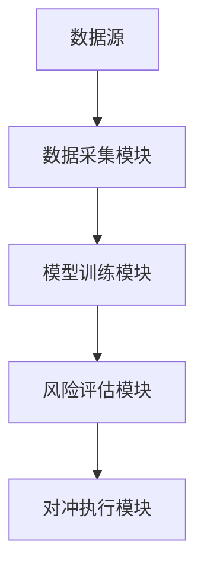

                 


# AI辅助的投资组合尾部风险对冲策略优化

> 关键词：投资组合优化、尾部风险、人工智能、机器学习、风险管理

> 摘要：  
> 本文探讨了如何利用人工智能技术优化投资组合的尾部风险对冲策略。通过对尾部风险的定义、特征及传统对冲策略的分析，提出了基于AI的对冲方法，包括深度学习模型、损失分布函数及风险对冲数学模型。通过系统架构设计和项目实战，展示了AI在尾部风险对冲中的实际应用，并总结了最佳实践和未来发展方向。

---

# {{此处是文章标题}}

> 关键词：{{此处列出文章的5-7个核心关键词}}

> 摘要：{{此处给出文章的核心内容和主题思想}}

---

# 第1章: 投资组合管理与风险管理概述

## 1.1 投资组合管理的基本概念

### 1.1.1 投资组合的定义与构成  
投资组合是指将一定资金按照特定比例分配到不同金融资产上的配置方式。其核心目标是通过资产多元化来降低投资风险，同时追求收益最大化。投资组合的构成包括股票、债券、基金等多种资产类别。

### 1.1.2 投资组合管理的目标与原则  
投资组合管理的目标是实现收益与风险的最佳平衡。其基本原则包括分散化原则、风险与收益匹配原则以及长期投资原则。

### 1.1.3 风险管理在投资组合中的重要性  
风险管理是投资组合管理的核心环节。通过识别、评估和对冲风险，投资者可以降低投资组合的波动性，提高收益的稳定性。

---

## 1.2 尾部风险的定义与特点

### 1.2.1 尾部风险的定义  
尾部风险是指在概率分布的“尾部”区域发生的极端事件，通常概率较低，但一旦发生会对投资组合造成重大损失。例如，市场崩盘、黑天鹅事件等。

### 1.2.2 尾部风险的特征  
尾部风险具有低概率、高损失、不可预测性强等特点。这些特点使得传统的统计方法在对冲尾部风险时效果有限。

### 1.2.3 尾部风险对投资组合的影响  
尾部风险可能导致投资组合的大幅亏损，甚至引发流动性危机。因此，如何有效对冲尾部风险是投资组合管理中的重要课题。

---

## 1.3 传统尾部风险对冲策略

### 1.3.1 传统对冲策略的概述  
传统的尾部风险对冲策略主要包括保险策略（Insurance Strategy）、风险逆转策略（Risk Reversal）和跨式策略（Straddle）。这些策略通常依赖于市场波动性和相关资产的价格走势。

### 1.3.2 常见的尾部风险对冲工具  
常见的尾部风险对冲工具有期权、互换、期货等衍生品。通过购买期权等工具，投资者可以在特定条件下对冲部分尾部风险。

### 1.3.3 传统对冲策略的局限性  
传统对冲策略在面对极端市场条件时往往失效。此外，传统方法通常基于历史数据分析，难以捕捉新的市场趋势。

---

## 1.4 AI技术在金融领域的应用前景

### 1.4.1 AI在金融领域的应用现状  
AI技术已在金融领域的股票预测、信用评估、交易策略等领域得到广泛应用。其强大的数据处理能力和模式识别能力使其成为金融创新的重要工具。

### 1.4.2 AI在投资组合管理中的潜力  
AI可以通过分析海量数据，发现传统方法难以捕捉的市场信号，从而优化投资组合的配置和风险对冲策略。

### 1.4.3 AI辅助对冲策略的优势与挑战  
优势：AI能够实时处理大量非结构化数据，提供动态的对冲建议。挑战：AI模型的黑箱特性可能导致风险难以完全可控。

---

## 1.5 本章小结  
本章介绍了投资组合管理的基本概念、尾部风险的定义与特点，以及传统对冲策略的局限性。同时，分析了AI技术在金融领域的应用前景及其在投资组合管理中的潜力。

---

# 第2章: 尾部风险对冲策略的核心概念与联系

## 2.1 尾部风险对冲的核心概念

### 2.1.1 尾部风险对冲的定义  
尾部风险对冲是指通过特定策略或工具，降低投资组合在极端市场条件下的潜在损失。

### 2.1.2 尾部风险对冲的原理  
尾部风险对冲的原理是通过识别潜在的极端风险事件，并采取相应的对冲措施，如购买保险产品或做空相关资产。

### 2.1.3 尾部风险对冲的关键要素  
尾部风险对冲的关键要素包括风险识别、风险评估、对冲工具选择和对冲效果评估。

---

## 2.2 AI辅助对冲策略的核心概念

### 2.2.1 AI在尾部风险对冲中的作用  
AI可以通过机器学习模型预测极端市场事件的发生概率，并提出相应的对冲建议。

### 2.2.2 AI辅助对冲策略的原理  
AI辅助对冲策略的原理是利用机器学习算法，分析历史数据和实时数据，识别潜在风险，并优化对冲工具的配置。

### 2.2.3 AI辅助对冲策略的关键技术  
关键技术包括深度学习、强化学习、自然语言处理等，这些技术可以帮助模型更好地捕捉市场信号。

---

## 2.3 尾部风险对冲

### 2.3.1 尾部风险对冲与投资组合优化的关系  
尾部风险对冲是投资组合优化的重要组成部分。通过对尾部风险的有效对冲，可以提高投资组合的稳定性。

### 2.3.2 AI如何优化尾部风险对冲策略  
AI可以通过实时数据分析和模型优化，动态调整对冲策略，从而提高对冲效率。

### 2.3.3 尾部风险对冲的数学模型  
尾部风险对冲的数学模型通常包括损失分布函数、风险价值（VaR）和预期短缺（ES）等。

---

## 2.4 尾部风险对冲与投资组合优化的联系

### 2.4.1 尾部风险对冲对投资组合稳定性的影响  
有效的尾部风险对冲可以显著降低投资组合的波动性，提高其稳定性。

### 2.4.2 AI如何提升投资组合的优化效率  
AI技术可以帮助投资者更快速、准确地识别和对冲尾部风险，从而提升投资组合的优化效率。

### 2.4.3 尾部风险对冲的未来发展方向  
未来，随着AI技术的不断发展，尾部风险对冲策略将更加智能化、个性化和动态化。

---

## 2.5 本章小结  
本章详细阐述了尾部风险对冲的核心概念与AI辅助对冲策略的关键技术，分析了尾部风险对冲与投资组合优化的联系。

---

# 第3章: AI辅助尾部风险对冲策略的核心算法

## 3.1 深度学习模型在尾部风险预测中的应用

### 3.1.1 深度学习模型的概述  
深度学习模型是一种基于人工神经网络的机器学习模型，具有强大的非线性特征提取能力。

### 3.1.2 深度学习模型的训练流程  
深度学习模型的训练流程包括数据预处理、模型构建、模型训练、模型评估和模型优化。

### 3.1.3 深度学习模型在尾部风险预测中的优势  
深度学习模型能够捕捉复杂的市场模式，提高尾部风险预测的准确性。

---

## 3.2 损失分布函数与风险对冲数学模型

### 3.2.1 损失分布函数的定义  
损失分布函数描述了不同损失水平发生的概率分布。

### 3.2.2 风险对冲数学模型的构建  
风险对冲数学模型通常基于损失分布函数，结合投资组合的权重分布，计算出最优对冲策略。

### 3.2.3 风险对冲数学模型的优化  
通过优化模型参数，可以提高对冲策略的有效性。

---

## 3.3 AI辅助对冲策略的优化算法

### 3.3.1 强化学习在对冲策略优化中的应用  
强化学习是一种通过试错机制优化策略的机器学习方法，适用于动态市场环境下的对冲策略优化。

### 3.3.2 遗传算法在对冲策略优化中的应用  
遗传算法是一种基于生物进化原理的优化算法，适用于复杂的多目标对冲策略优化。

### 3.3.3 混合算法的优势  
混合算法结合了多种算法的优点，能够更好地适应复杂的市场环境。

---

## 3.4 本章小结  
本章详细介绍了深度学习模型、损失分布函数和优化算法在AI辅助尾部风险对冲策略中的应用。

---

# 第4章: 系统分析与架构设计方案

## 4.1 系统应用场景

### 4.1.1 投资组合管理的场景描述  
本系统适用于机构投资者和高净值个人的投资组合管理。

### 4.1.2 尾部风险对冲的场景描述  
系统能够实时监测市场风险，自动触发对冲机制。

---

## 4.2 系统功能设计

### 4.2.1 数据采集模块  
数据采集模块负责收集市场数据，包括股票价格、指数、期权价格等。

### 4.2.2 模型训练模块  
模型训练模块负责训练深度学习模型，生成尾部风险预测结果。

### 4.2.3 风险评估模块  
风险评估模块根据预测结果，评估投资组合的尾部风险。

### 4.2.4 对冲执行模块  
对冲执行模块根据评估结果，执行相应的对冲策略。

---

## 4.3 系统架构设计

### 4.3.1 系统架构图  


### 4.3.2 关键模块接口设计  
模块之间的接口设计需要考虑数据格式和通信协议。

### 4.3.3 系统交互流程  
系统交互流程包括数据采集、模型训练、风险评估和对冲执行四个阶段。

---

## 4.4 本章小结  
本章详细描述了系统的设计与架构，包括功能模块、系统架构和模块之间的交互流程。

---

# 第5章: 项目实战与案例分析

## 5.1 项目环境配置

### 5.1.1 系统环境  
建议使用Python 3.8及以上版本。

### 5.1.2 数据集准备  
需要收集历史市场数据，包括股票价格、指数、期权价格等。

---

## 5.2 核心代码实现

### 5.2.1 数据预处理  
```python
import pandas as pd

# 读取数据
data = pd.read_csv('market_data.csv')

# 数据清洗
data.dropna(inplace=True)
data = data[~data['date'].duplicated()]
```

### 5.2.2 模型训练  
```python
import tensorflow as tf

# 构建深度学习模型
model = tf.keras.Sequential([
    tf.keras.layers.Dense(64, activation='relu'),
    tf.keras.layers.Dense(1, activation='sigmoid')
])

# 编译模型
model.compile(optimizer='adam', loss='binary_crossentropy')
```

### 5.2.3 风险评估与对冲策略  
```python
import numpy as np

# 风险评估
def risk_assessment(predictions):
    threshold = 0.95
    return np.where(predictions > threshold, 'high', 'low')

# 对冲执行
def hedge_strategy(signal):
    if signal == 'high':
        return 'buy put option'
    else:
        return 'hold'
```

---

## 5.3 实际案例分析

### 5.3.1 案例背景  
假设我们有一个股票投资组合，需要对冲市场崩盘的风险。

### 5.3.2 模型预测结果  
模型预测结果显示，未来一周内市场崩盘的概率为95%。

### 5.3.3 对冲策略执行  
根据模型预测结果，系统触发了买入看跌期权的对冲策略。

---

## 5.4 项目总结  
通过本项目，我们验证了AI辅助对冲策略的有效性，并展示了其在实际应用中的优势。

---

# 第6章: 总结与展望

## 6.1 最佳实践与注意事项

### 6.1.1 数据质量的重要性  
数据质量是模型性能的关键因素，需要确保数据的完整性和准确性。

### 6.1.2 模型解释性的重要性  
模型的解释性是实际应用中的重要考量，需要避免过度依赖黑箱模型。

### 6.1.3 系统稳定性的重要性  
系统的稳定运行是确保对冲策略有效执行的基础。

---

## 6.2 小结  
本文详细探讨了AI辅助的投资组合尾部风险对冲策略优化，分析了其核心算法、系统架构和实际应用。

---

## 6.3 未来展望  
随着AI技术的不断发展，尾部风险对冲策略将更加智能化和个性化。未来的研究方向包括多模态数据融合、自适应优化算法和实时风险监控。

---

# 第7章: 结语

## 7.1 重要性再强调  
AI技术在投资组合管理中的应用前景广阔，尾部风险对冲是其重要组成部分。

## 7.2 致谢  
感谢读者的关注和支持，感谢所有参与本项目的技术人员。

---

# 参考文献  
（此处列出相关参考文献）

---

# 附录: 代码与数据

## 附录A: 核心代码  
```python
# 附录中的代码示例
```

## 附录B: 数据说明  
（数据来源和数据格式说明）

---

# END

