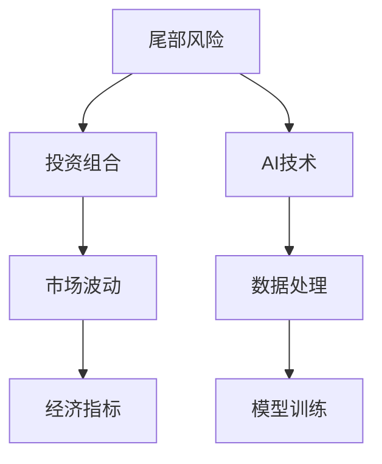
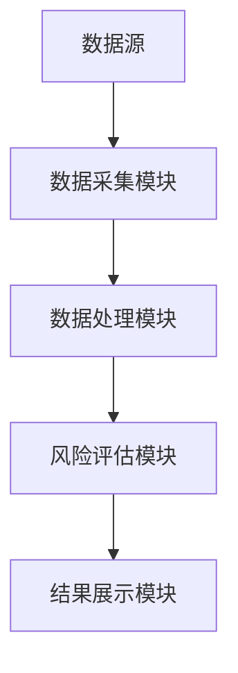

                 


```markdown
# AI辅助的投资组合尾部风险度量

> 关键词：投资组合，尾部风险，人工智能，风险管理，机器学习

> 摘要：本文介绍了一种利用人工智能技术辅助投资组合尾部风险度量的方法。通过结合统计学、金融学和机器学习技术，提出了一个创新的尾部风险度量模型，旨在提高投资组合风险管理的准确性和效率。本文详细分析了传统方法的局限性，探讨了AI技术在尾部风险识别和预测中的应用，提出了基于深度学习的尾部风险预测模型，并通过实际案例验证了模型的有效性。最后，本文总结了研究成果，并展望了未来的发展方向。

---

## 目录

### 第1章: 投资组合尾部风险度量的背景与问题

#### 1.1 问题背景
- 1.1.1 投资组合风险的基本概念
- 1.1.2 尾部风险的定义与特征
- 1.1.3 AI技术在金融风险管理中的应用前景

#### 1.2 问题描述
- 1.2.1 尾部风险的传统度量方法
- 1.2.2 传统方法的局限性
- 1.2.3 引入AI技术的必要性

#### 1.3 问题解决
- 1.3.1 AI在尾部风险度量中的优势
- 1.3.2 现有解决方案的分析
- 1.3.3 本书的研究目标与范围

#### 1.4 问题的边界与外延
- 1.4.1 尾部风险与其他类型风险的关系
- 1.4.2 AI技术在不同金融场景中的应用
- 1.4.3 本书的适用范围与限制

#### 1.5 概念结构与核心要素
- 1.5.1 投资组合、风险、尾部风险的关系
- 1.5.2 AI技术的核心要素在尾部风险度量中的作用
- 1.5.3 本书的逻辑框架

### 第2章: 尾部风险与投资组合风险的核心概念

#### 2.1 尾部风险的定义与属性
- 2.1.1 尾部风险的统计学定义
- 2.1.2 尾部风险的特征对比表
- 2.1.3 尾部风险与普通风险的差异

#### 2.2 投资组合风险的核心要素
- 2.2.1 投资组合风险的来源
- 2.2.2 投资组合风险的度量指标
- 2.2.3 投资组合风险与尾部风险的关系

#### 2.3 AI技术在尾部风险度量中的作用
- 2.3.1 AI技术的核心优势
- 2.3.2 AI技术在尾部风险识别中的应用
- 2.3.3 AI技术对传统尾部风险度量方法的改进

#### 2.4 尾部风险与AI技术的实体关系图


### 第3章: AI辅助尾部风险度量的算法原理

#### 3.1 算法概述
- 3.1.1 算法选择与原理
- 3.1.2 算法的优势与不足
- 3.1.3 算法的应用场景

#### 3.2 算法实现步骤
- 3.2.1 数据预处理
- 3.2.2 特征选择
- 3.2.3 模型训练
- 3.2.4 模型评估

#### 3.3 算法的数学模型与公式
- 3.3.1 数据标准化公式
- 3.3.2 深度学习模型的结构
- 3.3.3 损失函数与优化算法

#### 3.4 算法的实现代码
- 3.4.1 数据处理代码
- 3.4.2 模型训练代码
- 3.4.3 模型评估代码

### 第4章: 系统分析与架构设计方案

#### 4.1 系统概述
- 4.1.1 系统目标
- 4.1.2 系统架构
- 4.1.3 系统功能

#### 4.2 系统功能设计
- 4.2.1 数据采集模块
- 4.2.2 数据处理模块
- 4.2.3 风险评估模块
- 4.2.4 结果展示模块

#### 4.3 系统架构图


#### 4.4 接口设计与交互流程
- 4.4.1 接口定义
- 4.4.2 交互流程图

### 第5章: 项目实战

#### 5.1 项目概述
- 5.1.1 项目目标
- 5.1.2 项目环境
- 5.1.3 项目工具

#### 5.2 核心实现代码
- 5.2.1 数据处理代码
- 5.2.2 模型训练代码
- 5.2.3 模型评估代码

#### 5.3 案例分析与解读
- 5.3.1 数据采集与预处理
- 5.3.2 模型训练与评估
- 5.3.3 结果分析与解读

#### 5.4 项目总结
- 5.4.1 项目成果
- 5.4.2 项目经验
- 5.4.3 改进建议

### 第6章: 总结与展望

#### 6.1 研究总结
- 6.1.1 核心成果
- 6.1.2 方法创新
- 6.1.3 实践意义

#### 6.2 未来展望
- 6.2.1 技术改进方向
- 6.2.2 应用扩展领域
- 6.2.3 研究热点预测

#### 6.3 最佳实践 tips
- 6.3.1 项目实施建议
- 6.3.2 常见问题解答
- 6.3.3 注意事项提醒

#### 6.4 附录
- 6.4.1 参考文献
- 6.4.2 资源链接
- 6.4.3 术语表

---

### 作者简介

* [作者姓名]
* [作者简介]
* [联系方式]
* [社交媒体链接]

---

### 贡献者名单

* [贡献者姓名]
* [贡献者简介]
* [贡献者联系方式]

---

通过以上目录结构和内容安排，读者可以系统地了解AI辅助的投资组合尾部风险度量的背景、核心概念、算法原理、系统设计、项目实战以及未来展望。这本书将为金融风险管理领域的专业人士和研究人员提供有价值的参考和实践指导。
```

