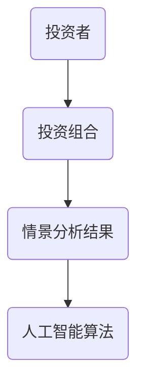
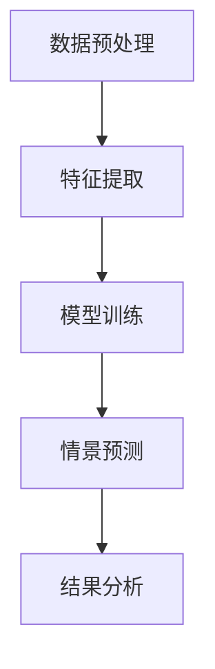
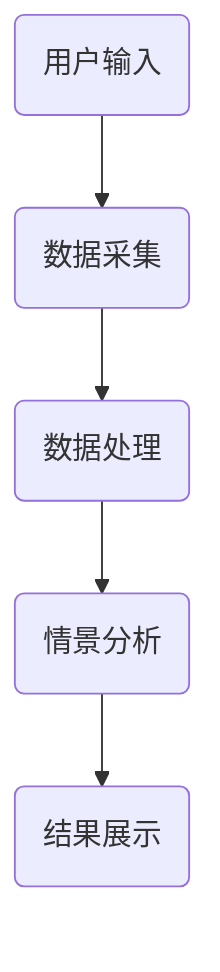
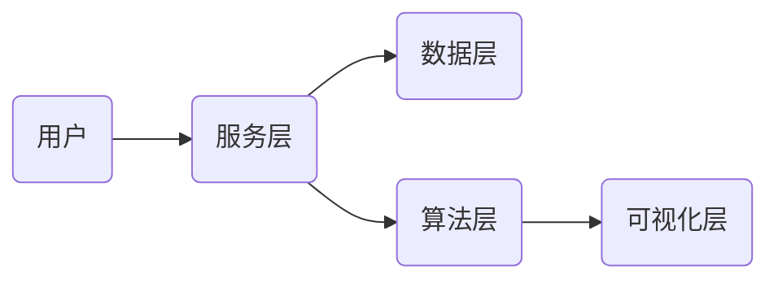
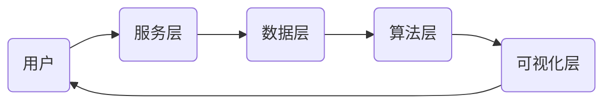

                 


# AI辅助的投资组合情景分析工具

## 关键词：AI，投资组合，情景分析，金融，机器学习

## 摘要：本文介绍了一种基于AI的投资组合情景分析工具，探讨其在金融领域的应用价值，详细分析了工具的核心概念、算法原理、系统架构设计以及实际案例，最后总结了最佳实践和注意事项。

---

# 第1章: AI辅助的投资组合情景分析工具背景

## 1.1 投资组合情景分析的背景与意义

### 1.1.1 传统投资组合分析的局限性
传统的投资组合分析依赖于历史数据分析和人工经验，存在以下问题：
- 数据处理复杂，难以覆盖多维度市场变化。
- 人工判断主观性强，易受市场情绪影响。
- 对突发市场变化反应不够及时。

### 1.1.2 AI技术在金融领域的应用前景
AI技术在金融领域的应用前景广阔，尤其是在投资组合管理方面：
- 数据处理能力强，可以快速分析大量非结构化数据。
- 模型预测准确性高，能够捕捉复杂市场关系。
- 实时分析能力突出，有助于及时应对市场变化。

### 1.1.3 投资组合情景分析工具的必要性
投资组合情景分析工具通过AI技术帮助投资者：
- 提供多种市场情景下的资产表现预测。
- 优化投资组合配置，降低风险。
- 实现自动化、智能化的投资决策支持。

## 1.2 AI辅助投资组合情景分析的核心概念

### 1.2.1 投资组合的定义与组成
投资组合是由多种资产（如股票、债券等）组成的集合，投资者通过合理配置资产来实现收益与风险的平衡。

### 1.2.2 情景分析的定义与作用
情景分析是指在不同假设条件下，评估投资组合的表现。其作用包括：
- 帮助投资者理解资产在不同市场环境下的表现。
- 支持决策者制定风险控制策略。
- 提供多种可能结果，便于投资者选择最优方案。

### 1.2.3 AI在情景分析中的应用方式
AI在情景分析中的应用方式包括：
- 使用机器学习模型预测市场走势。
- 基于历史数据生成多种假设情景。
- 实时监控市场变化，动态调整投资组合。

---

# 第2章: AI辅助投资组合情景分析的核心概念与联系

## 2.1 核心概念原理

### 2.1.1 投资组合的数学模型
投资组合的收益可以用以下公式计算：
$$ E(r) = \sum_{i=1}^{n} w_i r_i $$
其中，$w_i$ 是资产 $i$ 的权重，$r_i$ 是资产 $i$ 的预期收益率。

### 2.1.2 情景分析的实现方法
情景分析通常包括以下步骤：
1. 确定可能的市场情景。
2. 预测各情景下资产的收益率。
3. 计算投资组合在不同情景下的表现。

### 2.1.3 AI算法在情景分析中的应用
AI算法（如随机森林、神经网络等）用于分析历史数据，预测未来市场情景。

## 2.2 核心概念属性对比表

| 概念       | 属性1   | 属性2   | 属性3   |
|------------|---------|---------|---------|
| 投资组合   | 资产类别 | 风险水平 | 预期收益 |
| AI算法     | 模型类型 | 数据来源 | 输出结果 |

## 2.3 ER实体关系图


## 2.4 本章小结
本章介绍了AI辅助投资组合情景分析的核心概念，分析了投资组合与AI算法之间的关系，并通过对比表和ER图展示了核心概念的属性与联系。

---

# 第3章: AI辅助投资组合情景分析的算法原理

## 3.1 算法原理概述

### 3.1.1 机器学习在情景分析中的应用
机器学习算法（如支持向量机、决策树）用于预测市场情景下的资产收益。

### 3.1.2 常见的AI算法选择
常用的AI算法包括：
- 线性回归：用于预测资产收益。
- 聚类分析：用于识别市场情景的相似性。
- 时间序列分析：用于分析历史数据以预测未来走势。

## 3.2 算法流程图


## 3.3 算法数学模型

### 3.3.1 投资组合收益计算公式
$$ E(r) = \sum_{i=1}^{n} w_i r_i $$

### 3.3.2 风险计算公式
$$ \sigma^2 = \sum_{i=1}^{n} \sum_{j=1}^{n} w_i w_j \sigma_{ij} $$

## 3.4 算法实现代码示例
```python
import numpy as np
from sklearn.linear_model import LinearRegression

# 示例数据
X = np.array([[1, 2], [3, 4], [5, 6]])
y = np.array([7, 8, 9])

# 模型训练
model = LinearRegression()
model.fit(X, y)

# 预测
print(model.predict([[7, 8]]))
```

## 3.5 本章小结
本章详细讲解了AI辅助投资组合情景分析的算法原理，包括机器学习算法的选择与应用、数学模型的构建以及代码实现。

---

# 第4章: AI辅助投资组合情景分析系统的架构设计

## 4.1 系统功能设计

### 4.1.1 系统功能模块
系统功能模块包括：
- 数据采集模块：获取市场数据。
- 数据处理模块：清洗和转换数据。
- 情景分析模块：生成和评估多种市场情景。
- 结果展示模块：以可视化方式呈现分析结果。

### 4.1.2 功能模块交互流程


## 4.2 系统架构设计

### 4.2.1 系统架构图


### 4.2.2 模块交互流程图


## 4.3 系统接口设计

### 4.3.1 API接口
- 输入接口：接收用户输入的市场数据和参数。
- 输出接口：返回分析结果。

### 4.3.2 数据接口
- 数据存储接口：用于存储市场数据。
- 数据读取接口：用于获取存储的市场数据。

## 4.4 本章小结
本章详细设计了AI辅助投资组合情景分析系统的架构，包括功能模块、架构图和接口设计。

---

# 第5章: AI辅助投资组合情景分析工具的项目实战

## 5.1 项目介绍

### 5.1.1 项目目标
开发一个基于AI的投资组合情景分析工具，帮助投资者优化投资决策。

## 5.2 系统核心实现源代码

### 5.2.1 数据预处理代码
```python
import pandas as pd
import numpy as np

# 读取数据
data = pd.read_csv('market_data.csv')

# 数据清洗
data.dropna()
data = data[~data.duplicated()]
```

### 5.2.2 模型训练代码
```python
from sklearn.model

