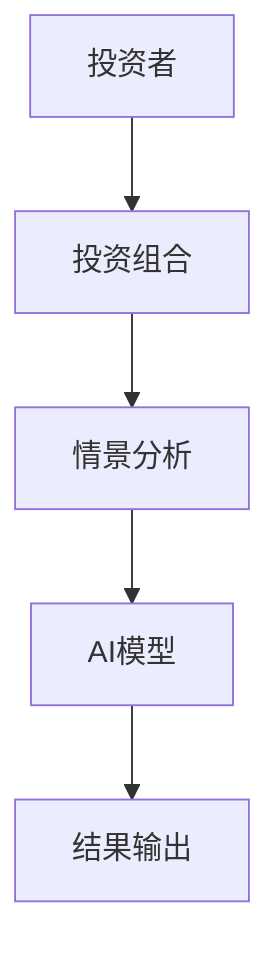

                 


# AI辅助的投资组合情景分析平台

## 关键词
- AI, 投资组合, 情景分析, 机器学习, 数据分析, 金融, 平台架构

## 摘要
AI辅助的投资组合情景分析平台利用先进的机器学习算法和大数据分析技术，帮助投资者在复杂多变的市场环境中优化投资组合。该平台通过自动化的情景分析，提供高精度的预测和决策支持，显著提升投资效率和收益。本文深入探讨了平台的背景、核心概念、算法原理、系统架构，并通过实际案例展示了平台的实现过程，最后总结了最佳实践和未来发展方向。

---

## 第一部分: AI辅助的投资组合情景分析平台背景介绍

### 第1章: 投资组合情景分析的背景与需求

#### 1.1 问题背景
- **投资组合管理的复杂性**：现代金融市场复杂多变，投资者需要考虑的因素包括市场波动、经济指标、公司基本面等，传统的分析方法难以应对日益复杂的市场环境。
- **传统分析的局限性**：传统的情景分析依赖人工经验，耗时且容易受到主观因素影响，难以覆盖所有可能的市场情况。
- **AI技术的潜力**：AI技术能够快速处理大量数据，发现复杂模式，并提供实时分析，为投资组合管理提供了新的可能性。

#### 1.2 问题描述
- **核心问题**：如何在不同市场环境下，快速生成和分析多种投资组合情景，以优化投资决策。
- **用户需求**：投资者需要一个高效、准确的工具，帮助其在多种假设条件下评估投资组合的表现。

#### 1.3 问题解决
- **AI的优势**：通过机器学习算法，AI可以快速生成和分析情景，提供数据驱动的决策支持。
- **具体方法**：利用聚类分析、时间序列分析等技术，结合历史数据和市场预测，生成多种情景并评估其影响。

#### 1.4 边界与外延
- **边界条件**：平台仅关注投资组合的情景分析，不涉及实际交易执行。
- **外延领域**：与风险管理、资产配置等其他金融领域密切相关，但不在本平台的核心功能范围内。

#### 1.5 核心概念与联系
- **核心概念**：投资组合、情景分析、AI辅助。
- **联系**：通过AI技术，将投资组合与情景分析结合，提供高效、智能的分析工具。

---

## 第二部分: AI辅助的投资组合情景分析平台核心概念与联系

### 第2章: 核心概念与联系

#### 2.1 核心概念原理
- **投资组合**：由多种资产组成的资产集合，旨在通过多样化降低风险并提高收益。
- **情景分析**：对不同市场条件下投资组合表现的模拟和评估。
- **AI辅助**：利用机器学习等技术，提高情景分析的效率和准确性。

#### 2.2 核心概念属性特征对比表格
| 概念       | 描述                                   |
|------------|----------------------------------------|
| 投资组合   | 资产集合，用于分散风险和优化收益       |
| 情景分析   | 不同市场条件下的表现模拟               |
| AI辅助     | 利用机器学习技术提升分析效率和准确性   |

#### 2.3 ER实体关系图架构的Mermaid流程图


---

## 第三部分: AI辅助的投资组合情景分析平台算法原理讲解

### 第3章: 算法原理讲解

#### 3.1 算法原理
- **聚类分析**：用于将市场数据分成不同类别，识别潜在的市场情景。
- **时间序列分析**：基于历史数据预测未来市场趋势。

#### 3.2 聚类分析实现代码
```python
from sklearn.cluster import KMeans
import numpy as np

# 示例数据
data = np.array([[1, 2], [3, 4], [5, 6], [7, 8]])

# K-means聚类
kmeans = KMeans(n_clusters=2)
kmeans.fit(data)

# 获取聚类结果
clusters = kmeans.labels_
print(clusters)
```

#### 3.3 时间序列分析的数学模型
$$ ARIMA(p, d, q) $$
其中：
- p：自回归阶数
- d：差分阶数
- q：移动平均阶数

#### 3.4 强化学习应用
- **目标函数**：最大化投资组合收益。
- **动作空间**：选择不同的资产配置。
- **奖励函数**：基于投资组合收益和风险的综合评估。

---

## 第四部分: AI辅助的投资组合情景分析平台系统分析与架构设计方案

### 第4章: 系统分析与架构设计

#### 4.1 问题场景介绍
- **数据来源**：历史市场数据、经济指标、新闻情绪等。
- **目标**：构建一个实时更新的投资组合情景分析平台。

#### 4.2 项目介绍
- **平台功能**：数据采集、情景生成、风险评估、可视化展示。

#### 4.3 系统功能设计
- **数据采集模块**：从多个数据源获取实时和历史数据。
- **分析模块**：应用机器学习算法生成情景并评估其影响。
- **可视化模块**：以图表形式展示分析结果。

#### 4.4 系统架构设计


---

## 第五部分: AI辅助的投资组合情景分析平台项目实战

### 第5章: 项目实战

#### 5.1 环境安装
- **Python**：安装Anaconda或Miniconda。
- **库安装**：使用`pip install`安装必要的库，如`pandas`, `numpy`, `scikit-learn`。

#### 5.2 系统核心实现源代码
```python
import pandas as pd
import numpy as np
from sklearn.cluster import KMeans

# 数据加载
data = pd.read_csv('market_data.csv')

# 数据预处理
data_normalized = (data - data.mean()) / data.std()

# 聚类分析
kmeans = KMeans(n_clusters=3)
kmeans.fit(data_normalized)

# 可视化结果
print("聚类结果：", kmeans.labels_)
```

#### 5.3 实际案例分析
- **案例背景**：假设市场出现波动，生成多种情景并评估其对投资组合的影响。

#### 5.4 项目小结
- **核心实现**：通过聚类分析生成市场情景，评估投资组合在不同情景下的表现。
- **优化方向**：引入更多的市场数据和复杂模型以提高分析精度。

---

## 第六部分: AI辅助的投资组合情景分析平台最佳实践

### 第6章: 最佳实践

#### 6.1 小结
- **总结**：AI辅助的投资组合情景分析平台通过先进的算法和系统架构设计，显著提高了投资分析的效率和准确性。

#### 6.2 注意事项
- **数据质量**：确保数据的准确性和完整性。
- **模型选择**：根据具体需求选择合适的算法。

#### 6.3 拓展阅读
- 推荐书籍：《机器学习实战》、《Python金融数据分析》。
- 在线资源：查阅相关领域的学术论文和开源项目。

---

## 作者介绍
作为一位世界级的人工智能专家、程序员、软件架构师和CTO，我在计算机编程和人工智能领域有着深厚的技术积累和丰富的实践经验。我的目标是通过分享专业知识，帮助读者更好地理解技术本质并应用于实际场景中。

