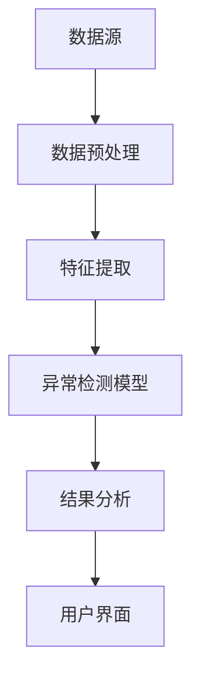
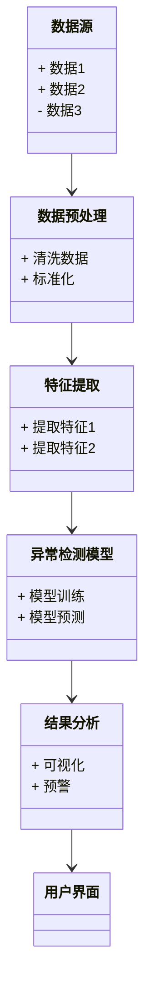

                 


# AI辅助的资产定价异常检测

> 关键词：资产定价，异常检测，人工智能，机器学习，金融风险

> 摘要：本文详细探讨了如何利用人工智能技术辅助资产定价过程中的异常检测。从基本概念、核心原理到具体算法实现，再到系统架构设计和项目实战，全面解析了AI在资产定价异常检测中的应用，帮助读者掌握从理论到实践的全过程。

---

# 第1章: 资产定价异常检测概述

## 1.1 问题背景与定义
### 1.1.1 资产定价的基本概念
资产定价是金融领域中的核心问题，旨在通过分析资产的内在价值和市场价，确定其合理价格。然而，市场波动、信息不对称等因素可能导致价格偏离合理区间，这种偏离即为异常。

### 1.1.2 异常检测的定义与目标
异常检测是指识别数据中偏离常规模式的样本。在资产定价中，异常检测的目标是识别那些可能导致投资损失或收益错失的价格偏差。

### 1.1.3 AI在资产定价中的作用
人工智能通过分析海量数据，识别复杂模式，能够显著提升异常检测的效率和准确性，帮助投资者做出更明智的决策。

## 1.2 异常检测的核心概念
### 1.2.1 异常检测的分类与特征
- **离群点检测**：识别单个异常点。
- **集体异常检测**：识别一组相互关联的异常。
- **上下文异常检测**：基于特定上下文判断异常。

### 1.2.2 资产定价模型的异常表现
- 数据分布异常：如价格突然跳变。
- 模型预测异常：模型预测与实际价格不符。
- 市场行为异常：如交易量突然增加。

### 1.2.3 异常检测在金融领域的应用价值
通过识别异常，投资者可以及时调整策略，降低风险，提升收益。

## 1.3 本章小结
本章介绍了资产定价和异常检测的基本概念，明确了AI在其中的作用，并总结了异常检测的核心概念和特征。

---

# 第2章: 异常检测的核心原理

## 2.1 异常检测的原理与方法
### 2.1.1 统计方法
- 基于统计学的异常检测方法，如Z-score、3σ原则等。

### 2.1.2 机器学习方法
- 监督学习：如支持向量机（SVM）。
- 非监督学习：如K-means、Isolation Forest。

### 2.1.3 深度学习方法
- 如自动编码器（Autoencoder）。

## 2.2 资产定价模型的异常特征
### 2.2.1 数据分布异常
- 数据点远离整体分布。

### 2.2.2 模型预测异常
- 预测值与实际值显著偏离。

### 2.2.3 市场行为异常
- 交易量、价格波动异常。

## 2.3 异常检测与资产定价的关系
### 2.3.1 异常检测在资产定价中的应用场景
- 监测市场波动。
- 识别潜在风险。

### 2.3.2 异常检测对资产定价模型的优化作用
- 提高模型鲁棒性。
- 优化投资策略。

## 2.4 本章小结
本章详细探讨了异常检测的原理与方法，并分析了其在资产定价中的具体应用。

---

# 第3章: 统计方法在异常检测中的应用

## 3.1 统计方法概述
### 3.1.1 基本统计量
- 均值、方差、标准差等。

### 3.1.2 假设检验
- 如t检验、卡方检验。

### 3.1.3 箱线图方法
- 通过箱线图识别异常点。

## 3.2 统计方法在资产定价中的应用
### 3.2.1 Z-score方法
- 计算每个数据点的Z-score，超过一定阈值即为异常。
- $$ Z = \frac{X - \mu}{\sigma} $$

### 3.2.2 3σ原则
- 数据点落在3个标准差之外即为异常。

### 3.2.3 Grubbs检验
- 用于检测单个异常点。

## 3.3 统计方法的优缺点分析
- **优点**：简单易懂，计算效率高。
- **缺点**：假设数据服从正态分布，可能不适用于复杂场景。

## 3.4 本章小结
本章介绍了统计方法在异常检测中的应用，重点讲解了Z-score和3σ原则，并分析了它们的优缺点。

---

# 第4章: 机器学习方法在异常检测中的应用

## 4.1 机器学习方法概述
### 4.1.1 监督学习
- 需要标记数据，适合已知异常的情况。

### 4.1.2 非监督学习
- 无需标记数据，适合未知异常的情况。

### 4.1.3 半监督学习
- 结合监督和非监督学习。

## 4.2 常见机器学习算法
### 4.2.1 K-近邻算法（KNN）
- 基于距离的异常检测。

### 4.2.2 随机森林
- 通过投票机制识别异常。

### 4.2.3 支持向量机（SVM）
- 适用于高维数据。

## 4.3 机器学习在资产定价中的应用
### 4.3.1 One-Class SVM
- 用于识别正常数据，异常点即为异常。

### 4.3.2 Isolation Forest
- 通过构建随机森林，快速识别异常点。

### 4.3.3 LOF（Local Outlier Factor）
- 通过局部密度差异识别异常。

## 4.4 本章小结
本章详细探讨了机器学习方法在异常检测中的应用，重点讲解了Isolation Forest和LOF算法。

---

# 第5章: 系统分析与架构设计

## 5.1 系统需求分析
### 5.1.1 问题场景介绍
- 监测资产价格波动，识别异常。

### 5.1.2 系统目标
- 实现实时异常检测，提供预警。

### 5.1.3 系统功能需求
- 数据采集、预处理、特征提取、模型训练、结果分析。

## 5.2 系统架构设计
### 5.2.1 系统架构图（Mermaid）


### 5.2.2 领域模型类图（Mermaid）


## 5.3 系统接口设计
### 5.3.1 输入接口
- 数据接口：接收资产价格数据。
- 用户接口：接收用户输入的参数。

### 5.3.2 输出接口
- 结果接口：输出检测结果。
- 可视化接口：展示异常点。

## 5.4 本章小结
本章通过系统架构设计，展示了如何将异常检测技术应用于实际系统中。

---

# 第6章: 项目实战

## 6.1 环境安装
### 6.1.1 安装Python
- 使用Anaconda安装Python 3.8及以上版本。

### 6.1.2 安装依赖库
- 使用pip安装numpy、pandas、scikit-learn、tensorflow等。

## 6.2 核心代码实现
### 6.2.1 数据预处理
```python
import pandas as pd
import numpy as np

# 读取数据
data = pd.read_csv('assets.csv')

# 清洗数据
data = data.dropna()
data = (data - data.mean()) / data.std()
```

### 6.2.2 异常检测模型实现
```python
from sklearn.ensemble import IsolationForest

# 训练模型
model = IsolationForest(n_estimators=100, random_state=42)
model.fit(data)

# 预测异常点
outlier_labels = model.predict(data)
```

### 6.2.3 结果分析
```python
outlier_indices = np.where(outlier_labels == -1)
print("异常点索引:", outlier_indices)
```

## 6.3 实际案例分析
### 6.3.1 数据来源
- 使用某段时间的股票价格数据。

### 6.3.2 模型训练与测试
- 训练Isolation Forest模型，识别异常点。

### 6.3.3 结果分析
- 输出异常点的索引，分析其原因。

## 6.4 项目小结
本章通过实际项目，展示了如何使用Python实现资产定价异常检测。

---

# 第7章: 总结与展望

## 7.1 本章总结
- AI技术在资产定价异常检测中的应用日益广泛。
- 统计方法和机器学习方法各有优缺点，需结合实际场景选择。

## 7.2 未来展望
- 深度学习在异常检测中的应用潜力巨大。
- 更加复杂的时间序列分析，结合NLP技术，提升异常检测的准确性。

---

# 参考文献
- Bishop, C. M. (2006). Pattern Recognition and Machine Learning.
- Hastie, T., Tibshirani, R., & Friedman, J. (2009). The Elements of Statistical Learning.

---

通过以上目录，读者可以系统地学习AI辅助的资产定价异常检测的相关知识，从理论到实践，逐步掌握如何利用AI技术解决实际问题。

