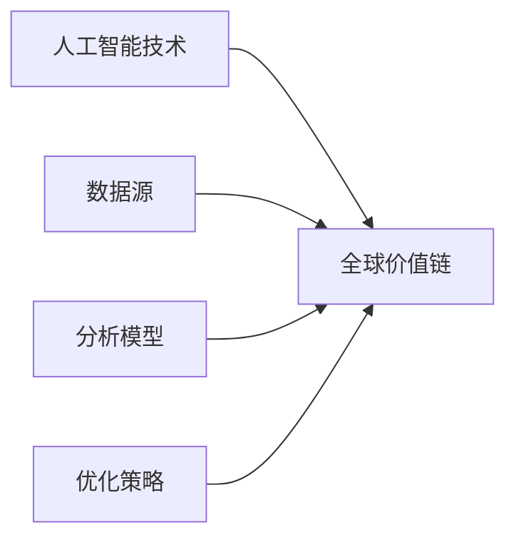
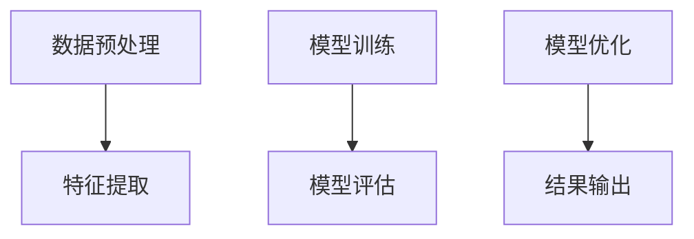
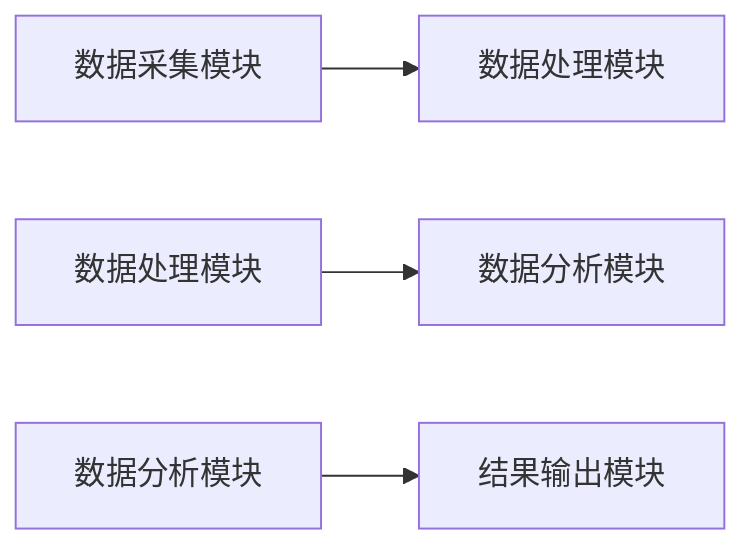

                 


# AI辅助识别全球价值链机会

## 关键词：AI技术、全球价值链、机会识别、机器学习、自然语言处理、系统架构

## 摘要：  
本文将探讨如何利用人工智能技术来识别全球价值链中的机会。通过对AI技术的核心原理、全球价值链的结构分析以及AI在价值链优化中的应用进行详细分析，本文将展示如何利用机器学习和自然语言处理等技术手段，提取和分析全球价值链中的关键数据，识别潜在的商业机会。文章还结合实际案例，通过系统架构设计和项目实战，展示了如何将AI技术应用于全球价值链机会识别的全过程。

---

# 第一部分: AI辅助识别全球价值链机会的基础

## 第1章: AI与全球价值链的背景介绍

### 1.1 AI技术的定义与核心概念

#### 1.1.1 AI技术的定义  
人工智能（Artificial Intelligence, AI）是指模拟人类智能的计算机系统，能够执行如学习、推理、问题解决等任务。AI的核心在于通过数据和算法，实现对复杂问题的自动化处理。

#### 1.1.2 AI技术的核心要素  
- **数据**：AI的基础，包括结构化数据（如表格数据）和非结构化数据（如文本、图像）。  
- **算法**：如机器学习、深度学习等，用于从数据中提取模式和洞察。  
- **计算能力**：高性能计算是AI模型训练和推理的基础。  
- **应用场景**：如图像识别、自然语言处理、预测分析等。  

#### 1.1.3 AI技术与全球价值链的关系  
全球价值链是指跨越多个国家和企业的生产过程，AI技术可以通过分析价值链中的数据，优化流程、降低成本、提高效率。

---

### 1.2 全球价值链的定义与结构

#### 1.2.1 全球价值链的基本概念  
全球价值链是指从原材料采购、生产、加工、分销到最终消费者的整个过程，涉及多个参与方和环节。

#### 1.2.2 全球价值链的主要环节  
- 供应商  
- 制造商  
- 分销商  
- 零售商  
- 消费者  

#### 1.2.3 全球价值链的驱动因素  
- 全球化  
- 技术进步  
- 成本差异  
- 市场需求  

---

### 1.3 AI技术在识别全球价值链机会中的作用

#### 1.3.1 AI技术的优势与特点  
- **高效性**：AI能够快速处理海量数据，识别潜在机会。  
- **准确性**：通过算法模型，AI能够提供高精度的分析结果。  
- **可扩展性**：AI技术可以应用于不同规模和复杂度的全球价值链。  

#### 1.3.2 AI技术在价值链分析中的应用  
- 供应链优化  
- 市场预测  
- 风险评估  

#### 1.3.3 AI技术对全球价值链优化的价值  
- 提高效率  
- 降低成本  
- 增强竞争力  

---

## 第2章: AI辅助识别全球价值链的核心概念与联系

### 2.1 AI技术的核心原理

#### 2.1.1 机器学习的基本原理  
机器学习是一种通过数据训练模型，使其能够从数据中学习并做出预测的技术。其核心包括：  
- **监督学习**：通过标记数据进行训练。  
- **无监督学习**：通过未标记数据发现模式。  
- **强化学习**：通过奖励机制优化决策。  

#### 2.1.2 自然语言处理的核心机制  
自然语言处理（NLP）是AI技术的重要组成部分，用于理解和处理人类语言。其核心包括：  
- **分词**：将文本分割成有意义的片段。  
- **实体识别**：识别文本中的实体（如人名、地名）。  
- **情感分析**：判断文本的情感倾向。  

#### 2.1.3 数据挖掘的关键算法  
数据挖掘是通过算法从数据中提取有价值的信息。常用算法包括：  
- K-Means聚类  
- Apriori关联规则挖掘  
-决策树  

---

### 2.2 全球价值链分析的核心方法

#### 2.2.1 价值链分析的框架  
价值链分析框架包括：  
1. 数据收集  
2. 数据清洗  
3. 数据分析  
4. 机会识别  

#### 2.2.2 价值链优化的策略  
- 优化供应链管理  
- 提高生产效率  
- 降低运营成本  

#### 2.2.3 价值链机会识别的指标  
- 市场增长率  
- 利润率  
- 市场份额  

---

### 2.3 AI与全球价值链的实体关系图



---

## 第3章: AI辅助识别全球价值链机会的算法原理

### 3.1 机器学习算法在价值链分析中的应用

#### 3.1.1 线性回归模型  
线性回归是一种简单的预测模型，适用于连续变量预测。  
$$ y = \beta_0 + \beta_1 x + \epsilon $$  

#### 3.1.2 支持向量机（SVM）  
SVM适用于分类问题，通过构建超平面将数据分成不同类别。  

#### 3.1.3 随机森林算法  
随机森林是一种基于决策树的集成学习算法，具有高准确性和鲁棒性。  

---

### 3.2 自然语言处理在价值链分析中的应用

#### 3.2.1 分词与实体识别  
分词是将文本分割成词语，实体识别是识别文本中的实体。  

#### 3.2.2 情感分析与主题挖掘  
情感分析用于判断文本的情感倾向，主题挖掘用于发现文本中的主要主题。  

#### 3.2.3 文本相似度计算  
文本相似度计算用于衡量两段文本的相似程度。  

---

### 3.3 算法实现的流程图



---

## 第4章: 全球价值链机会识别的系统分析与架构设计

### 4.1 系统分析与需求定义

#### 4.1.1 问题场景介绍  
全球价值链机会识别系统需要处理海量数据，识别潜在的商业机会。  

#### 4.1.2 项目目标设定  
- 提供全球价值链数据的可视化分析。  
- 识别潜在的商业机会。  

#### 4.1.3 系统功能需求  
- 数据采集模块  
- 数据处理模块  
- 数据分析模块  

---

### 4.2 系统架构设计

#### 4.2.1 数据采集模块  
负责从全球价值链的各个参与方获取数据。  

#### 4.2.2 数据处理模块  
对数据进行清洗、转换和标准化处理。  

#### 4.2.3 数据分析模块  
利用机器学习和NLP技术，分析数据并识别机会。  

---

### 4.3 系统架构图



---

## 第5章: 项目实战与案例分析

### 5.1 环境安装与数据准备

#### 5.1.1 环境安装  
安装Python、TensorFlow、Pandas等工具。  

#### 5.1.2 数据准备  
从全球价值链的公开数据集中获取数据。  

---

### 5.2 系统核心实现

#### 5.2.1 数据预处理  
```python
import pandas as pd
data = pd.read_csv('global_value_chain.csv')
data_cleaned = data.dropna()
```

#### 5.2.2 模型训练  
```python
from sklearn.model import LinearRegression
model = LinearRegression()
model.fit(X_train, y_train)
```

#### 5.2.3 模型评估  
```python
from sklearn.metrics import r2_score
y_pred = model.predict(X_test)
print(r2_score(y_test, y_pred))
```

---

### 5.3 实际案例分析

#### 5.3.1 案例背景  
假设我们分析某行业的全球价值链，识别潜在的市场机会。  

#### 5.3.2 数据分析  
利用NLP技术分析行业报告，识别关键词和趋势。  

#### 5.3.3 结果解读  
模型预测出某地区市场潜力较大，建议企业进入该市场。  

---

## 第6章: 总结与展望

### 6.1 项目总结  
本文详细介绍了AI技术在识别全球价值链机会中的应用，展示了如何通过机器学习和NLP技术，优化全球价值链的分析和决策过程。

### 6.2 最佳实践 tips  
- 数据质量是关键。  
- 模型调优需要不断迭代。  
- 持续学习和优化是保持竞争力的重要手段。  

### 6.3 未来展望  
随着AI技术的不断进步，全球价值链机会识别将更加智能化和精准化。未来，AI技术将进一步深度融合全球价值链的各个环节，为企业创造更大的价值。

---

通过本文的分析和实践，读者可以深入了解AI技术在识别全球价值链机会中的潜力和应用，为企业的全球化战略提供有力支持。

