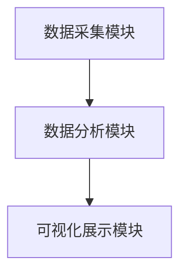

                 


# AI辅助识别全球价值链重构机会

## 关键词：人工智能、全球价值链、重构机会、价值网络分析、数据驱动决策、智能化匹配

## 摘要：  
随着全球化和技术进步的推动，全球价值链正经历深刻的重构。人工智能技术的快速发展为识别和优化全球价值链提供了前所未有的机会。本文将深入探讨AI技术在全球价值链重构中的应用，分析其核心概念、算法原理、系统架构，并通过实际案例展示如何利用AI技术识别和重构全球价值链中的机会。通过本文的分析，读者将能够理解AI如何助力全球价值链的优化与重构。

---

# 第一部分：全球价值链重构的背景与挑战

## 第1章：全球价值链重构的背景与挑战

### 1.1 全球价值链的基本概念

#### 1.1.1 全球价值链的定义与构成  
全球价值链（Global Value Chain，GVC）是指跨国企业在全球范围内组织生产和分配资源的链条，包括从原材料采购、生产制造、分销到最终消费者的整个过程。它由多个环节构成，每个环节由不同国家或地区的参与者完成。

#### 1.1.2 全球价值链的演变历程  
全球价值链的形成经历了从早期的垂直一体化到现代的分散化和网络化的过程。随着技术的进步和全球化的深入，企业逐渐将价值链的不同环节外包给全球各地的专业化企业，形成了高度分工和协作的全球生产网络。

#### 1.1.3 当前全球价值链重构的驱动因素  
- **技术驱动**：数字技术（如AI、大数据、区块链）的应用改变了传统的生产模式和协作方式。  
- **成本驱动**：企业为了降低成本，不断在全球范围内寻找最优的生产地点。  
- **政策驱动**：国际贸易政策的变化（如关税政策、区域贸易协定）影响了全球价值链的布局。  
- **环境驱动**：可持续发展和绿色生产的要求推动了全球价值链的重构。

---

### 1.2 AI技术在经济重构中的作用

#### 1.2.1 AI技术的基本概念与发展现状  
人工智能（AI）是指模拟人类智能的计算机系统，包括机器学习、自然语言处理、计算机视觉等技术。近年来，AI技术在各个领域的应用取得了显著进展，尤其是在数据分析和决策支持方面。

#### 1.2.2 AI技术对企业竞争力的影响  
AI技术能够帮助企业优化生产流程、提高效率、降低成本，并通过数据分析预测市场趋势，从而增强企业的竞争力。

#### 1.2.3 AI技术在全球价值链重构中的潜在机会  
AI技术可以帮助企业更精准地识别全球价值链中的机会和风险，优化资源分配，提升协作效率。

---

### 1.3 全球价值链重构的核心问题

#### 1.3.1 重构的定义与目标  
全球价值链重构是指通过对现有价值链的重新设计和优化，以适应新的市场环境和技术变化。其目标是提高效率、降低成本、增强竞争力。

#### 1.3.2 重构的关键挑战  
- 数据的获取与整合难度大。  
- 不同国家或地区的政策差异和文化差异增加了协作的复杂性。  
- 技术的不确定性和快速变化对企业提出了更高的要求。  

#### 1.3.3 重构的边界与外延  
全球价值链重构不仅涉及生产环节的优化，还包括供应链管理、市场营销、售后服务等整个价值链的重构。

---

## 第2章：AI辅助识别全球价值链机会的核心概念

### 2.1 价值网络分析

#### 2.1.1 价值网络的定义与特征  
价值网络（Value Network）是指围绕核心产品或服务，由供应商、制造商、分销商、零售商和消费者组成的网络。它强调各环节之间的协作和价值创造。

#### 2.1.2 数据驱动的决策模型  
数据驱动的决策模型通过收集和分析价值链中的数据，帮助企业在决策过程中实现更精准的判断。

#### 2.1.3 智能化匹配机制  
智能化匹配机制利用AI技术，将价值链中的各个参与者进行最优匹配，以实现资源的高效利用和价值的最大化。

---

### 2.2 数据驱动的全球价值链分析

#### 2.2.1 数据来源与处理方法  
数据来源包括企业内部数据（如生产数据、销售数据）和外部数据（如市场数据、政策数据）。数据处理方法包括数据清洗、数据整合和数据分析。

#### 2.2.2 数据分析与价值识别  
通过数据分析技术，识别价值链中的关键环节和瓶颈，帮助企业发现优化的机会。

#### 2.2.3 数据可视化与决策支持  
数据可视化技术将复杂的数据转化为易于理解的图表，为决策者提供直观的支持。

---

### 2.3 AI算法在价值识别中的应用

#### 2.3.1 机器学习算法的基本原理  
机器学习算法通过训练数据模型，自动识别数据中的模式和规律，从而帮助企业在价值链中发现潜在机会。

#### 2.3.2 深度学习模型的优势  
深度学习模型（如神经网络）具有强大的非线性分析能力，能够处理复杂的数据关系，为全球价值链分析提供更精确的支持。

#### 2.3.3 自然语言处理在价值链分析中的应用  
自然语言处理技术可以分析大量的文本数据（如市场报告、新闻资讯），提取有价值的信息，辅助企业做出决策。

---

## 第3章：AI辅助识别全球价值链机会的算法原理

### 3.1 机器学习算法的核心原理

#### 3.1.1 监督学习  
监督学习通过训练有标签的数据，预测新的数据点的标签。例如，使用回归算法预测市场需求。

#### 3.1.2 无监督学习  
无监督学习通过聚类分析，将相似的数据点分组，帮助企业发现潜在的市场机会。

#### 3.1.3 强化学习  
强化学习通过模拟决策过程，优化决策策略，应用于供应链优化等领域。

---

### 3.2 深度学习模型的应用

#### 3.2.1 卷积神经网络（CNN）  
CNN适用于图像识别和处理，可以用于分析生产过程中的图像数据，提高生产效率。

#### 3.2.2 循环神经网络（RNN）  
RNN适用于时间序列数据的分析，可以用于预测市场需求的变化趋势。

#### 3.2.3 图神经网络（GNN）  
GNN适用于复杂网络结构的分析，可以用于优化全球供应链网络。

---

## 第4章：系统架构与项目实现

### 4.1 系统架构设计

#### 4.1.1 系统功能模块  
- 数据采集模块：负责收集全球价值链中的数据。  
- 数据分析模块：利用AI算法对数据进行分析和挖掘。  
- 可视化展示模块：将分析结果以图表形式展示。  

#### 4.1.2 系统架构图  


---

### 4.2 项目实现

#### 4.2.1 环境安装  
- 安装Python、TensorFlow、Pandas等工具。

#### 4.2.2 核心代码实现  
```python
import pandas as pd
from sklearn.linear_model import LinearRegression

# 数据加载
data = pd.read_csv('global_value_chain.csv')

# 模型训练
model = LinearRegression()
model.fit(data[['input_feature']], data['target'])

# 模型预测
predictions = model.predict(data[['input_feature']])
```

#### 4.2.3 案例分析  
以某制造企业的全球供应链优化为例，展示如何利用AI技术优化生产流程。

---

## 第5章：最佳实践与总结

### 5.1 最佳实践

#### 5.1.1 数据质量的重要性  
高质量的数据是AI分析的基础，数据清洗和预处理是关键步骤。

#### 5.1.2 模型选择与调优  
根据具体问题选择合适的算法，并通过调参优化模型性能。

---

### 5.2 小结

通过本文的分析，我们可以看到AI技术在全球价值链重构中的巨大潜力。企业需要充分利用AI技术，优化生产流程，提升竞争力。

---

### 5.3 注意事项

- 数据隐私和安全问题需要高度重视。  
- 模型的可解释性和透明度是实际应用中的重要考量。  

---

### 5.4 拓展阅读

- 推荐阅读《人工智能：一种现代方法》和《全球价值链重构与企业战略》。

---

# 结语

AI技术正在深刻改变全球价值链的重构方式。通过本文的分析，我们相信，未来的企业将更加依赖AI技术来优化全球价值链，实现更高的效率和更强的竞争力。

