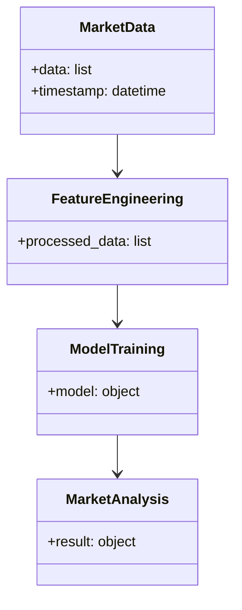
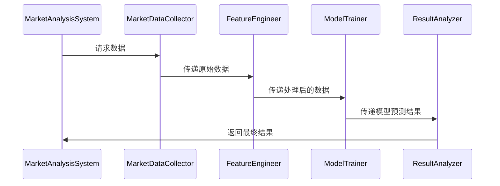

                 


# AI辅助识别市场结构性变化机会

## 关键词：AI，市场分析，结构性变化，机器学习，时间序列分析，深度学习，LSTM

## 摘要：  
本文探讨了如何利用人工智能技术辅助识别市场结构性变化机会。通过分析市场数据，结合机器学习和深度学习算法，我们能够更精准地预测市场趋势和发现潜在机会。文章从AI的基本概念入手，详细讲解了时间序列分析、聚类分析和神经网络等算法在市场分析中的应用，并通过实际案例展示了AI在识别市场机会中的强大能力。最后，文章总结了AI在市场分析中的优势，并提出了未来的研究方向。

---

# 第1章: AI与市场分析概述

## 1.1 AI技术的基本概念

### 1.1.1 人工智能的定义与特点  
人工智能（Artificial Intelligence, AI）是指计算机系统模拟人类智能的能力，包括学习、推理、问题解决和自然语言处理等。AI的核心特点包括：  
1. **数据驱动**：AI依赖大量数据进行训练和推理。  
2. **自适应性**：AI系统能够根据输入数据调整模型参数。  
3. **泛化能力**：AI模型能够处理未见过的数据。  

### 1.1.2 机器学习与深度学习的简介  
机器学习（Machine Learning）是AI的核心技术，通过训练模型从数据中学习规律。深度学习（Deep Learning）是机器学习的子领域，专注于多层神经网络的构建和训练。  

### 1.1.3 市场分析的传统方法与挑战  
传统市场分析依赖于人类经验和统计分析，但存在以下挑战：  
- 数据量大，难以处理。  
- 市场变化快，传统方法难以捕捉短期趋势。  
- 需要大量人工干预。  

## 1.2 市场结构性变化的概念  

### 1.2.1 市场结构的基本定义  
市场结构指的是市场中参与者之间的关系和竞争格局。  

### 1.2.2 结构性变化的定义与特征  
结构性变化是指市场中供需关系、竞争格局或消费者行为的重大转变。  

### 1.2.3 市场变化的驱动因素分析  
驱动因素包括技术进步、政策变化、消费者偏好变化等。  

## 1.3 AI在市场分析中的应用前景  

### 1.3.1 AI技术在市场分析中的优势  
AI能够快速处理大量数据，发现潜在规律。  

### 1.3.2 市场结构性变化识别的AI方法  
通过时间序列分析、聚类分析和神经网络等方法识别市场变化。  

### 1.3.3 企业利用AI识别市场机会的案例  
例如，某企业利用AI预测市场趋势，提前调整产品策略。  

## 1.4 本章小结  
本章介绍了AI的基本概念，分析了市场结构性变化的定义和驱动因素，并探讨了AI在市场分析中的应用前景。  

---

# 第2章: 数据驱动的市场分析

## 2.1 数据采集与预处理  

### 2.1.1 数据来源与采集方法  
数据来源包括公开数据集、企业内部数据和社交媒体数据。  

### 2.1.2 数据清洗与特征提取  
数据清洗包括去除噪声数据和填充缺失值。  

### 2.1.3 数据标准化与归一化  
标准化和归一化是数据预处理的重要步骤，能够提高模型性能。  

## 2.2 市场数据的特征工程  

### 2.2.1 特征选择的重要性  
特征选择能够提高模型的准确性和训练效率。  

### 2.2.2 时间序列数据的处理  
时间序列数据的特征提取包括均值、方差和自相关性分析。  

### 2.2.3 高维数据的降维方法  
主成分分析（PCA）是一种常用的降维方法。  

## 2.3 数据与市场的关联性分析  

### 2.3.1 数据相关性的定义  
数据相关性衡量变量之间的关联程度。  

### 2.3.2 数据关联性的可视化  
通过散点图和热力图可视化数据关联性。  

### 2.3.3 数据驱动的市场预测模型  
基于关联规则挖掘和回归分析构建预测模型。  

## 2.4 核心概念与联系的Mermaid图  


---

# 第3章: AI算法原理与数学模型

## 3.1 时间序列分析算法  

### 3.1.1 ARIMA模型的原理与实现  

#### 3.1.1.1 ARIMA模型的定义  
ARIMA（自回归积分滑动平均模型）是一种常用的时间序列预测模型。  

#### 3.1.1.2 ARIMA模型的数学公式  
$$ ARIMA(p, d, q) = y_t - \mu = \phi_1 y_{t-1} + \dots + \phi_p y_{t-p} + \theta_1 \epsilon_{t-1} + \dots + \theta_q \epsilon_{t-q} + \epsilon_t $$  

#### 3.1.1.3 ARIMA模型的实现步骤  
1. 数据预处理与可视化。  
2. 参数p、d、q的确定。  
3. 模型训练与验证。  

### 3.1.2 LSTM网络的原理与实现  

#### 3.1.2.1 LSTM模型的定义  
LSTM（长短期记忆网络）是一种特殊的RNN，能够有效捕捉时间序列的长-term依赖关系。  

#### 3.1.2.2 LSTM模型的数学公式  
$$ f_t = \sigma(W_f \cdot [h_{t-1}, x_t] + b_f) $$  
$$ i_t = \sigma(W_i \cdot [h_{t-1}, x_t] + b_i) $$  
$$ o_t = \sigma(W_o \cdot [h_{t-1}, x_t] + b_o) $$  
$$ c_t = f_t \cdot c_{t-1} + i_t \cdot tanh(W_c \cdot [h_{t-1}, x_t] + b_c) $$  
$$ h_t = o_t \cdot tanh(c_t) $$  

#### 3.1.2.3 LSTM模型的实现步骤  
1. 数据预处理与特征提取。  
2. 构建LSTM模型。  
3. 模型训练与评估。  

## 3.2 聚类分析算法  

### 3.2.1 K-means算法的原理与实现  

#### 3.2.1.1 K-means算法的定义  
K-means是一种无监督学习算法，用于将数据划分为k个簇。  

#### 3.2.1.2 K-means算法的数学公式  
$$ \text{目标函数} = \sum_{i=1}^{k} \sum_{j=1}^{n_i} \|x_j - c_i\|^2 $$  
其中，\( c_i \) 是第i个簇的中心，\( n_i \) 是第i个簇中的数据点数量。  

#### 3.2.1.3 K-means算法的实现步骤  
1. 初始化k个簇中心。  
2. 计算每个数据点到簇中心的距离。  
3. 重新计算簇中心，直到收敛。  

### 3.2.2 层次聚类的原理与实现  

#### 3.2.2.1 层次聚类的定义  
层次聚类是一种逐步合并或分割数据点的聚类方法。  

#### 3.2.2.2 层次聚类的数学公式  
$$ \text{距离度量} = \sqrt{(x_i - x_j)^2 + (y_i - y_j)^2} $$  

#### 3.2.2.3 层次聚类的实现步骤  
1. 计算所有数据点之间的距离。  
2. 按距离从小到大合并数据点。  
3. 绘制树状图分析簇的分布。  

## 3.3 分类分析算法  

### 3.3.1 决策树算法的原理与实现  

#### 3.3.1.1 决策树算法的定义  
决策树是一种基于树状结构的分类方法。  

#### 3.3.1.2 决策树算法的数学公式  
$$ Gini指数 = \sum_{i=1}^{n} p_i (1 - p_i) $$  
其中，\( p_i \) 是第i个类别在当前节点的分布概率。  

#### 3.3.1.3 决策树算法的实现步骤  
1. 计算特征的Gini指数。  
2. 选择Gini指数最小的特征进行分裂。  
3. 递归构建子树，直到叶子节点。  

### 3.3.2 随机森林算法的原理与实现  

#### 3.3.2.1 随机森林算法的定义  
随机森林是一种基于决策树的集成学习算法。  

#### 3.3.2.2 随机森林算法的数学公式  
$$ y = \sum_{i=1}^{n} \alpha_i \cdot \text{决策树}(x) $$  
其中，\( \alpha_i \) 是每个决策树的权重。  

#### 3.3.2.3 随机森林算法的实现步骤  
1. 生成多个决策树。  
2. 计算每个决策树的预测结果。  
3. 汇总结果，得到最终预测。  

---

# 第4章: 系统设计与架构方案

## 4.1 问题场景介绍  

### 4.1.1 问题背景  
市场数据复杂，变化快，需要高效的分析工具。  

### 4.1.2 问题描述  
如何利用AI技术实时分析市场数据，识别结构性变化机会。  

## 4.2 系统功能设计  

### 4.2.1 领域模型Mermaid类图  



### 4.2.2 系统架构设计Mermaid架构图  


### 4.2.3 系统接口设计  
1. 数据接口：数据采集与存储。  
2. 模型接口：模型训练与预测。  
3. 分析接口：结果展示与可视化。  

### 4.2.4 系统交互Mermaid序列图  



---

# 第5章: 项目实战

## 5.1 环境安装  

### 5.1.1 安装Python与相关库  
安装Python 3.8及以上版本，安装库：`numpy`, `pandas`, `scikit-learn`, `keras`, `tensorflow`。  

## 5.2 系统核心实现源代码  

### 5.2.1 时间序列分析代码  

```python
from statsmodels.tsa.arima_model import ARIMA
import pandas as pd
import matplotlib.pyplot as plt

# 加载数据
data = pd.read_csv('market_data.csv')

# 拆分数据
train_data = data[:int(len(data)*0.8)]
test_data = data[int(len(data)*0.8):]

# 训练ARIMA模型
model = ARIMA(train_data, order=(5,1,0))
model_fit = model.fit(disp=0)

# 预测
forecast = model_fit.forecast(steps=len(test_data))
forecast_df = pd.DataFrame(forecast[0], index=test_data.index, columns=['预测值'])

# 可视化
plt.plot(train_data, label='训练数据')
plt.plot(test_data, label='测试数据')
plt.plot(forecast_df['预测值'], label='预测值')
plt.legend()
plt.show()
```

### 5.2.2 LSTM网络代码  

```python
from keras.models import Sequential
from keras.layers import LSTM, Dense
import numpy as np

# 数据准备
data = ...  # 加载数据

# 模型构建
model = Sequential()
model.add(LSTM(50, input_shape=(timesteps, features)))
model.add(Dense(1))
model.compile(loss='mean_squared_error', optimizer='adam')

# 训练
model.fit(x_train, y_train, epochs=50, batch_size=32)
```

## 5.3 代码应用解读与分析  

### 5.3.1 时间序列分析代码解读  
1. 数据加载与预处理。  
2. 模型训练与预测。  
3. 结果可视化与评估。  

### 5.3.2 LSTM网络代码解读  
1. 数据准备与模型构建。  
2. 模型训练与优化。  
3. 预测结果分析与可视化。  

## 5.4 实际案例分析和详细讲解剖析  

### 5.4.1 案例背景  
某企业希望通过AI技术预测产品销量变化。  

### 5.4.2 数据收集与预处理  
收集过去3年的销售数据，进行清洗与特征提取。  

### 5.4.3 模型训练与预测  
使用LSTM网络模型预测未来3个月的销量。  

### 5.4.4 结果分析  
预测结果与实际数据对比，评估模型性能。  

## 5.5 项目小结  
本章通过实际案例展示了AI技术在市场分析中的应用，详细讲解了时间序列分析和LSTM网络的实现过程。  

---

# 第6章: 最佳实践、小结、注意事项与拓展阅读

## 6.1 最佳实践  

### 6.1.1 数据质量的重要性  
确保数据准确性和完整性。  

### 6.1.2 模型选择与调优  
根据数据特点选择合适的算法，并进行参数调优。  

### 6.1.3 结果验证与解释  
通过交叉验证和可视化分析验证模型结果。  

## 6.2 小结  
本文详细探讨了AI技术在市场分析中的应用，介绍了多种算法和系统设计方法，并通过实际案例展示了AI技术的强大能力。  

## 6.3 注意事项  

### 6.3.1 数据隐私问题  
确保数据处理符合隐私保护法规。  

### 6.3.2 模型的可解释性  
复杂模型需要提供可解释性，便于用户理解。  

### 6.3.3 模型的实时性  
实时分析需要考虑计算资源和响应时间。  

## 6.4 拓展阅读  

### 6.4.1 推荐书籍  
1. 《机器学习实战》  
2. 《深度学习入门：基于Python的CNN、RNN、GAN等人工神经网络基础》  

### 6.4.2 推荐博客与资源  
1. TensorFlow官方文档  
2. Keras官方文档  

---

# 附录: 更多AI算法与工具介绍

## 附录A: 常见AI算法总结  

### A.1 无监督学习算法  
1. K-means聚类。  
2. 层次聚类。  

### A.2 有监督学习算法  
1. 决策树。  
2. 随机森林。  

## 附录B: AI工具推荐  

### B.1 数据处理工具  
1. Python的pandas库。  
2. R语言的dplyr包。  

### B.2 模型训练工具  
1. TensorFlow。  
2. PyTorch。  

---

# 结束语

通过本文的探讨，我们深入分析了AI技术在市场分析中的应用，介绍了多种算法和系统设计方法，并通过实际案例展示了AI技术的强大能力。未来，随着AI技术的不断发展，市场分析将变得更加精准和高效。

