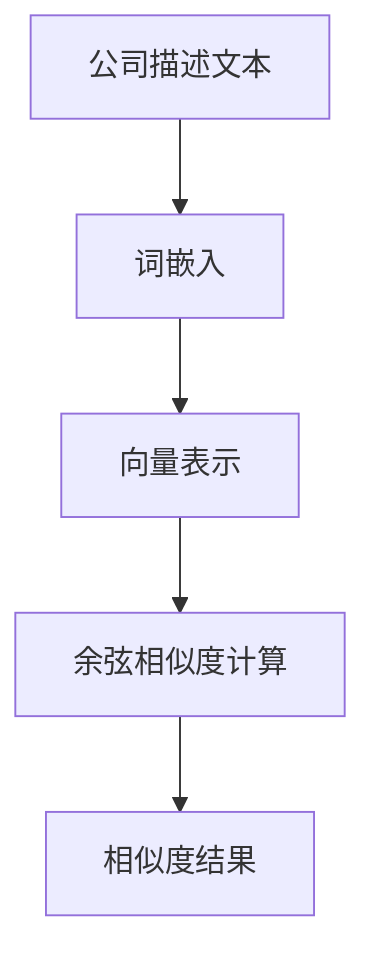
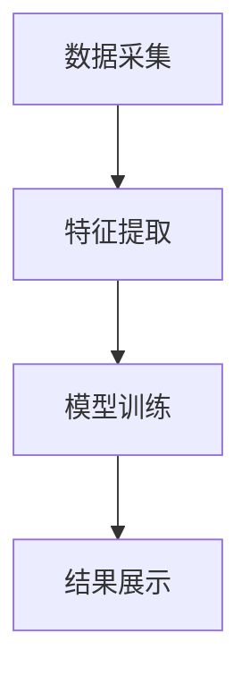

                 


# AI辅助识别长期价值创造型公司

> 关键词：AI，企业分析，长期价值创造，文本挖掘，财务分析，市场行为分析

> 摘要：随着人工智能技术的快速发展，识别长期价值创造型公司成为投资决策中的关键问题。本文从AI技术的应用角度，系统地分析了如何利用文本挖掘、财务数据分析和市场行为分析等方法，构建有效的模型和系统，帮助投资者识别具有长期价值创造潜力的企业。文章结合实际案例，详细讲解了算法原理、数学模型和系统架构设计，并通过代码实现和图表分析，展示了AI在企业价值评估中的强大能力。

---

## 第一部分：AI辅助识别长期价值创造型公司的背景与核心概念

### 第1章：问题背景与核心概念

#### 1.1 问题背景

在当前经济全球化和科技快速发展的背景下，企业之间的竞争日益激烈，投资者需要找到那些能够在长期内持续创造价值的企业。然而，传统的财务指标分析和市场表现分析往往难以捕捉企业的核心竞争力和未来发展潜力。AI技术的出现，为解决这一问题提供了新的思路。通过自然语言处理、深度学习和大数据分析等技术，AI能够从海量数据中提取有用信息，帮助企业识别具有长期价值创造潜力的公司。

#### 1.2 核心概念与联系

长期价值创造型公司的定义与特征可以通过以下几个方面进行分析：

- **核心定义**：长期价值创造型公司是指那些能够在较长的时间内持续创造高于行业平均水平的价值，并且在市场波动中表现出较强抗压能力的企业。

- **关键特征**：
  1. **财务健康度**：盈利能力稳定，资产负债结构合理。
  2. **创新能力强**：研发投入高，技术专利数量多。
  3. **管理团队稳定**：管理团队经验丰富，股权结构清晰。
  4. **市场竞争力**：市场份额稳定，品牌影响力强。

- **实体关系图（ER图）**：
  下图展示了企业分析的核心实体及其关系：

  ```mermaid
  graph TD
      A[企业] --> B[财务指标]
      A --> C[市场表现]
      A --> D[创新能力]
      A --> E[管理团队]
      B --> F[盈利能力]
      C --> G[市场份额]
      D --> H[技术专利]
      E --> I[团队稳定性]
  ```

---

## 第2章：AI辅助企业分析的核心算法

### 2.1 文本分析算法

#### 2.1.1 文本挖掘与自然语言处理（NLP）

文本挖掘和NLP技术可以帮助我们从企业的公开报告、新闻资讯等文本数据中提取有用的信息。例如，通过情感分析可以判断市场对企业的看法，通过关键词提取可以识别企业的核心竞争力。

#### 2.1.2 基于词嵌入的公司描述相似度计算

词嵌入技术（如Word2Vec、GloVe）可以将企业描述文本转换为向量表示，进而计算文本的相似度。下图展示了基于余弦相似度的公司描述相似度计算流程：



#### 2.1.3 主题模型在企业分析中的应用

主题模型（如LDA）可以帮助我们从大量的企业文本数据中发现潜在的主题，进而识别企业的核心业务和竞争优势。

---

### 2.2 财务数据分析算法

#### 2.2.1 时间序列分析与预测

时间序列分析可以用于预测企业的未来财务表现。例如，使用ARIMA模型对企业的收入和利润进行预测。

#### 2.2.2 基于聚类分析的企业财务健康度评估

聚类分析可以帮助我们将企业按照财务指标进行分组，识别出财务健康的企业。

#### 2.2.3 线性回归模型在财务预测中的应用

线性回归模型可以用于预测企业的未来财务表现。例如：

$$ \text{收入预测} = \beta_0 + \beta_1 \times \text{研发投入} + \epsilon $$

---

### 2.3 市场行为分析算法

#### 2.3.1 基于协同过滤的市场趋势预测

协同过滤技术可以用于预测市场的未来趋势，进而判断企业的市场竞争力。

#### 2.3.2 基于深度学习的市场情绪分析

深度学习模型（如LSTM）可以用于分析市场情绪，进而判断企业的市场表现。

#### 2.3.3 强化学习在投资决策中的应用

强化学习技术可以帮助投资者制定最优的投资策略。

---

## 第3章：数学模型与算法原理

### 3.1 文本相似度计算模型

#### 3.1.1 余弦相似度公式

$$ \text{余弦相似度} = \frac{\vec{A} \cdot \vec{B}}{|\vec{A}| |\vec{B}|} $$

### 3.2 财务预测模型

#### 3.2.1 线性回归模型

$$ y = \beta_0 + \beta_1x + \epsilon $$

### 3.3 市场情绪分析模型

#### 3.3.1 基于LSTM的情感分析模型

$$ f(x) = \text{LSTM}(x) $$

---

## 第4章：系统分析与架构设计

### 4.1 问题场景介绍

#### 4.1.1 企业价值识别的典型场景

- 数据来源：企业公开报告、新闻资讯、财务数据等。
- 分析目标：识别具有长期价值创造潜力的企业。
- 系统目标：构建一个基于AI的企业价值评估系统。

### 4.2 系统架构设计

#### 4.2.1 系统功能模块划分

- 数据采集模块：负责收集企业数据。
- 特征提取模块：对数据进行特征提取。
- 模型训练模块：训练机器学习模型。
- 结果展示模块：展示分析结果。

#### 4.2.2 系统架构图



---

## 第5章：项目实战

### 5.1 环境配置

- 数据集：企业公开报告、财务数据、市场数据。
- 工具：Python、TensorFlow、Scikit-learn、NLTK。

### 5.2 核心实现代码

#### 5.2.1 文本相似度计算

```python
from sklearn.feature_extraction.text import TfidfVectorizer
from sklearn.metrics.pairwise import cosine_similarity

# 初始化向量器
vectorizer = TfidfVectorizer()
# 计算向量表示
X = vectorizer.fit_transform(documents)
# 计算余弦相似度
similarity_matrix = cosine_similarity(X, X)
```

#### 5.2.2 财务预测模型

```python
import pandas as pd
from sklearn.linear_model import LinearRegression

# 数据准备
df = pd.read_csv('financial_data.csv')
# 训练模型
model = LinearRegression()
model.fit(df[['研发投入']], df['收入'])
```

#### 5.2.3 市场情绪分析

```python
import tensorflow as tf
from tensorflow.keras.layers import LSTM, Dense

# 定义模型
model = tf.keras.Sequential([
    LSTM(64, input_shape=(timesteps, features)),
    Dense(1, activation='sigmoid')
])
# 编译模型
model.compile(optimizer='adam', loss='binary_crossentropy')
```

### 5.3 实际案例分析

以某行业为例，分析该行业内的长期价值创造型公司。

---

## 第6章：总结与最佳实践

### 6.1 总结

通过AI技术，我们可以更准确地识别长期价值创造型公司，为投资者提供有力的决策支持。

### 6.2 最佳实践

- 数据质量：确保数据来源可靠，数据清洗充分。
- 模型调优：根据实际需求调整模型参数。
- 持续学习：定期更新模型，适应市场变化。

### 6.3 拓展阅读

- 《Deep Learning》
- 《Python机器学习》
- 《自然语言处理实战》

---

通过以上步骤，我们可以系统地构建一个基于AI的企业价值评估系统，帮助投资者识别长期价值创造型公司。

