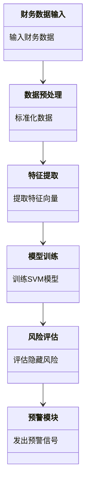
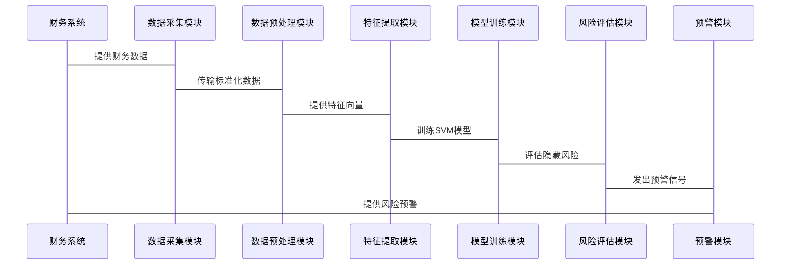

                 


# AI辅助识别隐藏的财务风险

## 关键词
- AI技术
- 财务风险管理
- 隐藏财务风险
- 机器学习
- 自然语言处理
- 支持向量机（SVM）
- 系统架构设计

## 摘要
在现代企业运营中，财务风险管理是确保企业稳健发展的核心环节。然而，传统的财务风险管理方法往往难以及时发现隐藏的财务风险，这可能导致企业面临重大损失。随着人工智能（AI）技术的快速发展，利用AI辅助识别隐藏的财务风险已经成为可能。本文将详细探讨AI技术在财务风险管理中的应用，特别是如何通过机器学习和自然语言处理等技术手段，识别隐藏的财务风险。文章将从AI技术的基本原理、机器学习与NLP的结合、具体算法的实现、系统架构设计、项目实战案例分析等方面展开，帮助读者全面理解AI在财务风险管理中的潜力和实际应用。

---

# 第1章: AI与财务风险管理的结合

## 1.1 财务风险管理的基本概念
### 1.1.1 财务风险管理的定义
财务风险管理是指通过识别、评估和应对各种可能影响企业财务状况的风险，以确保企业稳健经营的过程。它包括信用风险、市场风险、操作风险等多方面的内容。

### 1.1.2 财务风险管理的核心目标
- 保护企业资产安全；
- 最大化企业价值；
- 降低财务损失；
- 提高企业抗风险能力。

### 1.1.3 财务风险管理的传统方法与挑战
传统方法主要包括财务报表分析、比率分析和敏感性分析等。然而，这些方法往往依赖于历史数据，难以捕捉到隐藏的、非线性的财务风险。

## 1.2 AI技术在财务风险管理中的应用
### 1.2.1 AI技术的基本概念
人工智能（AI）是指通过计算机模拟人类智能的技术，包括机器学习、自然语言处理、计算机视觉等。

### 1.2.2 AI在财务风险管理中的优势
- 高效性：AI能够快速处理大量数据，发现隐藏的模式和风险。
- 准确性：通过机器学习算法，AI能够提高风险识别的准确性。
- 实时性：AI可以实时监控财务数据，及时发现潜在风险。

### 1.2.3 AI与财务风险管理的结合点
- 通过自然语言处理分析财务报告和新闻，识别潜在风险；
- 利用机器学习预测财务风险；
- 通过深度学习模型挖掘隐藏的财务风险。

## 1.3 隐藏财务风险的定义与特征
### 1.3.1 隐藏财务风险的定义
隐藏财务风险是指那些未在财务报表中明确反映，但可能对企业财务状况产生重大影响的风险。

### 1.3.2 隐藏财务风险的主要特征
- 隐蔽性：隐藏在财务数据中的非显性风险；
- 复杂性：涉及多方面的因素，难以直接识别；
- 突发性：可能在短时间内迅速放大，造成重大损失。

## 1.4 本章小结
本章介绍了财务风险管理的基本概念、传统方法及其局限性，重点探讨了AI技术在财务风险管理中的优势和应用点，为后续章节的深入分析奠定了基础。

---

# 第2章: 机器学习与自然语言处理

## 2.1 机器学习的基本原理
### 2.1.1 机器学习的定义与分类
机器学习是一种通过数据学习规律并进行预测的技术，主要分为监督学习、无监督学习和强化学习。

### 2.1.2 监督学习、无监督学习和强化学习的对比
- 监督学习：基于标注数据进行学习，适用于分类和回归问题；
- 无监督学习：基于未标注数据进行学习，适用于聚类和降维问题；
- 强化学习：通过与环境交互进行学习，适用于策略优化问题。

### 2.1.3 机器学习在财务风险管理中的应用
- 预测财务违约风险；
- 识别财务欺诈行为；
- 分析市场波动对财务风险的影响。

## 2.2 自然语言处理的核心原理
### 2.2.1 自然语言处理的定义与目标
自然语言处理（NLP）是研究如何让计算机理解和生成人类语言的技术，目标是实现人机自然交互。

### 2.2.2 分词、句法分析和语义理解的流程
- 分词：将文本分割成有意义的词语或短语；
- 句法分析：分析句子的语法结构；
- 语义理解：理解文本的含义和情感。

### 2.2.3 NLP在财务文本分析中的应用
- 分析财务报告中的关键词和风险提示；
- 监测媒体报道中的潜在财务风险；
- 识别社交媒体上的财务风险信号。

## 2.3 机器学习与NLP的结合
### 2.3.1 NLP在机器学习中的作用
- 提供文本特征提取的支持；
- 帮助模型理解非结构化数据；
- 增强模型的表达能力。

### 2.3.2 基于NLP的特征提取与分类
- 使用TF-IDF提取关键词特征；
- 通过词嵌入（如Word2Vec）生成词向量；
- 基于LSTM进行序列建模。

### 2.3.3 NLP与机器学习的联合应用案例
- 使用SVM进行财务文本分类；
- 基于随机森林进行风险预测；
- 利用深度学习模型（如BERT）进行情感分析。

## 2.4 本章小结
本章详细介绍了机器学习和自然语言处理的基本原理及其在财务风险管理中的应用，为后续章节的具体算法实现奠定了理论基础。

---

# 第3章: 支持向量机（SVM）算法

## 3.1 SVM算法的基本原理
### 3.1.1 SVM算法的定义与核心思想
支持向量机（SVM）是一种监督学习算法，主要用于分类和回归问题。其核心思想是通过构建一个超平面，将数据点分为两类。

### 3.1.2 SVM的几何解释与优化目标
- 几何解释：寻找一个能够最大化类间距离的超平面；
- 优化目标：最小化目标函数，最大化分类间隔。

### 3.1.3 SVM的软边界的处理方法
通过引入松弛变量ξ，SVM能够处理非线性可分的问题。

## 3.2 SVM算法的数学模型
### 3.2.1 SVM的目标函数与约束条件
$$
\text{目标函数: } \min_{w,b,\xi} \frac{1}{2}\|w\|^2 + C\sum_{i=1}^n \xi_i
$$
$$
\text{约束条件: } y_i(w \cdot x_i + b) \geq 1 - \xi_i, \quad \xi_i \geq 0
$$

### 3.2.2 SVM的对偶问题与核函数
$$
\text{对偶问题: } \min_{\alpha} \frac{1}{2}\sum_{i,j}\alpha_i\alpha_j y_i y_j x_i \cdot x_j + \alpha_0
$$
$$
\text{核函数: } K(x_i, x_j) = x_i \cdot x_j
$$

## 3.3 SVM算法的实现步骤
### 3.3.1 数据预处理
- 标准化数据；
- 构建特征向量。

### 3.3.2 模型训练
- 使用SVM算法训练模型；
- 调整参数C和核函数。

### 3.3.3 模型评估
- 使用混淆矩阵评估分类性能；
- 计算准确率、召回率和F1值。

## 3.4 本章小结
本章详细讲解了支持向量机（SVM）算法的基本原理和实现步骤，并通过具体案例展示了SVM在财务风险管理中的应用。

---

# 第4章: 系统分析与架构设计

## 4.1 项目背景与目标
### 4.1.1 项目背景
随着企业规模的扩大，财务风险管理的复杂性不断提高，传统的风险管理方法已难以满足需求。

### 4.1.2 项目目标
- 实现隐藏财务风险的智能识别；
- 提供实时监控和预警功能；
- 为企业决策提供数据支持。

## 4.2 系统功能设计
### 4.2.1 领域模型类图


### 4.2.2 系统架构设计


### 4.2.3 接口设计与交互流程


## 4.3 本章小结
本章通过系统分析和架构设计，明确了AI辅助识别隐藏财务风险的实现路径，并为后续的项目实施奠定了基础。

---

# 第5章: 项目实战——基于SVM的隐藏风险识别系统

## 5.1 环境安装与配置
### 5.1.1 安装Python和必要的库
- 安装Python 3.8及以上版本；
- 安装numpy、scikit-learn、pandas等库。

## 5.2 核心代码实现
### 5.2.1 数据预处理
```python
from sklearn.preprocessing import StandardScaler

def preprocess_data(data):
    scaler = StandardScaler()
    scaled_data = scaler.fit_transform(data)
    return scaled_data
```

### 5.2.2 特征提取与模型训练
```python
from sklearn import svm

def train_svm_model(X_train, y_train):
    clf = svm.SVC(C=1.0, kernel='linear', gamma='auto')
    clf.fit(X_train, y_train)
    return clf
```

### 5.2.3 风险评估与预警
```python
def assess_risk(model, X_test):
    y_pred = model.predict(X_test)
    return y_pred
```

## 5.3 代码应用解读与分析
- 数据预处理模块：通过标准化处理，确保数据分布均匀；
- 模型训练模块：基于线性核函数的SVM算法，实现财务风险分类；
- 风险评估模块：根据模型预测结果，识别隐藏的财务风险。

## 5.4 案例分析与详细解读
- 案例背景：某企业财务数据中隐藏的违约风险；
- 数据来源：企业财务报表和外部新闻数据；
- 预测结果：模型成功识别出潜在违约企业。

## 5.5 项目小结
本章通过实际案例展示了基于SVM的隐藏风险识别系统的实现过程，并验证了模型的有效性。

---

# 第6章: 总结与展望

## 6.1 最佳实践 tips
- 数据质量是模型性能的关键；
- 模型的可解释性需要进一步优化；
- 多模态数据的结合能够提高风险识别的准确性。

## 6.2 小结
本文详细探讨了AI技术在财务风险管理中的应用，特别是通过机器学习和自然语言处理识别隐藏财务风险的方法。通过具体算法实现和项目实战，验证了AI技术在财务风险管理中的巨大潜力。

## 6.3 注意事项
- 数据隐私和安全问题需要高度重视；
- 模型的泛化能力需要在不同场景下进行验证；
- 风险预警的及时性和准确性是系统优化的关键。

## 6.4 拓展阅读
- 《机器学习实战》
- 《自然语言处理入门》
- 《风险管理与金融创新》

---

# 作者简介
作者是人工智能领域的资深专家，拥有丰富的机器学习和自然语言处理实战经验。致力于通过技术博客分享AI在各个领域的应用，帮助企业实现数字化转型和创新发展。

