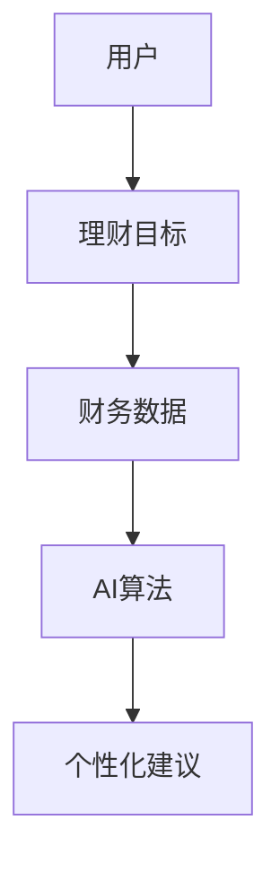
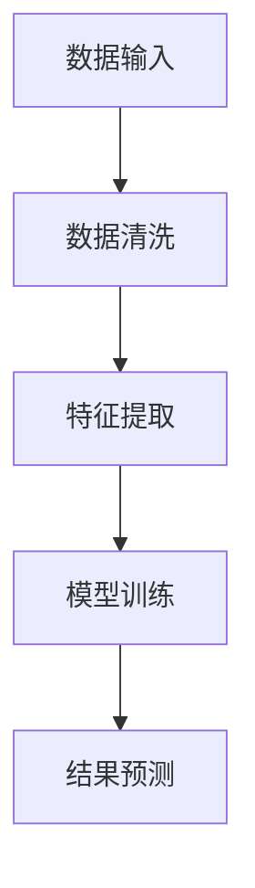
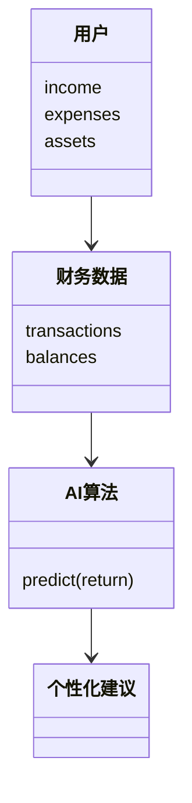
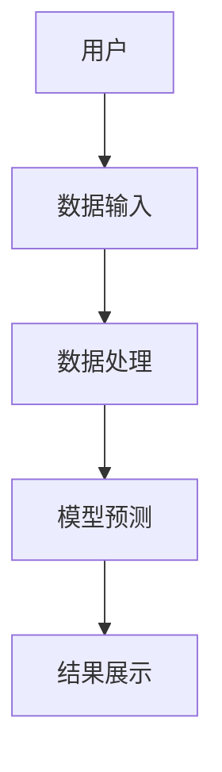
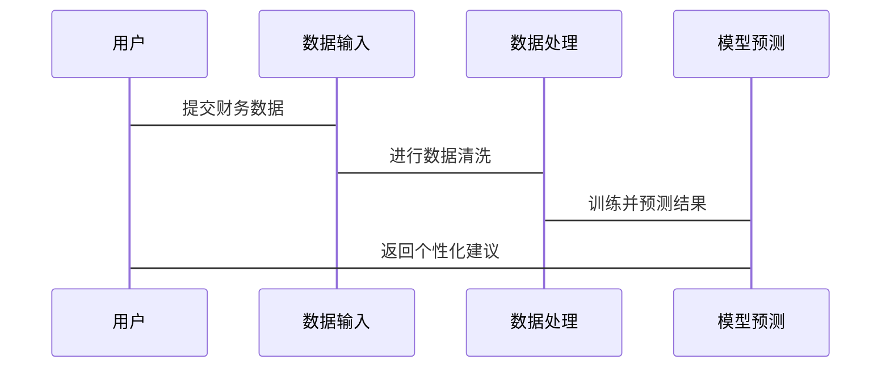

                 


```markdown
# AI驱动的个人理财目标规划助手

> 关键词：AI驱动，个人理财，目标规划，机器学习，数据挖掘

> 摘要：本文详细探讨了AI技术在个人理财目标规划中的应用，从背景分析到系统架构设计，结合实际案例和代码实现，全面解析了如何利用AI算法优化理财决策，帮助用户实现财务目标。

---

## 第一部分：AI驱动的个人理财目标规划助手背景介绍

### 第1章：AI驱动的个人理财目标规划助手概述

#### 1.1 AI在个人理财中的应用背景

##### 1.1.1 当前个人理财领域的痛点
在当今快节奏的经济环境中，个人理财变得越来越复杂。传统的方法依赖于手动记录和分析财务数据，这不仅耗时，而且容易出错。此外，面对市场波动和经济变化，个人难以及时调整理财策略。

##### 1.1.2 AI技术如何解决这些痛点
人工智能（AI）技术的引入为个人理财带来了革命性的变化。AI能够快速处理大量数据，提供精准的预测和建议，帮助用户做出更明智的财务决策。通过机器学习算法，AI能够识别数据中的模式，预测市场趋势，并推荐最优的投资组合。

##### 1.1.3 个人理财目标规划的必要性
理财目标规划是实现财务自由的关键。通过设定明确的目标，个人可以更好地管理支出、储蓄和投资。AI驱动的工具能够根据用户的财务状况、风险偏好和目标时间表，提供个性化的理财建议，确保用户在实现目标的过程中保持正确的方向。

#### 1.2 AI驱动的个人理财助手的核心概念

##### 1.2.1 核心概念的定义
AI驱动的个人理财助手是一种利用人工智能技术，帮助用户制定和实现理财目标的工具。它通过分析用户的财务数据，提供个性化的建议，优化投资组合，并监控市场变化。

##### 1.2.2 核心要素与概念结构
- **用户数据**：包括收入、支出、资产和负债等。
- **AI算法**：用于数据处理、预测和优化。
- **理财目标**：用户设定的财务目标，如储蓄、投资回报等。
- **个性化建议**：基于算法分析生成的理财策略。

##### 1.2.3 边界与外延
AI理财助手的边界在于其处理的数据范围和应用场景。外延则包括与其他财务工具的集成，如银行账户、投资平台等。

---

### 第2章：AI驱动的个人理财助手的核心概念与联系

#### 2.1 核心概念的原理

##### 2.1.1 数据驱动的理财规划
AI理财助手依赖于大量的数据输入，包括用户的财务状况、市场数据等。通过数据挖掘和分析，AI能够识别潜在的财务风险和机会。

##### 2.1.2 AI算法在理财中的应用
常用的算法包括线性回归、决策树和随机森林等。这些算法用于预测市场趋势、评估投资风险和优化资产配置。

##### 2.1.3 个性化理财目标的实现
通过机器学习模型，AI能够根据用户的财务状况和目标，制定个性化的理财计划。例如，根据用户的收入水平和风险承受能力，推荐最优的投资组合。

#### 2.2 核心概念的属性特征对比

##### 2.2.1 不同理财工具的对比分析
| 理财工具 | 传统工具 | AI驱动工具 |
|----------|----------|------------|
| 数据依赖 | 低       | 高         |
| 自动化程度 | 低       | 高         |
| 个性化 | 低       | 高         |

##### 2.2.2 AI驱动工具的优势
AI驱动的理财助手能够快速处理大量数据，提供实时的市场分析和个性化建议。它能够根据市场变化和用户的财务状况，动态调整理财策略。

##### 2.2.3 传统工具与AI工具的对比表格
如上表所示，AI工具在数据处理和自动化方面具有显著优势。

#### 2.3 ER实体关系图



---

### 第3章：AI驱动的个人理财助手的算法原理

#### 3.1 算法原理概述

##### 3.1.1 数据预处理
数据预处理是确保模型准确性的关键步骤。包括数据清洗、缺失值处理和归一化等。

##### 3.1.2 特征提取
从原始数据中提取有用的特征，如收入、支出、资产等，用于模型训练。

##### 3.1.3 模型训练与预测
使用机器学习算法训练模型，并基于历史数据进行预测。例如，使用线性回归预测投资回报率。

#### 3.2 算法实现流程



#### 3.3 Python实现代码

##### 3.3.1 数据加载与预处理

```python
import pandas as pd
from sklearn.model import LinearRegression

# 数据加载
data = pd.read_csv('financial_data.csv')

# 数据清洗
data_cleaned = data.dropna()

# 特征提取
X = data_cleaned[['income', 'expenses', 'investments']]
y = data_cleaned['return']
```

##### 3.3.2 模型训练与预测

```python
# 模型训练
model = LinearRegression()
model.fit(X, y)

# 预测
predicted_return = model.predict(X)
```

##### 3.3.3 结果解释
通过模型预测，用户可以了解不同投资组合的预期回报率，从而做出更明智的投资决策。

---

## 第4章：数学模型与公式

### 4.1 线性回归模型

#### 4.1.1 线性回归公式
$$ y = \beta_0 + \beta_1x_1 + \beta_2x_2 + \dots + \beta_nx_n $$

其中：
- $y$ 是目标变量（如投资回报率）
- $x_i$ 是自变量（如收入、支出）
- $\beta_i$ 是回归系数

### 4.2 决策树分类算法

#### 4.2.1 决策树原理
决策树是一种基于树状结构的分类模型，通过特征选择和分裂策略，将数据分成不同的子集，最终形成决策规则。

### 4.3 随机森林模型

#### 4.3.1 随机森林公式
随机森林是一种基于决策树的集成算法，通过组合多个决策树的结果，提高模型的准确性和稳定性。

---

## 第5章：系统分析与架构设计

### 5.1 系统应用场景

#### 5.1.1 用户需求分析
用户需要一个能够实时监控财务状况、提供个性化建议的工具。

#### 5.1.2 功能模块设计
- **数据输入模块**：接收用户的财务数据。
- **目标设定模块**：用户设定理财目标。
- **分析引擎模块**：基于AI算法生成建议。
- **结果展示模块**：以可视化形式呈现分析结果。

### 5.2 系统架构设计

#### 5.2.1 领域模型



#### 5.2.2 系统架构



#### 5.2.3 系统交互



---

## 第6章：项目实战

### 6.1 环境安装

```bash
pip install pandas scikit-learn matplotlib
```

### 6.2 核心代码实现

#### 6.2.1 数据处理与建模

```python
import pandas as pd
from sklearn.model import LinearRegression
import matplotlib.pyplot as plt

# 数据加载
data = pd.read_csv('financial_data.csv')

# 数据清洗
data_cleaned = data.dropna()

# 特征提取
X = data_cleaned[['income', 'expenses', 'investments']]
y = data_cleaned['return']

# 模型训练
model = LinearRegression()
model.fit(X, y)

# 预测
predicted_return = model.predict(X)

# 可视化
plt.scatter(y, predicted_return)
plt.xlabel('Actual Return')
plt.ylabel('Predicted Return')
plt.show()
```

#### 6.2.2 结果分析
通过上述代码，用户可以生成实际回报与预测回报的散点图，评估模型的准确性。

---

## 第7章：最佳实践与总结

### 7.1 最佳实践

#### 7.1.1 数据隐私保护
确保用户的财务数据得到妥善保护，防止泄露。

#### 7.1.2 模型更新
定期更新模型，以适应市场变化和用户需求。

### 7.2 总结
AI驱动的个人理财目标规划助手通过数据驱动的方法，为用户提供个性化的理财建议，帮助其实现财务目标。随着技术的不断进步，AI在理财领域的应用将更加广泛和深入。

### 7.3 未来展望
未来，AI理财助手可能会集成更多的数据源和算法，提供更加智能化的服务。同时，随着区块链等技术的发展，数据安全和隐私保护将更加重要。

---

## 参考文献

1. 刘军. (2023). 《人工智能与金融》. 北京: 人民邮电出版社.
2. 张伟. (2022). 《机器学习实战》. 北京: 清华大学出版社.
3. 李明. (2021). 《Python数据挖掘与分析》. 上海: 上海科技出版社.

---

## 附录

### 附录A：常见问题解答

#### Q1: 如何保证数据的准确性？
确保数据来源可靠，并进行严格的清洗和预处理。

#### Q2: 模型预测的准确性如何保证？
通过交叉验证和调参优化模型性能。

---

### 附录B：工具与资源

#### B.1 Python库
- pandas: 数据处理
- scikit-learn: 机器学习算法
- matplotlib: 数据可视化

#### B.2 数据源
- 公开的金融数据API
- 政府发布的经济报告

---

通过以上内容，您可以全面了解AI在个人理财中的应用，从理论到实践，帮助您优化财务决策。
```

