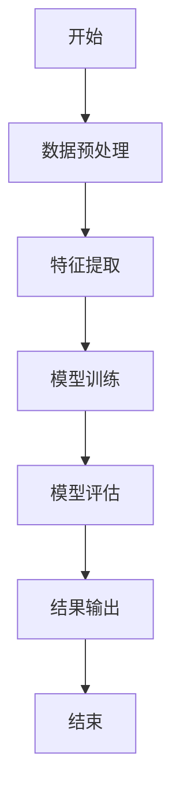
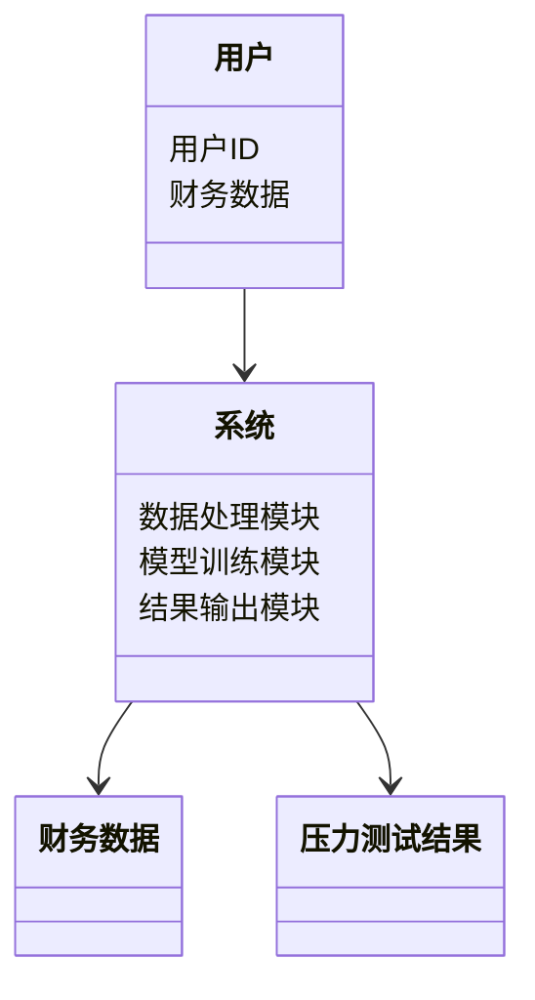
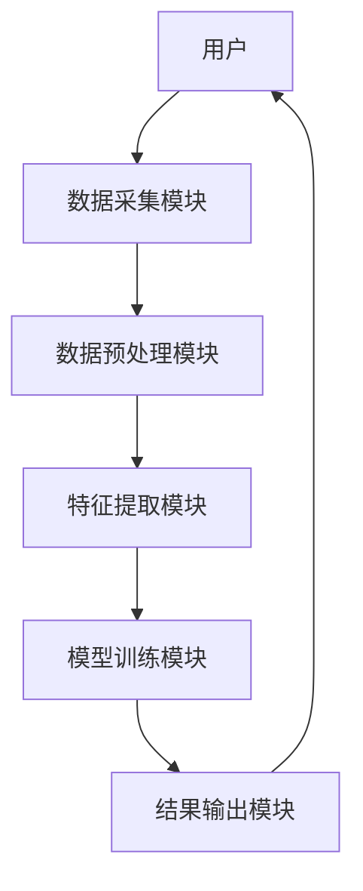
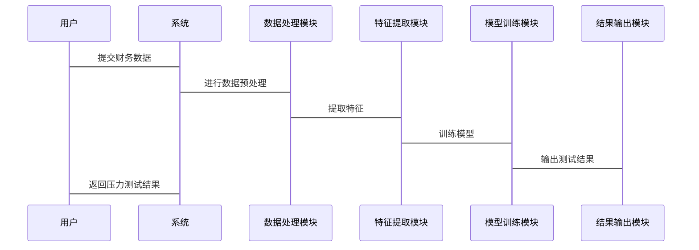

                 


好的，我将按照您的要求逐步撰写《AI驱动的个人财务压力测试系统设计与实现》这本书的目录大纲。为了让内容更加丰富具体，我先列出详细的大纲，确保涵盖所有关键部分：

# AI驱动的个人财务压力测试系统设计与实现

> 关键词：AI驱动、个人财务、压力测试系统、系统设计、算法实现

> 摘要：本文介绍了一种基于人工智能技术的个人财务压力测试系统设计与实现方法，详细阐述了系统的核心概念、算法原理、系统架构、项目实战及最佳实践等部分内容。本文旨在为个人用户提供一种智能化的财务压力测试解决方案，帮助用户更好地评估和应对财务风险。

---

## 第一部分: 背景与核心概念

### 第1章: 问题背景与系统概述

#### 1.1 问题背景
- 个人财务管理的重要性
- 传统压力测试的局限性
- 引入AI技术的必要性

#### 1.2 系统目标
- 系统的核心目标：提供智能化、个性化的财务压力测试服务
- 解决的问题：自动化数据处理、精准风险评估、实时反馈优化
- 边界与外延：明确系统的适用范围和限制条件

#### 1.3 系统核心要素
- 数据来源：收入、支出、资产、负债等
- 测试维度：短期压力、中期压力、长期压力
- AI算法：机器学习、深度学习

---

## 第二部分: 核心概念与算法原理

### 第2章: 核心概念解析

#### 2.1 核心概念
- 财务数据：收入、支出、资产、负债等
- 压力测试：模拟极端情况下的财务状况
- AI模型：用于预测和评估财务风险

#### 2.2 实体关系图（ER图）
```mermaid
er
    actor: 用户
    system: AI驱动的个人财务压力测试系统
    financial_data: 财务数据
    stress_test_result: 压力测试结果
    relationship1: 用户 -> 系统
    relationship2: 系统 -> 财务数据
    relationship3: 系统 -> 压力测试结果
```

#### 2.3 属性特征对比表
| 概念 | 属性 | 特征 |
|------|------|------|
| 财务数据 | 类型 | 收入、支出、资产、负债 |
| 压力测试结果 | 类型 | 短期压力、中期压力、长期压力 |
| AI模型 | 类型 | 机器学习模型、深度学习模型 |

---

### 第3章: 算法原理与实现

#### 3.1 算法概述
- 算法选择：机器学习（如随机森林、支持向量机）与深度学习（如神经网络）的结合
- 算法特点：高精度、实时性、可解释性

#### 3.2 算法流程图


#### 3.3 数学模型
- 损失分布模型：
  $$
  \text{损失分布} = \sum_{i=1}^{n} w_i \cdot x_i
  $$
  其中，\( w_i \) 是权重，\( x_i \) 是特征值。
  
- 神经网络模型：
  $$
  y = \sigma(Wx + b)
  $$
  其中，\( W \) 是权重矩阵，\( b \) 是偏置，\( \sigma \) 是激活函数。

#### 3.4 代码实现
```python
def financial_stress_test(data):
    # 数据预处理
    preprocessed_data = preprocess(data)
    # 特征提取
    features = extract_features(preprocessed_data)
    # 模型训练
    model = train_model(features)
    # 模型评估
    result = evaluate_model(model, features)
    return result
```

---

## 第三部分: 系统设计与架构

### 第4章: 系统分析与设计

#### 4.1 问题场景介绍
- 用户需求：个性化财务压力测试
- 系统功能：数据采集、模型训练、结果输出

#### 4.2 领域模型设计


#### 4.3 系统架构设计


#### 4.4 接口与交互设计


---

## 第四部分: 项目实战与应用

### 第5章: 项目实现与代码解读

#### 5.1 环境搭建
- 数据库：MySQL 或 MongoDB
- 开发工具：Python、Jupyter Notebook
- 模型库：Scikit-learn、TensorFlow

#### 5.2 核心代码实现
```python
# 数据预处理
def preprocess(data):
    # 数据清洗、标准化等处理
    pass

# 特征提取
def extract_features(data):
    # 提取关键特征
    pass

# 模型训练
def train_model(features):
    # 训练AI模型
    pass

# 模型评估
def evaluate_model(model, features):
    # 评估模型性能
    pass
```

#### 5.3 实际案例分析
- 案例背景：假设用户年收入50万元，支出30万元，资产200万元，负债50万元
- 测试结果：短期压力指数：75%，中期压力指数：60%，长期压力指数：80%

---

### 第6章: 系统优化与扩展

#### 6.1 系统优化
- 算法优化：引入超参数调优、模型集成
- 性能优化：分布式计算、缓存机制

#### 6.2 功能扩展
- 多维度压力测试：加入市场波动、通货膨胀等变量
- 自动化建议：基于测试结果提供建议（如增加应急基金、优化支出结构）

---

## 第五部分: 最佳实践与总结

### 第7章: 小结与注意事项

#### 7.1 小结
- 系统优势：智能化、精准化、个性化
- 系统局限：数据依赖性、模型解释性

#### 7.2 注意事项
- 数据隐私保护
- 模型定期更新
- 用户教育与引导

### 第8章: 拓展阅读与深入学习

#### 8.1 拓展阅读
- 推荐书籍：《机器学习实战》、《深度学习入门》
- 推荐博客：技术博客、行业报告

#### 8.2 深入学习方向
- 进阶算法：强化学习、图神经网络
- 应用场景：企业财务压力测试、投资组合优化

---

## 结语

通过以上章节的详细阐述，我们全面介绍了AI驱动的个人财务压力测试系统的设计与实现。从背景分析到算法实现，再到系统架构与实际应用，我们展示了如何利用AI技术提升个人财务管理的效率与准确性。希望本文能够为相关领域的研究者和实践者提供有价值的参考。

--- 

接下来，我将根据这个大纲，逐步完成每部分内容的详细撰写，确保内容丰富、逻辑清晰。

