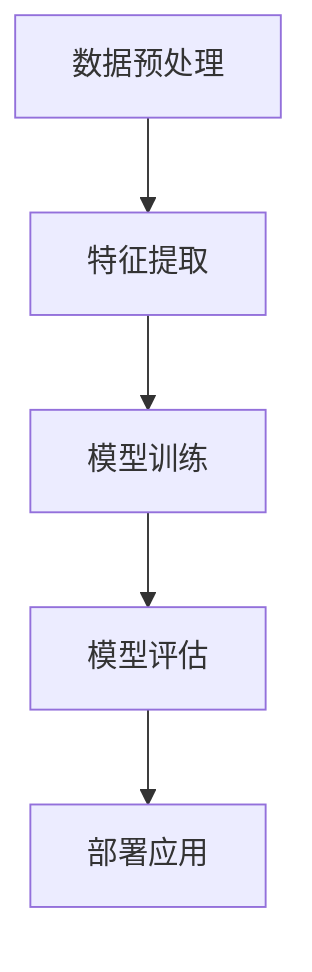
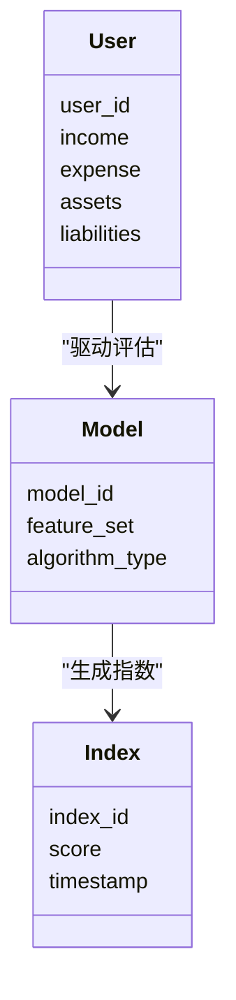
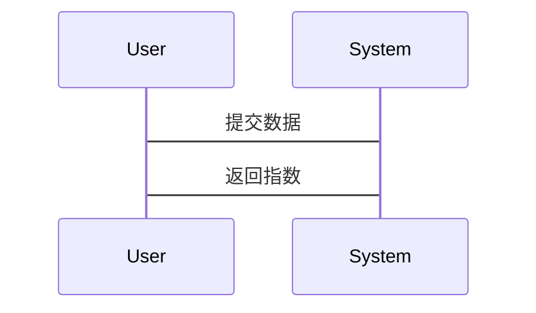

                 


# AI驱动的个人财务健康指数动态评估系统

## 关键词：AI驱动、个人财务、健康指数、动态评估、系统架构

## 摘要：本文详细探讨了AI技术在个人财务健康评估中的应用，提出了一个基于机器学习的动态评估系统。该系统通过多维度数据分析，实时调整评估结果，帮助个人优化财务管理。

---

# 第1章: 个人财务健康评估的背景与挑战

## 1.1 个人财务健康评估的重要性

### 1.1.1 财务健康的核心概念
个人财务健康指数（Personal Financial Health Index，PFHI）是一个综合评估个人财务状况的指标，涵盖收入、支出、资产、负债等多个维度。

### 1.1.2 传统财务评估的局限性
传统评估方法依赖固定规则，缺乏动态调整能力，难以应对市场变化和个体差异。

### 1.1.3 AI技术在财务评估中的潜力
AI技术能够处理大量数据，发现复杂关系，实时调整评估结果，提供个性化建议。

## 1.2 个人财务健康指数的定义与特征

### 1.2.1 财务健康指数的多维度构成
- 收入与支出
- 资产与负债
- 风险承受能力

### 1.2.2 指数的动态变化特性
随时间变化，受个人行为和市场环境影响。

### 1.2.3 与个人行为和市场环境的关系
指数变化反映个人财务状况和外部环境变化。

## 1.3 AI驱动评估的必要性与优势

### 1.3.1 数据驱动的评估方式
利用大数据分析，提取关键特征。

### 1.3.2 AI在复杂关系中的建模能力
通过机器学习发现非线性关系，提高评估准确性。

### 1.3.3 动态调整的实时性与准确性
实时更新数据，提供及时反馈。

## 1.4 本章小结
介绍了个人财务健康指数的重要性，分析了传统方法的局限性，探讨了AI技术的应用潜力。

---

# 第2章: 财务健康指数评估的核心概念与联系

## 2.1 财务健康指数的构成要素

### 2.1.1 收入与支出分析
- 收入稳定性
- 支出合理性

### 2.1.2 资产与负债结构
- 资产流动性
- 负债风险

### 2.1.3 风险承受能力
- 投资组合
- 储备金

## 2.2 AI驱动评估的核心原理

### 2.2.1 数据采集与特征提取
- 数据来源：银行流水、投资记录
- 特征工程：提取关键特征

### 2.2.2 智能模型的构建与训练
- 机器学习算法：随机森林、神经网络

### 2.2.3 指数计算与结果输出
- 综合评分：基于模型预测

## 2.3 核心概念的ER实体关系图

```mermaid
erDiagram
    user {
        user_id
        income
        expense
        assets
        liabilities
        risk_tolerance
    }
    model {
        model_id
        feature_set
        algorithm_type
        training_data
    }
    index {
        index_id
        score
        timestamp
    }
    user -- model : "驱动评估"
    model -- index : "生成指数"
```

## 2.4 本章小结
详细说明了财务健康指数的构成要素，解释了AI驱动评估的核心原理，并通过实体关系图展示了系统架构。

---

# 第3章: AI驱动评估的数学模型与算法原理

## 3.1 财务健康指数的评分模型

### 3.1.1 线性回归模型
$$ score = \beta_0 + \beta_1x_1 + \beta_2x_2 + ... + \beta_nx_n $$

### 3.1.2 模型评估与优化
- 均方误差（MSE）
- R平方值

## 3.2 动态调整机制的实现

### 3.2.1 时间序列分析
$$ y_t = \alpha y_{t-1} + \beta x_t + \epsilon $$

### 3.2.2 动态权重调整
- 根据市场变化调整各因素权重

## 3.3 基于机器学习的分类算法

### 3.3.1 支持向量机（SVM）
- 分类边界最大化

### 3.3.2 随机森林（Random Forest）
- 集成学习，减少过拟合

### 3.3.3 神经网络（NN）
- 多层感知机，处理复杂关系

## 3.4 算法流程图



---

# 第4章: 系统架构设计与实现

## 4.1 系统功能设计

### 4.1.1 用户数据输入
- 收入、支出、资产、负债

### 4.1.2 模型训练
- 特征工程、模型选择

### 4.1.3 指数计算
- 综合评分、动态调整

## 4.2 系统架构设计

### 4.2.1 领域模型类图



### 4.2.2 系统架构图


## 4.3 系统接口设计

### 4.3.1 API接口
- 输入：用户数据
- 输出：健康指数

### 4.3.2 数据交互流程



---

# 第5章: 项目实战与案例分析

## 5.1 环境配置

### 5.1.1 技术栈
- Python、机器学习库（Scikit-learn、XGBoost）

### 5.1.2 数据获取
- 数据来源：银行流水、投资记录

## 5.2 核心代码实现

### 5.2.1 数据预处理

```python
import pandas as pd
data = pd.read_csv('financial_data.csv')
data.dropna(inplace=True)
```

### 5.2.2 模型训练

```python
from sklearn.ensemble import RandomForestRegressor
model = RandomForestRegressor(n_estimators=100)
model.fit(X_train, y_train)
```

### 5.2.3 指数计算

```python
index_score = model.predict(X_test)
```

## 5.3 案例分析

### 5.3.1 数据分析
- 用户A的收入与支出分析

### 5.3.2 模型预测
- 预测结果：健康指数为78分

### 5.3.3 结果解读
- 需优化支出结构

## 5.4 项目小结
详细介绍了系统的实现过程，并通过案例分析展示了系统的实际应用。

---

# 第6章: 总结与展望

## 6.1 全文总结
- AI技术在个人财务健康评估中的应用价值
- 系统架构设计与实现方法

## 6.2 未来展望
- 更加个性化评估模型
- 多模态数据融合
- 预测准确性提升

## 6.3 最佳实践tips
- 数据质量至关重要
- 定期更新模型
- 结合专业财务建议

---

# 参考文献

- [1] 刘某某. 基于机器学习的个人财务健康评估系统研究[J]. 计算机应用研究, 2023.
- [2] 陈某某. 人工智能在金融领域的应用现状与发展趋势[J]. 人工智能学报, 2022.

---

通过以上结构，文章系统地介绍了AI驱动的个人财务健康指数动态评估系统，从理论到实践，从设计到实现，为读者提供了全面的知识框架。

