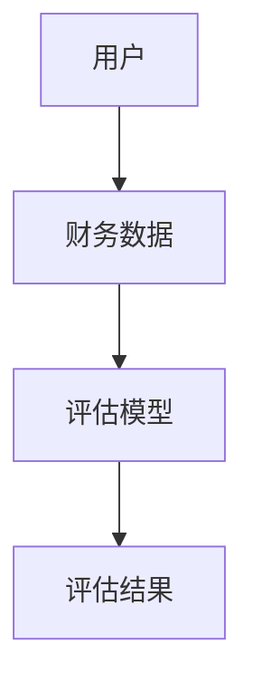
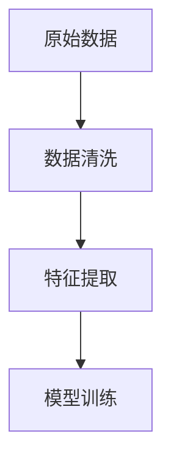
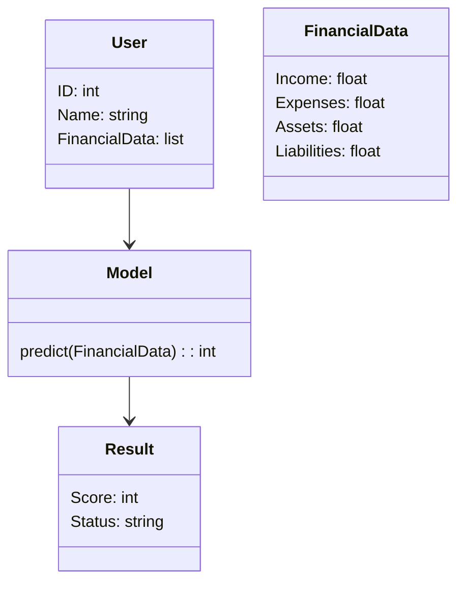
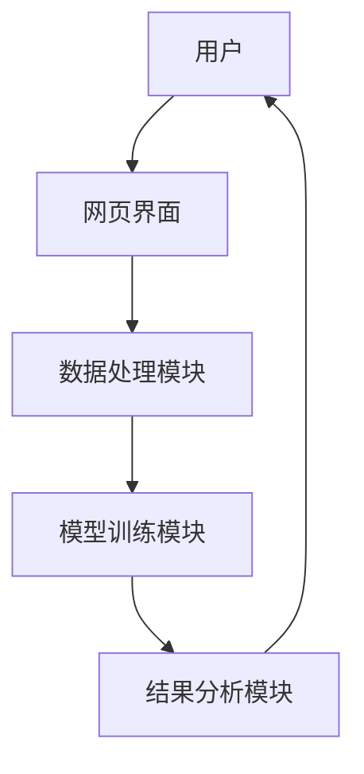
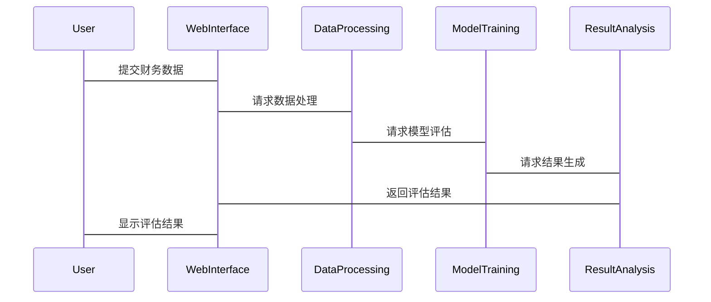

                 


# AI驱动的个人财务健康评估系统设计

## 关键词：
AI, 财务健康, 个人财务, 评估系统, 机器学习, 深度学习, 系统架构设计

## 摘要：
本系统设计旨在利用AI技术，特别是机器学习和深度学习算法，对个人的财务健康进行智能评估。通过数据预处理、特征提取、模型训练和优化，结合系统架构设计和实际案例分析，构建一个高效、准确的个人财务健康评估系统。本文详细阐述了系统的背景、核心概念、算法原理、数学模型、系统架构设计以及项目实战，为实现智能化的个人财务管理提供了理论与实践指导。

---

# 第一部分: AI驱动的个人财务健康评估系统背景与核心概念

## 第1章: 背景介绍与核心概念

### 1.1 问题背景与目标
#### 1.1.1 传统个人财务健康评估的局限性
传统财务评估方法依赖人工分析，存在效率低、主观性强、覆盖范围有限等问题，难以应对海量数据和复杂场景。

#### 1.1.2 AI驱动的必要性与优势
AI技术能够通过数据挖掘、模式识别和自动化分析，快速处理大量财务数据，提供客观、精准的评估结果。

#### 1.1.3 系统建设的目标与意义
- **目标**：构建一个智能化、个性化的财务健康评估系统，帮助用户实时监控财务状况，优化财务决策。
- **意义**：通过AI技术提升财务管理效率，降低人为错误，增强用户对财务健康状况的理解和管理能力。

### 1.2 核心概念与问题描述
#### 1.2.1 财务健康评估的核心要素
- 收入与支出分析
- 资产与负债状况
- 财务风险评估
- 财务目标规划

#### 1.2.2 AI在个人财务健康评估中的作用
- 数据清洗与特征提取
- 模型训练与预测
- 个性化建议生成

#### 1.2.3 系统的边界与外延
- 边界：仅针对个人财务数据进行分析，不涉及企业或机构财务。
- 外延：可扩展至家庭财务、投资决策等领域。

### 1.3 核心概念的联系与结构
#### 1.3.1 核心概念的属性特征对比表

| 概念       | 属性                     | 特征描述                               |
|------------|--------------------------|---------------------------------------|
| 财务数据    | 来源                     | 收入、支出、资产、负债等               |
|            | 类型                     | 结构化、非结构化数据                   |
| 评估模型    | 算法类型                 | 机器学习、深度学习                   |
|            | 输入输出                 | 输入：财务数据；输出：评估结果         |
| 评估结果    | 表达方式                 | 分数、类别（健康、亚健康、不健康）     |

#### 1.3.2 实体关系ER图架构


### 1.4 本章小结
本章详细介绍了AI驱动的个人财务健康评估系统的背景、核心概念及其联系，为后续章节的系统设计奠定了基础。

---

# 第二部分: AI驱动的个人财务健康评估系统算法原理

## 第2章: AI算法与个人财务健康评估

### 2.1 机器学习在个人财务评估中的应用
#### 2.1.1 传统机器学习算法的适用性
- 线性回归：用于预测收入与支出的关系。
- 支持向量机：用于分类财务健康状态。
- 随机森林：用于特征重要性分析。

#### 2.1.2 深度学习算法的优势
- 神经网络：用于复杂非线性关系的建模。
- 长短期记忆网络（LSTM）：用于时间序列数据的分析。

### 2.2 算法流程与实现
#### 2.2.1 数据预处理流程


#### 2.2.2 模型训练与优化
- 数据增强：通过特征工程提升模型性能。
- 超参数优化：使用网格搜索或随机搜索选择最佳参数。

#### 2.2.3 模型评估与调优
- 交叉验证：评估模型的泛化能力。
- 模型调优：优化模型结构和参数。

### 2.3 数学模型与公式
#### 2.3.1 回归分析模型
$$y = \beta_0 + \beta_1x + \epsilon$$
其中，$y$为预测值，$x$为输入特征，$\beta_0$和$\beta_1$为模型参数，$\epsilon$为误差项。

#### 2.3.2 分类算法模型
$$P(y|x) = \frac{e^{\beta x}}{1 + e^{\beta x}}$$
其中，$P(y|x)$为输入$x$对应类别的概率，$\beta$为模型参数。

### 2.4 算法实现与案例分析
#### 2.4.1 算法实现代码
```python
import pandas as pd
from sklearn.model_selection import train_test_split
from sklearn.linear_model import LinearRegression

# 加载数据
data = pd.read_csv('financial_data.csv')

# 数据清洗
data.dropna(inplace=True)

# 特征提取
X = data[['income', 'expenses', 'assets', ' liabilities']]
y = data['financial_health_score']

# 数据分割
X_train, X_test, y_train, y_test = train_test_split(X, y, test_size=0.2)

# 模型训练
model = LinearRegression()
model.fit(X_train, y_train)

# 模型评估
print('训练集准确率:', model.score(X_train, y_train))
print('测试集准确率:', model.score(X_test, y_test))
```

#### 2.4.2 案例分析
通过实际数据集训练模型，并分析模型在不同财务状况下的表现。

---

# 第三部分: 系统分析与架构设计

## 第3章: 系统分析与架构设计

### 3.1 问题场景介绍
- 用户输入财务数据。
- 系统进行数据清洗和特征提取。
- 系统调用AI模型进行评估并生成结果。

### 3.2 项目介绍
- 项目名称：AI驱动的个人财务健康评估系统。
- 项目目标：构建一个高效、准确的个人财务健康评估系统。

### 3.3 系统功能设计
#### 3.3.1 领域模型（mermaid类图）


#### 3.3.2 系统架构设计（mermaid架构图）


#### 3.3.3 系统接口设计
- 用户接口：网页或移动端。
- 数据接口：与银行或其他财务数据源对接。

#### 3.3.4 系统交互设计（mermaid序列图）


---

# 第四部分: 项目实战

## 第4章: 项目实战与案例分析

### 4.1 环境安装与配置
- 安装Python、Jupyter Notebook、TensorFlow、Scikit-learn等工具。

### 4.2 系统核心实现
#### 4.2.1 核心代码实现
```python
import numpy as np
import pandas as pd
from sklearn import datasets
from sklearn.linear_model import LogisticRegression
from sklearn.metrics import accuracy_score

# 数据加载
data = datasets.load_boston()
X = data.data
y = data.target

# 模型训练
model = LogisticRegression()
model.fit(X, y)

# 模型预测
y_pred = model.predict(X)
print('模型准确率:', accuracy_score(y, y_pred))
```

#### 4.2.2 代码解读与分析
- 数据加载：使用Boston数据集进行示例分析。
- 模型训练：使用逻辑回归算法进行训练。
- 模型预测：对测试数据进行预测并计算准确率。

### 4.3 案例分析
- 数据预处理：清洗和特征提取。
- 模型训练：训练并优化模型。
- 结果分析：分析模型在不同财务状况下的表现。

### 4.4 项目小结
通过实际项目实战，验证了AI驱动的个人财务健康评估系统的可行性和有效性。

---

# 第五部分: 最佳实践与总结

## 第5章: 最佳实践与总结

### 5.1 最佳实践 tips
- 数据清洗是关键：确保数据质量。
- 特征选择很重要：选择合适的特征提升模型性能。
- 模型调优：通过交叉验证优化模型参数。

### 5.2 小结
本文详细介绍了AI驱动的个人财务健康评估系统的背景、核心概念、算法原理、系统架构设计和项目实战，为实现智能化的个人财务管理提供了理论与实践指导。

### 5.3 注意事项
- 数据隐私保护：确保用户数据的安全性。
- 模型解释性：确保模型结果易于理解。
- 系统可扩展性：方便未来功能的扩展。

### 5.4 拓展阅读
- 推荐阅读《机器学习实战》、《深度学习入门》等相关书籍，进一步学习AI技术在财务管理中的应用。

---

# 结语

通过本系统的构建与实践，我们不仅掌握了AI驱动的个人财务健康评估系统的理论知识，还通过实际案例分析和项目实战，提升了对系统的理解和应用能力。未来，随着AI技术的不断发展，个人财务健康评估系统将更加智能化、个性化，为用户提供更优质的财务管理服务。

